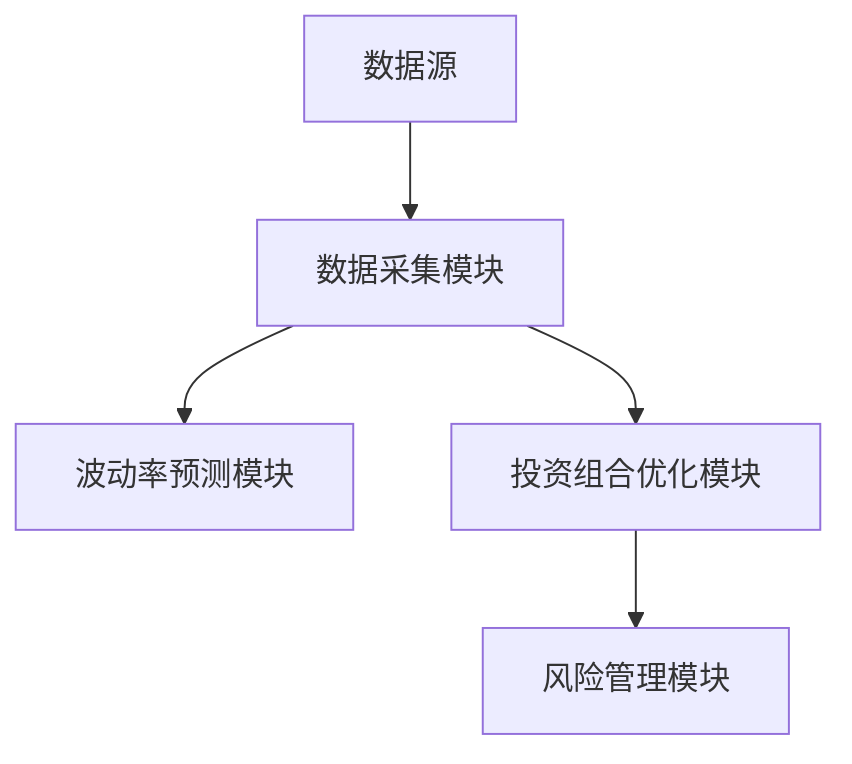
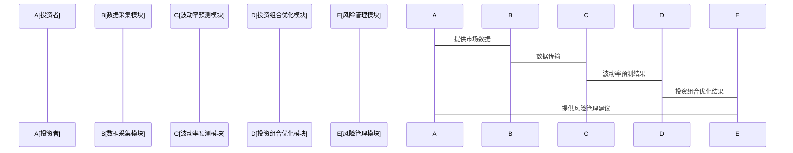

                 


# 彼得林奇的"慢牛"投资在高波动市场中的心理学分析

> **关键词**：心理学，投资策略，高波动市场，彼得林奇，慢牛  
> **摘要**：本文分析了彼得林奇的“慢牛”投资策略在高波动市场中的心理学因素，探讨了投资者心理如何影响策略的实施，以及在高波动环境下的策略调整和心理应对措施。

---

## 第一部分：背景介绍

### 第1章：彼得林奇的"慢牛"投资策略概述

#### 1.1 "慢牛"投资策略的起源
- **彼得林奇的投资理念**  
  彼得林奇是美国著名基金经理，以其长期价值投资理念闻名。他认为，成功的投资在于选择优质企业并长期持有，而非频繁交易。
  
- **"慢牛"策略的核心思想**  
  "慢牛"策略强调寻找那些能够持续稳定增长的企业，通过长期持有这些股票，在市场波动中实现稳健收益。这种策略与市场的短期波动保持一定距离，避免因短期波动影响决策。

- **策略在不同市场环境中的表现**  
  在稳定市场中，“慢牛”策略表现优异，但在高波动市场中，该策略面临更多挑战，需结合投资者心理因素进行调整。

#### 1.2 高波动市场的定义与特征
- **高波动市场的定义**  
  高波动市场是指价格波动剧烈、市场走势不稳定、投资者情绪波动大的市场环境。这种环境常由市场恐慌、突发事件或经济不确定性引发。

- **高波动市场的常见特征**  
  - 市场价格波动大，短期走势难以预测。
  - 投资者情绪波动剧烈，恐慌和贪婪交替出现。
  - 市场信息不对称加剧，谣言和误传影响投资者决策。

- **高波动市场对投资者的影响**  
  高波动市场容易引发投资者的焦虑和决策失误，尤其是对于那些依赖长期策略的投资者来说，短期波动可能动摇其信心，影响策略执行。

#### 1.3 "慢牛"策略与高波动市场的关联
- **策略在高波动环境中的适用性**  
  “慢牛”策略在高波动市场中仍然有效，但需要投资者具备强大的心理素质，能够在市场波动中坚持长期投资理念。

- **波动性对策略执行的影响**  
  高波动市场可能导致策略执行中的短期亏损，但长期来看，优质企业的持续增长能够弥补短期波动带来的损失。

- **高波动环境中的策略成功案例**  
  例如，在2008年金融危机期间，采用“慢牛”策略的投资者在市场底部买入优质股票，最终在市场复苏中获得超额收益。

---

## 第二部分：核心概念与联系

### 第2章："慢牛"投资策略与高波动市场的相互作用

#### 2.1 "慢牛"策略的核心要素
- **长期价值投资**  
  着重于企业基本面分析，寻找具有持续盈利能力、良好管理团队和竞争优势的企业。

- **股票选择标准**  
  选择那些市盈率合理、成长性良好、行业地位稳固的公司。

- **投资组合管理**  
  通过分散投资降低风险，避免因单一只股票的波动影响整体投资组合。

#### 2.2 高波动市场的波动性分析
- **市场波动的来源**  
  - 经济数据发布。
  - 政治事件。
  - 市场参与者情绪变化。
  - 不确定性事件（如疫情、地缘政治冲突）。

- **波动性对投资策略的影响**  
  高波动性可能导致策略执行中的短期亏损，但长期来看，优质资产的价值会被市场逐渐认可。

- **高波动环境下的风险管理**  
  通过严格的投资纪律和风险控制，避免因市场波动过度调整投资组合。

#### 2.3 策略与市场波动的互动机制
- **波动性对策略执行的影响**  
  市场波动可能导致投资者对策略的信心动摇，尤其是在短期内出现较大亏损时。

- **策略对市场波动的反馈作用**  
  “慢牛”策略通过长期持有优质资产，实际上在市场底部提供支持，有助于稳定市场波动。

- **高波动环境中的策略调整**  
  在高波动市场中，投资者需要更加谨慎地选择股票，并增加对投资标的深入研究，避免因短期波动影响决策。

---

## 第三部分：算法原理讲解

### 第3章：量化分析与"慢牛"策略的数学模型

#### 3.1 "慢牛"策略的量化分析
- **量化分析的核心**  
  通过数据分析，验证“慢牛”策略在不同市场环境下的表现。

- **数学模型的构建**  
  使用回归分析、时间序列分析等方法，研究市场波动对策略收益的影响。

- **案例分析**  
  以某段时间内的市场数据为例，分析“慢牛”策略在高波动环境下的表现。

#### 3.2 高波动市场的波动性建模

##### 3.2.1 时间序列分析
- **ARIMA模型**  
  使用ARIMA模型预测市场波动，帮助投资者了解未来市场走势。

- **GARCH模型**  
  GARCH模型用于估计和预测市场波动性，帮助投资者更好地管理风险。

##### 3.2.2 波动率预测
- **模型选择与应用**  
  通过比较不同模型的预测效果，选择最适合当前市场的波动率预测方法。

#### 3.3 策略优化与调整
- **动态调整策略参数**  
  根据市场波动情况，动态调整投资组合的构成，以适应市场变化。

- **风险管理机制**  
  设置止损点和止盈点，确保在市场波动加剧时能够及时止损。

---

## 第四部分：系统分析与架构设计

### 第4章：系统架构与实现

#### 4.1 系统功能设计
- **功能模块划分**  
  - 数据采集模块。
  - 波动率预测模块。
  - 投资组合优化模块。
  - 风险管理模块。

#### 4.2 系统架构设计

##### 4.2.1 系统架构图


##### 4.2.2 系统接口设计
- **数据接口**  
  从外部数据源获取市场数据，如股价、指数、成交量等。

- **预测接口**  
  波动率预测模块向投资组合优化模块提供预测结果。

#### 4.3 系统交互设计

##### 4.3.1 系统交互流程图


---

## 第五部分：项目实战

### 第5章：项目实战与案例分析

#### 5.1 环境安装与配置
- **工具安装**  
  安装Python、Pandas、NumPy、Scikit-learn等工具。

- **数据源获取**  
  从Yahoo Finance获取历史股价数据。

#### 5.2 核心代码实现

##### 5.2.1 波动率预测代码
```python
import pandas as pd
import numpy as np
from sklearn.metrics import mean_squared_error

# 加载数据
data = pd.read_csv('stock_data.csv')

# 计算对数收益率
data['log_return'] = np.log(data['close'] / data['close'].shift(1))

# 分割数据集
train = data.iloc[:800]
test = data.iloc[800:]

# 波动率预测（简单移动平均法）
def calculate_fluctuation(data, window=30):
    return data['log_return'].rolling(window=window).std()

train_fluctuation = calculate_fluctuation(train)
test_fluctuation = calculate_fluctuation(test)

# 预测结果与真实波动率对比
预测波动率 = test_fluctuation.iloc[window:]
真实波动率 = test_fluctuation.iloc[window:]

# 计算均方误差
mse = mean_squared_error(预测波动率, 真实波动率)
print(f'均方误差：{mse}')
```

#### 5.3 案例分析与解读
- **案例选择**  
  以2020年新冠疫情引发的市场波动为例，分析“慢牛”策略在高波动环境下的表现。

- **代码实现结果**  
  展示波动率预测结果与实际波动率的对比，说明模型的有效性。

---

## 第六部分：最佳实践与总结

### 第6章：最佳实践与注意事项

#### 6.1 心理学视角的投资建议
- **保持冷静，避免情绪化决策**  
  投资者应避免因市场波动而过度反应，坚持长期投资理念。

- **定期审视投资组合**  
  定期评估投资组合的表现，根据市场变化进行适当调整。

- **分散投资，降低风险**  
  通过分散投资降低单一资产波动对整体组合的影响。

#### 6.2 小结与展望
- **本文总结**  
  本文分析了彼得林奇的“慢牛”策略在高波动市场中的心理学因素，探讨了投资者心理如何影响策略实施，提出了应对高波动环境的具体措施。

- **未来研究方向**  
  进一步研究不同市场环境下的策略优化方法，探索更多心理学因素对投资策略的影响。

---

## 第七部分：作者信息

**作者：AI天才研究院/AI Genius Institute & 禅与计算机程序设计艺术 /Zen And The Art of Computer Programming**

---

通过以上结构化的内容，我们从背景介绍、核心概念、算法原理、系统设计、项目实战等多个方面，全面分析了彼得林奇的“慢牛”投资策略在高波动市场中的心理学因素及其实施方法。希望本文能够为投资者在高波动市场中运用“慢牛”策略提供有价值的参考和启发。

