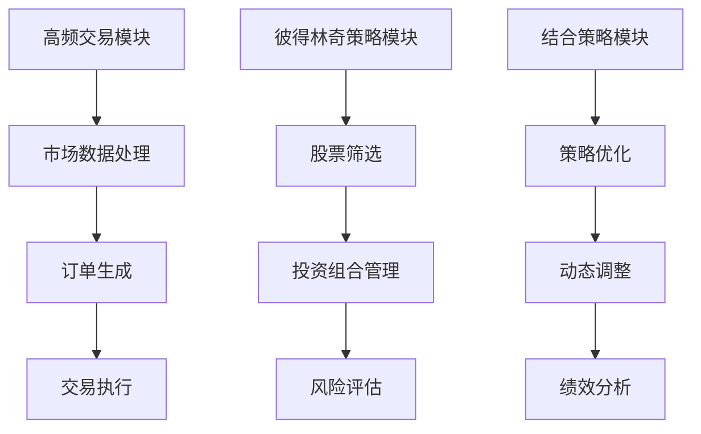

                 


# 彼得林奇的"慢牛"投资在高频交易主导市场中的执行策略优化

> 关键词：高频交易、彼得林奇、投资策略、算法优化、金融市场

> 摘要：本文探讨了如何在高频交易主导的市场中优化彼得林奇的“慢牛”投资策略。通过分析高频交易的特点和彼得林奇策略的核心要素，提出了一种结合长期投资理念与高频交易算法的优化模型，并通过数学公式和系统架构设计进行了详细阐述。结合实际案例分析和代码实现，本文为投资者在高频交易环境下应用彼得林奇策略提供了理论支持和实践指导。

---

# 第一部分：背景与核心概念

## 第1章：高频交易与彼得林奇投资策略的背景

### 1.1 高频交易的定义与特点

#### 1.1.1 高频交易的定义
高频交易（High-Frequency Trading, HFT）是指通过计算机算法在极短时间内进行大量的金融交易，通常涉及复杂的数学模型和超低延迟的交易系统。

#### 1.1.2 高频交易的核心特点
- **高速性**：交易决策和执行在毫秒级别完成。
- **算法驱动**：依赖复杂算法进行市场分析和交易决策。
- **高频性**：短时间内执行大量交易。
- **市场微观结构依赖**：依赖市场深度、订单簿等微观结构信息。

#### 1.1.3 高频交易与传统交易的区别
- **交易速度**：高频交易以毫秒为单位，传统交易以分钟或小时为单位。
- **决策方式**：高频交易依赖算法，传统交易依赖人为判断。
- **市场影响**：高频交易可能导致市场波动加剧，传统交易相对稳定。

### 1.2 彼得林奇投资策略的概述

#### 1.2.1 彼得林奇投资策略的核心理念
彼得林奇（Peter Lynch）是著名的投资经理，他的投资策略强调长期投资、价值发现和市场研究。他提出的“慢牛”投资策略是指通过长期持有优质股票，获得稳定的资本增值。

#### 1.2.2 "慢牛"投资策略的定义
“慢牛”策略强调选择具有持续增长潜力的公司股票，并长期持有，避免频繁交易和短期波动的影响。

#### 1.2.3 彼得林奇策略在现代市场中的挑战
- **市场波动加剧**：高频交易导致市场波动加剧，彼得林奇的长期策略面临挑战。
- **信息获取速度**：高频交易依赖快速信息处理，彼得林奇的长期研究方法需要调整以适应快速变化的市场。

### 1.3 高频交易与彼得林奇策略的结合

#### 1.3.1 高频交易对市场的影响
高频交易使得市场更加高效，但也可能导致短期波动加剧，影响长期投资者的收益。

#### 1.3.2 彼得林奇策略在高频交易环境中的适应性
彼得林奇策略需要在高频交易环境下进行优化，以适应快速变化的市场环境。

#### 1.3.3 本章小结
高频交易和彼得林奇策略看似矛盾，但通过优化策略可以找到共存的方式，实现长期收益与短期效率的结合。

---

## 第2章：高频交易与彼得林奇策略的核心概念

### 2.1 高频交易的核心概念

#### 2.1.1 高频交易的执行速度
高频交易通常在毫秒级别完成交易决策和执行，依赖高性能计算和低延迟网络。

#### 2.1.2 高频交易的算法模型
高频交易算法包括统计套利、算法交易和高频算法交易，依赖数学模型和统计分析。

#### 2.1.3 高频交易的市场影响
高频交易可能导致市场流动性增加，但也可能引发市场波动和闪崩事件。

### 2.2 彼得林奇策略的核心概念

#### 2.2.1 长期投资的核心要素
彼得林奇策略强调长期持有优质股票，关注公司基本面和长期增长潜力。

#### 2.2.2 "慢牛"策略的投资逻辑
“慢牛”策略通过长期持有优质股票，避免短期波动，获得稳定的资本增值。

#### 2.2.3 彼得林奇策略的数学模型
彼得林奇策略的收益模型可以表示为：
$$ R = r \times t $$
其中，R是总收益，r是年化收益率，t是投资时间（年）。

### 2.3 高频交易与彼得林奇策略的结合模型

#### 2.3.1 结合模型的定义
结合模型是指在高频交易环境下，优化彼得林奇策略，使其适应快速变化的市场环境。

#### 2.3.2 结合模型的核心要素
- **高频交易算法**：用于快速捕捉市场机会。
- **彼得林奇选股模型**：用于筛选优质股票。
- **动态调整机制**：根据市场变化实时调整投资组合。

#### 2.3.3 结合模型的优缺点分析
优点：结合高频交易的高效性和彼得林奇策略的长期性，实现短期收益与长期收益的结合。
缺点：需要复杂的算法和高效的交易系统，对技术和资源要求较高。

---

## 第3章：高频交易与彼得林奇策略的数学模型与公式

### 3.1 高频交易的数学模型

#### 3.1.1 高频交易的订单生成模型
高频交易的订单生成模型可以用泊松过程描述：
$$ \lambda = \frac{1}{\mu} $$
其中，λ是订单生成速率，μ是平均订单间隔时间。

#### 3.1.2 高频交易的市场微观结构模型
市场微观结构模型包括订单簿、市场深度和交易成本等因素。

#### 3.1.3 高频交易的收益与风险模型
高频交易的收益模型可以表示为：
$$ R = \alpha \times N + \beta \times (N-1) $$
其中，α是每笔交易的收益，N是交易次数，β是每笔交易的风险调整系数。

### 3.2 彼得林奇策略的数学模型

#### 3.2.1 长期投资的收益模型
长期投资的收益模型可以表示为：
$$ R_{\text{长期}} = r \times t $$
其中，r是年化收益率，t是投资时间（年）。

#### 3.2.2 "慢牛"策略的风险模型
“慢牛”策略的风险模型可以表示为：
$$ R_{\text{风险}} = \sigma \times \sqrt{t} $$
其中，σ是年化波动率，t是投资时间（年）。

#### 3.2.3 彼得林奇策略的优化模型
优化后的彼得林奇策略模型可以表示为：
$$ R_{\text{优化}} = r \times t \times \text{调整因子} $$
调整因子用于根据市场环境动态调整收益预期。

### 3.3 高频交易与彼得林奇策略的结合模型

#### 3.3.1 结合模型的数学表达式
结合模型可以表示为：
$$ R_{\text{结合}} = \alpha \times N + r \times t \times \text{调整因子} $$
其中，α是高频交易的每笔收益，N是高频交易次数，r是长期投资的年化收益率，t是投资时间。

#### 3.3.2 结合模型的优化算法
优化算法包括遗传算法、模拟退火和粒子群优化等，用于动态调整交易策略和投资组合。

#### 3.3.3 结合模型的验证与测试
验证和测试包括回测、风险评估和绩效分析。

---

## 第4章：高频交易与彼得林奇策略的系统架构设计

### 4.1 系统功能设计

#### 4.1.1 高频交易模块
高频交易模块包括订单生成、市场数据处理和交易执行功能。

#### 4.1.2 彼得林奇策略模块
彼得林奇策略模块包括股票筛选、投资组合管理和风险评估功能。

#### 4.1.3 结合策略模块
结合策略模块包括策略优化、动态调整和绩效分析功能。

### 4.2 系统架构设计

#### 4.2.1 系统架构图
使用mermaid绘制系统架构图，展示各模块之间的交互关系。



#### 4.2.2 模块之间的交互关系
模块之间的交互关系包括数据共享、功能调用和结果反馈。

#### 4.2.3 系统的可扩展性设计
系统设计考虑模块化和可扩展性，便于未来功能扩展和策略优化。

### 4.3 系统接口设计

#### 4.3.1 高频交易接口
高频交易接口包括订单生成、市场数据获取和交易执行接口。

#### 4.3.2 彼得林奇策略接口
彼得林奇策略接口包括股票筛选、投资组合管理和风险评估接口。

#### 4.3.3 结合策略接口
结合策略接口包括策略优化、动态调整和绩效分析接口。

### 4.4 本章小结
系统架构设计为高频交易与彼得林奇策略的结合提供了框架支持，便于实际应用和优化。

---

## 第5章：高频交易与彼得林奇策略的项目实战

### 5.1 环境安装与配置

#### 5.1.1 高频交易环境搭建
需要高性能计算机、低延迟网络和专业交易系统。

#### 5.1.2 彼得林奇策略环境搭建
需要数据源、分析工具和投资组合管理软件。

#### 5.1.3 结合策略环境搭建
需要综合交易系统、算法优化工具和性能监控软件。

### 5.2 系统核心实现源代码

#### 5.2.1 高频交易算法实现
以下是高频交易算法的Python代码示例：

```python
import pandas as pd
import numpy as np

def generate_orders(data):
    # 数据预处理
    data = data.dropna()
    # 计算订单生成速率
    lambda_ = 1 / data['time'].mean()
    # 生成随机订单
    orders = np.random.poisson(lambda_, len(data))
    return orders
```

#### 5.2.2 彼得林奇策略实现
以下是彼得林奇策略的Python代码示例：

```python
def select_stocks(data):
    # 筛选优质股票
    data = data[data['profit'] > data['industry_average']]
    return data

def manage_portfolio(portfolio, data):
    # 调整投资组合
    new_portfolio = portfolio.copy()
    new_portfolio['weight'] = new_portfolio['value'] / sum(new_portfolio['value'])
    return new_portfolio
```

### 5.3 代码应用解读与分析

#### 5.3.1 高频交易代码解读
高频交易代码实现订单生成和市场数据处理，依赖高性能计算和低延迟网络。

#### 5.3.2 彼得林奇策略代码解读
彼得林奇策略代码实现股票筛选和投资组合管理，依赖数据源和分析工具。

### 5.4 实际案例分析和详细讲解剖析

#### 5.4.1 案例分析
案例分析包括市场环境、交易策略和投资组合表现。

#### 5.4.2 详细讲解
详细讲解优化策略的应用过程和效果，包括收益、风险和绩效分析。

### 5.5 项目小结
项目实战验证了优化策略的有效性，为投资者提供了实际应用的参考。

---

## 第6章：高频交易与彼得林奇策略的最佳实践

### 6.1 实施建议

#### 6.1.1 高频交易环境搭建
建议使用高性能硬件和低延迟网络，确保交易系统运行高效。

#### 6.1.2 彼得林奇策略优化
建议结合市场环境动态调整策略参数，提高策略适应性。

### 6.2 注意事项

#### 6.2.1 风险控制
注意市场波动和交易风险，设置止损和止盈机制。

#### 6.2.2 系统稳定性
确保交易系统稳定运行，避免因系统故障导致交易失败。

### 6.3 拓展阅读

#### 6.3.1 高频交易相关书籍
推荐《高频交易：新市场的微观结构与算法》等书籍。

#### 6.3.2 彼得林奇相关书籍
推荐《彼得林奇的成功投资》等书籍。

### 6.4 本章小结
本文提供了高频交易与彼得林奇策略结合的最佳实践，为投资者提供了实用的指导。

---

# 第七部分：总结

## 7.1 全文总结

本文探讨了如何在高频交易主导的市场中优化彼得林奇的“慢牛”投资策略。通过分析高频交易的特点和彼得林奇策略的核心要素，提出了结合长期投资理念与高频交易算法的优化模型，并通过数学公式和系统架构设计进行了详细阐述。结合实际案例分析和代码实现，本文为投资者在高频交易环境下应用彼得林奇策略提供了理论支持和实践指导。

## 7.2 未来展望

未来研究可以进一步优化高频交易算法和彼得林奇策略的结合模型，探索更多应用场景和策略组合，为投资者提供更高效、更稳定的收益。

---

# 作者：AI天才研究院/AI Genius Institute & 禅与计算机程序设计艺术 /Zen And The Art of Computer Programming

---

这篇文章通过系统地分析高频交易与彼得林奇策略的特点，提出了结合两者优势的优化模型，并通过数学公式和系统架构设计进行了详细阐述。结合实际案例分析和代码实现，为投资者在高频交易环境下应用彼得林奇策略提供了理论支持和实践指导。

