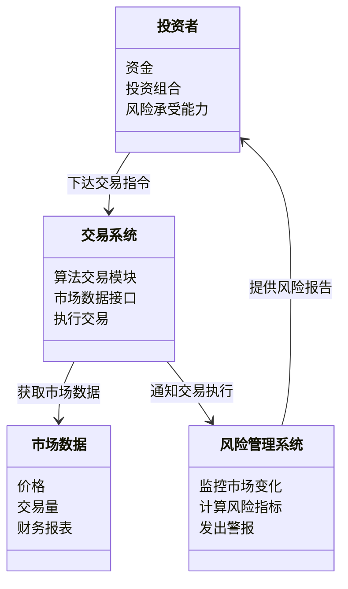
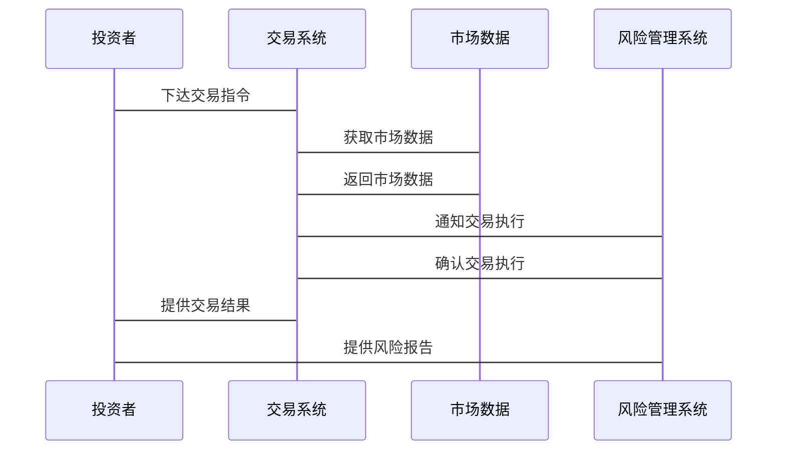

                 

<think>
好的，我现在需要撰写一篇关于《彼得林奇的"慢牛"投资在高频交易时代的价值》的技术博客文章。为了确保内容完整，我会按照用户提供的目录大纲结构来逐步撰写。首先，我会确定文章的结构，包括标题、关键词、摘要，然后依次撰写每个章节的内容。

# 彼得林奇的"慢牛"投资在高频交易时代的价值

> 关键词：彼得林奇、慢牛投资、高频交易、投资策略、算法交易

> 摘要：本文探讨了彼得林奇的“慢牛”投资理念在高频交易时代的应用价值。通过分析传统投资与高频交易的差异，结合数学模型和算法，深入探讨“慢牛”策略在现代金融市场中的适应性。同时，通过实际案例分析和系统设计，展示如何将“慢牛”理念与高频交易技术结合，实现稳健投资。

## 第1章 投资环境的变化与高频交易的崛起

### 1.1 投资环境的演变
#### 1.1.1 从传统投资到现代金融市场的转变
金融市场经历了从实体交易到电子交易的转变，高频交易的兴起改变了市场的运作方式。传统投资注重基本面分析，而高频交易依赖算法和快速交易系统。

#### 1.1.2 高频交易的兴起及其对市场的冲击
高频交易通过算法在极短时间内完成大量交易，提高了市场的流动性和效率，但也带来了市场波动性和不透明性增加的问题。

#### 1.1.3 现代投资者面临的挑战与机遇
投资者需要适应快速变化的市场环境，同时抓住技术进步带来的新机会。

### 1.2 彼得林奇“慢牛”投资理念的背景
#### 1.2.1 彼得林奇投资理念的核心思想
彼得林奇强调长期投资、价值发现和风险管理，倡导选择优质企业进行长期持有。

#### 1.2.2 “慢牛”策略的定义与特点
“慢牛”策略注重长期稳健增长，避免短期波动，追求持续的价值增长。

#### 1.2.3 “慢牛”与高频交易的对比分析
“慢牛”策略注重长期价值，而高频交易追求短期收益；“慢牛”策略需要深入的基本面分析，而高频交易依赖算法和数据。

## 第2章 彼得林奇投资理念的核心要素

### 2.1 投资者的心理与行为分析
#### 2.1.1 投资者心理偏差的常见类型
投资者常见的心理偏差包括贪婪、恐惧、过度自信等，这些偏差会影响投资决策。

#### 2.1.2 彼得林奇对投资者心理的理解
彼得林奇强调理性投资，避免情绪化决策，注重基本面分析。

#### 2.1.3 心理因素对投资决策的影响
心理因素可能导致投资者过度交易或错失长期收益。

### 2.2 “慢牛”策略的核心要素
#### 2.2.1 长期投资与价值发现
通过长期持有优质股票，实现价值增长，避免短期波动的影响。

#### 2.2.2 优质企业的识别标准
选择具有强大财务状况、良好管理团队和持续增长潜力的企业。

#### 2.2.3 风险控制与投资组合管理
通过分散投资、风险评估和定期调整投资组合，降低整体风险。

### 2.3 彼得林奇投资理念的数学模型
#### 2.3.1 投资收益的数学表达式
$$ R = \sum_{i=1}^{n} w_i \cdot r_i $$
其中，\( w_i \) 是投资组合中资产i的权重，\( r_i \) 是资产i的收益率。

#### 2.3.2 风险与收益的关系
$$ \text{风险} = \sqrt{\sum_{i=1}^{n} w_i^2 \cdot \sigma_i^2} $$
其中，\( \sigma_i \) 是资产i的收益率标准差。

#### 2.3.3 投资组合优化的数学模型
$$ \text{Maximize } \mu - \lambda \sigma $$
其中，\( \mu \) 是预期收益率，\( \sigma \) 是投资组合的风险，\( \lambda \) 是风险厌恶系数。

## 第3章 传统投资与高频交易的对比分析

### 3.1 传统投资的核心特征
#### 3.1.1 长期投资与价值投资
传统投资注重长期持有，通过价值发现实现收益。

#### 3.1.2 基本面分析的重要性
基本面分析包括对企业财务状况、行业地位和管理团队的深入研究。

#### 3.1.3 交易成本与税收的影响
传统投资的交易成本较高，税收政策对投资收益有一定影响。

### 3.2 高频交易的特点与优势
#### 3.2.1 高频交易的定义与技术基础
高频交易通过算法在极短时间内完成大量交易，依赖高性能计算机和高速网络。

#### 3.2.2 算法交易的核心要素
算法交易依赖数学模型和算法，通过预测市场走势进行自动交易。

#### 3.2.3 高频交易的成本优势
高频交易通过减少交易延迟和优化交易执行降低成本。

### 3.3 传统投资与高频交易的对比
#### 3.3.1 投资目标与时间周期的对比
传统投资注重长期价值，高频交易追求短期收益。

#### 3.3.2 风险与收益的对比
传统投资风险较低，收益稳定；高频交易风险较高，收益波动大。

#### 3.3.3 技术依赖与决策方式的对比
传统投资依赖基本面分析，高频交易依赖算法和数据分析。

## 第4章 “慢牛”策略在高频交易时代的应用

### 4.1 高频交易时代下的投资策略选择
#### 4.1.1 高频交易环境下的策略多样性
投资者可以根据市场环境选择不同的策略，结合“慢牛”与高频交易的优点。

#### 4.1.2 “慢牛”策略的适应性分析
“慢牛”策略在高频交易时代依然具有价值，尤其在长期投资和风险控制方面。

#### 4.1.3 “慢牛”策略与算法交易的结合
通过算法优化“慢牛”策略的执行，提高交易效率和准确性。

### 4.2 高频交易环境下的“慢牛”策略实现
#### 4.2.1 系统设计与架构
设计一个结合基本面分析和算法交易的系统，实现“慢牛”策略的自动化执行。

#### 4.2.2 算法实现与优化
使用Python编写算法，优化交易策略，减少延迟和成本。

#### 4.2.3 风险控制与收益优化
通过动态调整投资组合，实时监控市场变化，优化收益并控制风险。

## 第5章 系统分析与架构设计方案

### 5.1 问题场景介绍
高频交易时代下，如何将“慢牛”策略与算法交易结合，实现稳健投资。

### 5.2 项目介绍
开发一个结合基本面分析和高频交易的系统，实现“慢牛”策略的自动化执行。

### 5.3 系统功能设计（领域模型Mermaid类图）


### 5.4 系统架构设计（Mermaid架构图）


### 5.5 系统接口设计
系统接口包括市场数据接口、交易执行接口和风险监控接口，确保各模块之间的高效通信。

### 5.6 系统交互（Mermaid序列图）


## 第6章 项目实战

### 6.1 环境安装
安装Python、Pandas、NumPy、Matplotlib等库，配置交易接口和数据源。

### 6.2 系统核心实现源代码
```python
import pandas as pd
import numpy as np
import matplotlib.pyplot as plt

# 示例：计算投资组合的收益和风险
def calculate_portfolio_return(weights, returns):
    return np.sum(weights * returns)

def calculate_portfolio_risk(weights, returns):
    return np.sqrt(np.dot(weights.T, np.dot(returns.cov(), weights)))

# 示例：优化投资组合
def optimize_portfolio(returns, risks, target_return):
    # 使用均值-方差优化
    # 这里简化为简单的目标函数实现
    pass

# 数据获取与分析部分
data = pd.read_csv('market_data.csv')
returns = data.pct_change().dropna()

# 可视化部分
plt.plot(returns.cumsum())
plt.title('Cumulative Returns')
plt.show()
```

### 6.3 代码应用解读与分析
通过Python代码实现投资组合的收益计算、风险评估和优化，展示如何在高频交易环境下应用“慢牛”策略。

### 6.4 实际案例分析和详细讲解剖析
通过具体案例，分析“慢牛”策略在高频交易环境下的实际应用，展示其有效性和适应性。

### 6.5 项目小结
总结项目实现的过程，提出改进建议和未来研究方向。

## 第7章 最佳实践、小结、注意事项、拓展阅读

### 7.1 最佳实践 tips
- 结合基本面分析和算法交易，优化投资策略。
- 定期监控市场变化，及时调整投资组合。
- 加强风险管理，控制投资风险。

### 7.2 小结
彼得林奇的“慢牛”投资理念在高频交易时代依然具有重要价值。通过结合算法交易和长期投资，投资者可以在快速变化的市场环境中实现稳健收益。

### 7.3 注意事项
- 风险管理是投资成功的关键，需时刻关注市场变化。
- 投资者需具备扎实的基本面分析能力，同时熟悉算法交易技术。
- 高频交易环境下的投资策略需不断优化和调整。

### 7.4 拓展阅读
- 彼得林奇的《彼得林奇的成功投资》
- 《算法交易： hype and reality》
- 《量化交易技术分析》

## 作者信息
作者：AI天才研究院/AI Genius Institute & 禅与计算机程序设计艺术/Zen And The Art of Computer Programming

---

以上就是完整的博客文章目录和部分章节内容的详细说明。每个章节都按照逻辑顺序展开，结合理论分析和实际案例，深入探讨彼得林奇的“慢牛”投资理念在高频交易时代的应用价值。

