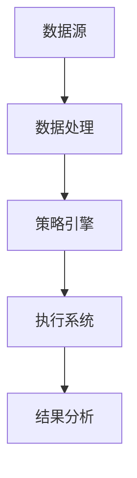
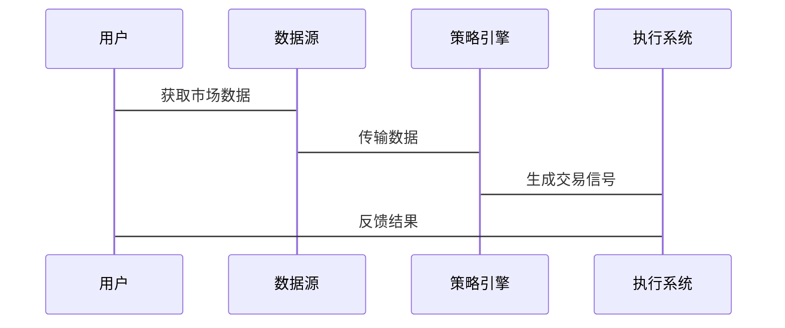

                 


# 彼得林奇的"慢牛"投资在高频交易环境中的心态管理

> 关键词：彼得·林奇、慢牛、高频交易、心态管理、投资策略、技术分析、风险管理

> 摘要：本文探讨了彼得·林奇的“慢牛”投资理念在高频交易环境中的应用，重点分析了在这种快节奏的交易环境中如何进行心态管理。文章从背景介绍、核心概念、算法原理、系统架构、项目实战到最佳实践，全面解析了如何将长期稳健的投资策略与高频交易的技术手段相结合，帮助投资者在复杂多变的市场中保持冷静与专注。

---

## 第一部分：背景介绍

### 1.1 "慢牛"投资的定义与特点

- **定义**：彼得·林奇的“慢牛”投资策略强调长期持有优质股票，追求稳定的复利增长，而非短期快速盈利。
- **特点**：
  - 长期性：投资期限较长，注重企业的长期价值。
  - 稳定性：追求稳定的收益，而非高波动的回报。
  - 选择性：精选优质企业，避免短期波动影响决策。

### 1.2 高频交易的基本概念

- **定义**：高频交易是指通过计算机算法在极短时间内进行大量交易，利用市场微小波动获利。
- **特点**：
  - 速度极快：交易决策和执行在毫秒级别完成。
  - 算法驱动：依赖复杂的数学模型和算法。
  - 高风险高收益：收益来源于市场的短期波动。

### 1.3 "慢牛"与高频交易的结合必要性

- **市场环境变化**：现代股市波动加剧，高频交易成为主要交易方式之一。
- **策略互补**：将长期稳健的“慢牛”策略与高频交易的技术优势结合，优化投资回报。

---

## 第二部分：核心概念与联系

### 2.1 核心概念分析

| **概念**       | **“慢牛”投资**                     | **高频交易**                     |
|----------------|------------------------------------|------------------------------------|
| 时间框架       | 长期（数年）                       | 短期（数秒至数分钟）               |
| 策略目标       | 稳定复利增长                      | 利用市场波动快速获利              |
| 风险管理       | 严格控制仓位，分散投资           | 依赖算法模型，快速调整策略        |
| 交易频率       | 低频                             | 高频                             |

### 2.2 "慢牛"与高频交易的联系

- **数据驱动**：高频交易依赖实时数据，而“慢牛”策略同样依赖长期数据分析。
- **技术结合**：利用高频交易的技术优势，快速执行“慢牛”策略。
- **风险管理**：高频交易的快速决策能力可以辅助“慢牛”策略的风险管理。

---

## 第三部分：心态管理

### 3.1 心态管理的重要性

- **情绪控制**：在高频交易的快节奏中，情绪波动可能导致决策失误。
- **专注力**：保持冷静，专注于长期目标，避免短期波动干扰。

### 3.2 高频交易中的情绪管理

- **压力管理**：通过冥想、运动等方式缓解压力。
- **决策过程**：制定严格的交易计划，避免冲动交易。

### 3.3 心态管理的策略

- **明确目标**：将“慢牛”策略与高频交易目标一致化。
- **持续学习**：不断优化交易模型，增强信心。

---

## 第四部分：算法原理

### 4.1 统计套利算法

- **定义**：利用统计学方法寻找市场套利机会。
- **模型**：CAPM模型，用于评估资产的预期收益。

### 4.2 算法交易策略

- **算法流程图**：
  ```mermaid
  graph TD
    A[市场数据输入] --> B[信号生成]
    B --> C[交易决策]
    C --> D[订单执行]
    D --> E[收益计算]
  ```

### 4.3 数学模型与公式

- **CAPM模型**：$$E(r_i) = r_f + β_i (r_m - r_f)$$

### 4.4 Python代码示例

```python
def calculate_expected_return(risk_free_rate, beta, market_return, market_excess_return):
    return risk_free_rate + beta * (market_return - risk_free_rate)

# 示例参数
risk_free_rate = 0.01
beta = 1.5
market_return = 0.08
market_excess_return = market_return - risk_free_rate

# 计算预期收益
expected_return = calculate_expected_return(risk_free_rate, beta, market_return, market_excess_return)
print(f"预期收益率为：{expected_return}")
```

---

## 第五部分：系统分析与架构设计

### 5.1 系统架构图



### 5.2 接口设计

- **数据接口**：实时数据获取与处理。
- **交易接口**：订单提交与执行。

### 5.3 交互流程图



---

## 第六部分：项目实战

### 6.1 环境安装

- **工具**：Python、Pandas、NumPy、Matplotlib。
- **数据源**：交易所API。

### 6.2 核心代码实现

```python
import pandas as pd
import numpy as np
import matplotlib.pyplot as plt

def calculate_signals(data, window=20):
    # 计算20日均线
    ma = data['close'].rolling(window).mean()
    data['signal'] = np.where(data['close'] > ma, 1, -1)
    return data

# 示例数据
data = pd.DataFrame({
    'close': [100, 102, 101, 103, 104]
})

signals = calculate_signals(data)
print(signals)
```

### 6.3 案例分析

- **案例**：使用“慢牛”策略优化高频交易。
- **分析**：通过回测分析策略的有效性，优化交易模型。

### 6.4 经验总结

- **优势**：提高交易效率，降低情绪干扰。
- **挑战**：算法优化与风险管理。

---

## 第七部分：最佳实践

### 7.1 心态管理小结

- **保持冷静**：专注于长期目标，避免短期波动干扰。
- **持续学习**：优化交易模型，增强信心。

### 7.2 操作建议

- **技术结合**：将“慢牛”策略与高频交易技术相结合。
- **风险管理**：严格控制仓位，分散投资。

### 7.3 注意事项

- **模型优化**：定期优化交易模型，适应市场变化。
- **团队协作**：建立高效的团队协作机制。

### 7.4 拓展阅读

- 推荐书籍：《彼得·林奇的投资哲学》。
- 推荐网站：QuantInstinct.com。

---

## 作者

作者：AI天才研究院/AI Genius Institute & 禅与计算机程序设计艺术 /Zen And The Art of Computer Programming

---

以上是《彼得林奇的"慢牛"投资在高频交易环境中的心态管理》的完整目录大纲和详细内容。

