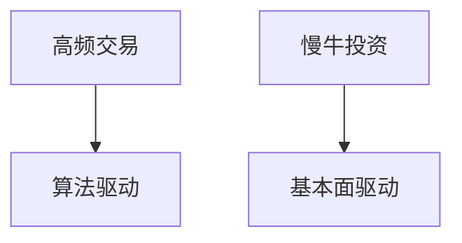
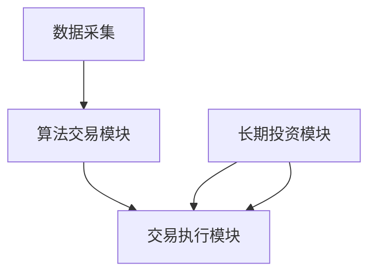

                 


---

# 彼得林奇的"慢牛"投资在高频交易环境中的心理建设

## 关键词：高频交易、彼得林奇、慢牛投资、心理建设、算法交易、投资心理

## 摘要：本文探讨了如何在高频交易的快节奏环境中，运用彼得林奇的"慢牛"投资理念进行心理建设。通过分析高频交易的特点与"慢牛"投资的本质差异，结合算法交易与长期价值投资的平衡，提出在高频交易环境下保持长期投资心理的方法。本文从理论分析到实践应用，详细阐述了如何在复杂多变的市场中，通过心理调节和技术手段，实现投资目标。

---

## 第一部分: 背景介绍

### 第1章: 高频交易与彼得林奇投资理念的背景

#### 1.1 高频交易的背景与现状

##### 1.1.1 高频交易的定义与特点
高频交易（High-Frequency Trading, HFT）是指通过复杂的算法和计算机系统，在极短时间内进行大量股票、期货等金融产品的交易。其主要特点包括：
- **自动化**：依赖算法自动执行交易。
- **高速性**：利用高速网络和低延迟设备，快速完成交易。
- **高频次**：短时间内进行大量交易，追求微小价差的累计收益。

##### 1.1.2 高频交易的历史发展
高频交易起源于20世纪90年代，随着互联网技术的发展和交易系统的升级，逐渐成为金融市场的重要组成部分。高频交易公司通过技术优势，占据了市场的主导地位，但也引发了市场的质疑和监管关注。

##### 1.1.3 高频交易的市场影响
高频交易的普及使得市场流动性大幅提高，但同时也带来了市场波动性增加的问题。高频交易公司通过算法优势，占据了市场的主要交易量，但其短期交易策略可能与长期价值投资理念相冲突。

#### 1.2 彼得林奇投资理念的背景

##### 1.2.1 彼得林奇投资理念的核心思想
彼得林奇（Peter Lynch）是全球著名的职业基金经理人，他强调长期投资和价值发现。他认为，投资者应该寻找那些具有持续增长潜力的公司，长期持有，而非频繁交易以追求短期收益。

##### 1.2.2 "慢牛"投资策略的定义与特点
"慢牛"投资策略是指通过长期持有优质股票，在市场波动中逐步积累收益。其特点包括：
- **长期性**：强调长期持有，不频繁交易。
- **价值导向**：注重公司基本面，选择具有持续增长潜力的股票。
- **稳定性**：在市场波动中保持稳定，追求长期复利收益。

##### 1.2.3 "慢牛"投资策略的历史表现
彼得林奇在其职业生涯中管理的麦哲伦基金，通过长期持有优质股票，取得了显著的长期收益。这种投资策略在长期市场表现中优于短期高频交易策略。

#### 1.3 高频交易与"慢牛"投资的冲突与融合

##### 1.3.1 两者的本质差异
高频交易追求短期收益，依赖技术优势；而"慢牛"投资追求长期收益，依赖基本面分析。两者在交易频率、策略目标和风险控制上有明显差异。

##### 1.3.2 高频交易环境对"慢牛"投资的挑战
高频交易的高波动性和短期性对长期投资者的心理和策略构成了挑战。市场短期波动可能掩盖长期趋势，投资者需要在市场波动中保持信心，避免短期交易的诱惑。

##### 1.3.3 如何在高频交易环境中实践"慢牛"投资
在高频交易环境中，投资者需要结合技术分析和基本面分析，建立长期投资策略，同时通过心理建设克服短期波动带来的心理压力。

---

## 第二部分: 核心概念与联系

### 第2章: 高频交易与"慢牛"投资的核心概念

#### 2.1 高频交易的核心原理

##### 2.1.1 高频交易的算法机制
高频交易依赖复杂的算法，包括统计套利、算法交易模型等。这些算法通过分析市场数据，快速做出交易决策。

##### 2.1.2 高频交易的数学模型
高频交易的数学模型包括时间序列分析、统计套利模型等。这些模型通过分析市场数据，预测短期价格波动。

##### 2.1.3 高频交易的风险与收益分析
高频交易的风险主要体现在市场波动性和技术故障。收益主要来源于短期价格波动的微小利润积累。

#### 2.2 "慢牛"投资的核心原理

##### 2.2.1 "慢牛"投资的选股策略
"慢牛"投资注重公司基本面分析，选择具有持续增长潜力的公司。选股策略包括市盈率分析、ROE分析、成长性分析等。

##### 2.2.2 "慢牛"投资的长期收益模型
"慢牛"投资的收益模型基于复利效应，通过长期持有优质股票，实现资产的稳定增长。

##### 2.2.3 "慢牛"投资的心理学基础
"慢牛"投资需要投资者具备强大的心理素质，能够在市场波动中保持冷静，避免短期交易的诱惑。

#### 2.3 高频交易与"慢牛"投资的对比分析

##### 2.3.1 核心概念对比表
| **对比维度** | **高频交易** | **"慢牛"投资** |
|--------------|--------------|----------------|
| 交易频率     | 高           | 低             |
| 交易策略     | 算法驱动     | 基本面驱动     |
| 投资期限     | 短期         | 长期           |
| 风险控制     | 技术性       | 基本面分析     |

##### 2.3.2 交易策略对比图（Mermaid）


---

## 第三部分: 算法原理

### 第3章: 高频交易中的算法与"慢牛"投资的结合

#### 3.1 高频交易算法原理

##### 3.1.1 统计套利算法
统计套利算法通过分析市场数据，寻找价格偏离均值的机会，进行套利交易。

##### 3.1.2 算法交易模型
算法交易模型包括均值回归模型、动量模型等，通过分析市场数据，预测短期价格波动。

#### 3.2 "慢牛"投资的数学模型

##### 3.2.1 均值回归模型
$$ R_t = \alpha + \beta R_{t-1} + \epsilon_t $$

##### 3.2.2 马科维茨有效组合模型
$$ \text{Minimize } \sigma^2 \text{ subject to } E[r] \geq \text{目标收益} $$

#### 3.3 高频交易与"慢牛"投资的算法结合

##### 3.3.1 高频交易中的"慢牛"算法
在高频交易中，可以通过算法筛选出具有长期增长潜力的股票，结合短期价格波动进行交易。

##### 3.3.2 算法实现示例
```python
import pandas as pd
import numpy as np

def slow_bull_strategy(prices, window=20):
    # 计算20日均线
    ma = pd.Series.rolling(prices, window).mean()
    # 生成交易信号
    signal = pd.Series.where(prices > ma, 0, 1)
    return signal
```

---

## 第四部分: 数学模型

### 第4章: 结合高频交易与"慢牛"投资的数学模型

#### 4.1 高频交易中的数学模型

##### 4.1.1 时间序列分析
$$ ARIMA(p, d, q) $$

##### 4.1.2 统计套利模型
$$ pairs\_trading = \text{寻找价格趋同的股票对} $$

#### 4.2 "慢牛"投资中的数学模型

##### 4.2.1 均值回归模型
$$ \text{长期均值} = \mu $$

##### 4.2.2 动量模型
$$ \text{动量系数} = \text{过去n期的收益} $$

#### 4.3 结合高频交易与"慢牛"投资的数学模型

##### 4.3.1 长短期结合的模型
$$ \text{综合收益} = \alpha \times \text{长期收益} + \beta \times \text{短期收益} $$

---

## 第五部分: 系统分析

### 第5章: 高频交易环境下的系统架构

#### 5.1 系统功能设计

##### 5.1.1 数据采集模块
- 采集市场数据，包括价格、成交量等。

##### 5.1.2 算法交易模块
- 实现高频交易算法，生成交易信号。

##### 5.1.3 长期投资模块
- 实现"慢牛"投资策略，筛选长期增长潜力股票。

#### 5.2 系统架构图（Mermaid）



---

## 第六部分: 项目实战

### 第6章: 在高频交易环境中实现"慢牛"投资

#### 6.1 环境安装

##### 6.1.1 安装Python环境
- 使用Anaconda安装Python 3.8及以上版本。

##### 6.1.2 安装相关库
- `pip install pandas numpy matplotlib`

#### 6.2 核心实现

##### 6.2.1 数据采集代码
```python
import pandas as pd
import requests

def get_data(ticker):
    url = f"https://api.example.com/stock/{ticker}"
    response = requests.get(url)
    data = response.json()
    df = pd.DataFrame(data)
    return df
```

##### 6.2.2 策略实现代码
```python
def slow_bull_strategy(prices, window=20):
    # 计算均线
    ma = prices.rolling(window).mean()
    # 生成信号
    signal = (prices > ma).astype(int)
    return signal
```

#### 6.3 案例分析

##### 6.3.1 数据分析
- 使用历史数据验证"慢牛"策略的有效性。

##### 6.3.2 策略回测
- 计算策略在历史数据中的表现，包括收益率、波动率等。

#### 6.4 小结
通过实际案例，验证了在高频交易环境中实现"慢牛"投资的可行性。

---

## 第七部分: 最佳实践

### 第7章: 投资者心理建设与实际操作建议

#### 7.1 心理建设

##### 7.1.1 建立长期投资理念
- 强调长期复利效应，避免短期波动干扰。

##### 7.1.2 培养坚韧不拔的毅力
- 在市场波动中保持冷静，坚持投资策略。

#### 7.2 实际操作建议

##### 7.2.1 结合技术分析
- 在高频交易环境中，结合技术分析工具，寻找长期趋势。

##### 7.2.2 定期评估和调整策略
- 根据市场变化，定期评估投资策略，进行适当调整。

#### 7.3 小结与注意事项

##### 7.3.1 小结
- 在高频交易环境中，"慢牛"投资需要结合技术分析和基本面分析，建立长期投资策略。

##### 7.3.2 注意事项
- 避免过度依赖高频交易的技术优势，保持长期投资的耐心和信心。

---

## 作者：AI天才研究院 & 禅与计算机程序设计艺术

---

通过本文的详细分析，读者可以理解如何在高频交易环境中，运用彼得林奇的"慢牛"投资理念进行心理建设，并通过实际操作实现长期投资目标。

