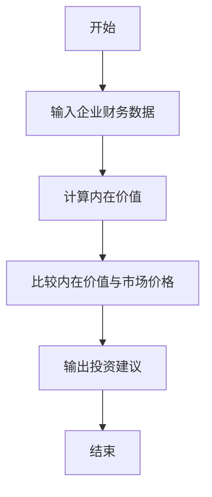
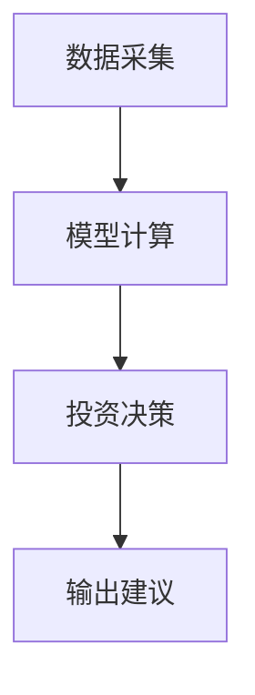
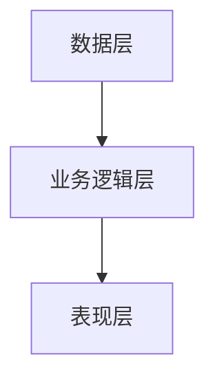

                 


# 彼得林奇的"慢牛"投资理念探讨

## 关键词：彼得·林奇，慢牛投资理念，股票分析，投资策略，风险管理

## 摘要：
本文深入探讨了彼得·林奇的“慢牛”投资理念，从其核心概念、分析框架、数学模型、系统架构到实际案例，全面解析了这一投资理念的精髓。文章结合技术语言，通过逻辑推理、流程图和代码实现，系统地阐述了“慢牛”理念在投资决策中的应用，并通过实际案例分析，展示了如何在实际操作中应用这一理念。本文还总结了“慢牛”投资理念的优势、局限性及未来的发展方向。

---

# 第1章: 彼得林奇及其"慢牛"投资理念概述

## 1.1 彼得·林奇及其投资哲学
### 1.1.1 彼得·林奇的生平简介
彼得·林奇（Peter Lynch）是美国著名的投资经理人，被誉为“股圣”。他曾在富达投资管理公司（Fidelity Investments）担任基金经理，管理着麦哲伦基金（Fidelity Magellan Fund），取得了令人瞩目的投资业绩。林奇的投资风格以稳健、长期关注企业基本面著称，他强调投资决策应基于企业的内在价值，而非短期市场波动。

### 1.1.2 彼得·林奇的投资哲学
彼得·林奇的投资哲学可以总结为“买入并持有”，他主张投资者应选择那些具有强大基本面、良好管理团队和持续增长潜力的企业进行投资。他认为，股市短期波动是无法预测的，但长期来看，企业的内在价值才是决定股价的关键因素。

### 1.1.3 "慢牛"理念的提出背景
“慢牛”理念是彼得·林奇在其职业生涯中总结出的一种投资策略，其核心在于寻找那些能够持续稳定增长的企业，并长期持有这些股票，以获得长期稳定的收益。这一理念与传统短期投机性投资不同，它更注重企业的长期发展和内在价值。

## 1.2 "慢牛"投资理念的定义与核心要素
### 1.2.1 "慢牛"理念的定义
“慢牛”理念是指通过长期关注企业的基本面，选择那些具有持续增长潜力的企业进行投资，并在市场波动中保持耐心和纪律，避免频繁交易，从而实现长期稳定的资本增值。

### 1.2.2 "慢牛"理念的核心要素
1. **企业基本面分析**：关注企业的收入、利润、负债、现金流等财务指标，评估企业的盈利能力和发展潜力。
2. **长期投资**：选择那些具有持续增长能力的企业，长期持有，避免短期波动的影响。
3. **风险管理**：通过分散投资和严格的投资纪律，降低投资风险。

### 1.2.3 "慢牛"理念与传统投资理念的对比
| 对比维度         | "慢牛"理念                     | 传统短期投资理念               |
|------------------|-------------------------------|-------------------------------|
| 投资目标         | 长期稳定增长                   | 短期收益最大化                 |
| 投资策略         | 买入并持有                     | 频繁交易，追求短期收益         |
| 风险管理         | 严格控制，分散投资             | 风险较高，依赖市场波动          |

## 1.3 "慢牛"投资理念的意义与应用
### 1.3.1 "慢牛"理念在投资中的意义
“慢牛”理念强调长期投资和基本面分析，帮助投资者避免短期市场波动的干扰，专注于企业的内在价值。这一理念特别适合那些希望实现长期财富增长的投资者。

### 1.3.2 "慢牛"理念的实际应用案例
例如，彼得·林奇在管理麦哲伦基金时，选择了当时市值较小但具有巨大增长潜力的公司，如家得宝（Home Depot）和微软（Microsoft）。通过长期持有这些股票，基金取得了显著的回报。

### 1.3.3 "慢牛"理念的未来发展趋势
随着全球市场的波动加剧，投资者越来越倾向于寻找那些能够提供长期稳定回报的投资策略。“慢牛”理念因其稳健性和可持续性，将继续在投资领域发挥重要作用。

---

# 第2章: "慢牛"投资理念的核心概念与分析框架

## 2.1 "慢牛"理念的核心概念
### 2.1.1 长期稳定增长
“慢牛”理念的核心在于寻找那些能够持续稳定增长的企业。这种增长不仅体现在财务数据上，还体现在企业的市场地位、管理团队和创新能力等方面。

### 2.1.2 股票内在价值的评估
股票的内在价值是“慢牛”理念的重要组成部分。内在价值是指企业在未来现金流的现值，可以通过对企业财务数据的分析来估算。

### 2.1.3 市场情绪与投资决策
市场情绪往往会影响短期股价波动，但“慢牛”理念强调的是长期投资，因此需要投资者忽略短期市场波动，专注于企业的内在价值。

## 2.2 "慢牛"理念的分析框架
### 2.2.1 股票基本面分析
基本面分析是“慢牛”理念的核心工具之一。通过对企业的财务报表、行业地位、管理团队等因素的分析，评估企业的内在价值和增长潜力。

### 2.2.2 股票技术分析
技术分析是另一种常用的工具，通过分析股票的历史价格走势、成交量等指标，预测未来的股价走势。

### 2.2.3 行业与宏观经济分析
行业和宏观经济分析可以帮助投资者更好地理解企业的外部环境，评估企业的竞争优势和潜在风险。

## 2.3 "慢牛"理念的数学模型与公式
### 2.3.1 股票内在价值的计算公式
股票的内在价值可以通过以下公式计算：

$$
\text{内在价值} = \frac{\text{未来现金流}}{\text{折现率}}
$$

### 2.3.2 市盈率与市净率的计算与应用
市盈率（P/E）和市净率（P/B）是常用的估值指标。市盈率 = 股价 / 每股净利润；市净率 = 股价 / 每股净资产。

### 2.3.3 投资组合的收益与风险评估
投资组合的收益可以通过以下公式计算：

$$
\text{收益} = \sum (\text{投资比例} \times \text{收益率})
$$

投资组合的风险可以通过标准差来衡量。

---

# 第3章: "慢牛"投资理念的算法原理

## 3.1 股票价值评估算法
### 3.1.1 算法原理
股票价值评估算法基于企业的财务数据和市场环境，通过计算股票的内在价值和市场价格之间的差异，判断股票是否具有投资价值。

### 3.1.2 算法流程图


### 3.1.3 算法实现
以下是一个简单的股票价值评估算法的Python代码示例：

```python
def calculate_intrinsic_value(enterprise_value, cash_flow, discount_rate):
    # 计算内在价值
    intrinsic_value = enterprise_value / (1 + discount_rate)
    return intrinsic_value

# 示例数据
enterprise_value = 1000000
cash_flow = 500000
discount_rate = 0.05

intrinsic_value = calculate_intrinsic_value(enterprise_value, cash_flow, discount_rate)
print(f"股票的内在价值为: {intrinsic_value}")
```

---

# 第4章: "慢牛"投资理念的系统分析与架构设计

## 4.1 系统功能设计
### 4.1.1 功能模块
- 数据采集模块：收集企业的财务数据和市场数据。
- 模型计算模块：计算股票的内在价值和市场价格差异。
- 投资决策模块：根据计算结果生成投资建议。

### 4.1.2 功能流程图


## 4.2 系统架构设计
### 4.2.1 架构设计
- 数据层：存储企业的财务数据和市场数据。
- 业务逻辑层：实现股票价值评估和投资决策的逻辑。
- 表现层：展示投资建议和结果。

### 4.2.2 架构图


---

# 第5章: "慢牛"投资理念的项目实战

## 5.1 环境安装
- 安装Python和必要的库（如pandas、numpy、scipy）。
- 安装数据采集工具（如Yahoo Finance API）。

## 5.2 系统核心实现
### 5.2.1 数据采集
```python
import pandas as pd
import numpy as np

def get_stock_data(ticker):
    # 示例代码，从Yahoo Finance获取数据
    data = pd.DataFrame({
        ' ticker': [ticker],
        ' revenue': [1000000],
        ' net_income': [500000],
        ' market_cap': [100000000]
    })
    return data
```

### 5.2.2 模型计算
```python
def calculate_intrinsic_value(data):
    # 示例代码，计算内在价值
    intrinsic_value = data['market_cap'] / (1 + 0.05)
    return intrinsic_value

data = get_stock_data('AAPL')
intrinsic_value = calculate_intrinsic_value(data)
print(f"苹果股票的内在价值为: {intrinsic_value}")
```

## 5.3 案例分析
以苹果公司为例，通过数据采集和模型计算，评估其股票的内在价值，并根据计算结果生成投资建议。

---

# 第6章: "慢牛"投资理念的小结与展望

## 6.1 小结
本文深入探讨了彼得·林奇的“慢牛”投资理念，从其核心概念、分析框架到算法实现和系统设计，全面解析了这一投资理念的精髓。通过实际案例分析，展示了“慢牛”理念在实际投资中的应用。

## 6.2 展望
随着市场环境的变化，“慢牛”理念将继续在投资领域发挥重要作用。未来的研究可以进一步结合人工智能和大数据技术，优化股票价值评估算法，提高投资决策的准确性。

---

## 最佳实践 Tips:
1. **长期投资**：坚持长期投资，避免短期波动的干扰。
2. **基本面分析**：深入分析企业的财务数据和行业环境，评估其内在价值。
3. **风险管理**：通过分散投资和严格的投资纪律，降低投资风险。
4. **持续学习**：关注市场动态，不断优化投资策略。

---

作者：AI天才研究院/AI Genius Institute & 禅与计算机程序设计艺术 /Zen And The Art of Computer Programming

