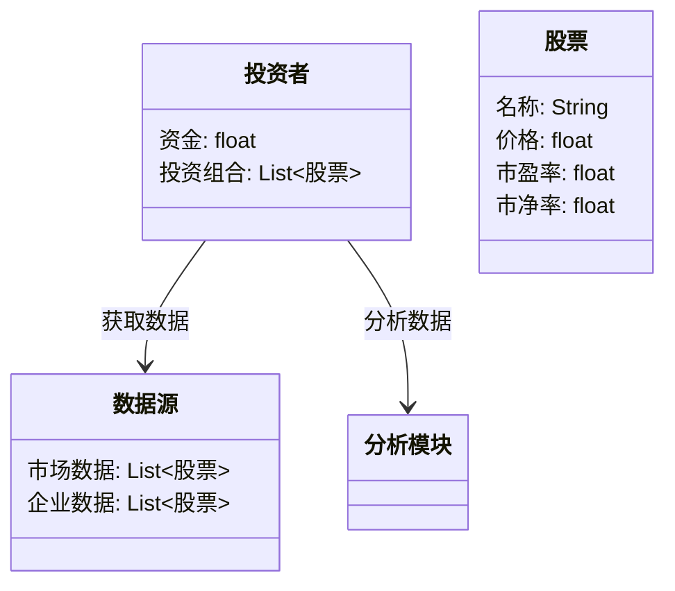

                 


# 彼得林奇的"慢牛"投资策略在不同市场的应用

> 关键词：彼得林奇，慢牛投资策略，股票投资，市场分析，投资系统架构

> 摘要：本文深入探讨了彼得林奇的"慢牛"投资策略，分析了其在不同市场的应用，并结合实际案例和系统架构，为投资者提供了实用的投资策略和系统设计方案。

---

## 第1章: 彼得林奇投资策略的核心理念

### 1.1 彼得林奇投资策略的背景

彼得林奇是美国著名的基金经理和投资专家，以其独特的"慢牛"投资策略闻名。这种策略强调长期投资，注重企业基本面分析，避免短期市场波动的干扰。其核心理念是选择具有持续增长潜力的企业，而非追求短期暴利。

#### 1.1.1 "慢牛"策略的定义与特点

"慢牛"策略是一种长期价值投资策略，注重企业的内在价值和持续增长能力。其特点包括：

1. **长期性**：投资期限较长，注重企业的长期增长。
2. **稳定性**：选择波动较小、风险可控的企业。
3. **基本面驱动**：以企业财务数据和行业趋势为依据。

#### 1.1.2 "慢牛"策略的核心思想与哲学

彼得林奇认为，投资成功的关键在于对企业进行深入研究，选择那些具有持续增长潜力的企业。他强调避免短期市场波动的干扰，专注于企业的内在价值。

---

### 1.2 "慢牛"策略与其他投资策略的对比

#### 1.2.1 传统投资策略的优缺点

- **优点**：灵活性高，适合短期操作。
- **缺点**：风险较大，需要频繁监控市场波动。

#### 1.2.2 "慢牛"策略的独特性与创新性

- **独特性**：注重长期价值，避免短期波动。
- **创新性**：结合基本面分析和长期投资理念。

#### 1.2.3 "慢牛"策略在不同市场环境下的适用性

在成熟市场（如美国）和新兴市场（如中国）中，"慢牛"策略的应用方式有所不同。成熟市场适合选择稳定的蓝筹股，而新兴市场则适合选择具有高增长潜力的企业。

---

## 第2章: "慢牛"策略的核心理论与分析

### 2.1 "慢牛"策略的核心要素

#### 2.1.1 长期价值投资的核心要素

- **企业基本面分析**：包括财务数据、行业地位、竞争优势等。
- **市场波动预测**：通过技术分析和市场情绪预测波动。
- **投资组合优化**：通过分散投资降低风险。

#### 2.1.2 企业基本面分析的关键指标

以下是常见的企业基本面分析指标：

| 指标名称   | 定义与作用                       |
|------------|--------------------------------|
| 市盈率（P/E）| 评估企业估值的指标             |
| 市净率（P/B）| 评估企业资产价值的指标         |
| 净利润率    | 评估企业盈利能力               |
| 营业收入增长率| 评估企业增长潜力               |

#### 2.1.3 市场波动与投资时机的选择

市场波动是影响投资策略的重要因素。在市场波动较大时，"慢牛"策略强调保持投资纪律，避免频繁交易。

---

### 2.2 "慢牛"策略的数学模型与算法

#### 2.2.1 投资回报的数学公式

投资回报的计算公式为：

$$ R = \frac{P_{final} - P_{initial}}{P_{initial}} \times 100\% $$

其中，$R$ 是投资回报率，$P_{final}$ 是最终价值，$P_{initial}$ 是初始投资。

#### 2.2.2 风险与收益的平衡模型

通过现代投资组合理论（MPT）进行风险与收益的平衡。公式如下：

$$ \text{风险} = \sqrt{2 \times \text{协方差矩阵}} $$

#### 2.2.3 "慢牛"策略的风险控制机制

通过设定止损点和分散投资来控制风险。止损点的计算公式为：

$$ \text{止损点} = P_{entry} \times (1 - \text{止损比例}) $$

---

## 第3章: 美国市场的"慢牛"策略应用

### 3.1 美国市场的特点与投资环境

美国市场是全球最成熟的市场之一，适合"慢牛"策略的应用。其特点包括：

- 市场流动性高。
- 企业信息披露透明。
- 蓝筹股占比高。

#### 3.1.1 具体案例分析

以苹果公司为例，通过基本面分析和长期持有策略，投资者可以获得稳定的回报。

### 3.2 "慢牛"策略在美国市场的具体应用

- **投资组合构建**：选择具有持续增长潜力的蓝筹股。
- **风险控制**：通过分散投资和设定止损点降低风险。

---

## 第4章: 中国市场的"慢牛"策略应用

### 4.1 中国市场的特点与投资环境

中国市场的特点是增长潜力大，但波动性较高。其特点包括：

- 经济增长快。
- 行业集中度高。
- 政策影响大。

#### 4.1.1 具体案例分析

以茅台为例，通过基本面分析和长期持有策略，投资者可以获得较高的回报。

### 4.2 "慢牛"策略在中国市场的具体应用

- **行业选择**：选择具有高增长潜力的行业，如科技和消费行业。
- **政策分析**：关注政策变化对市场的影响。

---

## 第5章: 日本市场的"慢牛"策略应用

### 5.1 日本市场的特点与投资环境

日本市场成熟度高，但增长潜力有限。其特点包括：

- 企业盈利能力稳定。
- 市场波动较小。
- 人口老龄化问题。

#### 5.1.1 具体案例分析

以丰田为例，通过基本面分析和长期持有策略，投资者可以获得稳定的回报。

### 5.2 "慢牛"策略在日本市场的具体应用

- **行业选择**：选择具有稳定盈利能力的行业，如汽车和电子行业。
- **市场波动预测**：关注市场波动对投资的影响。

---

## 第6章: 投资系统架构设计与实现

### 6.1 系统功能模块划分

- 数据采集模块：采集市场数据和企业基本面数据。
- 数据分析模块：进行基本面分析和技术分析。
- 投资决策模块：根据分析结果生成投资策略。
- 风险控制模块：实时监控投资组合的风险。

### 6.2 系统架构设计

系统架构设计包括：

- 领域模型类图（Mermaid图）：


- 系统架构图（Mermaid图）：


### 6.3 系统接口设计

- 数据接口：提供API接口获取市场数据。
- 投资决策接口：根据分析结果生成投资策略。

---

## 第7章: 项目实战与案例分析

### 7.1 环境安装

- 安装Python和相关库（如Pandas、NumPy）。

### 7.2 核心代码实现

```python
import pandas as pd
import numpy as np

def calculate_return(initial, final):
    return (final - initial) / initial * 100

def calculate_risk(returns):
    return np.std(returns)

# 示例数据
prices = pd.Series([100, 110, 120, 130])
returns = prices.pct_change()

# 计算回报率
returns_percent = returns.apply(lambda x: x * 100)

# 计算风险
risk = calculate_risk(returns_percent)
```

### 7.3 案例分析

以苹果公司为例，分析其基本面和技术面，制定投资策略。

---

## 第8章: 总结与展望

### 8.1 总结

彼得林奇的"慢牛"策略强调长期投资和基本面分析，适合不同市场的应用。通过系统的架构设计和实际案例分析，我们可以更好地理解和应用这一策略。

### 8.2 展望

未来，随着市场的变化和技术的发展，"慢牛"策略需要不断创新和适应新的市场环境。

---

## 作者：AI天才研究院/AI Genius Institute & 禅与计算机程序设计艺术 /Zen And The Art of Computer Programming

---

以上是《彼得林奇的"慢牛"投资策略在不同市场的应用》的技术博客文章，涵盖了背景介绍、核心理论、系统设计、项目实战等内容，结合了数学模型和实际案例，帮助投资者更好地理解和应用"慢牛"策略。

