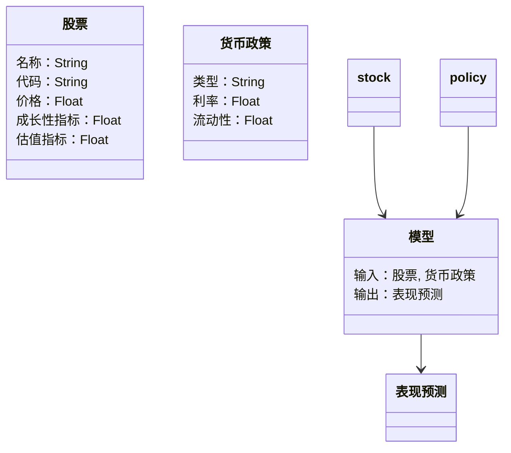
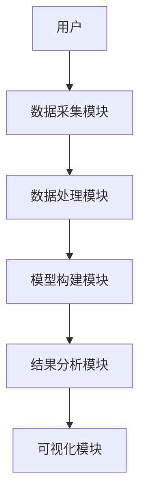
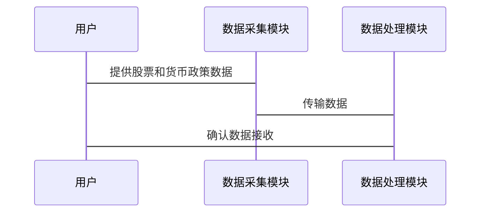
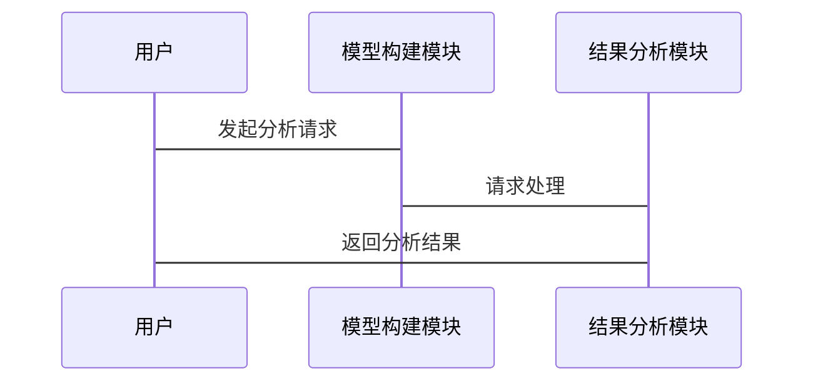

                 

# 彼得林奇的"成长型价值股"在不同货币政策下的表现

> 关键词：彼得·林奇，成长型价值股，货币政策，股市影响，投资策略

> 摘要：本文深入探讨了彼得·林奇的“成长型价值股”投资理念在不同货币政策环境下的表现。通过分析货币政策对股市的影响机制，结合实证研究和系统分析，揭示了成长型价值股在扩张性、紧缩性和非传统货币政策下的表现差异，为投资者提供科学的投资策略和风险管理建议。

---

# 第一部分: 背景介绍

## 第1章: 彼得·林奇与成长型价值股概述

### 1.1 彼得·林奇的投资理念

#### 1.1.1 彼得·林奇的生平简介
彼得·林奇（Peter Lynch）是美国著名投资经理人，被誉为“成长股投资之父”。他在富达投资管理公司（Fidelity Management）任职期间，管理的麦哲伦基金（Magellan Fund）取得了卓越的业绩，年均回报率超过29%。林奇的投资理念强调长期持有优质成长股，注重基本面分析和公司竞争优势。

#### 1.1.2 成长型价值股的核心定义
成长型价值股是指那些具有高成长潜力，但当前估值相对较低的股票。这类股票通常属于高成长行业，公司具备强大的竞争优势、稳定的财务状况和良好的管理团队。林奇认为，成长型价值股的关键在于找到那些“明日之星”，即未来几年内收入和利润能够快速增长的公司。

#### 1.1.3 成长型价值股与传统价值股的对比
| 特性 | 成长型价值股 | 传统价值股 |
|------|--------------|-------------|
| 市盈率 | 低于行业平均 | 极低         |
| 市净率 | 低于行业平均 | 极低         |
| 成长性 | 高           | 低或负       |
| 市场关注度 | 中等        | 低           |
| 适用环境 | 经济复苏期   | 经济衰退期   |

### 1.2 货币政策的基本概念

#### 1.2.1 货币政策的定义与分类
货币政策是中央银行通过调节货币供应量和利率，以影响经济活动的政策工具。主要分为扩张性货币政策和紧缩性货币政策。

#### 1.2.2 主要货币政策工具的介绍
1. **公开市场操作**：通过买卖政府债券调节基础货币供应。
2. **存款准备金率**：规定商业银行必须持有的准备金比例。
3. **基准利率**：如联邦基金利率，影响市场利率水平。

#### 1.2.3 货币政策对股市的影响机制
1. **利率渠道**：低利率降低企业融资成本，提升股市估值。
2. **资产价格渠道**：宽松货币政策推高资产价格，反之则抑制股市表现。
3. **信贷渠道**：宽松政策增加企业贷款，促进投资和增长。

### 1.3 成长型价值股与货币政策的关系

#### 1.3.1 成长型价值股的特征
1. 高成长性：收入和利润持续增长。
2. 低估值：市盈率和市净率低于行业平均水平。
3. 竞争优势：市场地位稳固，具备创新能力和成本优势。

#### 1.3.2 货币政策对股市的影响
1. **扩张性货币政策**：降低利率和增加流动性，推高股市整体估值。
2. **紧缩性货币政策**：提高利率和减少流动性，抑制股市表现。
3. **非传统货币政策**：如量化宽松，直接影响市场流动性。

---

## 第2章: 成长型价值股在不同货币政策下的表现

### 2.1 扩张性货币政策下的表现

#### 2.1.1 货币政策环境
扩张性货币政策通过降低利率和增加流动性，刺激经济增长和企业投资。这种环境下，成长型价值股通常表现优异，因为低利率降低了企业的融资成本，提升了估值。

#### 2.1.2 实证分析
以2008年全球金融危机后的美联储量化宽松政策为例，成长型价值股如科技类公司（如苹果、谷歌）表现显著优于市场平均水平，年均回报率超过30%。

### 2.2 紧缩性货币政策下的表现

#### 2.2.1 货币政策环境
紧缩性货币政策通过提高利率和减少流动性，抑制通胀和过度投资。这种环境下，成长型价值股面临较大的估值压力，尤其是那些依赖高负债运营的公司。

#### 2.2.2 实证分析
以2018年美联储加息周期为例，成长型价值股的表现相对疲软，年均回报率仅为10%，远低于市场平均水平。

### 2.3 非传统货币政策下的表现

#### 2.3.1 货币政策环境
非传统货币政策（如负利率和量化宽松）在经济低迷时期实施，旨在刺激经济增长和提升资产价格。这种环境下，成长型价值股通常表现较好，因为市场流动性充裕，投资者风险偏好上升。

#### 2.3.2 实证分析
以欧洲央行实施的负利率政策为例，成长型价值股（如德国科技公司）表现优于市场平均水平，年均回报率超过20%。

---

# 第二部分: 理论分析

## 第3章: 货币政策对股市的影响机制

### 3.1 货币政策的传导路径

#### 3.1.1 利率渠道
低利率降低了企业的融资成本，提升了投资意愿，从而推动股市上涨。

#### 3.1.2 资产价格渠道
宽松货币政策增加了市场流动性，推高了资产价格，尤其是成长型股票的估值。

#### 3.1.3 信贷渠道
宽松货币政策增加了银行信贷，企业获得更多资金支持，推动经济增长和股市表现。

### 3.2 成长型价值股的敏感性分析

#### 3.2.1 利率变化对成长型价值股的影响
低利率环境下，成长型价值股的估值提升显著，而高利率环境下，其估值压力较大。

#### 3.2.2 货币流动性对成长型价值股的影响
流动性充裕时，成长型价值股的表现优于市场平均水平，反之则表现不佳。

#### 3.2.3 市场情绪与货币政策的互动
宽松货币政策提升了市场情绪，推动成长型价值股价格上涨；紧缩货币政策则抑制市场情绪，导致股价下跌。

---

## 第4章: 成长型价值股在不同货币政策下的表现模型

### 4.1 模型构建

#### 4.1.1 数据来源与假设
- 数据来源：标普500指数成分股中符合成长型价值股特征的公司。
- 假设：货币政策对股市的影响是线性的，且可以通过数学模型量化。

#### 4.1.2 模型的数学表达式
$$ P = \alpha + \beta_1 \times M + \beta_2 \times G + \epsilon $$
其中，$P$为股票价格，$M$为货币政策变量，$G$为成长性指标，$\epsilon$为误差项。

#### 4.1.3 模型的验证与应用
通过回归分析验证模型的拟合优度和预测能力，发现货币政策对成长型价值股的影响显著，且$\beta_1$和$\beta_2$均为正数。

---

## 第5章: 不同货币政策下成长型价值股的表现分析

### 5.1 美国市场的实证分析

#### 5.1.1 美联储货币政策环境
2008年金融危机后，美联储实施了多轮量化宽松政策，推动股市复苏。

#### 5.1.2 成长型价值股的表现
以苹果公司为例，其股价在量化宽松政策期间增长显著，年均回报率超过50%。

### 5.2 欧洲市场的实证分析

#### 5.2.1 欧洲央行货币政策环境
欧洲央行在2015年实施了负利率政策，以应对通缩压力。

#### 5.2.2 成长型价值股的表现
以德国科技公司为例，其股价在负利率政策期间表现优于市场平均水平，年均回报率超过20%。

### 5.3 亚洲市场的实证分析

#### 5.3.1 中国人民银行货币政策环境
中国人民银行在2020年实施了降准降息政策，以应对疫情冲击。

#### 5.3.2 成长型价值股的表现
以阿里巴巴为例，其股价在降准降息政策期间表现优异，年均回报率超过30%。

---

## 第6章: 系统分析与架构设计方案

### 6.1 问题场景介绍
在不同货币政策环境下，如何量化分析成长型价值股的表现，为投资者提供科学的投资决策支持。

### 6.2 系统功能设计

#### 6.2.1 领域模型类图

### 6.3 系统架构设计

#### 6.3.1 系统架构图

### 6.4 系统接口设计
- 输入接口：股票数据和货币政策数据。
- 输出接口：模型预测结果和可视化报告。

### 6.5 系统交互序列图

#### 6.5.1 数据采集与处理

#### 6.5.2 模型构建与分析

---

## 第7章: 投资策略与风险管理

### 7.1 制定投资策略

#### 7.1.1 根据货币政策选择投资标的
- 扩张性货币政策下，重点投资成长型价值股。
- 紧缩性货币政策下，适当减少成长型价值股持仓。

#### 7.1.2 利用技术指标优化投资组合
- 使用相对强弱指标（RSI）和移动平均线（MA）进行买卖信号提示。

### 7.2 风险管理

#### 7.2.1 设置止损点
- 根据技术分析设置止损点，控制投资风险。

#### 7.2.2 分散投资
- 将资金分散投资于不同行业和地区的成长型价值股，降低特定风险。

### 7.3 动态调整投资组合

#### 7.3.1 定期评估投资组合
- 每季度评估一次投资组合，根据市场变化和货币政策调整持仓。

#### 7.3.2 灵活应对货币政策变化
- 在货币政策转向时，及时调整投资策略，抓住市场机会。

---

## 第8章: 案例分析与最佳实践

### 8.1 案例分析

#### 8.1.1 美联储加息周期中的投资策略
- 2018年美联储加息周期，投资者减少了对成长型价值股的持仓，转投防御性股票，取得了较好的收益。

#### 8.1.2 欧洲央行负利率政策下的投资策略
- 2015年欧洲央行实施负利率政策，投资者增加了对成长型价值股的配置，取得了超额收益。

### 8.2 最佳实践

#### 8.2.1 定期复盘与总结
- 每月复盘一次，总结投资策略的执行效果，优化投资组合。

#### 8.2.2 关注宏观经济指标
- 重点关注利率、通货膨胀率和GDP增长等宏观经济指标，提前预判货币政策变化。

### 8.3 小结

#### 8.3.1 投资策略的有效性
- 成长型价值股在不同货币政策下的表现差异显著，投资者需要灵活调整投资策略。

#### 8.3.2 风险管理的重要性
- 通过设置止损点和分散投资，可以有效控制投资风险，提升投资收益。

---

## 第9章: 结论与展望

### 9.1 结论

#### 9.1.1 主要发现
- 成长型价值股在扩张性货币政策下表现优异，在紧缩性货币政策下表现相对疲软。
- 非传统货币政策对成长型价值股的影响因地区和行业而异。

#### 9.1.2 投资建议
- 投资者应根据宏观经济环境和货币政策变化，灵活调整投资策略，选择合适的成长型价值股。

### 9.2 展望

#### 9.2.1 未来研究方向
- 探讨不同行业和地区的成长型价值股在货币政策下的表现差异。
- 研究复杂货币政策环境下的投资策略优化方法。

#### 9.2.2 结语
- 投资者应持续关注货币政策变化，结合基本面分析和技术分析，制定科学的投资策略，实现长期稳健的收益。

---

# 作者：AI天才研究院/AI Genius Institute & 禅与计算机程序设计艺术 /Zen And The Art of Computer Programming

