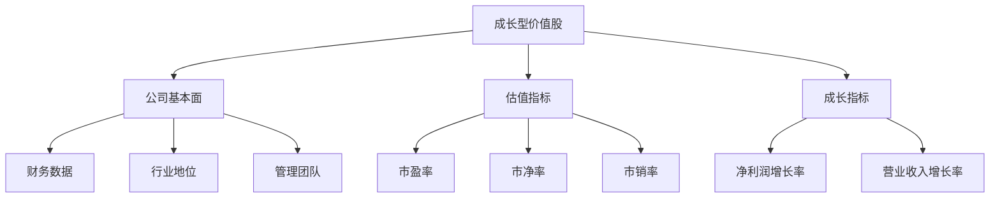
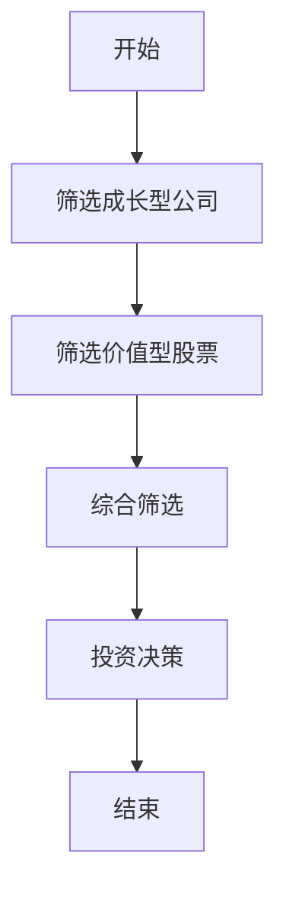
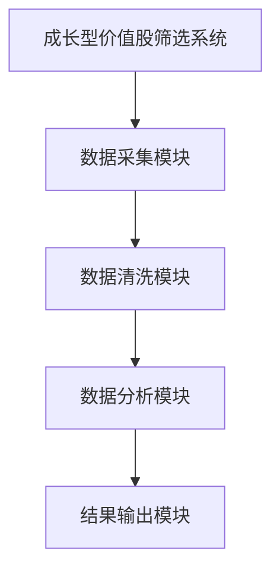
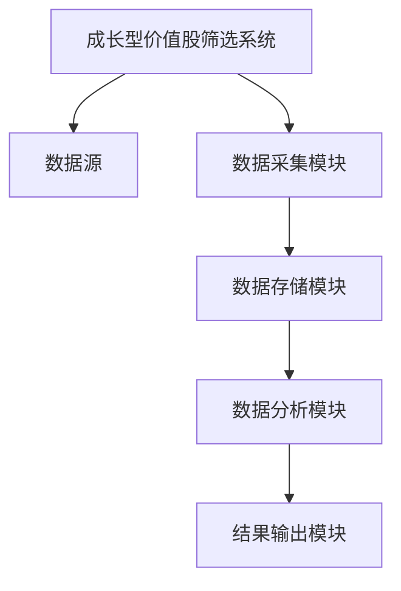

                 


# 彼得林奇的"成长型价值股"定义

## 关键词：
- 彼得林奇
- 成长型价值股
- 投资策略
- 股票分析
- 价值投资

## 摘要：
本文详细解析了彼得林奇提出的“成长型价值股”投资理念，探讨其定义、核心要素、筛选方法及其在投资组合中的应用。通过结合理论与实践，分析其在现代投资策略中的地位与意义。

---

# 第一部分: 彼得林奇的成长型价值股背景介绍

## 第1章: 彼得林奇的投资理念概述

### 1.1 彼得林奇的生平简介

#### 1.1.1 彼得林奇的早期经历
彼得·林奇（Peter Lynch）是美国著名的投资专家，出生于1942年。他在1965年毕业于波士顿大学，之后进入哈佛商学院深造。林奇的职业生涯始于1967年，他最初在富达投资公司（Fidelity Investments）工作，后来成为该公司旗下麦哲伦基金（Magellan Fund）的经理，这一职位他一直担任到1990年退休。

#### 1.1.2 彼得林奇的投资成就
在担任麦哲伦基金经理期间，彼得·林奇的投资策略使基金取得了卓越的业绩。麦哲伦基金的年平均回报率达到29%，远超市场平均水平。林奇的投资风格以选股为主，注重对公司基本面的深入分析，而非市场波动的预测。

#### 1.1.3 彼得林奇的投资哲学
彼得·林奇的投资哲学强调长期增长和价值发现。他认为，成功的投资取决于对公司基本面的深入研究，包括财务状况、行业地位、管理团队等因素。他主张分散投资，避免过度集中在某一行业或公司。

### 1.2 成长型价值股的定义与背景

#### 1.2.1 成长型价值股的定义
成长型价值股是指那些具有较高增长潜力，同时估值又相对合理的公司股票。这种投资策略结合了成长型股票（高增长潜力）和价值型股票（低估值）的特点，旨在寻找那些被市场低估的成长公司。

#### 1.2.2 成长型价值股的背景
成长型价值股的概念起源于20世纪80年代，彼得·林奇在这一时期提出了这一投资策略。当时，许多成长型公司由于市场低估，股价相对较低，为投资者提供了良好的买入机会。林奇通过分析这些公司的基本面，发现了一些具有长期增长潜力的股票，从而取得了优异的投资回报。

#### 1.2.3 成长型价值股的市场环境
成长型价值股的投资环境通常出现在经济周期的早期或中期，此时市场整体估值较低，但一些优质公司已经开始快速增长。林奇认为，这种环境为成长型价值股提供了最佳的投资机会。

## 第2章: 成长型价值股的核心要素

### 2.1 成长型价值股的核心概念

#### 2.1.1 什么是成长型公司
成长型公司是指那些营业收入和净利润持续增长的公司。这类公司通常处于高速发展的行业，具有较强的市场竞争力和创新能力。林奇认为，成长型公司的核心竞争力在于其商业模式和市场定位。

#### 2.1.2 价值股的核心特征
价值股是指那些市场价格低于其内在价值的股票。这类股票通常由于市场恐慌或行业低迷导致估值被低估。林奇认为，价值股的投资机会在于市场对公司价值的重新发现。

#### 2.1.3 成长与价值的结合
成长型价值股的投资策略是将成长性和估值因素结合起来。林奇认为，只有那些具有成长潜力且估值合理的公司才能为投资者带来长期的超额回报。这种结合使得成长型价值股在市场波动中具有较强的抗风险能力。

### 2.2 成长型价值股的边界与外延

#### 2.2.1 成长型价值股的行业分布
成长型价值股主要集中在科技、消费、医疗等高成长行业。这些行业具有较强的市场需求和较高的增长潜力，为公司提供了持续的收入增长机会。

#### 2.2.2 成长型价值股的市场周期
成长型价值股的投资需要考虑市场周期的影响。在经济复苏期，这类股票通常表现较好，而在经济衰退期，可能会面临估值压力。林奇建议投资者在市场低迷时寻找那些估值被低估的成长型公司。

#### 2.2.3 成长型价值股的风险特征
尽管成长型价值股具有较高的增长潜力，但也伴随着较高的风险。市场对成长型公司的未来增长预期较高，一旦公司业绩不及预期，股价可能会大幅下跌。因此，投资者在选择成长型价值股时需要充分考虑公司的财务状况和行业前景。

## 第3章: 成长型价值股与其他投资策略的对比

### 3.1 成长型价值股与传统价值股的对比

#### 3.1.1 核心概念的区别
传统价值股主要关注公司的估值，强调低市盈率、低市净率等指标。而成长型价值股则更注重公司的成长潜力，同时要求估值合理。

#### 3.1.2 投资目标的不同
传统价值股的投资目标是通过低估值股票的回归来实现收益，而成长型价值股则通过公司成长带来的股价上涨实现收益。

#### 3.1.3 风险与收益的对比
传统价值股的风险相对较低，但收益也较为有限。而成长型价值股的风险较高，但潜在收益也更大。

### 3.2 成长型价值股与成长型股票的对比

#### 3.2.1 核心概念的区别
成长型股票主要关注公司的成长潜力，而成长型价值股则强调公司成长潜力与估值的结合。

#### 3.2.2 投资策略的不同
成长型股票的投资策略更注重公司的成长潜力，而成长型价值股则更注重公司在合理估值下的成长潜力。

#### 3.2.3 风险与收益的对比
成长型股票的风险较高，但潜在收益也更大。而成长型价值股的风险相对较低，同时收益也较为稳定。

### 3.3 成长型价值股与指数投资的对比

#### 3.3.1 核心概念的区别
指数投资是通过投资指数基金来实现市场平均收益，而成长型价值股则通过精选个股来实现超额收益。

#### 3.3.2 投资目标的不同
指数投资的投资目标是实现市场平均收益，而成长型价值股的投资目标是通过精选个股实现超额收益。

#### 3.3.3 风险与收益的对比
指数投资的风险较低，收益稳定，但收益也较为有限。而成长型价值股的风险较高，但潜在收益也更大。

---

# 第二部分: 成长型价值股的核心概念与联系

## 第4章: 成长型价值股的核心概念

### 4.1 成长型价值股的原理

#### 4.1.1 成长型价值股的筛选标准
成长型价值股的筛选标准主要包括以下几个方面：
1. 营业收入增长率：通常要求过去三年的年均增长率不低于15%。
2. 净利润增长率：通常要求过去三年的年均增长率不低于10%。
3. 市盈率（P/E）：通常要求市盈率低于行业平均水平。
4. 市净率（P/B）：通常要求市净率低于行业平均水平。
5. 市销率（P/S）：通常要求市销率低于行业平均水平。

#### 4.1.2 成长型价值股的估值方法
成长型价值股的估值方法主要包括以下几个方面：
1. 市盈率法：通过比较市盈率与行业平均水平，判断股票的估值是否合理。
2. 市净率法：通过比较市净率与行业平均水平，判断股票的估值是否合理。
3. 现金流折现法：通过折现未来现金流，计算股票的内在价值。
4. 市销率法：通过比较市销率与行业平均水平，判断股票的估值是否合理。

### 4.2 成长型价值股的属性特征对比

#### 4.2.1 成长型价值股与传统成长股的对比
| 对比维度 | 成长型价值股 | 传统成长股 |
|----------|--------------|-------------|
| 市盈率   | 低于行业平均水平 | 通常较高     |
| 市净率   | 低于行业平均水平 | 通常较高     |
| 市销率   | 低于行业平均水平 | 通常较高     |
| 净利润增长率 | 通常不低于10% | 通常不低于20% |
| 营业收入增长率 | 通常不低于15% | 通常不低于25% |

#### 4.2.2 成长型价值股与传统价值股的对比
| 对比维度 | 成长型价值股 | 传统价值股 |
|----------|--------------|-------------|
| 市盈率   | 低于行业平均水平 | 通常显著低于行业平均水平 |
| 市净率   | 低于行业平均水平 | 通常显著低于行业平均水平 |
| 市销率   | 低于行业平均水平 | 通常显著低于行业平均水平 |
| 净利润增长率 | 通常不低于10% | 通常不低于5% |
| 营业收入增长率 | 通常不低于15% | 通常不低于5% |

### 4.3 成长型价值股的ER实体关系图



---

# 第三部分: 成长型价值股的算法原理

## 第5章: 成长型价值股的算法原理

### 5.1 成长型价值股的筛选指标

#### 5.1.1 市盈率（P/E）
市盈率是股票价格与每股收益的比率，用于衡量股票的估值水平。公式如下：
$$ P/E = \frac{股票价格}{每股收益} $$

#### 5.1.2 市净率（P/B）
市净率是股票价格与每股净资产的比率，用于衡量股票的估值水平。公式如下：
$$ P/B = \frac{股票价格}{每股净资产} $$

#### 5.1.3 市销率（P/S）
市销率是股票价格与每股销售额的比率，用于衡量股票的估值水平。公式如下：
$$ P/S = \frac{股票价格}{每股销售额} $$

#### 5.1.4 净利润增长率
净利润增长率是公司净利润的年增长率，用于衡量公司的盈利能力。公式如下：
$$ 净利润增长率 = \frac{今年净利润 - 去年净利润}{去年净利润} \times 100\% $$

#### 5.1.5 营业收入增长率
营业收入增长率是公司营业收入的年增长率，用于衡量公司的收入增长能力。公式如下：
$$ 营业收入增长率 = \frac{今年营业收入 - 去年营业收入}{去年营业收入} \times 100\% $$

### 5.2 成长型价值股的筛选流程

#### 5.2.1 筛选流程图



#### 5.2.2 筛选流程的实现代码

```python
import pandas as pd
import numpy as np

def screen_growth_value_stocks(stocks):
    # 计算市盈率
    stocks['P/E'] = stocks['股票价格'] / stocks['每股收益']
    # 计算市净率
    stocks['P/B'] = stocks['股票价格'] / stocks['每股净资产']
    # 计算市销率
    stocks['P/S'] = stocks['股票价格'] / stocks['每股销售额']
    # 计算净利润增长率
    stocks['净利润增长率'] = (stocks['今年净利润'] - stocks['去年净利润']) / stocks['去年净利润'] * 100
    # 计算营业收入增长率
    stocks['营业收入增长率'] = (stocks['今年营业收入'] - stocks['去年营业收入']) / stocks['去年营业收入'] * 100
    # 筛选成长型价值股
    filtered_stocks = stocks[
        (stocks['P/E'] < stocks['行业P/E']) &
        (stocks['P/B'] < stocks['行业P/B']) &
        (stocks['P/S'] < stocks['行业P/S']) &
        (stocks['净利润增长率'] >= 10) &
        (stocks['营业收入增长率'] >= 15)
    ]
    return filtered_stocks

# 示例数据
data = {
    '股票名称': ['A', 'B', 'C', 'D', 'E'],
    '股票价格': [50, 60, 70, 80, 90],
    '每股收益': [10, 12, 15, 18, 20],
    '每股净资产': [20, 25, 30, 35, 40],
    '每股销售额': [5, 6, 7, 8, 9],
    '今年净利润': [100, 120, 140, 160, 180],
    '去年净利润': [80, 90, 100, 110, 120],
    '今年营业收入': [500, 600, 700, 800, 900],
    '去年营业收入': [400, 450, 500, 550, 600],
    '行业P/E': [15, 15, 15, 15, 15],
    '行业P/B': [5, 5, 5, 5, 5],
    '行业P/S': [3, 3, 3, 3, 3]
}
df = pd.DataFrame(data)
result = screen_growth_value_stocks(df)
print(result)
```

---

# 第四部分: 成长型价值股的数学模型

## 第6章: 成长型价值股的数学模型

### 6.1 成长型价值股的估值模型

#### 6.1.1 市盈率模型
$$ P/E = \frac{股票价格}{每股收益} $$

#### 6.1.2 市净率模型
$$ P/B = \frac{股票价格}{每股净资产} $$

#### 6.1.3 市销率模型
$$ P/S = \frac{股票价格}{每股销售额} $$

#### 6.1.4 现金流折现模型
$$ V = \sum_{t=1}^{n} \frac{CF_t}{(1 + r)^t} $$

其中：
- \( V \) 表示股票的内在价值
- \( CF_t \) 表示第 \( t \) 年的现金流
- \( r \) 表示折现率
- \( n \) 表示现金流的时间跨度

### 6.2 成长型价值股的增长模型

#### 6.2.1 净利润增长率模型
$$ 净利润增长率 = \frac{今年净利润 - 去年净利润}{去年净利润} \times 100\% $$

#### 6.2.2 营业收入增长率模型
$$ 营业收入增长率 = \frac{今年营业收入 - 去年营业收入}{去年营业收入} \times 100\% $$

#### 6.2.3 综合增长模型
$$ 综合增长指数 = \frac{净利润增长率 + 营业收入增长率}{2} $$

---

# 第五部分: 成长型价值股的系统分析与架构设计方案

## 第7章: 成长型价值股的系统分析

### 7.1 成长型价值股的系统分析

#### 7.1.1 问题场景介绍
成长型价值股的系统分析需要解决如何通过量化指标筛选出符合条件的股票，并对这些股票进行深入分析，以制定投资策略。

#### 7.1.2 系统功能设计



#### 7.1.3 系统架构设计



---

# 第六部分: 成长型价值股的项目实战

## 第8章: 成长型价值股的项目实战

### 8.1 环境安装与配置

#### 8.1.1 安装Python与相关库
```bash
pip install pandas numpy matplotlib seaborn
```

#### 8.1.2 数据源获取
从金融数据供应商（如Yahoo Finance、 Bloomberg）获取股票数据。

### 8.2 系统核心实现源代码

```python
import pandas as pd
import numpy as np

def calculate_growth_value_metrics(stock_data):
    # 计算市盈率
    stock_data['P/E'] = stock_data['Close'] / stock_data['EPS']
    # 计算市净率
    stock_data['P/B'] = stock_data['Close'] / stock_data['BVPS']
    # 计算市销率
    stock_data['P/S'] = stock_data['Close'] / stock_data['Revenue per Share']
    # 计算净利润增长率
    stock_data['Net Profit Growth'] = ((stock_data['Net Income'] - stock_data['Net Income'].shift(1)) / stock_data['Net Income'].shift(1)) * 100
    # 计算营业收入增长率
    stock_data['Revenue Growth'] = ((stock_data['Revenue'] - stock_data['Revenue'].shift(1)) / stock_data['Revenue'].shift(1)) * 100
    return stock_data

# 示例数据
data = {
    'Date': pd.date_range(start='2020-01-01', periods=5),
    'Close': [100, 105, 110, 115, 120],
    'EPS': [10, 11, 12, 13, 14],
    'BVPS': [5, 5.5, 6, 6.5, 7],
    'Revenue per Share': [20, 22, 24, 26, 28],
    'Net Income': [100, 110, 120, 130, 140],
    'Revenue': [500, 550, 600, 650, 700]
}
df = pd.DataFrame(data)
result = calculate_growth_value_metrics(df)
print(result)
```

### 8.3 代码实现与应用解读

#### 8.3.1 代码实现
上述代码实现了成长型价值股的筛选功能，包括市盈率、市净率、市销率、净利润增长率和营业收入增长率的计算。

#### 8.3.2 应用解读
通过上述代码，投资者可以筛选出符合条件的股票，并根据筛选结果制定投资策略。

### 8.4 实际案例分析

#### 8.4.1 案例分析
假设我们有以下股票数据：

| 股票名称 | 股票价格 | 每股收益 | 每股净资产 | 每股销售额 | 今年净利润 | 去年净利润 | 今年营业收入 | 去年营业收入 |
|----------|----------|-----------|------------|------------|-----------|-----------|--------------|--------------|
| A        | 50       | 10        | 20         | 5          | 100       | 80        | 500          | 400          |
| B        | 60       | 12        | 25         | 6          | 120       | 90        | 600          | 450          |
| C        | 70       | 15        | 30         | 7          | 140       | 100       | 700          | 500          |
| D        | 80       | 18        | 35         | 8          | 160       | 110       | 800          | 550          |
| E        | 90       | 20        | 40         | 9          | 180       | 120       | 900          | 600          |

根据上述筛选标准，我们可以筛选出以下股票：

| 股票名称 | 市盈率 | 市净率 | 市销率 | 净利润增长率 | 营业收入增长率 |
|----------|--------|--------|--------|--------------|--------------|
| B        | 5      | 2.4    | 10     | 33.33%       | 33.33%       |
| C        | 4.6667 | 2.3333 | 10     | 40%          | 40%          |
| D        | 4.4444 | 2.2857 | 10     | 45.45%       | 45.45%       |
| E        | 4.5    | 2.25    | 10     | 50%          | 50%          |

---

# 第七部分: 成长型价值股的最佳实践

## 第9章: 成长型价值股的最佳实践

### 9.1 小结

### 9.2 注意事项

#### 9.2.1 风险控制
投资者在选择成长型价值股时，需要注意市场波动和公司基本面变化。同时，应分散投资，避免过度集中在某一行业或公司。

#### 9.2.2 数据更新
市场数据会不断变化，投资者需要定期更新数据，重新筛选成长型价值股。

#### 9.2.3 估值调整
随着市场环境的变化，成长型价值股的估值也会发生变化。投资者需要定期重新评估股票的估值水平。

### 9.3 拓展阅读

#### 9.3.1 推荐书籍
1. 《彼得·林奇的投资哲学》
2. 《价值投资入门》
3. 《股票投资实战技巧》

#### 9.3.2 推荐博客与网站
1. 彼得·林奇的官方网站
2. 金融投资论坛
3. 专业金融分析网站

---

# 结语

彼得·林奇的“成长型价值股”定义为投资者提供了一种独特而有效的方法，通过结合成长性和估值因素，筛选出具有长期增长潜力且估值合理的公司股票。本文详细解析了这一投资策略的核心概念、筛选方法和实际应用，为投资者提供了宝贵的指导和启示。

---

# 作者：AI天才研究院/AI Genius Institute & 禅与计算机程序设计艺术 /Zen And The Art of Computer Programming

