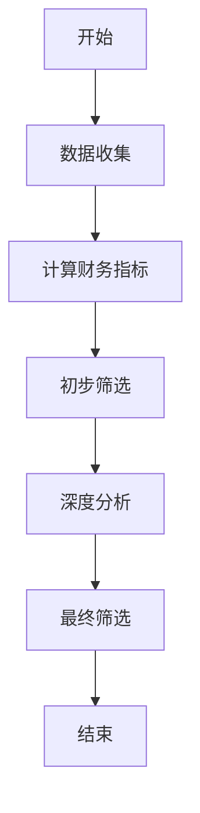
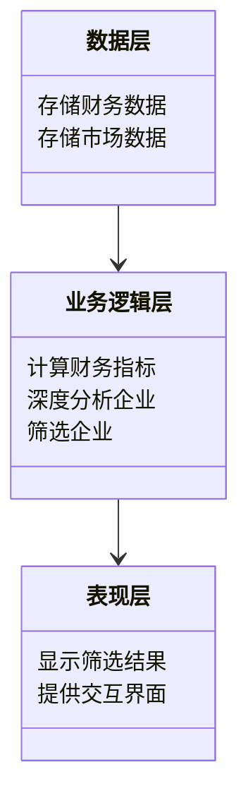

                 


# 彼得林奇的"成长型价值股"筛选方法

## 关键词：成长型价值股、彼得·林奇、股票筛选、投资策略、财务分析

## 摘要：  
彼得·林奇是全球著名的价值投资者，他提出的“成长型价值股”筛选方法结合了成长性和价值性两大核心要素，为企业投资者提供了系统化的筛选标准和流程。本文将详细解析这一方法的核心概念、筛选标准、算法原理、系统架构及实际应用，帮助读者掌握如何通过科学的方法筛选出具有长期增长潜力的优质股票。

---

# 第一部分: 成长型价值股的定义与背景

## 第1章: 成长型价值股的定义与背景

### 1.1 投资的基本概念
#### 1.1.1 什么是投资
投资是指将资金投入到能够产生收益的资产中，以实现财富增值的过程。投资的核心在于通过分析资产的内在价值和市场表现，选择具有成长潜力的标的。

#### 1.1.2 投资的基本原则
1. **价值投资**：关注资产的内在价值，寻找市场价格低于内在价值的投资机会。
2. **长期投资**：避免频繁交易，专注于企业长期增长的潜力。
3. **分散投资**：通过分散投资降低风险，避免过度依赖单一资产。

#### 1.1.3 成长型投资的定义
成长型投资是一种以企业成长潜力为核心的投资策略，关注那些营业收入和净利润持续增长的企业，尤其是那些在行业内具有领先地位且具备较强竞争优势的企业。

---

### 1.2 彼得·林奇的投资理念
#### 1.2.1 彼得·林奇的生平简介
彼得·林奇（Peter Lynch）是全球最著名的价值投资者之一，曾任富达麦哲伦基金的经理，创造了年化29%的惊人回报率。他以深入研究企业基本面和长期关注企业成长著称。

#### 1.2.2 林奇的成长型投资哲学
1. **关注企业基本面**：林奇认为，投资的核心在于对企业财务状况和成长潜力的深入分析。
2. **寻找“伟大企业”**：他倾向于投资那些在行业内具有竞争优势、财务健康且成长性良好的企业。
3. **长期持有**：林奇主张长期持有优质股票，避免短期市场波动的干扰。

#### 1.2.3 林奇投资方法的核心思想
林奇强调，成长型价值股的筛选需要结合企业的财务数据、行业地位和市场前景，寻找那些估值合理、成长性良好的企业。

---

### 1.3 成长型价值股的特征
#### 1.3.1 什么是成长型价值股
成长型价值股是指那些具有持续的营业收入和净利润增长，同时市场价格低于其内在价值的股票。

#### 1.3.2 成长型价值股的三大特征
1. **高成长性**：营业收入和净利润持续增长。
2. **低估值**：市场价格低于企业内在价值。
3. **竞争优势**：在行业内具有较强的市场地位和竞争优势。

#### 1.3.3 成长型价值股与成长股的区别
| 特性          | 成长型价值股                     | 成长股                       |
|---------------|----------------------------------|-----------------------------|
| 估值标准      | 估值合理，价格低于内在价值      | 估值可能偏高                 |
| 成长性        | 既有成长性，又注重估值           | 更注重成长性，估值可能较高   |
| 投资策略      | 长期持有，等待价值回归           | 短期持有，捕捉成长收益       |

---

## 1.4 本章小结
本章主要介绍了成长型价值股的定义、彼得·林奇的投资理念及其核心思想。通过对比成长型价值股与成长股的区别，读者可以更好地理解成长型价值股的筛选标准。

---

# 第二部分: 成长型价值股的筛选标准

## 第2章: 林奇的筛选标准

### 2.1 盈利能力分析
#### 2.1.1 净利润增长率的计算公式
$$ \text{净利润增长率} = \frac{\text{净利润增长量}}{\text{净利润}} \times 100\% $$

#### 2.1.2 净利润率的计算公式
$$ \text{净利润率} = \frac{\text{净利润}}{\text{营业收入}} \times 100\% $$

---

### 2.2 成长性分析
#### 2.2.1 营收增长率的计算公式
$$ \text{营收增长率} = \frac{\text{营收增长量}}{\text{营收}} \times 100\% $$

#### 2.2.2 营收复合增长率的计算公式
$$ \text{营收复合增长率} = \left( \frac{\text{最终营收}}{\text{初始营收}} \right)^{\frac{1}{n}} - 1 $$

---

### 2.3 行业地位分析
#### 2.3.1 行业集中度的计算公式
$$ \text{行业集中度} = \frac{\text{前几大企业的市场份额之和}}{\text{行业总市场份额}} \times 100\% $$

#### 2.3.2 市场占有率的计算公式
$$ \text{市场占有率} = \frac{\text{企业销售额}}{\text{行业总销售额}} \times 100\% $$

---

### 2.4 财务健康状况分析
#### 2.4.1 负债率的计算公式
$$ \text{负债率} = \frac{\text{总负债}}{\text{总资产}} \times 100\% $$

#### 2.4.2 速动比率的计算公式
$$ \text{速动比率} = \frac{\text{速动资产}}{\text{流动负债}} $$

---

## 第3章: 筛选流程与算法

### 3.1 筛选流程
1. **数据收集**：收集目标企业的财务数据和市场数据。
2. **初步筛选**：计算各项财务指标，筛选出符合初步标准的企业。
3. **深度分析**：分析企业的行业地位、竞争优势和未来发展前景。
4. **最终筛选**：综合考虑各项指标，确定最终的候选企业。

---

### 3.2 算法原理
以下为成长型价值股筛选算法的流程图：



---

## 第4章: 系统架构与实现

### 4.1 系统架构设计
以下为系统架构设计的类图：



---

## 第5章: 项目实战

### 5.1 环境安装
需要安装以下工具：
1. Python 3.x
2. Pandas
3. Matplotlib
4. Mermaid

---

### 5.2 核心实现
以下是成长型价值股筛选系统的核心代码：

```python
import pandas as pd

def calculate_profit_growth(net_profit_current, net_profit_previous):
    return ((net_profit_current - net_profit_previous) / net_profit_previous) * 100

def calculate_revenue_growth(revenue_current, revenue_previous):
    return ((revenue_current - revenue_previous) / revenue_previous) * 100

def is_growth_stock(net_profit_growth, revenue_growth, market_capitalization):
    if net_profit_growth > 20 and revenue_growth > 20 and market_capitalization > 1000000000:
        return True
    else:
        return False

# 示例数据
data = {
    '公司': ['公司A', '公司B', '公司C'],
    '净利润': [100, 150, 200],
    '营业收入': [500, 600, 700],
    '市值': [1.5e9, 2e9, 2.5e9]
}

df = pd.DataFrame(data)

# 筛选成长型价值股
growth_stocks = []
for i in range(len(df)):
    net_profit_growth = calculate_profit_growth(df['净利润'][i], df['净利润'][i-1])
    revenue_growth = calculate_revenue_growth(df['营业收入'][i], df['营业收入'][i-1])
    market_capitalization = df['市值'][i]
    if is_growth_stock(net_profit_growth, revenue_growth, market_capitalization):
        growth_stocks.append(df['公司'][i])

print("成长型价值股列表:", growth_stocks)
```

---

## 第6章: 总结与扩展

### 6.1 总结
彼得·林奇的成长型价值股筛选方法通过结合企业的财务数据、行业地位和市场前景，帮助投资者筛选出具有长期增长潜力的优质股票。这种方法既注重企业的成长性，又关注其估值的合理性，是一种科学且实用的投资策略。

### 6.2 注意事项
1. 筛选标准需要根据市场环境和企业具体情况动态调整。
2. 数据来源必须可靠，避免因数据错误导致误判。
3. 投资者需具备一定的财务分析能力，必要时可寻求专业机构的帮助。

### 6.3 拓展阅读
1. 《彼得·林奇的投资策略》
2. 《价值投资实战策略》
3. 《财务报表分析与股票投资》

---

# 作者：AI天才研究院 & 禅与计算机程序设计艺术

---

通过本文的详细解析，读者可以系统地掌握彼得·林奇的成长型价值股筛选方法，并将其应用于实际投资中，从而提高投资决策的科学性和准确性。

