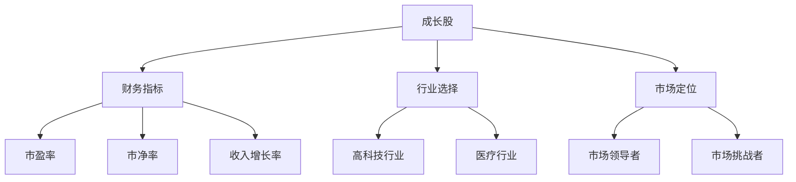
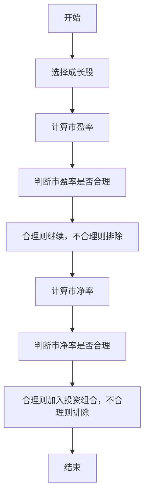
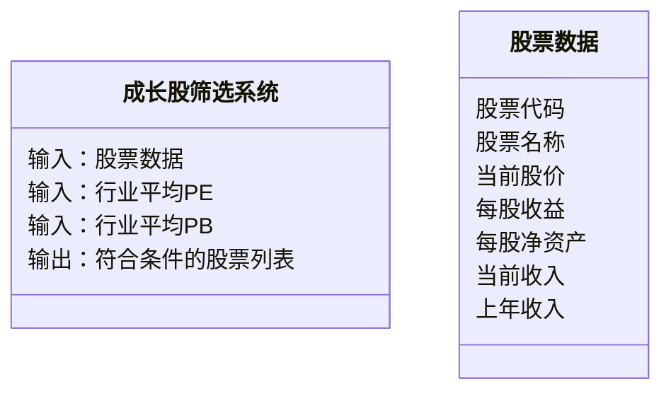
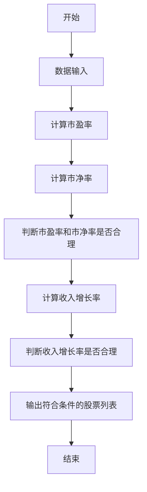

                 


# 彼得林奇的"成长股"在不同经济周期的表现

## 关键词：成长股，彼得林奇，经济周期，投资策略，选股标准，市盈率，市净率

## 摘要：
本文深入分析了彼得·林奇的成长股投资策略在不同经济周期下的表现。通过介绍成长股的定义、彼得林奇的投资理念，以及经济周期对投资的影响，本文探讨了成长股的核心概念与联系，详细讲解了彼得林奇投资模型的算法原理，并结合实际案例分析了不同经济周期下的投资策略调整。文章还提供了系统的架构设计和代码实现，帮助读者更好地理解和应用这些投资策略。

---

# 第1章：彼得林奇的"成长股"投资概述

## 1.1 成长股的定义与特点

### 1.1.1 成长股的定义
成长股是指那些具有较高增长潜力，且未来盈利预期较高的公司股票。这类股票通常属于新兴产业或朝阳行业，具有较高的市盈率和市净率。

### 1.1.2 成长股的核心特征
- **高增长**：年收入增长率通常超过行业平均水平。
- **高估值**：市盈率和市净率较高，反映了市场的高预期。
- **低股息**：成长股公司倾向于 reinvest profits into growth opportunities，因此股息较低。

### 1.1.3 成长股与价值股的区别
| 特性 | 成长股 | 价值股 |
|------|--------|--------|
| 市盈率 | 高     | 低     |
| 市净率 | 高     | 中等   |
| 股息率 | 低     | 高     |
| 行业 | 新兴产业 | 成熟产业 |

## 1.2 彼得林奇的投资理念

### 1.2.1 彼得林奇的背景介绍
彼得·林奇是美国著名投资家，曾任富达麦哲伦基金的经理，以投资成长股闻名。他强调深入研究公司基本面，寻找具有持续增长潜力的公司。

### 1.2.2 成长股投资的核心思想
- **长期投资**：关注公司的长期增长潜力，而非短期价格波动。
- **深入研究**：通过分析财务报表和行业趋势，识别具有竞争优势的公司。
- **分散投资**：通过投资多个成长股，降低风险。

### 1.2.3 长期投资与价值发现
彼得林奇认为，投资成长股的关键是发现那些尚未被市场充分认识到的公司，这些公司具有较高的成长潜力。

## 1.3 经济周期对投资的影响

### 1.3.1 经济周期的定义与分类
经济周期分为四个阶段：衰退、复苏、繁荣和衰退。

### 1.3.2 不同经济周期下的投资策略
- **衰退期**：寻找估值低、具有强大竞争优势的公司。
- **复苏期**：关注那些在衰退期中表现不佳但具有潜在增长的公司。
- **繁荣期**：投资那些高增长、高估值的公司。
- **衰退期**：避免高估值的成长股，转投防御性股票。

### 1.3.3 经济周期对成长股的影响
在繁荣期，成长股表现优异；在衰退期，成长股面临较大的压力。因此，在不同经济周期下，成长股的投资策略需要相应调整。

---

# 第2章：彼得林奇成长股的核心概念与联系

## 2.1 成长股的核心概念

### 2.1.1 成长股的财务指标分析
- **市盈率（PE）**：衡量股票价格与每股收益的比率。
- **市净率（PB）**：衡量股票价格与每股净资产的比率。
- **收入增长率**：衡量公司收入的增长速度。

### 2.1.2 成长股的行业选择标准
- **行业增长潜力**：选择那些处于高增长行业的公司。
- **行业竞争结构**：避免选择竞争激烈的行业。
- **行业周期性**：选择那些受经济周期影响较小的行业。

### 2.1.3 成长股的市场定位
- **市场领导者**：在行业中占据领先地位。
- **市场挑战者**：试图挑战市场领导者。
- **市场跟随者**：跟随市场领导者，但具有一定的竞争优势。

## 2.2 彼得林奇投资模型的原理

### 2.2.1 投资模型的基本框架
彼得林奇的投资模型基于对公司基本面的深入分析，包括财务状况、行业地位和管理团队等。

### 2.2.2 成长股的选股标准
- **收入和利润增长**：公司过去三年的收入和利润增长率均高于行业平均水平。
- **财务健康状况**：公司具有较强的盈利能力，且债务水平较低。
- **管理团队**：公司管理团队具有丰富的经验和良好的声誉。

### 2.2.3 投资组合的构建策略
- **分散投资**：将资金分散投资于多个成长股，降低风险。
- **定期调整**：根据市场变化和公司基本面，定期调整投资组合。
- **长期持有**：避免频繁交易，长期持有优质成长股。

## 2.3 核心概念的ER实体关系图



---

# 第3章：彼得林奇成长股投资的算法原理

## 3.1 投资模型的数学公式

### 3.1.1 市盈率计算公式
$$市盈率 = \frac{股票价格}{每股收益}$$

### 3.1.2 市净率计算公式
$$市净率 = \frac{股票价格}{每股净资产}$$

### 3.1.3 收入增长率计算公式
$$收入增长率 = \frac{本年收入 - 上年收入}{上年收入} \times 100\%$$

## 3.2 算法流程图



## 3.3 算法实现代码

```python
def calculate_pe(stock_price, earnings_per_share):
    return stock_price / earnings_per_share

def calculate_pb(stock_price, book_value_per_share):
    return stock_price / book_value_per_share

def calculate_growth_revenue(revenue_current, revenue_previous):
    return ((revenue_current - revenue_previous) / revenue_previous) * 100

def is_reasonable_pe(pe, industry_average_pe):
    return pe < (industry_average_pe * 1.5)

def is_reasonable_pb(pb, industry_average_pb):
    return pb < (industry_average_pb * 1.5)

def select_growth_stocks(stocks, industry_average_pe, industry_average_pb):
    selected_stocks = []
    for stock in stocks:
        pe = calculate_pe(stock['price'], stock['earnings_per_share'])
        pb = calculate_pb(stock['price'], stock['book_value_per_share'])
        revenue_growth = calculate_growth_revenue(stock['revenue_current'], stock['revenue_previous'])
        
        if is_reasonable_pe(pe, industry_average_pe) and is_reasonable_pb(pb, industry_average_pb):
            selected_stocks.append(stock)
    return selected_stocks
```

## 3.4 算法流程解释
1. 计算目标股票的市盈率和市净率。
2. 将市盈率和市净率与行业平均水平进行比较，判断是否合理。
3. 如果市盈率和市净率合理，进一步分析收入增长率。
4. 将符合条件的股票加入投资组合。

---

# 第4章：系统分析与架构设计方案

## 4.1 项目介绍
本项目旨在构建一个基于彼得林奇投资模型的成长股筛选系统，帮助投资者在不同经济周期下选择合适的成长股。

## 4.2 系统功能设计

### 4.2.1 领域模型


### 4.2.2 系统架构设计


---

# 第5章：项目实战

## 5.1 环境安装
需要安装Python和相关库，如pandas和numpy。

## 5.2 核心实现代码

```python
import pandas as pd

def load_stock_data():
    # 加载股票数据
    data = pd.read_csv('stocks.csv')
    return data

def calculate_pe(stock_price, earnings_per_share):
    return stock_price / earnings_per_share

def calculate_pb(stock_price, book_value_per_share):
    return stock_price / book_value_per_share

def calculate_growth_revenue(revenue_current, revenue_previous):
    return ((revenue_current - revenue_previous) / revenue_previous) * 100

def is_reasonable_pe(pe, industry_average_pe):
    return pe < (industry_average_pe * 1.5)

def is_reasonable_pb(pb, industry_average_pb):
    return pb < (industry_average_pb * 1.5)

def select_growth_stocks(stocks, industry_average_pe, industry_average_pb):
    selected_stocks = []
    for stock in stocks:
        pe = calculate_pe(stock['price'], stock['earnings_per_share'])
        pb = calculate_pb(stock['price'], stock['book_value_per_share'])
        revenue_growth = calculate_growth_revenue(stock['revenue_current'], stock['revenue_previous'])
        
        if is_reasonable_pe(pe, industry_average_pe) and is_reasonable_pb(pb, industry_average_pb):
            selected_stocks.append(stock)
    return selected_stocks

def main():
    stocks = load_stock_data()
    industry_average_pe = 20  # 示例数据
    industry_average_pb = 3  # 示例数据
    selected = select_growth_stocks(stocks, industry_average_pe, industry_average_pb)
    print("符合条件的股票列表：", selected)

if __name__ == "__main__":
    main()
```

## 5.3 代码应用解读与分析
1. 加载股票数据。
2. 计算每只股票的市盈率和市净率。
3. 判断市盈率和市净率是否合理。
4. 计算收入增长率。
5. 输出符合条件的股票列表。

---

# 第6章：最佳实践

## 6.1 小结
彼得林奇的成长股投资策略在不同经济周期下表现各异，投资者需要根据市场环境调整投资策略。

## 6.2 注意事项
- 避免过度集中投资。
- 定期监控投资组合。
- 注意市场风险。

## 6.3 拓展阅读
推荐阅读彼得·林奇的《彼得林奇的选股方法》和《股票投资的成功秘诀》。

---

# 作者：AI天才研究院/AI Genius Institute & 禅与计算机程序设计艺术 /Zen And The Art of Computer Programming

