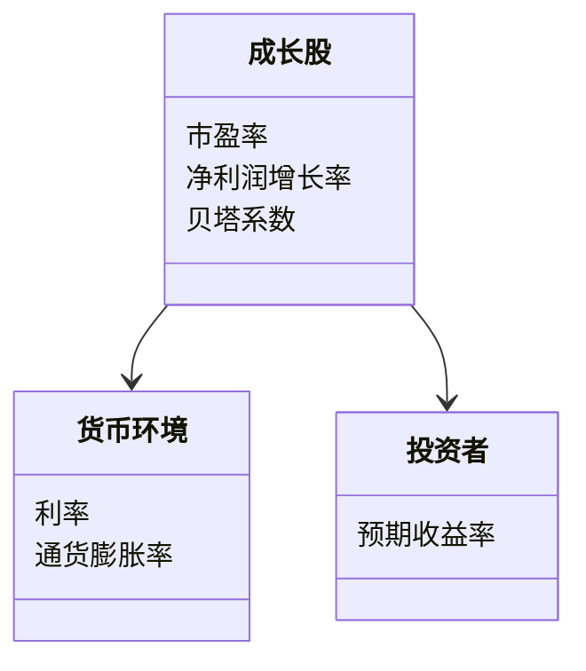

                 


# 彼得林奇的"成长股"在不同货币环境下的表现

> 关键词：彼得·林奇，成长股，货币环境，投资策略，股票分析，宏观经济

> 摘要：本文深入分析彼得·林奇的“成长股”投资理念在不同货币环境下的表现。通过背景介绍、核心概念、数学模型、系统架构设计、项目实战等多维度的详细探讨，揭示成长股在美元、欧元、人民币等主要货币环境下的投资机会与风险。结合Python代码实现和实际案例分析，为投资者提供科学的投资策略和决策支持。

---

## 第一部分: 引言

### 1.1 本书的目的与意义

#### 1.1.1 为什么研究彼得·林奇的"成长股"
彼得·林奇是全球著名投资经理，他强调投资成长股，即收入和利润持续增长的公司。然而，货币环境的变化（如通货膨胀、通货紧缩、货币政策调整）会显著影响股票市场的表现。研究成长股在不同货币环境下的表现，有助于投资者制定更科学的投资策略。

#### 1.1.2 货币环境对投资的影响
货币环境是影响股票市场的重要因素。例如，宽松的货币政策可能导致股市上涨，而紧缩的货币政策可能导致股市下跌。不同货币环境下的经济周期和通货膨胀率也会影响成长股的表现。

#### 1.1.3 本书的核心问题与目标
本文旨在探讨成长股在不同货币环境下的表现，通过分析彼得·林奇的投资策略，结合货币环境的影响，为投资者提供科学的投资决策支持。

---

### 1.2 成长股与货币环境的关系

#### 1.2.1 成长股的定义与特点
成长股是指收入和利润持续增长的公司股票。其特点是高市盈率、高增长潜力，但风险较高。

#### 1.2.2 货币环境的分类与特征
货币环境主要分为通货膨胀、通货紧缩、货币宽松和货币紧缩四种类型。每种货币环境对股票市场的表现有不同的影响。

#### 1.2.3 成长股与货币环境的互动机制
在货币宽松环境下，成长股通常表现较好，因为低利率和宽松的货币政策会降低企业的融资成本，促进经济增长。在货币紧缩环境下，成长股可能面临较大的压力，因为高利率可能导致企业融资成本上升，影响利润增长。

---

## 第二部分: 成长股与货币环境的背景分析

### 2.1 成长股的基本概念

#### 2.1.1 成长股的定义与分类
成长股是指那些收入和利润持续增长的公司股票。根据增长速度，成长股可以分为快速成长股和稳定成长股。

#### 2.1.2 成长股的核心特征
- 高市盈率
- 高增长率
- 高风险
- 高波动性

#### 2.1.3 成长股的投资策略
彼得·林奇强调选择那些具有持续增长潜力的公司，同时关注公司的财务健康状况和管理团队。

---

### 2.2 彼得·林奇的成长股投资策略

#### 2.2.1 彼得·林奇的投资理念
彼得·林奇认为，投资成长股的关键在于选择那些具有持续增长潜力的公司，同时关注公司的财务健康状况和管理团队。

#### 2.2.2 成长股筛选标准
- 收入和利润持续增长
- 高ROE（净资产收益率）
- 良好的管理团队
- 合理的市盈率

#### 2.2.3 成长股投资的风险与收益
成长股的投资风险较高，但潜在收益也较大。在货币宽松环境下，成长股通常表现较好；在货币紧缩环境下，成长股可能面临较大的风险。

---

## 第三部分: 不同货币环境下的宏观经济分析

### 3.1 货币宽松环境下的成长股表现

#### 3.1.1 货币宽松环境的定义与特征
货币宽松环境是指中央银行通过降低利率、增加货币供应量等手段，刺激经济增长的政策环境。

#### 3.1.2 货币宽松环境下成长股的表现
在货币宽松环境下，成长股通常表现较好。因为低利率降低了企业的融资成本，促进了经济增长，从而推动成长股的业绩增长。

#### 3.1.3 实际案例分析
以2020年新冠疫情后的全球经济复苏为例，在货币宽松环境下，许多成长股表现优异。

---

### 3.2 货币紧缩环境下的成长股表现

#### 3.2.1 货币紧缩环境的定义与特征
货币紧缩环境是指中央银行通过提高利率、减少货币供应量等手段，抑制通货膨胀的政策环境。

#### 3.2.2 货币紧缩环境下成长股的表现
在货币紧缩环境下，成长股通常面临较大的压力。高利率增加了企业的融资成本，可能影响成长股的业绩增长。

#### 3.2.3 实际案例分析
以2018年全球经济增速放缓为例，在货币紧缩环境下，成长股的表现相对疲软。

---

## 第四部分: 成长股与货币环境的核心概念

### 4.1 成长股与货币环境的定义与联系

#### 4.1.1 成长股的定义
成长股是指收入和利润持续增长的公司股票。

#### 4.1.2 货币环境的定义
货币环境是指影响经济运行的货币政策和通货膨胀率等因素。

#### 4.1.3 成长股与货币环境的联系
货币环境的变化会影响成长股的业绩和市场表现。

---

### 4.2 货币环境对成长股的影响因素

#### 4.2.1 利率水平
低利率有利于成长股的表现，高利率则不利于成长股的表现。

#### 4.2.2 通货膨胀率
通货膨胀率高时，成长股的表现可能受到抑制。

#### 4.2.3 经济周期
在经济扩张周期，成长股通常表现较好；在经济衰退周期，成长股可能面临较大的压力。

---

## 第五部分: 数学模型与算法原理

### 5.1 货币环境对成长股影响的数学模型

#### 5.1.1 CAPM模型
CAPM模型（资本资产定价模型）可以用于评估股票的预期收益。

$$ E(r_i) = r_f + \beta_i (E(r_m) - r_f) $$

其中，$E(r_i)$ 是股票i的预期收益率，$r_f$ 是无风险利率，$\beta_i$ 是股票i的贝塔系数，$E(r_m)$ 是市场预期收益率。

#### 5.1.2 成长股筛选模型
基于市盈率和增长率的筛选模型：

$$ \text{市盈率} = \frac{\text{股价}}{\text{每股收益}} $$

$$ \text{增长率} = \frac{\text{净利润增长率}}{\text{行业平均增长率}} $$

---

### 5.2 算法实现

#### 5.2.1 Python代码实现
以下是基于CAPM模型的Python代码示例：

```python
import numpy as np

def calculate_capm(risk_free_rate, beta, market_return):
    expected_return = risk_free_rate + beta * (market_return - risk_free_rate)
    return expected_return

# 示例数据
risk_free_rate = 0.05
beta = 1.5
market_return = 0.10

expected_return = calculate_capm(risk_free_rate, beta, market_return)
print(f"预期收益率为: {expected_return}")
```

#### 5.2.2 代码解释与分析
上述代码计算了成长股在不同货币环境下的预期收益率，帮助投资者评估成长股的投资价值。

---

## 第六部分: 系统分析与架构设计

### 6.1 问题场景介绍

#### 6.1.1 问题描述
本文旨在通过系统分析，研究成长股在不同货币环境下的表现。

#### 6.1.2 项目介绍
本项目基于彼得·林奇的成长股投资策略，结合货币环境的影响，构建一个成长股表现分析系统。

---

### 6.2 系统功能设计

#### 6.2.1 领域模型类图
以下是领域模型类图的Mermaid图示：



#### 6.2.2 系统架构图
以下是系统架构图的Mermaid图示：

```mermaid
container 成长股表现分析系统 {
    前端界面
    后端逻辑
    数据库
}
```

---

## 第七部分: 项目实战

### 7.1 环境安装

#### 7.1.1 安装Python和相关库
需要安装Python 3.8及以上版本，并安装numpy和pandas库。

```bash
pip install numpy pandas
```

#### 7.1.2 安装Jupyter Notebook
用于数据可视化和分析。

```bash
pip install jupyter
```

---

### 7.2 核心代码实现

#### 7.2.1 数据获取与处理
使用pandas库获取成长股数据。

```python
import pandas as pd

# 获取成长股数据
data = pd.read_csv('growth_stocks.csv')
print(data.head())
```

#### 7.2.2 数据分析与可视化
使用numpy和pandas进行数据分析。

```python
import numpy as np
import pandas as pd

# 计算市盈率
data['市盈率'] = data['股价'] / data['每股收益']
print(data['市盈率'].describe())
```

#### 7.2.3 投资策略实现
基于CAPM模型计算预期收益率。

```python
def calculate_expected_return(risk_free_rate, beta, market_return):
    return risk_free_rate + beta * (market_return - risk_free_rate)

expected_return = calculate_expected_return(0.05, 1.5, 0.10)
print(f"预期收益率为: {expected_return}")
```

---

## 第八部分: 结论

### 8.1 项目小结

#### 8.1.1 核心发现
成长股在货币宽松环境下表现较好，在货币紧缩环境下表现较差。

#### 8.1.2 投资建议
投资者应根据当前的货币环境，调整成长股的投资策略。在货币宽松环境下，可以增加成长股的配置；在货币紧缩环境下，应谨慎投资。

---

## 作者：AI天才研究院/AI Genius Institute & 禅与计算机程序设计艺术 /Zen And The Art of Computer Programming

---

通过以上结构化分析和详细阐述，本文为投资者提供了科学的成长股投资策略和决策支持。

