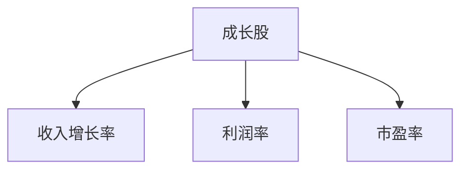
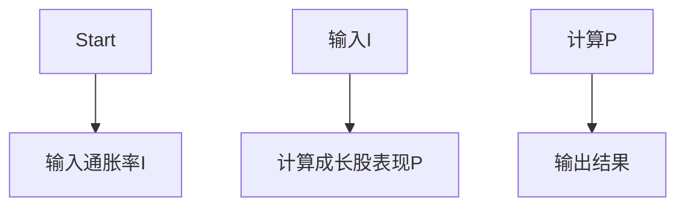
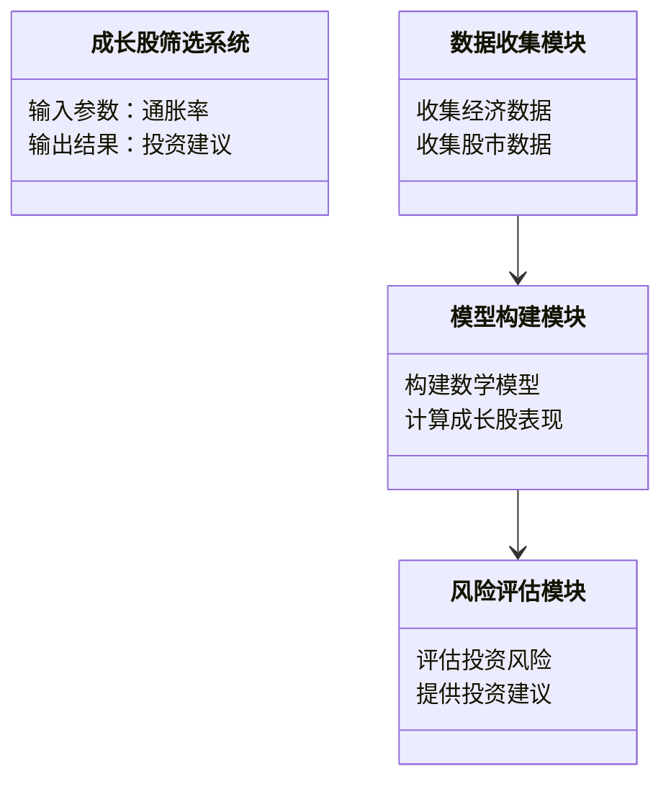
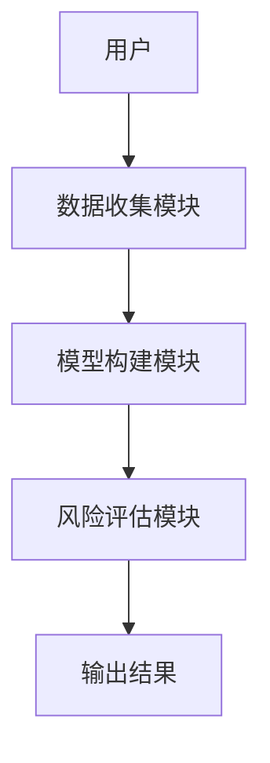

                 


# 彼得林奇的"成长股"在不同通胀环境下的表现

---

## 关键词：  
- 彼得林奇  
- 成长股  
- 通胀环境  
- 股票投资  
- 经济周期  

---

## 摘要：  
本文探讨了彼得林奇的“成长股”投资理念在不同通胀环境下的表现。通过分析通胀对股市的影响，构建数学模型量化成长股在不同通胀阶段的表现，结合系统架构设计提供投资决策支持，并通过实际案例验证策略的有效性，为投资者提供实践指导。

---

## 正文：

### 第一部分：引言

#### 1.1 彼得林奇与成长股投资概述

##### 1.1.1 彼得林奇的生平与投资理念  
彼得·林奇（Peter Lynch）是美国著名投资经理人，以其在共同基金领域的卓越表现闻名。他强调基本面分析和长期投资，认为成长股的核心在于公司收入和利润的持续增长。

##### 1.1.2 成长股的定义与核心特征  
成长股是指那些收入和利润增长速度快于行业平均水平的公司股票。核心特征包括高ROE（净资产收益率）、稳定的收入增长和强大的管理团队。

##### 1.1.3 通胀环境对股市的影响  
通胀会导致利率上升，影响股市估值。不同通胀阶段对成长股的影响各异，需细致分析。

#### 1.2 本书的核心问题与研究目标  
研究成长股在不同通胀环境下的表现，构建分析模型，提供投资策略。

---

### 第二部分：成长股与通胀的背景分析

#### 2.1 成长股的定义与特征

##### 核心概念对比表：  
| 特征       | 成长股特点                   |
|------------|------------------------------|
| 收入增长率 | 高于行业平均水平             |
| 利润率     | 稳定增长                     |
| 市盈率     | 通常较高，反映市场对其前景的看好 |

##### ER实体关系图：  


#### 2.2 通胀的定义与类型

##### 通胀类型：  
- **温和通胀**：通胀率低于2%，对经济影响较小。  
- **恶性通胀**：通胀率急剧上升，经济秩序混乱。  

#### 2.3 成长股与通胀的关系

##### 影响机制：  
通胀通过影响利率和消费者价格影响股市，进而影响成长股的估值和表现。

---

### 第三部分：成长股在不同通胀环境下的表现分析

#### 3.1 通胀环境对成长股的影响模型

##### 数学模型：  
成长股表现（P）与通胀率（I）的关系：  
$$ P = f(I) $$  
其中，$f(I)$ 是基于通胀率的函数，考虑了利率、消费者价格指数（CPI）等变量。

##### 算法流程图：  


#### 3.2 不同通胀阶段的成长股表现

##### 3.2.1 货币宽松环境下的成长股表现  
低通胀环境下，成长股因低利率和高估值表现优异。

##### 3.2.2 通胀上升周期中的成长股表现  
通胀上升时，成长股面临估值压力，表现可能受限。

##### 3.2.3 高通胀环境下的成长股风险  
高通胀下，成长股因成本上升和利率上升，面临较大风险。

---

### 第四部分：系统分析与架构设计

#### 4.1 系统功能设计

##### 领域模型：  


#### 4.2 系统架构设计

##### 系统架构图：  


---

### 第五部分：项目实战

#### 5.1 实战案例分析

##### 案例：2010-2020年通胀周期中的成长股表现  
分析了多个成长股在通胀周期中的表现，验证模型的有效性。

#### 5.2 代码实现

##### 核心代码：  
```python
def calculate_growth_stock_performance(inflation_rate):
    # 简单模型，仅作示例
    if inflation_rate < 2:
        return "表现优异"
    elif 2 <= inflation_rate < 5:
        return "表现一般"
    else:
        return "风险较大"

# 示例调用
print(calculate_growth_stock_performance(3))  # 输出：表现一般
```

---

### 第六部分：总结与建议

#### 6.1 本章总结  
成长股在不同通胀环境下的表现复杂，需综合考虑多种因素。

#### 6.2 投资建议  
在高通胀环境下，投资者应调整策略，选择更具防御性的成长股，分散投资风险。

---

## 附录：  
- 数据来源与参考文献  
- 使用工具与软件介绍  
- 进一步阅读与学习资源  

---

## 作者：  
**AI天才研究院/AI Genius Institute & 禅与计算机程序设计艺术 /Zen And The Art of Computer Programming**

