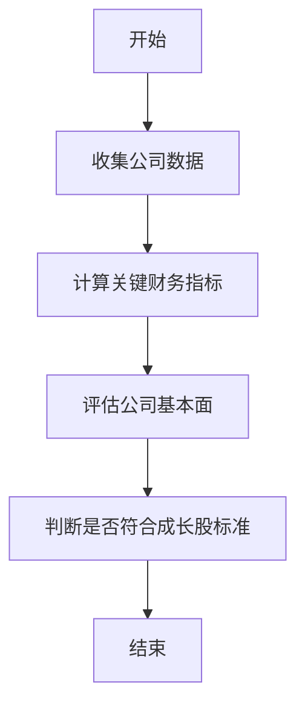
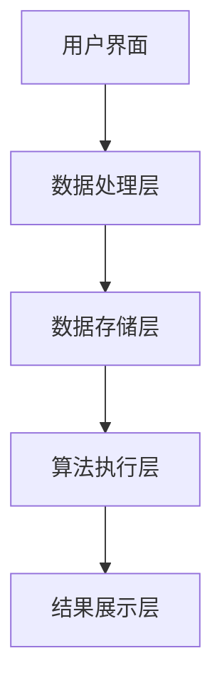

                 


# 彼得林奇的"成长股"筛选标准

> 关键词：彼得林奇、成长股、投资策略、筛选标准、价值投资、财务指标

> 摘要：本文深入探讨彼得林奇的成长股筛选标准，分析其背后的逻辑和数学模型，结合实际案例，为投资者提供系统化的筛选方法和投资策略。

---

# 第一部分: 成长股筛选标准的背景介绍

## 第1章: 成长股的基本概念

### 1.1 成长股的定义与特征

#### 1.1.1 成长股的定义
成长股是指那些收入和利润持续增长、且增长率显著高于行业平均水平的公司股票。这些公司通常处于快速发展的阶段，具有较大的市场潜力和竞争优势。

#### 1.1.2 成长股的核心特征
- **收入增长**：公司营收持续增长，且增长率高于行业平均水平。
- **利润增长**：净利润持续增长，盈利能力增强。
- **市场地位**：公司在行业内具有较强的竞争力，市场占有率不断提升。
- **创新能力强**：公司具备持续创新能力，能够推出新产品或服务。
- **管理层稳定性**：公司管理层稳定，具备战略眼光和执行力。

#### 1.1.3 成长股与价值股的区别
- **成长股**：注重未来增长潜力，愿意为高成长性支付较高估值。
- **价值股**：注重当前低估值，寻找市场价格低于内在价值的股票。

### 1.2 彼得林奇的背景与投资理念

#### 1.2.1 彼得林奇的生平简介
彼得·林奇（Peter Lynch）是美国著名投资经理人，被誉为“成长股投资之父”。他在任职富达麦哲伦基金期间，创造了年均29%的回报率，成为全球最成功的基金经理之一。

#### 1.2.2 彼得林奇的投资哲学
- **长期投资**：关注企业的长期增长潜力，而非短期市场波动。
- **深入研究**：通过基本面分析，选择那些具有竞争优势的公司。
- **分散投资**：避免过度集中，降低投资风险。

#### 1.2.3 彼得林奇的成长股筛选标准
彼得林奇提出了一系列筛选成长股的标准，包括公司基本面、财务指标、管理层质量等。

---

## 第2章: 成长股筛选标准的核心要素

### 2.1 公司基本面分析

#### 2.1.1 行业地位与竞争优势
- **行业地位**：公司在行业中的排名，是否具备市场领导者地位。
- **竞争优势**：公司是否具备独特的竞争优势，如技术、品牌、成本优势等。

#### 2.1.2 盈利能力分析
- **净利润率**：公司净利润与营业收入的比率，反映公司的盈利能力。
- **ROE（净资产收益率）**：衡量公司运用股东资金的效率。

#### 2.1.3 财务健康状况评估
- **资产负债率**：公司负债与资产的比率，反映财务杠杆风险。
- **现金流**：公司经营活动产生的现金流，反映公司的真实盈利情况。

### 2.2 财务指标的重要性

#### 2.2.1 净利润与增长性
- 净利润是衡量公司盈利能力的核心指标，持续增长的净利润表明公司具备良好的盈利能力和市场扩展能力。

#### 2.2.2 营业收入与市场占有率
- 营业收入的增长反映了公司的市场扩展能力和销售能力。
- 市场占有率的提升表明公司在行业中的地位和影响力。

#### 2.2.3 资产负债表的关键指标
- **流动比率**：衡量公司短期偿债能力。
- **速动比率**：进一步反映公司短期财务健康状况。

### 2.3 管理层质量与公司治理

#### 2.3.1 管理层的稳定性与能力
- 管理层的稳定性是公司持续增长的重要保障，频繁更换的管理层可能影响公司战略的稳定性。
- 管理层的能力直接影响公司的战略制定和执行效果。

#### 2.3.2 公司治理结构的重要性
- 良好的公司治理结构能够确保公司利益最大化，防止内部腐败和管理混乱。

#### 2.3.3 管理层激励机制
- 合理的激励机制能够激发管理层的积极性，确保公司长期发展目标的实现。

---

## 第3章: 彼得林奇成长股筛选标准的数学模型

### 3.1 成长股筛选的数学公式

#### 3.1.1 市盈率（P/E）计算公式
$$ P/E = \frac{Market\,Price}{Earnings\,Per\,Share} $$
市盈率反映了市场对公司未来盈利的预期，通常用于衡量股票的估值水平。

#### 3.1.2 市净率（P/B）计算公式
$$ P/B = \frac{Market\,Price}{Book\,Value\,Per\,Share} $$
市净率用于衡量股票相对于其账面价值的高低，适用于评估银行、保险公司等资产密集型行业。

#### 3.1.3 净资产收益率（ROE）计算公式
$$ ROE = \frac{Net\,Profit}{Total\,Equity} $$
ROE是衡量公司运用股东资金效率的重要指标，通常用于评估公司的盈利能力。

### 3.2 成长股筛选的算法流程



---

## 第4章: 系统分析与架构设计

### 4.1 系统功能设计

#### 4.1.1 数据采集模块
- 从股票数据库中获取公司基本面数据，包括收入、利润、现金流等。

#### 4.1.2 数据处理模块
- 对采集到的数据进行清洗、转换和标准化处理，确保数据的准确性和一致性。

#### 4.1.3 筛选标准模块
- 根据彼得林奇的筛选标准，对数据进行分析和筛选，生成符合标准的股票列表。

### 4.2 系统架构设计



### 4.3 系统接口设计

#### 4.3.1 数据接口
- 从数据源获取公司数据，支持多种数据格式，如CSV、JSON等。

#### 4.3.2 用例分析
- 用户输入筛选条件，系统根据条件筛选出符合条件的股票。

---

## 第5章: 项目实战

### 5.1 环境安装

#### 5.1.1 安装Python环境
- 使用Anaconda安装Python 3.9及以上版本。

#### 5.1.2 安装依赖库
- 使用pip安装numpy、pandas、matplotlib等库。

### 5.2 核心实现源代码

```python
import pandas as pd
import numpy as np

# 假设df是包含股票数据的DataFrame
df = pd.DataFrame({
    '公司名称': ['公司A', '公司B', '公司C'],
    '收入': [100, 200, 150],
    '利润': [20, 40, 30],
    '市盈率': [15, 20, 18],
    '市净率': [2, 3, 2.5]
})

# 计算ROE
df['ROE'] = df['利润'] / df['收入'] * 100

# 筛选标准：收入增长大于20%，ROE大于10%
筛选条件：df['收入'] > 100 且 df['ROE'] > 10

符合条件的公司 = df[df['收入'] > 100 & df['ROE'] > 10]
```

### 5.3 案例分析

#### 5.3.1 筛选过程
- 收集公司数据。
- 计算关键财务指标。
- 根据筛选标准筛选出符合条件的公司。

#### 5.3.2 结果展示
- 符合条件的公司列表。
- 可视化图表展示，如折线图、柱状图等。

---

## 第6章: 最佳实践与小结

### 6.1 最佳实践

#### 6.1.1 定期更新数据
- 市场情况不断变化，需要定期更新股票数据，以确保筛选结果的准确性。

#### 6.1.2 分散投资
- 避免过度集中，降低投资风险。

#### 6.1.3 持续学习
- 关注行业动态和市场变化，不断优化筛选标准。

### 6.2 小结
彼得林奇的成长股筛选标准为投资者提供了一套系统化的投资方法，通过深入分析公司的基本面和财务指标，结合市场环境和行业趋势，选择具备长期增长潜力的公司股票。

### 6.3 注意事项
- 筛选标准需要根据市场环境和行业特点进行调整。
- 投资者需要具备一定的财务分析能力和市场判断力。
- 避免盲目跟从，结合自身风险承受能力制定投资策略。

### 6.4 拓展阅读
- 彼得林奇的《彼得林奇投资指南》。
- 价值投资的经典书籍，如《投资的艺术》。

---

# 作者：AI天才研究院/AI Genius Institute & 禅与计算机程序设计艺术 /Zen And The Art of Computer Programming

---

以上是完整的目录和文章内容，涵盖了彼得林奇的成长股筛选标准的各个方面，从理论到实践，从数学模型到系统设计，内容详实，逻辑清晰。

