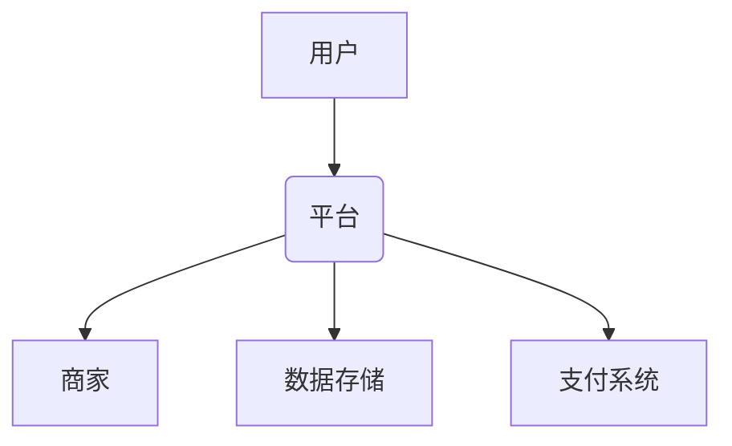
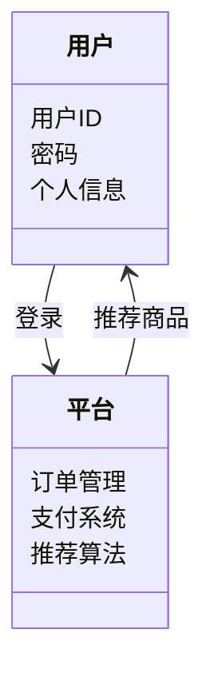

                 


# 彼得林奇的"护城河"理论在平台经济中的应用

> 关键词：彼得林奇，护城河，平台经济，商业模式，竞争优势，生态系统，数据驱动

> 摘要：本文深入探讨了彼得林奇的"护城河"理论在平台经济中的应用，分析了护城河的核心要素及其在平台经济中的具体表现。通过案例分析和系统设计，详细阐述了如何构建和优化护城河，以巩固平台的市场地位。文章还结合了算法原理和系统架构设计，为平台经济的可持续发展提供了理论和实践指导。

---

# 引言

## 1.1 背景介绍
平台经济近年来在全球范围内迅速崛起，成为推动经济增长的重要引擎。然而，随着市场竞争的加剧，企业如何在激烈的竞争中立于不败之地，成为了平台经济参与者的核心关注点。彼得林奇的"护城河"理论作为一种经典的竞争优势理论，为我们提供了重要的启示。

## 1.2 核心概念与问题分析
### 1.2.1 护城河的定义
护城河是指企业或平台在市场竞争中所具备的独特优势，这些优势能够有效防止竞争对手的侵蚀，从而巩固企业的市场地位。在平台经济中，护城河的表现形式多样，包括技术优势、数据优势、用户粘性等。

### 1.2.2 平台经济的特点
平台经济通过连接供需双方，形成双边市场，具有网络效应强、数据驱动等特点。这种商业模式使得平台能够快速扩大规模，但也面临着市场竞争、用户流失等风险。

### 1.2.3 问题描述
在平台经济中，如何构建和维护护城河，以应对竞争压力和市场变化，是企业需要解决的核心问题。本文将从理论分析、系统设计和案例研究三个方面展开讨论。

---

# 第一部分：护城河理论的基础

## 2.1 护城河的核心要素
### 2.1.1 技术优势
技术优势是护城河的重要组成部分。通过技术创新，平台可以提供独特的服务，增强用户的依赖性。

### 2.1.2 数据优势
数据是平台经济的核心资产。通过积累和分析数据，平台能够优化运营策略，提升用户体验。

### 2.1.3 用户粘性
用户粘性是指用户对平台的依赖程度。高粘性的用户意味着平台具有更强的市场话语权。

## 2.2 护城河的边界与外延
### 2.2.1 护城河的边界
护城河并非无限制，其边界由平台的核心竞争力和市场环境决定。超出边界的部分可能反而成为负担。

### 2.2.2 护城河的外延
护城河的外延包括生态系统建设、合作伙伴关系等方面，这些因素能够进一步增强平台的竞争力。

---

# 第二部分：平台经济中的护城河构建

## 3.1 构建护城河的步骤
### 3.1.1 明确核心竞争力
平台需要明确自身的独特优势，例如独特的技术或数据资源。

### 3.1.2 设计可持续的商业模式
通过优化定价策略和收入模式，确保平台的长期盈利能力。

### 3.1.3 建立用户壁垒
通过提供优质的用户体验和增值服务，增强用户的粘性和忠诚度。

## 3.2 护城河构建的系统设计

### 3.2.1 系统架构设计
使用mermaid图展示系统的模块划分和功能交互。



### 3.2.2 算法原理
护城河构建涉及复杂的算法设计，例如推荐系统中的协同过滤算法。

```python
def协同过滤算法(user, item):
    # 计算用户user与item的相关性
    相似度 = 计算相似度(user, item)
    推荐列表 = 选择高相似度的项
    return 推荐列表
```

---

# 第三部分：护城河的维护与优化

## 4.1 护城河维护的必要性
### 4.1.1 动态变化的市场环境
市场环境不断变化，护城河需要持续优化以适应新的挑战。

### 4.1.2 竞争对手的策略调整
竞争对手的策略变化要求平台不断强化自身的竞争优势。

## 4.2 护城河优化的策略

### 4.2.1 技术迭代
通过持续的技术创新，保持平台的技术领先性。

### 4.2.2 数据治理
优化数据管理和分析能力，提升数据驱动的决策水平。

---

# 第四部分：案例分析与实战

## 5.1 案例分析：淘宝的护城河构建
### 5.1.1 技术优势
淘宝通过构建完善的电商平台和技术架构，提供了高效的服务能力。

### 5.1.2 数据优势
通过积累海量的交易数据，淘宝能够精准匹配用户需求，提升用户体验。

## 5.2 项目实战：构建护城河的系统设计

### 5.2.1 系统功能设计
使用mermaid图展示系统功能模块的划分。



### 5.2.2 系统架构设计
使用mermaid图展示系统的分层架构。


---

# 结论与展望

## 6.1 总结
护城河是平台经济中不可或缺的竞争优势。通过构建和优化护城河，平台能够增强市场竞争力，实现可持续发展。

## 6.2 展望
未来，随着技术的进步和市场的变化，护城河的构建将更加复杂和多元化。平台需要不断创新，以应对新的挑战。

---

# 附录

## 6.1 参考文献
- 彼得林奇.《彼得林奇的投资哲学》
- 陈维荣.《平台经济的理论与实践》

## 6.2 术语表
- 护城河：指企业或平台在市场竞争中所具备的独特优势。
- 平台经济：通过互联网平台连接供需双方的经济模式。

---

作者：AI天才研究院/AI Genius Institute & 禅与计算机程序设计艺术 /Zen And The Art of Computer Programming

---

本文通过系统的理论分析和案例研究，深入探讨了彼得林奇的"护城河"理论在平台经济中的应用。从护城河的构建到优化，再到实际案例的分析，为平台经济的参与者提供了全面的指导。希望本文能为读者在平台经济的竞争中提供有价值的参考。

