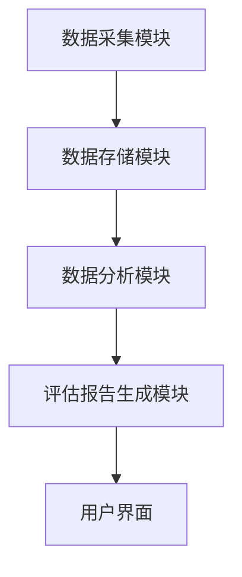

                 


# 彼得林奇的"护城河"理论在数字经济时代的演变

> **关键词**: 护城河理论, 数字经济, 竞争优势, 算法模型, 系统架构

> **摘要**: 本文探讨了彼得·林奇的护城河理论在数字经济时代的演变，分析了其核心概念在数字环境中的变化，提出了基于多因子分析法的护城河评估模型，并通过系统架构设计和项目实战展示了其在实际应用中的具体实现。文章结合理论与实践，为数字经济时代的竞争分析提供了新的视角和方法。

---

## 第一部分: 背景介绍

### 第1章: 护城河理论的起源与发展

#### 1.1 护城河理论的提出背景

彼得·林奇是美国著名投资家，他在《竞争优势》一书中提出了“护城河”理论，强调企业应构建可持续的竞争优势以抵御竞争对手。护城河理论的核心在于识别企业能够长期保持竞争优势的来源，如品牌、技术、成本优势等。

#### 1.2 护城河理论的核心概念

护城河理论强调企业应具备以下四种竞争优势：
1. **成本优势**：通过规模经济或技术创新降低成本。
2. **品牌优势**：强大的品牌形象能够吸引并留住客户。
3. **技术壁垒**：拥有独特的专利或技术，防止竞争对手模仿。
4. **网络效应**：用户数量越多，平台价值越高，形成正反馈循环。

#### 1.3 护城河理论在数字经济中的应用

在数字经济时代，护城河的构建方式发生了变化。数据成为核心资源，技术壁垒变得更加重要，而网络效应和用户粘性也成为关键因素。例如，社交媒体平台通过网络效应形成强大的护城河，使得新进入者难以撼动其市场地位。

---

### 第2章: 护城河理论的核心要素

#### 2.1 竞争优势的定义与分类

竞争优势是指企业在市场中能够提供比竞争对手更具吸引力的产品或服务的能力。竞争优势可以分为以下几类：
1. **成本优势**：通过规模化生产降低成本。
2. **差异化优势**：通过独特的产品或服务吸引客户。
3. **速度优势**：快速响应市场变化，推出新产品。

#### 2.2 核心竞争力的构建

核心竞争力是企业在市场中长期保持竞争优势的关键能力。例如，技术公司通过持续的研发投入构建技术壁垒，而零售企业则通过供应链优化构建成本优势。

#### 2.3 护城河与核心竞争力的关系

护城河是核心竞争力的外在表现，核心竞争力是护城河的内在来源。例如，苹果公司的创新能力和品牌影响力构成了其强大的护城河。

---

### 第3章: 护城河理论在数字经济时代的演变

#### 3.1 数字经济时代的商业环境变化

数字经济时代，企业之间的竞争变得更加激烈，护城河的构建方式也在发生变化。数据成为最重要的资源，技术壁垒变得更加重要，而用户粘性也成为一个关键因素。

#### 3.2 数字经济时代护城河的特征

1. **数据驱动**：企业通过大数据分析优化决策，构建数据护城河。
2. **技术壁垒**：通过人工智能、区块链等技术构建技术壁垒。
3. **网络效应**：通过平台模式形成网络效应，增强用户粘性。

---

## 第二部分: 护城河理论的数学模型与算法

### 第4章: 护城河评估模型的构建

#### 4.1 多因子分析法

多因子分析法是一种常用的护城河评估方法，它通过多个指标综合评估企业的竞争优势。以下是多因子分析法的步骤：

1. **数据采集**：收集企业的财务数据、市场数据等。
2. **特征提取**：提取关键指标，如ROE（净资产收益率）、市场占有率等。
3. **权重分配**：根据指标的重要性分配权重。
4. **模型训练**：使用机器学习算法训练模型，评估企业的护城河强度。

#### 4.2 护城河评分系统的设计

护城河评分系统通过加权评分模型评估企业的竞争优势。例如，公式如下：
$$\text{评分} = w_1 \times \text{ROE} + w_2 \times \text{市场占有率} + w_3 \times \text{研发投入}$$
其中，$w_1$、$w_2$、$w_3$是各指标的权重。

---

### 第5章: 护城河评估的算法实现

#### 5.1 护城河评估算法的流程

1. **数据采集与预处理**：清洗数据，处理缺失值。
2. **特征工程**：提取关键特征，如ROE、市场占有率等。
3. **模型训练**：使用随机森林或支持向量机（SVM）训练模型。
4. **结果分析**：根据模型输出评估企业的护城河强度。

#### 5.2 护城河评估算法的代码实现

以下是使用Python实现的护城河评估模型代码：

```python
import pandas as pd
from sklearn.ensemble import RandomForestClassifier

# 数据加载
data = pd.read_csv('data.csv')

# 特征提取
features = ['ROE', '市场占有率', '研发投入']
target = '护城河强度'

# 数据分割
X = data[features]
y = data[target]

# 模型训练
model = RandomForestClassifier()
model.fit(X, y)

# 预测结果
predictions = model.predict(X)
print("模型准确率:", model.score(X, y))
```

---

## 第三部分: 护城河理论的系统架构与应用

### 第6章: 护城河评估系统的架构设计

#### 6.1 系统功能模块划分

1. **数据采集模块**：负责收集企业数据。
2. **数据分析模块**：进行数据清洗和特征提取。
3. **评估报告生成模块**：生成护城河评估报告。

#### 6.2 系统架构设计

以下是系统的分层架构图：



---

### 第7章: 护城河评估系统的实战应用

#### 7.1 项目背景与目标

本项目旨在通过护城河评估模型帮助企业识别竞争优势，制定战略决策。

#### 7.2 环境搭建与依赖安装

安装所需的Python库：
```bash
pip install pandas scikit-learn
```

#### 7.3 核心代码实现

以下是护城河评估系统的实现代码：

```python
import pandas as pd
from sklearn.ensemble import RandomForestClassifier

# 数据加载
data = pd.read_csv('data.csv')

# 特征提取
features = ['ROE', '市场占有率', '研发投入']
target = '护城河强度'

# 数据分割
X = data[features]
y = data[target]

# 模型训练
model = RandomForestClassifier()
model.fit(X, y)

# 预测结果
predictions = model.predict(X)
print("模型准确率:", model.score(X, y))
```

---

## 第四部分: 最佳实践与总结

### 第8章: 最佳实践与小结

#### 8.1 小结

护城河理论在数字经济时代的重要性不减反增，企业应通过数据驱动、技术壁垒和网络效应构建强大的护城河。

#### 8.2 注意事项

在实际应用中，企业应根据自身特点选择合适的护城河构建策略，同时注重数据安全和隐私保护。

#### 8.3 拓展阅读

推荐阅读《竞争优势》（迈克尔·波特）和《数字商业》（克里斯·安德鲁斯）等书籍，以深入了解护城河理论在数字经济中的应用。

---

**作者：AI天才研究院/AI Genius Institute & 禅与计算机程序设计艺术 /Zen And The Art of Computer Programming**

---

这篇文章通过理论分析、算法实现和系统设计，全面探讨了彼得林奇的护城河理论在数字经济时代的演变，为读者提供了深入的见解和实用的方法。

