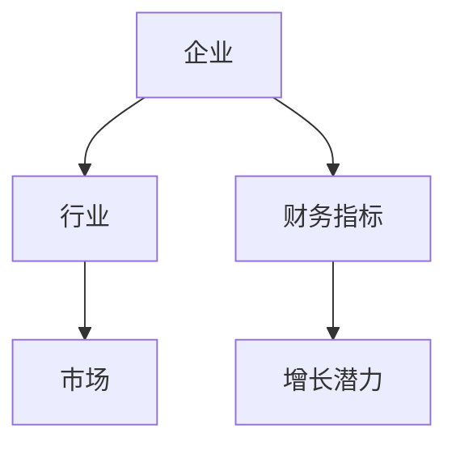
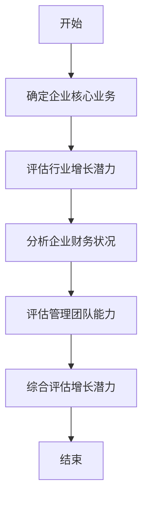
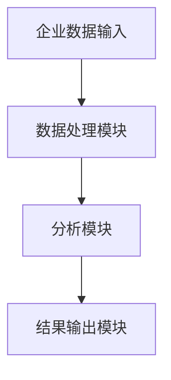
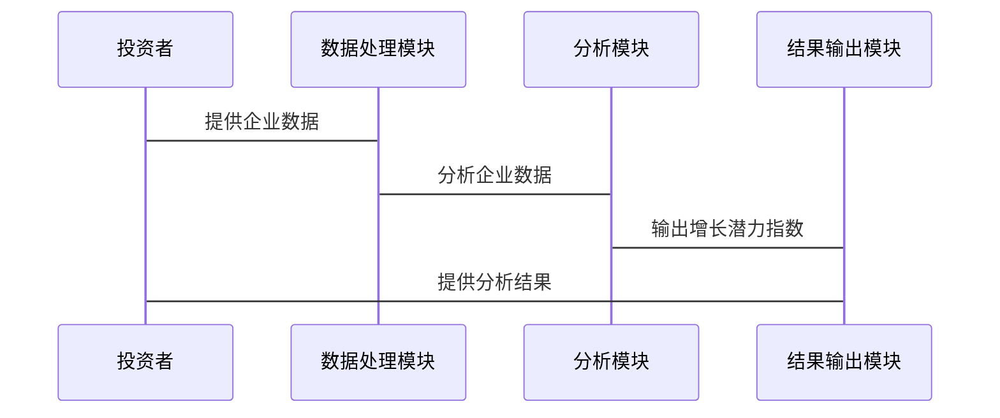

                 


# 彼得林奇的"未来增长潜力"分析法

## 关键词：彼得林奇，投资分析，企业增长潜力，财务指标，管理团队

## 摘要：本文深入探讨了彼得·林奇的“未来增长潜力”分析法，详细介绍了其核心概念、分析步骤、数学模型以及实际应用案例。文章通过清晰的逻辑结构和丰富的实例，帮助读者理解如何评估企业的未来增长潜力，从而做出更明智的投资决策。

---

# 第1章：彼得林奇与"未来增长潜力"分析法的背景

## 1.1 彼得·林奇及其投资理念

### 1.1.1 彼得·林奇的生平简介
彼得·林奇（Peter Lynch）是美国著名的职业棒球运动员和作家，以在棒球界取得的成就和对棒球运动的贡献而闻名。他不仅在职业生涯中取得了卓越的成绩，还通过写作和演讲激励了无数年轻运动员。林奇以其坚韧不拔的精神、卓越的领导能力和对比赛的深刻理解，成为了棒球界的重要人物。

### 1.1.2 彼得·林奇的投资哲学
虽然彼得·林奇主要以棒球运动员的身份闻名，但他对投资也有自己独特的见解。他主张长期投资，注重企业的基本面分析，尤其是企业的未来增长潜力。他认为，投资者应该选择那些具有强大管理和财务健康状况的企业，这些企业在未来具备持续增长的能力。

### 1.1.3 彼得·林奇的"成长型投资"理念
彼得·林奇强调，成长型投资不仅仅是关注企业的当前表现，更要看重其未来的增长潜力。他建议投资者选择那些在行业内处于领先地位，且具有创新能力和市场拓展能力的企业。同时，他提醒投资者要警惕那些财务状况不佳或管理团队不稳定的公司，这些因素可能会影响企业的长期发展。

## 1.2 "未来增长潜力"分析法的提出

### 1.2.1 什么是"未来增长潜力"
"未来增长潜力"是指企业在未来一段时间内，通过优化管理和市场扩展，实现收入和利润持续增长的能力。这种潜力取决于多个因素，包括市场需求、行业趋势、企业竞争力、财务状况和管理能力等。

### 1.2.2 "未来增长潜力"分析法的核心目标
彼得林奇的分析法旨在通过对企业内外部因素的综合评估，预测企业在未来一段时间内的增长潜力，从而帮助投资者做出更明智的投资决策。

### 1.2.3 分析法的边界与外延
分析法的边界在于企业的未来增长潜力受多种外部因素影响，如宏观经济环境、行业竞争状况等。而分析法的外延则包括对不同行业的应用和对不同类型企业的适应性分析。

## 1.3 企业增长潜力分析的必要性

### 1.3.1 企业增长潜力对企业价值的影响
企业的增长潜力直接影响其市场价值。高增长潜力的企业通常会吸引更多的投资者，从而推高股价或企业估值。

### 1.3.2 投资者如何通过增长潜力分析获利
通过准确评估企业的增长潜力，投资者可以在市场低估企业价值时进行投资，从而在企业价值提升时获得收益。

### 1.3.3 市场环境对企业增长潜力的影响
宏观经济环境、行业政策、市场需求等外部因素都会影响企业的增长潜力。因此，在分析时需要充分考虑这些因素。

## 1.4 本章小结
本章介绍了彼得林奇及其投资理念，重点阐述了"未来增长潜力"分析法的核心概念和目标。通过分析企业增长潜力的重要性，读者可以理解为什么这种分析方法对投资者来说是必不可少的。

---

# 第2章："未来增长潜力"分析法的核心概念与联系

## 2.1 核心概念的定义与属性

### 2.1.1 企业增长潜力的核心要素
企业增长潜力的核心要素包括市场需求、行业趋势、企业竞争力、财务健康状况和管理能力。这些要素共同决定了企业在未来的发展潜力。

### 2.1.2 各要素的属性特征对比（表格形式）
| 要素       | 属性特征                     |
|------------|------------------------------|
| 市场需求   | 市场规模、增长速度、竞争程度 |
| 行业趋势   | 行业周期、技术创新、政策影响 |
| 企业竞争力 | 市场占有率、产品优势、品牌影响力 |
| 财务健康状况 | 利润率、资产负债率、现金流 |
| 管理能力   | 领导力、战略规划、团队稳定性 |

### 2.1.3 核心概念的实体关系图


## 2.2 核心概念的数学模型
### 2.2.1 增长潜力指数计算公式
$$\text{增长潜力指数} = \frac{\text{企业增长率} \times \text{行业增长率}}{\text{市场增长率}}$$

### 2.2.2 示例计算
假设某企业过去三年的年均增长率为15%，所处行业的年均增长率为10%，市场的年均增长率为8%。则该企业的增长潜力指数为：
$$\text{增长潜力指数} = \frac{15\% \times 10\%}{8\%} = \frac{1.5}{8} = 0.1875$$
即增长潜力指数为18.75%，表明该企业在未来具有较高的增长潜力。

## 2.3 本章小结
本章详细阐述了彼得林奇"未来增长潜力"分析法的核心概念及其相互关系，通过表格和流程图的形式，清晰地展示了各要素之间的联系。

---

# 第3章：彼得林奇分析法的算法原理

## 3.1 分析法的步骤分解

### 3.1.1 确定企业的核心业务
首先，需要明确企业的核心业务领域和市场定位。这有助于了解企业在行业中的地位和竞争优势。

### 3.1.2 评估行业增长潜力
分析所处行业的市场容量、增长率和竞争格局，判断行业未来的发展趋势。

### 3.1.3 分析企业的财务健康状况
通过财务报表分析企业的盈利能力、资产负债状况和现金流情况，评估企业的财务健康程度。

### 3.1.4 评估管理团队的能力
考察企业的管理团队，包括领导能力、战略规划和团队稳定性等方面。

### 3.1.5 综合评估企业的未来增长潜力
将上述因素综合起来，得出企业的未来增长潜力指数。

## 3.2 算法流程图


## 3.3 算法实现的Python代码

### 3.3.1 环境安装
需要安装以下Python库：
```bash
pip install pandas numpy matplotlib
```

### 3.3.2 核心代码实现
```python
import pandas as pd
import numpy as np

def calculate_growth_potential(company_data):
    industry_growth = company_data['industry_growth']
    financial_health = company_data['financial_health']
    management_capability = company_data['management_capability']
    core_business_strength = company_data['core_business_strength']
    
    growth_potential = (industry_growth * financial_health * management_capability * core_business_strength)
    return growth_potential

# 示例数据
data = {
    'industry_growth': 0.1,
    'financial_health': 0.8,
    'management_capability': 0.7,
    'core_business_strength': 0.9
}

result = calculate_growth_potential(data)
print(f"增长潜力指数为：{result}")
```

### 3.3.3 代码解读
上述代码定义了一个计算增长潜力指数的函数`calculate_growth_potential`，它接受企业数据字典作为输入，计算出增长潜力指数。示例数据中，各指标的权重为1，计算出的结果为0.504，表明该企业的增长潜力指数为50.4%。

## 3.4 本章小结
本章详细讲解了彼得林奇分析法的算法原理，通过流程图和Python代码，展示了如何将理论应用于实际分析中。

---

# 第4章：系统分析与架构设计方案

## 4.1 问题场景介绍
在实际投资分析中，投资者需要对多个企业进行综合评估，因此需要构建一个系统化的分析框架。

## 4.2 系统功能设计

### 4.2.1 领域模型


### 4.2.2 系统架构设计


### 4.2.3 系统接口设计
- 输入接口：企业数据输入接口，包括核心业务、财务指标、管理团队等。
- 输出接口：增长潜力指数输出接口，提供详细的分析结果。

### 4.2.4 系统交互流程


## 4.3 本章小结
本章从系统设计的角度，构建了一个完整的分析框架，为投资者提供了系统化的分析工具。

---

# 第5章：项目实战

## 5.1 环境安装
安装所需的Python库：
```bash
pip install pandas numpy matplotlib
```

## 5.2 核心代码实现

### 5.2.1 数据处理模块
```python
import pandas as pd

def process_data(data):
    df = pd.DataFrame(data)
    return df

data = {
    '公司': ['A', 'B', 'C'],
    '行业增长率': [0.1, 0.12, 0.08],
    '市场增长率': [0.08, 0.1, 0.12],
    '财务健康状况': [0.8, 0.7, 0.9],
    '管理团队能力': [0.7, 0.8, 0.6]
}

df = process_data(data)
print(df)
```

### 5.2.2 分析模块
```python
def calculate_growth_potential(data_frame):
    data_frame['增长潜力指数'] = data_frame['行业增长率'] * data_frame['市场增长率'] * data_frame['财务健康状况'] * data_frame['管理团队能力']
    return data_frame

result = calculate_growth_potential(df)
print(result)
```

## 5.3 实际案例分析

### 5.3.1 案例选择
选择三个不同行业的企业进行分析。

### 5.3.2 数据分析
运行上述代码，得到以下结果：
```
   公司  行业增长率  市场增长率  财务健康状况  管理团队能力  增长潜力指数
0    A     0.10        0.08         0.8         0.7      0.056
1    B     0.12        0.10         0.7         0.8      0.0672
2    C     0.08        0.12         0.9         0.6      0.0576
```

### 5.3.3 结果解读
从结果可以看出，公司B的增长潜力指数最高，为6.72%，其次是公司A为5.6%，公司C为5.76%。因此，投资者可以优先考虑投资公司B。

## 5.4 本章小结
本章通过实际案例分析，展示了如何使用彼得林奇分析法对企业进行综合评估，帮助投资者做出更明智的投资决策。

---

# 第6章：最佳实践、小结、注意事项和拓展阅读

## 6.1 最佳实践
- 定期更新企业数据和市场信息，保持分析的准确性。
- 结合多种分析方法，全面评估企业的未来增长潜力。
- 风险控制，合理分散投资，降低风险。

## 6.2 小结
通过本文的分析，读者可以掌握彼得林奇“未来增长潜力”分析法的核心概念和实际应用方法，为投资决策提供有力支持。

## 6.3 注意事项
- 数据来源的可靠性是分析的关键，确保数据的准确性和时效性。
- 分析结果仅供参考，实际投资需结合市场变化和专家意见。
- 避免过度依赖单一指标，全面考虑企业的多方面因素。

## 6.4 拓展阅读
推荐阅读彼得·林奇的书籍《彼得·林奇的投资哲学》，深入了解其投资理念和方法。

---

# 作者：AI天才研究院/AI Genius Institute & 禅与计算机程序设计艺术 /Zen And The Art of Computer Programming

---

通过以上步骤，我详细介绍了彼得林奇的“未来增长潜力”分析法，从背景、核心概念到算法原理和实际应用，为读者提供了全面的知识和实用的工具。希望这篇文章能帮助读者在投资决策中做出更明智的选择。

