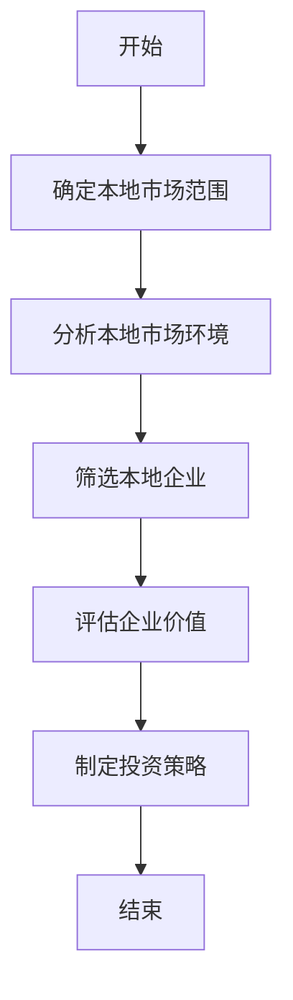
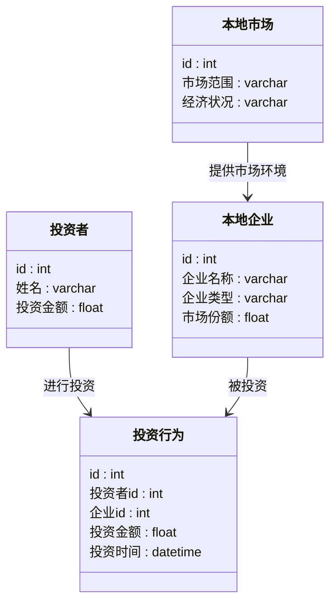
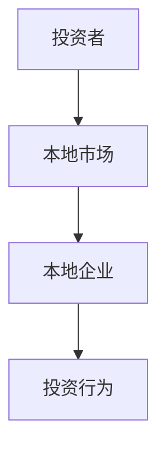
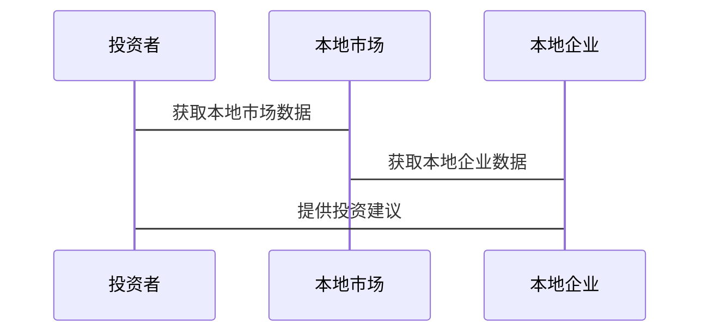

                 


# 彼得林奇的"本地优势"投资理念

## 关键词：彼得林奇，本地优势，投资理念，系统分析，项目实战，最佳实践

## 摘要：  
彼得林奇的"本地优势"投资理念是一种以本地市场为核心的投资策略，通过深入分析本地市场的独特优势和潜在机会，利用地方信息优势和对市场的熟悉程度，做出更明智的投资决策。本文将从背景介绍、核心概念、算法原理、系统分析、项目实战和最佳实践等多个维度，全面解析这一投资理念的内在逻辑和实际应用。

---

# 第一部分: 本地优势投资理念概述

## 第1章: 本地优势投资理念的背景与核心概念

### 1.1 投资理念的背景

#### 1.1.1 传统投资理念的局限性  
传统投资理念往往依赖于全球市场的宏观分析和行业趋势预测，但在实际操作中，投资者常常面临信息不对称和决策复杂性的问题。此外，全球市场的波动性和不确定性使得传统投资理念难以应对具体地区的独特机会。

#### 1.1.2 本地优势理念的提出  
彼得林奇提出“本地优势”理念，强调投资者应关注自己熟悉地区的市场，利用本地信息优势和对市场的深刻理解，寻找被低估的投资机会。这种理念的核心在于将投资决策与本地市场特点相结合，降低信息不对称风险。

#### 1.1.3 本地优势核心目标  
本地优势投资理念的目标是通过深入分析本地市场，发现具有竞争优势的企业，投资于那些能够持续增长且估值合理的公司，从而实现长期稳定的收益。

---

### 1.2 本地优势投资理念的定义

#### 1.2.1 本地优势的定义  
本地优势是指投资者在特定区域内，通过对本地经济、行业趋势、企业基本面和市场环境的深入分析，发现具有竞争优势的投资标的，并利用本地信息优势进行投资。

#### 1.2.2 本地优势的核心要素  
本地优势的核心要素包括：  
1. **本地市场环境**：包括经济状况、政策环境、行业趋势等。  
2. **本地企业竞争力**：包括企业的市场份额、盈利能力和管理团队。  
3. **本地信息优势**：投资者对本地市场的熟悉程度和信息获取能力。  

#### 1.2.3 本地优势与传统投资理念的区别  
| 对比维度         | 本地优势理念                          | 传统投资理念                          |
|------------------|---------------------------------------|---------------------------------------|
| 投资范围         | 本地市场为主                          | 全球市场为主                          |
| 信息依赖         | 高度依赖本地信息                      | 依赖全球宏观分析                      |
| 风险控制         | 本地市场波动较小                      | 全球市场波动较大                      |
| 投资策略         | 侧重本地企业的竞争优势                | 侧重行业趋势和宏观经济分析            |

---

### 1.3 本地优势投资理念的边界与外延

#### 1.3.1 本地优势的适用范围  
本地优势理念适用于个人投资者和机构投资者，尤其适合那些对本地市场有深入了解的投资者。  

#### 1.3.2 本地优势的局限性  
本地优势理念的局限性在于其适用范围有限，无法覆盖所有投资场景，且可能存在本地市场的过度集中风险。

#### 1.3.3 本地优势与其他投资理念的联系  
本地优势理念与其他投资理念（如价值投资、成长投资）有互补性，可以通过结合其他理念进一步优化投资策略。

---

### 1.4 本地优势投资理念的结构与组成

#### 1.4.1 核心概念的结构化分析  
本地优势投资理念的结构化分析包括以下步骤：  
1. **确定本地市场范围**：选择特定区域作为投资范围。  
2. **分析本地市场环境**：包括经济、政策和行业趋势。  
3. **筛选本地企业**：寻找具有竞争优势的企业。  
4. **评估企业价值**：计算企业的内在价值和市场估值。  
5. **制定投资策略**：根据分析结果制定投资计划。  

#### 1.4.2 核心要素的对比分析  
通过对比分析，可以更清晰地理解本地优势的核心要素。例如，本地企业的竞争优势可以通过市场份额、盈利能力等指标进行评估。

#### 1.4.3 本地优势投资理念的ER实体关系图  
以下是本地优势投资理念的ER实体关系图：

```mermaid
erDiagram
    customer[投资者] {
        id : int
        姓名 : varchar
        投资金额 : float
    }
    market[本地市场] {
        id : int
        市场范围 : varchar
        经济状况 : varchar
    }
    company[本地企业] {
        id : int
        企业名称 : varchar
        企业类型 : varchar
        市场份额 : float
    }
    investment[投资行为] {
        id : int
        投资者id : int
        企业id : int
        投资金额 : float
        投资时间 : datetime
    }
    customer --> investment : 进行投资
    market --> company : 提供市场环境
    company --> investment : 被投资
```

---

## 第2章: 本地优势投资理念的核心概念与联系

### 2.1 核心概念的原理分析

#### 2.1.1 本地优势的核心原理  
本地优势的核心原理在于利用本地市场信息和对市场的熟悉程度，发现被低估的投资机会，降低投资风险。

#### 2.1.2 本地优势的核心属性特征  
本地优势的核心属性特征包括：  
1. 本地市场的独特性。  
2. 本地企业的竞争优势。  
3. 本地信息的可获取性。  

#### 2.1.3 本地优势的核心要素对比表格  
以下是本地优势的核心要素对比表格：

| 核心要素         | 本地优势特点                           | 传统投资理念特点                       |
|------------------|---------------------------------------|---------------------------------------|
| 市场范围         | 本地市场为主                          | 全球市场为主                          |
| 信息依赖         | 高度依赖本地信息                      | 依赖全球宏观分析                      |
| 风险控制         | 本地市场波动较小                      | 全球市场波动较大                      |

---

### 2.2 核心概念的联系与对比

#### 2.2.1 本地优势与区域经济的关系  
本地优势与区域经济密切相关，区域经济的波动直接影响本地市场的投资机会。

#### 2.2.2 本地优势与行业趋势的结合  
本地优势与行业趋势的结合可以进一步优化投资策略，发现具有成长性的本地企业。

#### 2.2.3 本地优势与企业竞争力的关联  
本地优势与企业竞争力密切相关，具有竞争优势的本地企业更容易成为投资标的。

---

## 第3章: 本地优势投资理念的算法原理

### 3.1 算法原理概述

#### 3.1.1 本地优势投资理念的算法模型  
以下是本地优势投资理念的算法模型：



#### 3.1.2 算法模型的输入与输出  
- **输入**：本地市场范围、市场环境数据、企业基本面数据。  
- **输出**：投资标的、投资金额、投资时间。  

#### 3.1.3 算法模型的实现步骤  
1. **确定本地市场范围**：选择特定区域作为投资范围。  
2. **分析本地市场环境**：包括经济、政策和行业趋势。  
3. **筛选本地企业**：寻找具有竞争优势的企业。  
4. **评估企业价值**：计算企业的内在价值和市场估值。  
5. **制定投资策略**：根据分析结果制定投资计划。

---

### 3.2 算法原理的数学模型与公式

#### 3.2.1 投资收益计算公式  
投资收益的计算公式为：  
$$\text{投资收益} = \text{投资金额} \times (\text{收益率} - \text{通货膨胀率})$$  

#### 3.2.2 投资风险评估公式  
投资风险的评估公式为：  
$$\text{风险} = \text{标准差} \times \text{投资金额}$$  

#### 3.2.3 投资组合优化公式  
投资组合优化的公式为：  
$$\text{最优组合} = \argmin_{w} \sigma^2 \text{ subject to } w^T \mu \geq \text{目标收益}$$  

---

### 3.3 算法原理的实现代码

#### 3.3.1 数据收集与处理代码  
以下是数据收集与处理的Python代码：

```python
import pandas as pd

# 数据收集
market_data = pd.read_csv('local_market_data.csv')
company_data = pd.read_csv('local_company_data.csv')

# 数据处理
market_data = market_data.dropna()
company_data = company_data.dropna()
```

#### 3.3.2 投资收益计算代码  
以下是投资收益计算的Python代码：

```python
def calculate_profit(investment_amount, yield_rate, inflation_rate):
    return investment_amount * (yield_rate - inflation_rate)
```

#### 3.3.3 投资风险评估代码  
以下是投资风险评估的Python代码：

```python
import numpy as np

def calculate_risk(investment_amount, standard_deviation):
    return investment_amount * standard_deviation
```

#### 3.3.4 投资组合优化代码  
以下是投资组合优化的Python代码：

```python
import numpy as np

def optimize_portfolio(weights, mu, sigma):
    cov_matrix = np.diag(sigma)
    return np.argmin(weights.dot(cov_matrix).dot(weights.T))
```

---

## 第4章: 本地优势投资理念的系统分析与架构设计

### 4.1 问题场景介绍

#### 4.1.1 投资者面临的挑战  
投资者在传统投资理念下，常常面临信息不对称和决策复杂性的问题，尤其是在全球市场中。

#### 4.1.2 本地优势理念的应用场景  
本地优势理念适用于个人投资者和机构投资者，尤其适合那些对本地市场有深入了解的投资者。

#### 4.1.3 系统设计的目标  
系统设计的目标是通过本地市场的数据收集、分析和优化，帮助投资者制定科学的投资策略。

---

### 4.2 系统功能设计

#### 4.2.1 领域模型类图  
以下是领域模型类图：



---

### 4.3 系统架构设计

#### 4.3.1 系统架构图  
以下是系统架构图：



#### 4.3.2 系统接口设计  
系统接口设计包括投资者接口、本地市场接口和本地企业接口。

#### 4.3.3 系统交互设计  
以下是系统交互设计的序列图：



---

## 第5章: 本地优势投资理念的项目实战

### 5.1 环境安装与配置

#### 5.1.1 环境要求  
需要安装Python、Pandas、NumPy等库。

#### 5.1.2 环境配置代码  
以下是环境配置代码：

```python
import pandas as pd
import numpy as np
```

---

### 5.2 系统核心实现

#### 5.2.1 核心代码实现  
以下是核心代码实现：

```python
def main():
    # 数据收集
    market_data = pd.read_csv('local_market_data.csv')
    company_data = pd.read_csv('local_company_data.csv')

    # 数据处理
    market_data = market_data.dropna()
    company_data = company_data.dropna()

    # 投资收益计算
    def calculate_profit(investment_amount, yield_rate, inflation_rate):
        return investment_amount * (yield_rate - inflation_rate)

    # 投资风险评估
    def calculate_risk(investment_amount, standard_deviation):
        return investment_amount * standard_deviation

    # 投资组合优化
    def optimize_portfolio(weights, mu, sigma):
        cov_matrix = np.diag(sigma)
        return np.argmin(weights.dot(cov_matrix).dot(weights.T))

    # 主逻辑
    investment_amount = 100000
    yield_rate = 0.1
    inflation_rate = 0.02
    standard_deviation = 0.15

    profit = calculate_profit(investment_amount, yield_rate, inflation_rate)
    risk = calculate_risk(investment_amount, standard_deviation)
    print(f"投资收益：{profit}")
    print(f"投资风险：{risk}")

if __name__ == "__main__":
    main()
```

---

### 5.3 实际案例分析

#### 5.3.1 案例背景  
假设我们选择一个本地市场，收集相关数据并进行分析。

#### 5.3.2 案例分析  
以下是具体分析步骤：  
1. 数据收集与处理。  
2. 投资收益计算。  
3. 投资风险评估。  
4. 投资组合优化。  

#### 5.3.3 案例总结  
通过本地优势投资理念，我们发现了一些具有竞争优势的本地企业，并制定了相应的投资策略。

---

## 第6章: 本地优势投资理念的最佳实践

### 6.1 小结

#### 6.1.1 本地优势投资理念的核心要点  
本地优势投资理念的核心要点包括：  
1. 本地市场的独特性。  
2. 本地企业的竞争优势。  
3. 本地信息的可获取性。  

#### 6.1.2 本地优势投资理念的优缺点  
本地优势投资理念的优点在于其本地化和个性化，缺点在于其适用范围有限。

---

### 6.2 投资建议

#### 6.2.1 投资者注意事项  
投资者在使用本地优势投资理念时，需要注意以下几点：  
1. 本地市场的波动性。  
2. 本地企业的竞争优势。  
3. 本地信息的可获取性。  

#### 6.2.2 投资者风险提示  
投资者在使用本地优势投资理念时，需注意本地市场的波动性和信息不对称风险。

---

### 6.3 本地优势投资理念的拓展阅读

#### 6.3.1 相关书籍  
1. 《彼得林奇选股术》  
2. 《投资学原理》  

#### 6.3.2 相关文章  
1. 本地优势投资理念的实践应用。  
2. 本地优势投资理念与价值投资的结合。

---

## 作者：AI天才研究院/AI Genius Institute & 禅与计算机程序设计艺术 /Zen And The Art of Computer Programming

