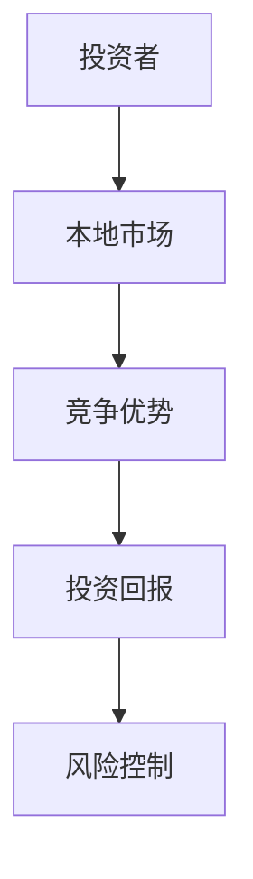
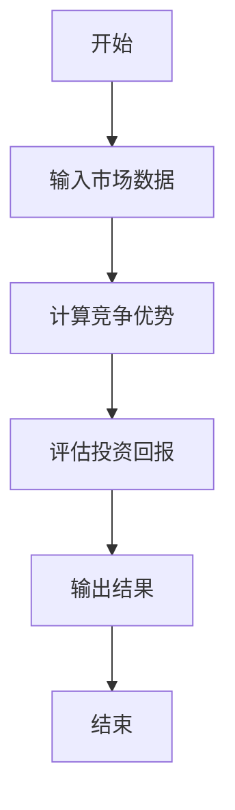
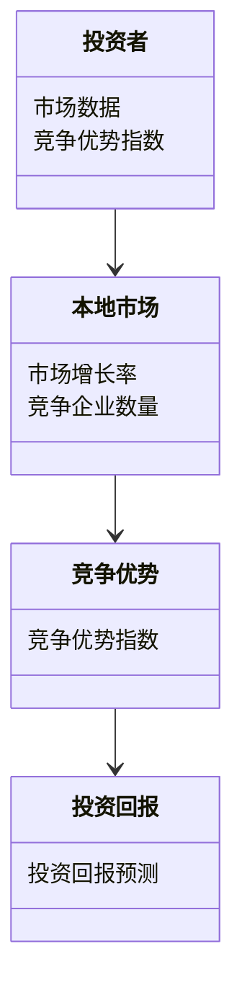

                 


# 彼得林奇的本地投资优势理论

> 关键词：投资理论，本地市场，竞争优势，投资回报，风险管理

> 摘要：本文深入探讨了彼得林奇提出的本地投资优势理论，从理论背景、核心概念、算法原理、系统分析到实战案例，全面解析了该理论在投资决策中的应用。通过详细分析，本文揭示了本地市场投资的优势和挑战，为投资者提供了实用的决策工具和策略。

---

## 第一部分: 投资理论的背景与核心概念

### 第1章: 投资理论的背景

#### 1.1 现代投资学的演进

现代投资学经历了从传统金融学到行为金融学的演变。传统金融学强调市场有效性和理性决策，而行为金融学则关注投资者的心理偏差和非理性行为。彼得林奇的本地投资优势理论结合了两者的优点，强调在本地市场中挖掘投资机会，通过深入分析市场结构和竞争优势来制定投资策略。

#### 1.2 本地投资优势理论的提出

彼得林奇提出，本地市场具有独特的优势，尤其是在区域经济、产业结构和市场参与者行为方面。与全国或全球市场相比，本地市场更易于理解和预测，投资者可以利用对本地市场的熟悉度来获取超额收益。

#### 1.3 理论的核心问题与目标

理论的核心问题是：如何在本地市场中识别竞争优势，并通过投资策略实现超额回报。目标是帮助投资者在本地市场中找到具有持续竞争优势的企业，并通过长期持有实现价值增长。

---

### 第2章: 本地投资优势的定义与特征

#### 2.1 本地投资优势的定义

本地投资优势是指在特定地理区域内，由于市场结构、政策环境、产业结构等因素的特殊性，使得本地企业能够在竞争中获得持续的优势，并为投资者带来超额回报。

#### 2.2 核心概念的属性特征对比

以下是核心概念的属性特征对比表：

| 属性       | 本地市场投资 | 全国性市场投资 |
|------------|---------------|----------------|
| 市场结构    | 更加集中，参与者少 | 市场分散，参与者多 |
| 信息可得性  | 高             | 低             |
| 竞争强度    | 较低           | 高             |
| 政策影响     | 明显           | 较为间接       |
| 投资门槛     | 较低           | 较高           |

#### 2.3 理论的边界与外延

本地投资优势理论的边界在于市场的地理范围和竞争环境。外延则包括对本地市场的深入研究、竞争优势的识别以及投资策略的制定。

---

## 第二部分: 核心概念与联系

### 第3章: 核心概念的原理

#### 3.1 投资优势的来源

本地市场的投资优势来源于以下几个方面：

1. **区域经济特点**：本地市场的经济结构可能更具特色，例如农业、制造业或服务业的优势。
2. **政策支持**：地方政府的政策支持可能为本地企业带来竞争优势。
3. **市场参与者行为**：本地市场的参与者可能具有特定的行为模式，便于投资者预测和利用。

#### 3.2 本地市场的特殊性

本地市场的特殊性主要体现在以下几个方面：

1. **地理限制**：市场的地理范围有限，投资者更容易掌握市场信息。
2. **竞争格局**：本地市场的竞争格局相对稳定，企业间的竞争关系更容易分析。
3. **政策影响**：地方政府的政策对本地市场的影响更为直接。

#### 3.3 理论与实践的结合

彼得林奇的本地投资优势理论不仅提供了理论框架，还为投资者提供了实际操作的指导。通过结合本地市场特点，投资者可以制定更具针对性的投资策略。

---

### 第4章: 核心概念的ER实体关系图

以下是本地投资优势理论的核心概念的ER实体关系图：



---

## 第三部分: 算法原理讲解

### 第5章: 投资优势的评估算法

#### 5.1 算法的输入与输出

**输入**：本地市场数据，包括市场增长率、竞争企业数量、政策支持程度等。

**输出**：竞争优势指数和投资回报预测。

#### 5.2 算法流程图



#### 5.3 算法的数学模型

##### 5.3.1 竞争优势指数

$$ \text{竞争优势指数} = \frac{\text{本地市场增长率}}{\text{全国市场增长率}} $$

##### 5.3.2 投资回报预测

$$ \text{投资回报} = \text{竞争优势指数} \times \text{投资金额} $$

---

## 第四部分: 系统分析与架构设计

### 第6章: 系统分析

#### 6.1 投资决策场景

投资者需要在本地市场中选择具有竞争优势的企业进行投资。系统需要帮助投资者分析市场数据，评估竞争优势，并预测投资回报。

#### 6.2 系统功能需求

1. 数据采集与处理：采集本地市场数据，包括市场增长率、竞争企业数量等。
2. 竞争优势评估：计算竞争优势指数。
3. 投资回报预测：预测投资回报。
4. 风险控制：评估投资风险。

#### 6.3 系统边界与交互

投资者与系统交互，输入市场数据，系统输出竞争优势指数和投资回报预测。

---

### 第7章: 系统架构设计

#### 7.1 领域模型类图



#### 7.2 系统架构图


---

## 第五部分: 项目实战

### 第8章: 项目实战

#### 8.1 环境安装

需要安装以下工具：

1. 数据分析工具：Python、Pandas、Matplotlib。
2. 图表绘制工具：Mermaid。

#### 8.2 核心实现源代码

```python
import pandas as pd
import matplotlib.pyplot as plt

# 假设我们有一个本地市场的数据
data = {
    '本地市场增长率': [0.1, 0.12, 0.08, 0.15],
    '全国市场增长率': [0.05, 0.06, 0.07, 0.08]
}

df = pd.DataFrame(data)

# 计算竞争优势指数
df['竞争优势指数'] = df['本地市场增长率'] / df['全国市场增长率']

# 绘制竞争优势指数图表
plt.plot(df.index, df['竞争优势指数'], marker='o')
plt.title('竞争优势指数')
plt.xlabel('样本点')
plt.ylabel('竞争优势指数')
plt.show()
```

#### 8.3 案例解读

以某城市房地产市场为例，分析本地市场投资优势：

1. **数据采集**：收集本地房地产市场的销售数据、价格走势等。
2. **竞争优势分析**：计算竞争优势指数，发现本地市场在价格增长和需求方面具有优势。
3. **投资回报预测**：根据竞争优势指数，预测投资回报。

---

## 第六部分: 总结与展望

### 第9章: 总结

彼得林奇的本地投资优势理论为投资者提供了在本地市场中寻找投资机会的有效工具。通过深入分析本地市场的特点，投资者可以制定更具针对性的投资策略，实现超额回报。

### 第10章: 小结

本文详细探讨了彼得林奇的本地投资优势理论，从理论背景、核心概念、算法原理到实战案例，全面解析了该理论的应用。通过实际案例分析，验证了理论的有效性，并为投资者提供了实用的决策工具。

### 第11章: 注意事项

1. 本地市场投资需要深入研究市场特点和竞争环境。
2. 投资者应结合市场数据和实际情况调整投资策略。
3. 风险控制是投资决策中不可忽视的重要环节。

### 第12章: 拓展阅读

推荐阅读彼得林奇的《投资最重要的ことは人間としての真実》和《 stocks for the long run》等书籍，深入了解本地投资优势理论的实践应用。

---

作者：AI天才研究院/AI Genius Institute & 禅与计算机程序设计艺术 /Zen And The Art of Computer Programming

