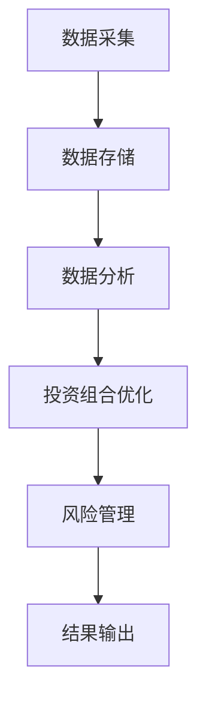

                 


# 彼得林奇的"知道你在买什么"原则

> **关键词**：投资原则，彼得林奇，价值评估，风险管理，投资策略，系统架构

> **摘要**：本文将深入探讨彼得林奇的"知道你在买什么"投资原则，从核心概念、算法原理、系统架构到项目实战，全面解析这一原则在现代投资管理中的应用。通过详细分析投资组合管理、风险管理策略以及系统架构设计，结合具体案例和代码实现，为读者提供全面的技术视角。

---

## 第一部分: 投资概述

### 第1章: 投资的基本概念

#### 1.1 投资的基本定义

投资是指将资金投入到某个项目或资产中，以期获得未来的收益。根据投资对象的不同，可以将其分为股票、债券、房地产等多种类型。投资的基本原则包括分散投资、长期持有、价值投资等。投资与投机的主要区别在于，投资注重长期价值的分析，而投机则更多依赖短期价格波动的预测。

#### 1.2 彼得林奇投资原则的背景

彼得·林奇（Peter Lynch）是美国著名的投资专家，以其在富达投资管理公司的长期投资业绩而闻名。他提出的核心投资原则之一是“知道你在买什么”，即投资者在进行投资决策时，必须深入理解投资标的的本质和价值。

---

### 第2章: 彼得林奇的核心投资方法

#### 2.1 企业分析方法

企业分析是彼得林奇方法的核心。以下是企业的基本面分析、财务状况分析和竞争优势分析的详细步骤：

- **基本面分析**：分析企业的行业地位、商业模式、管理团队和市场前景。  
- **财务状况分析**：通过财务报表（如资产负债表、利润表、现金流量表）评估企业的盈利能力、偿债能力和成长性。  
- **竞争优势分析**：识别企业的核心竞争力，如成本优势、技术壁垒或品牌影响力。

#### 2.2 价值评估方法

价值评估是投资决策的关键。以下是常用的企业估值方法和指标：

- **市盈率（P/E）**：衡量股票价格与每股收益的比例，反映市场对企业的估值。  
- **市净率（P/B）**：衡量股票价格与每股净资产的比例，适用于评估资产密集型企业的价值。  
- **内在价值计算**：通过DCF模型（现金流贴现法）估算企业的实际价值。

#### 2.3 市场分析方法

市场分析是投资决策的重要组成部分。以下是市场周期分析、市场情绪判断和市场风险评估的具体步骤：

- **市场周期分析**：识别市场的牛熊周期，判断当前市场所处的阶段。  
- **市场情绪判断**：通过分析市场参与度、成交量和投资者情绪指标，评估市场的整体风险。  
- **市场风险评估**：通过波动率、VaR（在险值）等指标量化市场风险。

---

## 第3章: 投资组合管理

### 3.1 投资组合的基本原理

投资组合管理是实现投资目标的重要手段。以下是投资组合的基本原理和优化方法：

- **投资组合的定义与作用**：通过将资金分散投资于不同资产或股票，降低单一投资的风险。  
- **投资组合的构建原则**：根据投资者的风险承受能力和收益目标，选择合适的资产配置。  
- **风险分散效应**：通过多样化投资降低非系统性风险。

#### 3.2 投资组合优化的数学模型

以下是投资组合优化的数学模型和Python实现代码：

- **CAPM模型**：资本资产定价模型用于计算资产的预期收益。  
- **投资组合优化公式**：  
  $$ \text{Minimize } \sigma^2 \text{（方差）} \text{ subject to } \mathbf{w}^T \mathbf{r} = \text{target return} $$  
  其中，$\mathbf{w}$ 是权重向量，$\mathbf{r}$ 是收益向量。

以下是Python代码示例：

```python
import numpy as np
import pandas as pd
from scipy.optimize import minimize

def optimize_portfolio(returns):
    n = returns.shape[1]
    # 定义优化目标函数
    def objective(weights):
        return np.dot(weights.T, np.dot(returns.cov(), weights))
    # 定义约束条件
    constraints = [{'type': 'eq', 'fun': lambda w: sum(w) - 1.0}]
    # 初始化权重向量
    init_weights = np.array([1.0/n]*n)
    # 调用优化函数
    result = minimize(objective, init_weights, constraints=constraints)
    return result.x

# 示例数据
data = pd.read_csv('stock_returns.csv')
weights = optimize_portfolio(data)
print(weights)
```

---

## 第4章: 投资风险管理

### 4.1 风险识别与评估

风险是投资中不可避免的一部分。以下是风险识别与评估的关键步骤：

- **风险的定义与分类**：根据来源可分为市场风险、信用风险、流动性风险等。  
- **风险评估的指标**：波动率、VaR、最大回撤等。

#### 4.2 风险管理策略

以下是常见的风险管理策略：

- **风险分散**：通过投资多样化降低非系统性风险。  
- **风险对冲**：利用衍生品对冲特定风险。  
- **风险控制模型**：通过数学模型量化风险并制定应对策略。

---

## 第5章: 系统架构与设计

### 5.1 投资管理系统架构

以下是投资管理系统的功能设计和架构图：

- **系统功能设计**：包括数据采集、分析、评估、组合优化和风险管理模块。  
- **系统架构图**：展示各个模块之间的关系和数据流。

以下是Mermaid架构图：



---

## 第6章: 项目实战

### 6.1 投资组合优化的实战案例

以下是投资组合优化的实际案例：

- **环境安装**：安装Python、Pandas、NumPy等工具。  
- **代码实现**：基于实际数据实现投资组合优化。  
- **案例分析**：分析优化结果并评估其有效性。

---

## 第7章: 最佳实践

### 7.1 小结

通过本文的分析，我们可以看到，彼得林奇的"知道你在买什么"原则不仅是一种投资理念，更是一种系统化的方法。从企业分析到风险管理，每一步都需要细致的分析和严谨的逻辑。

---

### 7.2 注意事项

- 投资者需根据自身情况调整策略。  
- 风险管理是投资决策的核心。  
- 长期持有是实现价值投资的关键。

### 7.3 拓展阅读

建议读者进一步阅读《彼得林奇的投资哲学》和《投资学》等书籍，深入理解投资的本质。

---

## 作者：AI天才研究院 & 禅与计算机程序设计艺术

---

通过本文的详细分析，我们不仅理解了彼得林奇的投资原则，还从技术角度探讨了其在现代投资管理中的应用。希望本文能为读者提供有价值的投资思路和实践方法。

