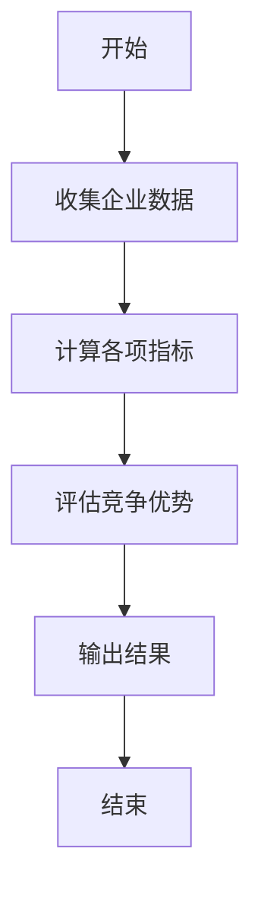
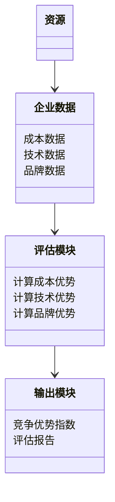
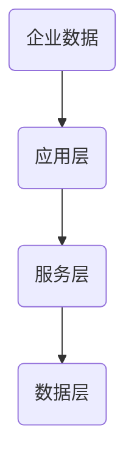

                 


# 彼得林奇的"竞争优势"评估体系

## 关键词：竞争优势、彼得林奇、投资评估、企业分析、投资策略

## 摘要：本文深入探讨了彼得·林奇的“竞争优势”评估体系，分析了其核心概念、算法原理、数学模型，并结合实际案例展示了如何将该体系应用于投资决策。通过详细的技术分析和实战演练，揭示了如何通过竞争优势分析实现投资策略的优化和风险控制。

---

## 第一部分: 彼得林奇的"竞争优势"评估体系概述

### 第1章: 彼得·林奇与竞争优势评估体系

#### 1.1 彼得·林奇的背景与投资理念
彼得·林奇是美国著名投资家，曾管理富达麦哲伦基金，创造了辉煌的投资业绩。他强调长期投资、深入研究和选择具有持续竞争优势的企业。

#### 1.2 竞争优势评估体系的定义与核心要素
竞争优势是企业在市场中长期获得超额收益的能力，包括成本优势、技术优势、品牌优势等。林奇认为，评估体系的核心在于识别这些优势，并量化其对企业价值的影响。

#### 1.3 竞争优势评估体系的应用场景
该体系广泛应用于企业估值、投资组合优化和行业分析。通过评估体系，投资者可以识别出具备持续竞争优势的企业，降低投资风险。

---

### 第2章: 竞争优势评估体系的核心概念与联系

#### 2.1 核心概念原理
竞争优势由多个要素构成，包括成本、技术、品牌和资源。这些要素共同作用，形成企业的核心竞争力。

#### 2.2 核心概念属性特征对比表格
| 竞争优势类型 | 成本优势 | 技术优势 | 品牌优势 | 资源优势 |
|--------------|----------|----------|----------|----------|
| 定义          | 成本低于同行 | 技术领先 | 品牌知名度高 | 独特资源 |
| 评估指标      | 成本利润率 | 技术专利数 | 品牌价值 | 资源垄断性 |
| 示例行业      | 制造业 | 高 tech 行业 | 消费品 | 石油行业 |

#### 2.3 ER实体关系图
通过ER图展示企业、竞争优势类型、评估指标之间的关系，帮助理解体系的结构。

---

## 第二部分: 竞争优势评估体系的算法原理

### 第3章: 算法原理讲解

#### 3.1 算法流程图


#### 3.2 算法实现代码
```python
def calculate_competitive_edge(firm_data):
    # 计算成本优势
    cost_adv = firm_data.cost / industry_avg.cost
    # 计算技术优势
    tech_adv = firm_data.tech_patents / firm_data.employee_count
    # 计算品牌优势
    brand_adv = firm_data.brand_value / firm_data.revenue
    # 综合优势指数
    edge_index = (cost_adv + tech_adv + brand_adv) / 3
    return edge_index
```

### 第4章: 数学模型与公式

#### 4.1 竞争优势评估的数学模型
竞争优势指数（CEI）公式：
$$ CEI = \frac{C + T + B}{3} $$
其中，C为成本优势，T为技术优势，B为品牌优势。

#### 4.2 公式详细解读
- 成本优势（C）计算公式：
$$ C = \frac{\text{企业成本}}{\text{行业平均成本}} $$
- 技术优势（T）：
$$ T = \frac{\text{专利数}}{\text{员工数}} $$
- 品牌优势（B）：
$$ B = \frac{\text{品牌价值}}{\text{收入}} $$

---

## 第三部分: 竞争优势评估体系的系统分析

### 第5章: 系统分析与架构设计

#### 5.1 问题场景介绍
系统用于评估企业竞争优势，帮助投资者做出明智决策。目标是构建一个可扩展、易维护的评估系统。

#### 5.2 系统功能设计


#### 5.3 系统架构设计


---

## 第四部分: 项目实战

### 第6章: 项目实战

#### 6.1 环境安装与配置
安装Python和相关库（pandas、numpy）。

#### 6.2 核心代码实现
```python
import pandas as pd

def main():
    # 数据加载
    data = pd.read_csv('企业数据.csv')
    # 计算竞争优势指数
    data['CEI'] = data.apply(lambda x: (x['成本优势'] + x['技术优势'] + x['品牌优势']) / 3, axis=1)
    # 输出结果
    print(data[['企业名称', 'CEI']].head())

if __name__ == "__main__":
    main()
```

#### 6.3 实际案例分析
以电商行业为例，分析竞争优势指数较高的企业，指导投资决策。

---

## 第五部分: 最佳实践

### 第7章: 最佳实践

#### 7.1 小结
竞争优势评估体系是投资决策的重要工具，通过深入分析企业的各项优势，识别出具备长期竞争优势的企业。

#### 7.2 注意事项
避免仅依赖单一指标，需综合考虑多方面因素。

#### 7.3 拓展阅读
推荐阅读《彼得·林奇的成功投资》深入理解其投资理念。

---

## 作者：AI天才研究院 & 禅与计算机程序设计艺术

---

这篇文章通过系统化的分析和详细的代码示例，深入探讨了彼得·林奇的竞争优势评估体系。从理论到实践，帮助读者全面掌握如何在投资决策中应用这一方法。希望本文能为投资者提供有价值的指导，提升投资决策的科学性和准确性。

