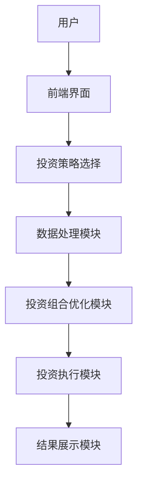

                 


# 彼得林奇的"简单明了"投资哲学

> 关键词：彼得林奇，投资哲学，简单明了，投资策略，资产配置，投资组合优化，风险控制，数学模型

> 摘要：彼得·林奇是世界著名投资专家，他的投资哲学强调简单明了，通过长期投资、分散投资和风险控制来实现财富增值。本文将从投资哲学的背景、核心概念、数学模型、系统设计、实战案例等多个维度，详细阐述彼得林奇的简单明了投资哲学，并结合实际案例进行分析和解读，帮助读者更好地理解和应用这一投资理念。

---

## 第一部分: 彼得林奇投资哲学的背景与核心概念

### 第1章: 彼得林奇投资哲学的背景

#### 1.1 投资哲学的演变与彼得林奇的贡献

彼得·林奇（Peter Lynch）是美国著名的职业基金经理人，曾任管理费城化工公司养老基金的经理人。他以长期投资、分散投资和风险控制为核心的投资理念闻名于世。他的投资哲学强调“简单明了”，即通过长期持有优质股票，避免频繁交易，从而降低交易成本和税务负担，实现财富的稳步增长。

#### 1.2 简单明了投资哲学的核心理念

彼得林奇的简单明了投资哲学的核心理念包括：

1. **长期投资**：避免短期波动，关注企业的长期价值。
2. **分散投资**：通过分散投资降低风险，避免将所有资金投入单一资产或行业。
3. **价值投资**：寻找具有成长潜力的公司，投资其低估的股票。
4. **风险控制**：通过分散投资和长期持有，降低市场的波动性对投资组合的影响。

### 第2章: 简单明了投资哲学的核心概念

#### 2.1 投资的基本原理

1. **资产配置**：将资金分配到不同的资产类别（如股票、债券、现金等）中，以优化风险和收益。
2. **投资组合优化**：通过数学模型优化投资组合的收益和风险。
3. **风险与收益的平衡**：在投资中，收益与风险是成正比的，需要找到最佳平衡点。

#### 2.2 投资策略的核心要素

1. **长期投资**：通过长期持有优质股票，获得企业的成长收益。
2. **分散投资**：将资金分散投资于多个行业和公司，降低单一资产的风险。
3. **安全边际**：购买价格低于内在价值的股票，确保有一定的安全空间。

---

## 第二部分: 投资哲学的数学模型与算法原理

### 第3章: 投资组合优化的数学模型

#### 3.1 投资组合优化的基本原理

投资组合优化的目标是在给定的风险水平下最大化收益，或者在给定的收益水平下最小化风险。数学上，投资组合优化可以表示为以下公式：

$$ \text{最大化收益 } \sum_{i=1}^{n} w_i r_i - \text{最小化风险 } \sum_{i=1}^{n} \sum_{j=1}^{n} w_i w_j \sigma_{ij} $$

其中，\( w_i \) 是第 \( i \) 个资产的权重，\( r_i \) 是第 \( i \) 个资产的预期收益，\( \sigma_{ij} \) 是第 \( i \) 和第 \( j \) 个资产之间的协方差。

#### 3.2 投资组合优化的算法实现

以下是一个简单的投资组合优化算法：

```python
import numpy as np

def portfolio_optimization(weights, returns, covariance):
    # 计算投资组合的收益和风险
    portfolio_return = np.dot(weights, returns)
    portfolio_risk = np.sqrt(np.dot(weights, np.dot(covariance, weights)))
    return portfolio_return, portfolio_risk

# 示例数据
returns = np.array([0.1, 0.15, 0.08])
covariance = np.array([[0.04, 0.02, 0.01],
                       [0.02, 0.06, 0.03],
                       [0.01, 0.03, 0.05]])
weights = np.array([0.4, 0.4, 0.2])

# 调用函数
return_value, risk_value = portfolio_optimization(weights, returns, covariance)
print("投资组合收益:", return_value)
print("投资组合风险:", risk_value)
```

### 第4章: 简单明了投资策略的算法实现

#### 4.1 简单明了投资策略的数学模型

彼得林奇的简单明了投资策略可以通过以下步骤实现：

1. **确定投资目标**：根据投资者的风险承受能力和收益目标，确定投资策略。
2. **资产配置**：将资金分配到不同的资产类别中，例如股票、债券、现金等。
3. **股票筛选**：选择具有长期增长潜力的公司，购买其股票。
4. **定期复盘**：定期检查投资组合的表现，调整权重以保持与目标一致。

#### 4.2 投资策略的算法实现

以下是一个简单的投资策略实现代码：

```python
import pandas as pd

def simple_investment_strategy(stocks, weights, periods):
    # 计算每只股票的收益
    stock_returns = stocks.pct_change().dropna()
    # 计算投资组合收益
    portfolio_returns = stock_returns.dot(weights)
    # 计算累计收益
    cumulative_returns = (1 + portfolio_returns).cumprod()
    return cumulative_returns

# 示例数据
stocks = pd.DataFrame({
    'stock1': [100, 105, 110, 115],
    'stock2': [80, 85, 90, 95],
    'stock3': [120, 125, 130, 135]
})
weights = [0.4, 0.4, 0.2]
periods = 4

# 调用函数
cumulative_returns = simple_investment_strategy(stocks, weights, periods)
print("累计收益:", cumulative_returns)
```

---

## 第三部分: 投资哲学的系统设计与实战案例

### 第5章: 投资管理系统的设计与实现

#### 5.1 系统功能设计

1. **用户界面**：提供简单易用的界面，用户可以输入资金、选择投资策略、查看投资组合表现。
2. **数据处理**：获取股票、债券等资产的历史数据，计算收益和风险。
3. **投资组合优化**：根据用户需求，优化投资组合的收益和风险。
4. **投资策略执行**：根据优化结果，执行投资策略。

#### 5.2 系统架构设计

以下是一个投资管理系统的架构图：



---

## 第6章: 项目实战与案例分析

### 6.1 投资实战环境安装

1. **安装Python环境**：安装Python和必要的库（如pandas、numpy、matplotlib）。
2. **数据获取工具**：使用Yahoo Finance或其它数据源获取股票数据。

### 6.2 核心代码实现

以下是投资组合优化的核心代码：

```python
import pandas as pd
import numpy as np

def portfolio_optimizer(returns, covariance, target_return):
    # 优化目标：最大化收益，同时满足风险约束
    n = len(returns)
    # 初始化优化器
    import scipy.optimize as optimize
    # 定义目标函数
    def objective(weights):
        return -np.dot(weights, returns)  # 最小化收益
    # 定义约束条件
    constraints = []
    for i in range(n):
        for j in range(n):
            constraints.append({'type': 'ineq', 'fun': lambda w, i=i, j=j: w[i] + w[j] <= 1})
    # 边界条件
    bounds = [(0, 1) for _ in range(n)]
    # 求解优化问题
    result = optimize.minimize(objective, np.ones(n)/n, bounds=bounds, constraints=constraints)
    return result.x

# 示例数据
returns = np.array([0.1, 0.15, 0.08])
covariance = np.array([[0.04, 0.02, 0.01],
                       [0.02, 0.06, 0.03],
                       [0.01, 0.03, 0.05]])
target_return = 0.12

# 调用优化器
optimal_weights = portfolio_optimizer(returns, covariance, target_return)
print("最优权重:", optimal_weights)
```

---

## 第7章: 最佳实践与小结

### 7.1 投资哲学的实践总结

彼得林奇的简单明了投资哲学强调长期投资、分散投资和风险控制。通过数学模型和算法优化，可以更好地实现投资目标。

### 7.2 投资建议

1. **长期投资**：避免频繁交易，降低交易成本和税务负担。
2. **分散投资**：将资金分配到不同的资产和行业中，降低风险。
3. **定期复盘**：定期检查投资组合的表现，及时调整策略。

### 7.3 小结

彼得林奇的简单明了投资哲学为投资者提供了一种有效的投资方法。通过长期投资和分散投资，投资者可以在风险可控的前提下实现财富的稳步增长。

---

## 作者：AI天才研究院 & 禅与计算机程序设计艺术

