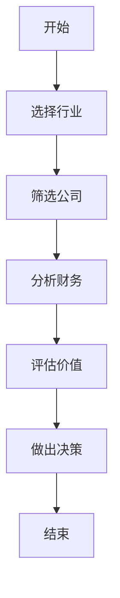

                 


---

# 彼得林奇的"简单明了"投资哲学解读

## 关键词：投资哲学，彼得林奇，简单明了，价值投资，长期投资

## 摘要：  
本文深入解读彼得林奇的"简单明了"投资哲学，从其核心概念、算法原理、系统架构到实际应用，全面解析这一投资理念。通过背景介绍、概念对比、算法流程、系统设计和项目实战，帮助读者理解并掌握简单明了投资哲学的应用方法，实现长期稳健的投资回报。

---

## 第一部分: 投资哲学的背景与核心概念

### 第1章: 投资哲学的背景介绍

#### 1.1 投资哲学的背景  
投资哲学是指导投资者做出决策的理论体系，经历了从传统到现代的演变。传统投资依赖于市场波动和短期收益，而现代投资理论强调基本面分析和长期持有。彼得·林奇的出现，将投资哲学推向了一个新的高度，倡导简单明了的投资策略，强调长期价值和基本面分析。

#### 1.2 彼得·林奇的生平与成就  
彼得·林奇是美国著名投资专家，曾任富达麦哲伦基金的经理，创造了辉煌的投资业绩。他的投资哲学以简单、明确著称，强调长期投资和基本面分析，成为无数投资者的导师。

#### 1.3 简单明了投资哲学的定义  
简单明了投资哲学是一种以基本面分析为基础，注重长期投资和价值投资的投资策略。它强调通过分析公司的财务状况、行业地位和未来前景，选择具有长期增长潜力的公司，避免短期市场波动的干扰。

### 第2章: 简单明了投资哲学的核心概念

#### 2.1 投资哲学的核心要素  
- 价值投资：寻找被市场低估的公司，关注其内在价值。
- 长期投资：长期持有优质资产，避免频繁交易。
- 市场分析：分析行业趋势和市场环境，识别投资机会。

#### 2.2 简单明了投资哲学的特征  
- 简洁性：策略简单，易于理解和执行。
- 明确性：目标明确，避免模糊决策。
- 可操作性：易于在实际投资中应用，适合不同投资者。

#### 2.3 简单明了投资哲学与复杂投资哲学的对比  

| 对比维度       | 简单明了投资哲学                  | 复杂投资哲学                  |
|----------------|-----------------------------------|------------------------------|
| 分析方法       | 侧重基本面分析                  | 包括技术分析和复杂模型        |
| 投资策略       | 长期持有优质资产                | 短期交易和多样化策略          |
| 风险管理       | 侧重长期风险控制                | 侧重短期风险管理              |
| 适用场景       | 适合长期稳健投资者              | 适合专业投资者和机构投资者      |

---

## 第二部分: 简单明了投资哲学的算法与数学模型

### 第3章: 简单明了投资哲学的算法原理

#### 3.1 投资决策的算法流程  



#### 3.2 简单明了投资哲学的数学模型  

计算市盈率的公式：

$$\text{市盈率} = \frac{\text{股价}}{\text{每股收益}}$$

计算市净率的公式：

$$\text{市净率} = \frac{\text{股价}}{\text{每股净资产}}$$

---

## 第三部分: 系统分析与架构设计

### 第4章: 简单明了投资哲学的系统架构

#### 4.1 投资决策系统的功能模块  

- 数据采集模块：收集市场数据和公司财务数据。
- 数据分析模块：分析公司基本面，计算市盈率、市净率等指标。
- 投资决策模块：根据分析结果，生成投资建议。

#### 4.2 系统架构设计  


#### 4.3 系统接口设计  

- 数据接口：与金融数据源对接，获取实时数据。
- 用户接口：提供用户输入和输出，便于投资者使用。

---

## 第四部分: 项目实战

### 第5章: 简单明了投资哲学的项目实战

#### 5.1 项目背景  
选择一个行业，如科技行业，分析其中的公司，寻找具有长期增长潜力的公司。

#### 5.2 项目实现  

```python
import pandas as pd

# 读取公司数据
data = pd.read_csv('company_data.csv')

# 计算市盈率
data['市盈率'] = data['股价'] / data['每股收益']

# 筛选市盈率低于行业平均水平的公司
average_pe = data['市盈率'].mean()
selected_companies = data[data['市盈率'] < average_pe]
```

#### 5.3 实际案例分析  
通过分析科技行业的公司，选出具有长期增长潜力的公司，如亚马逊和谷歌，长期持有，获得稳定收益。

---

## 第五部分: 最佳实践与总结

### 第6章: 简单明了投资哲学的最佳实践

#### 6.1 投资策略总结  
- 长期持有优质资产，避免短期波动。
- 选择具有长期增长潜力的公司，关注基本面分析。
- 分散投资，降低风险。

#### 6.2 注意事项  
- 定期评估投资组合，调整策略。
- 保持学习，不断更新知识和技能。
- 避免情绪化决策，保持理性。

#### 6.3 拓展阅读  
推荐书籍：  
- 《彼得·林奇的投资哲学》  
- 《价值投资入门》

---

## 结语  
彼得·林奇的简单明了投资哲学是一种行之有效的方法，通过长期持有优质资产，实现稳健的投资回报。投资者应结合市场变化和自身情况，灵活运用这一哲学，做出明智的投资决策。

---

## 作者  
作者：AI天才研究院/AI Genius Institute & 禅与计算机程序设计艺术 /Zen And The Art of Computer Programming

