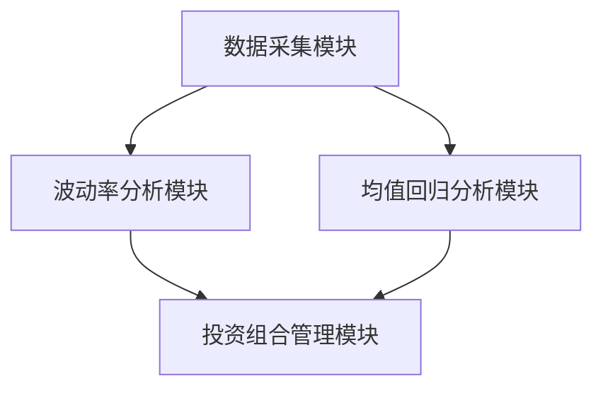

                 


# 彼得林奇的"耐心投资"在市场短期波动中的执行策略

> **关键词**：彼得林奇，耐心投资，市场波动，投资策略，算法模型

> **摘要**：本文探讨了彼得林奇的耐心投资理念在市场短期波动中的应用策略。通过分析市场波动的特征，结合耐心投资的核心要素，提出了在短期波动中执行耐心投资的具体方法。文章还结合数学模型和算法原理，详细阐述了如何在短期波动中实现长期投资目标。

---

## 第一部分：彼得林奇投资理念概述

### 第1章：彼得林奇投资理念的核心要素

#### 1.1 彼得林奇投资理念的起源与背景

- **彼得林奇的个人投资经历**
  - 彼得林奇是著名的投资家，曾管理富达麦哲伦基金，创造了长期稳定的超额收益。
  - 他强调长期投资，注重公司基本面分析，避免短期市场波动的干扰。

- **耐心投资的定义与内涵**
  - 耐心投资是指在选择优质企业后，长期持有，不因短期市场波动而改变投资策略。
  - 强调企业内在价值，而非市场情绪或短期价格波动。

- **耐心投资与短期波动的关系**
  - 短期波动是市场的一部分，耐心投资的核心是通过长期持有优质资产，抵御短期波动的影响。
  - 在短期波动中，耐心投资需要结合市场环境和企业基本面进行动态调整。

#### 1.2 短期波动中的投资者行为分析

- **投资者情绪对市场波动的影响**
  - 短期波动往往由市场情绪驱动，如恐慌性抛售或过度乐观的买入行为。
  - 投资者情绪的非理性放大了短期波动，但优质资产的长期价值不会因此改变。

- **羊群效应与市场波动的关系**
  - 羊群效应是指投资者盲目跟随市场潮流，导致市场波动加剧。
  - 耐心投资需要避免羊群效应，坚持独立思考和长期价值判断。

- **短期波动中的决策误区**
  - 过度关注短期收益，忽视长期价值。
  - 在市场波动中频繁交易，增加交易成本和税务负担。

---

## 第二部分：耐心投资策略的系统性分析

### 第2章：耐心投资策略的核心要素

#### 2.1 耐心投资的选股标准

- **公司基本面分析**
  - 财务健康：关注企业的盈利能力、资产负债情况和现金流状况。
  - 行业地位：选择行业龙头或具有竞争优势的企业。
  - 管理团队：优秀的管理层能够带领企业持续发展。

- **行业地位与竞争优势**
  - 行业龙头通常具有更强的市场影响力和抗风险能力。
  - 竞争优势包括技术壁垒、成本优势、品牌影响力等。

- **财务健康状况评估**
  - 关注企业的盈利能力、负债水平和现金流情况。
  - 财务健康的企业能够在市场波动中保持稳定。

#### 2.2 耐心投资的组合管理策略

- **投资组合的构建原则**
  - 分散投资：避免过度集中于单一行业或资产。
  - 长期持有：选择优质资产，长期持有，减少频繁交易。
  - 定期复盘：定期审视投资组合，根据市场变化和企业基本面进行调整。

- **风险分散与收益平衡**
  - 通过分散投资降低风险，同时追求长期收益。
  - 在市场波动中，保持投资组合的稳定性。

- **定期复盘与调整机制**
  - 定期审视投资组合，评估企业的基本面变化。
  - 根据市场环境和企业情况调整投资组合。

---

## 第三部分：数学模型与算法原理

### 第3章：市场波动预测的数学模型

#### 3.1 市场波动预测的算法选择

- **时间序列分析**
  - 使用ARIMA（自回归积分滑动平均模型）预测未来的价格走势。
  - 通过历史数据建立模型，预测未来波动。

- **随机游走模型**
  - 假设市场价格的变化是随机的，无法通过历史数据预测未来走势。
  - 适用于短期市场波动的随机性特征。

- **均值回归与波动率分析**
  - 均值回归假设市场价格会回归长期均值。
  - 波动率分析通过历史波动率预测未来波动幅度。

#### 3.2 基于彼得林奇理念的算法实现

- **算法原理概述**
  - 结合市场波动预测和长期价值判断，制定投资策略。
  - 在市场波动中，优先选择基本面良好的资产。

- **算法实现步骤**
  1. 数据收集：收集历史价格数据和财务数据。
  2. 波动率计算：计算历史波动率，判断当前波动是否异常。
  3. 均值回归分析：判断价格是否偏离长期均值。
  4. 选股策略：选择基本面良好且价格接近长期均值的资产。
  5. 投资组合调整：根据波动率和均值回归分析结果调整投资组合。

---

## 第四部分：系统架构与项目实战

### 第4章：系统架构设计

#### 4.1 系统功能设计

- **数据采集模块**
  - 收集历史价格数据和财务数据。
  - 数据来源包括股票市场数据 API 和财务报表。

- **波动率分析模块**
  - 计算历史波动率，判断当前波动是否异常。
  - 使用时间序列分析预测未来波动。

- **均值回归分析模块**
  - 判断价格是否偏离长期均值。
  - 通过 ARIMA 模型预测未来价格走势。

- **投资组合管理模块**
  - 根据波动率和均值回归结果调整投资组合。
  - 选择基本面良好且价格接近长期均值的资产。

#### 4.2 系统架构图



---

## 第五部分：项目实战

### 第5章：项目实战

#### 5.1 环境安装

- **Python环境**
  - 安装 Python 和必要的库，如 pandas、numpy、scipy、matplotlib 和 statsmodels。

#### 5.2 核心代码实现

- **数据采集模块**
  ```python
  import pandas as pd
  import requests

  def get_stock_data(ticker, start_date, end_date):
      url = f'https://api.example.com/stock_data? ticker={ticker}&start={start_date}&end={end_date}'
      response = requests.get(url)
      data = response.json()
      df = pd.DataFrame(data)
      return df
  ```

- **波动率计算模块**
  ```python
  import numpy as np

  def calculate_volatility(prices):
      returns = np.log(prices.pct_change().dropna())
      volatility = returns.std() * np.sqrt(252)
      return volatility
  ```

- **均值回归分析模块**
  ```python
  from statsmodels.tsa.arima_model import ARIMA

  def predict_prices(prices, order=(1, 1, 1)):
      model = ARIMA(prices, order=order)
      model_fit = model.fit()
      forecast = model_fit.forecast(steps=10)
      return forecast
  ```

---

## 第六部分：最佳实践与总结

### 第6章：最佳实践与总结

#### 6.1 小结

- 耐心投资的核心是选择优质资产，长期持有。
- 在短期波动中，通过基本面分析和波动率预测，优化投资组合。
- 系统化的方法和纪律性的执行是实现长期投资目标的关键。

#### 6.2 注意事项

- 短期波动是市场的一部分，但不应影响长期投资决策。
- 在市场波动中，避免情绪化交易，坚持价值投资。
- 定期审视投资组合，根据市场变化和企业基本面进行调整。

#### 6.3 拓展阅读

- 彼得林奇的《投资之道》
- 投资学经典教材：《投资学》（如《投资学》（中文版））

---

**作者：AI天才研究院/AI Genius Institute & 禅与计算机程序设计艺术 /Zen And The Art of Computer Programming**

