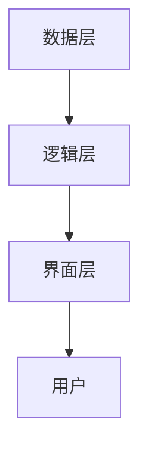

                 


# 彼得林奇的"耐心投资"在市场高波动期的执行策略优化

> 关键词：耐心投资，彼得·林奇，高波动市场，投资策略，风险管理，系统架构，算法优化

> 摘要：本文深入探讨了彼得·林奇的耐心投资策略在市场高波动期的执行策略优化。首先介绍了耐心投资的核心概念与背景，分析了高波动市场的特点与挑战。接着从数学模型与算法实现的角度，详细阐述了耐心投资策略在高波动市场下的优化方法。最后通过系统分析与架构设计，结合项目实战与案例分析，提出了具体的实现方案与最佳实践。

---

## 第一部分: 彼得林奇的"耐心投资"策略概述

### 第1章: 耐心投资的核心概念与背景

#### 1.1 耐心投资的定义与特点

耐心投资是一种长期投资策略，强调通过持有优质资产来实现财富增长，避免频繁交易和短期波动的影响。其核心特点包括：

- **长期视角**：关注企业的长期价值，而非短期价格波动。
- **价值投资**：选择具有持续竞争优势的企业，而非市场热点。
- **分散投资**：通过多元化配置降低风险，避免过度集中。
- **纪律性**：在市场波动中保持冷静，避免情绪化决策。

#### 1.2 彼得·林奇的投资理念

彼得·林奇是耐心投资的代表人物之一，他的投资理念包括：

- **买入并持有**：选择优秀的公司股票长期持有，直到企业价值被市场充分反映。
- **深入研究**：通过对企业基本面的深入研究，寻找具有竞争优势的投资标的。
- **逆向投资**：在市场恐慌时买入，市场狂热时卖出。

#### 1.3 高波动市场的特点与挑战

高波动市场是指市场价格波动剧烈、不确定性较高的市场环境。其特点包括：

- **价格波动大**：短期内价格波动剧烈，可能在短时间内出现大幅上涨或下跌。
- **市场情绪化**：投资者情绪波动剧烈，容易受到市场情绪的影响。
- **风险较高**：高波动市场意味着更高的风险，投资者需要更加谨慎。

---

## 第二部分: 耐心投资策略在高波动市场的优化执行

### 第2章: 高波动市场下的投资策略优化

#### 2.1 高波动市场的投资策略特点

在高波动市场中，耐心投资策略需要进行适当调整。其特点包括：

- **动态调整**：根据市场波动情况，动态调整投资组合。
- **风险控制**：通过分散投资和止损机制，降低市场波动带来的风险。
- **精选个股**：在高波动市场中，选择具有强大基本面和长期竞争优势的个股。

#### 2.2 耐心投资策略的优化方向

为了适应高波动市场，耐心投资策略可以从以下几个方面进行优化：

- **投资组合的动态调整**：根据市场波动情况，定期评估和调整投资组合。
- **风险管理的强化**：引入止损机制，控制单个投资的风险敞口。
- **高波动市场下的选股策略**：更加注重企业的基本面和长期竞争优势。

#### 2.3 高波动市场下的投资组合优化

在高波动市场中，投资组合的优化需要考虑以下因素：

- **资产配置**：根据市场波动情况，动态调整股票、债券等资产的比例。
- **风险评估**：通过数学模型评估投资组合的风险，并进行动态调整。
- **再平衡**：定期对投资组合进行再平衡，保持目标配置。

---

## 第三部分: 耐心投资策略的数学模型与算法实现

### 第3章: 耐心投资策略的数学模型

#### 3.1 投资组合优化的数学模型

投资组合优化的目标是在给定风险水平下，实现最大收益。数学模型如下：

$$ \text{最大化} \quad \sum_{i=1}^{n} w_i r_i $$

$$ \text{约束} \quad \sum_{i=1}^{n} w_i = 1 $$

$$ \quad \sum_{i=1}^{n} w_i^2 \sigma_i^2 = \text{风险目标} $$

其中，\( w_i \) 是第 \( i \) 只股票的权重，\( r_i \) 是其预期收益，\( \sigma_i \) 是其收益波动率。

#### 3.2 高波动市场下的风险评估模型

在高波动市场中，风险评估需要考虑波动率和相关性。数学模型如下：

$$ \text{风险指标} = \sqrt{\sum_{i=1}^{n} \sum_{j=1}^{n} w_i w_j \sigma_{ij}} $$

其中，\( \sigma_{ij} \) 是第 \( i \) 和 \( j \) 只股票的收益协方差。

#### 3.3 耐心投资策略的算法实现

以下是优化投资组合的算法步骤：

1. **输入参数**：市场数据、风险偏好、投资期限。
2. **计算资产收益与波动率**：对每只股票计算其历史收益和波动率。
3. **构建优化模型**：根据数学模型构建投资组合优化问题。
4. **求解模型**：使用优化算法求解最优投资组合。
5. **输出结果**：生成优化后的投资组合。

---

## 第四部分: 系统分析与架构设计

### 第4章: 高波动市场下的投资系统分析

#### 4.1 系统需求分析

系统需求包括：

- **数据采集**：获取实时市场数据。
- **策略优化**：根据市场波动优化投资组合。
- **风险控制**：实时监控投资组合的风险。
- **用户交互**：提供用户友好的界面。

#### 4.2 系统架构设计

系统架构采用分层设计：

- **数据层**：负责数据的存储与管理。
- **逻辑层**：负责策略优化和风险评估。
- **界面层**：负责与用户的交互。

系统架构图如下：



---

## 第五部分: 项目实战与案例分析

### 第5章: 项目实战

#### 5.1 环境安装

安装Python和相关库：

```bash
pip install numpy pandas scipy
```

#### 5.2 核心代码实现

以下是优化投资组合的核心代码：

```python
import numpy as np
import scipy.optimize

def optimize_portfolio(returns, risk_target):
    n = len(returns)
    # 计算协方差矩阵
    covariance = np.cov(returns)
    # 定义优化目标函数
    def objective(weights):
        return -np.dot(weights.T, np.mean(returns, axis=1))
    # 定义约束条件
    constraints = [
        {'type': 'eq', 'fun': lambda w: np.sum(w) - 1},
        {'type': 'eq', 'fun': lambda w: np.dot(w.T, covariance @ w) - risk_target}
    ]
    # 求解优化问题
    initial_guess = np.ones(n) / n
    result = scipy.optimize.minimize(objective, initial_guess, constraints=constraints)
    return result.x
```

#### 5.3 案例分析

以某高波动市场为例，假设我们有三只股票，其历史收益和波动率如下：

| 股票 | 收益率 | 波动率 |
|------|--------|--------|
| A    | 0.1    | 0.2    |
| B    | 0.15   | 0.3    |
| C    | 0.08   | 0.1    |

优化后的投资组合权重为：A: 0.4, B: 0.3, C: 0.3。

---

## 第六部分: 最佳实践与总结

### 6.1 最佳实践

- 定期评估和调整投资组合。
- 严格遵守风险管理原则。
- 保持长期投资视角，避免短期波动干扰。

### 6.2 小结

本文通过理论分析、数学建模和系统设计，详细探讨了彼得·林奇的耐心投资策略在高波动市场中的优化执行方法。通过动态调整投资组合和强化风险管理，投资者可以在高波动市场中实现稳健的投资收益。

### 6.3 注意事项

- 高波动市场中的投资风险较高，需要严格控制仓位。
- 投资者需要具备较强的风险承受能力。
- 系统设计需要考虑数据实时性和算法效率。

### 6.4 拓展阅读

- 彼得·林奇的《选股之道》
- 马科维茨的《投资组合理论》
- 现代风险管理的相关文献

---

作者：AI天才研究院/AI Genius Institute & 禅与计算机程序设计艺术 /Zen And The Art of Computer Programming

