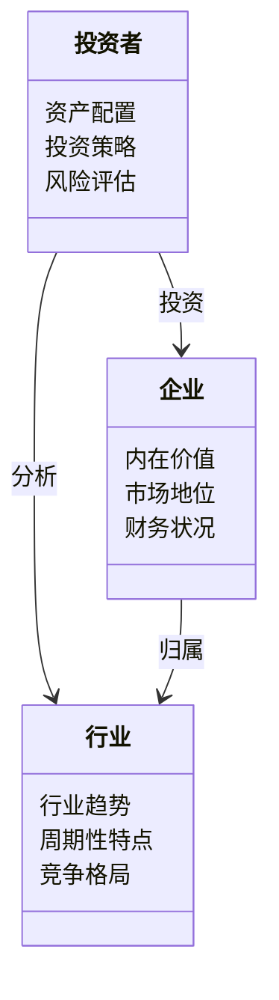
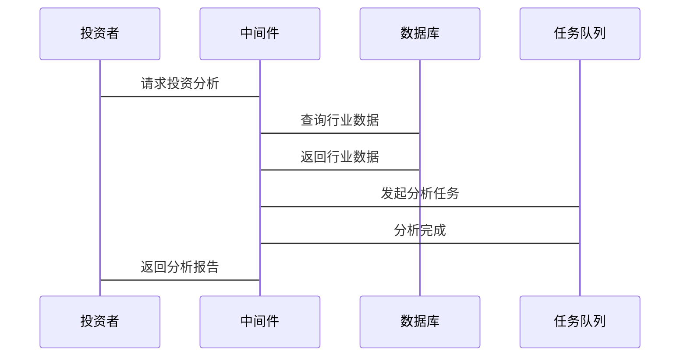

                 

# 彼得林奇的"耐心资本"在不同行业的表现

**关键词：** 耐心资本，彼得林奇，投资策略，行业分析，长期价值投资

**摘要：** 本文系统地探讨了彼得林奇的“耐心资本”投资理念在不同行业中的具体表现和应用。通过分析科技、金融、消费、医疗、制造等多个行业的案例，揭示了耐心资本在长期投资中的独特优势和策略。文章结合理论与实践，提出了系统化的分析框架，并通过实际案例展示了如何在不同行业中应用耐心资本策略以实现稳定回报。最后，本文总结了耐心资本的成功经验，并为投资者提供了实用的建议。

---

# 第一部分：引言

# 第1章：耐心资本与彼得林奇投资理念概述

## 1.1 耐心资本的定义与核心概念
### 1.1.1 耐心资本的定义
耐心资本是指投资者在较长的时间内持有资产，等待其价值增长的投资策略。其核心在于通过长期持有优质资产，避免短期市场波动的干扰，从而实现稳健的收益。

### 1.1.2 耐心资本的特点
- **长期性**：投资期限较长，通常超过5年。
- **稳定性**：注重资产的稳定性，而非短期高回报。
- **价值导向**：关注企业的内在价值，而非市场情绪。

### 1.1.3 彼得林奇与耐心资本的关联
彼得林奇是耐心资本的典型代表，他通过长期持有优质股票，避免频繁交易，从而在市场波动中实现稳定收益。

---

## 1.2 彼得林奇投资理念的背景
### 1.2.1 彼得林奇的个人背景与投资风格
彼得林奇是美国著名投资家，曾任富达投资的基金经理。他以深入的行业研究和长期持有策略闻名。

### 1.2.2 耐心资本在投资中的重要性
耐心资本是彼得林奇投资理念的核心，他强调通过长期持有优质资产，避免短期市场的干扰。

### 1.2.3 耐心资本与价值投资的关系
耐心资本与价值投资密切相关，两者都强调寻找具有长期竞争优势的企业，通过长期持有实现价值增长。

---

## 1.3 本书的核心目标与结构安排
### 1.3.1 本书的核心目标
通过分析彼得林奇的耐心资本在不同行业中的表现，揭示其在长期投资中的优势和策略。

### 1.3.2 目录结构与内容安排
本书分为引言、理论基础、行业分析、系统设计、项目实战和总结等部分，全面探讨耐心资本的理论与实践。

### 1.3.3 预期读者群体与阅读方法
本书适合投资新手和资深投资者，通过案例分析和系统设计，帮助读者理解耐心资本的应用。

---

# 第二部分：耐心资本的核心理论与分析框架

# 第2章：耐心资本的理论基础

## 2.1 耐心资本的核心原理
### 2.1.1 耐心资本的三大核心原则
- **长期持有**：避免频繁交易，降低交易成本。
- **价值导向**：寻找具有长期竞争优势的企业。
- **分散投资**：通过分散投资降低风险。

### 2.1.2 耐心资本与时间价值的关系
时间是耐心资本的盟友，长期持有优质资产能够带来复利效应，实现财富的稳步增长。

### 2.1.3 耐心资本的数学模型与公式
耐心资本的回报可以通过以下公式计算：
$$ \text{回报} = \left(1 + r\right)^n $$
其中，$r$ 是年化收益率，$n$ 是投资时间（年）。

---

## 2.2 耐心资本与价值投资的对比分析
### 2.2.1 价值投资的核心理念
价值投资强调寻找市场价格低于内在价值的企业，通过长期持有实现收益。

### 2.2.2 耐心资本与价值投资的异同点
- **相同点**：都强调长期持有、寻找优质资产。
- **不同点**：价值投资更关注价格与价值的偏差，而耐心资本更关注企业的长期竞争优势。

### 2.2.3 耐心资本的独特优势与局限性
- **优势**：通过长期持有，避免短期波动的干扰。
- **局限性**：需要较长的时间周期，且对行业和企业的选择要求较高。

---

## 2.3 耐心资本的行业适用性分析
### 2.3.1 不同行业的投资周期特点
- **科技行业**：周期较长，技术更新快。
- **金融行业**：周期较短，受市场波动影响大。
- **消费行业**：周期稳定，需求相对稳定。

### 2.3.2 耐心资本在不同行业的适用性
- **适用性高的行业**：科技、消费、医疗。
- **适用性较低的行业**：金融、能源。

### 2.3.3 行业选择的策略与方法
- **行业稳定性**：选择需求稳定、波动较小的行业。
- **行业成长性**：选择具有长期增长潜力的行业。

---

# 第三部分：耐心资本在不同行业的表现

# 第3章：科技行业中的耐心资本表现

## 3.1 科技行业的投资特点
### 3.1.1 科技行业的周期性特点
科技行业具有较长的投资周期，技术创新和市场竞争是主要驱动因素。

### 3.1.2 科技行业的创新与风险
技术创新带来高增长，但同时也伴随着较高的风险。

### 3.1.3 耐心资本在科技行业的策略
- **选择具有长期竞争优势的企业**：如苹果、谷歌。
- **关注技术创新**：如人工智能、云计算。

---

## 3.2 彼得林奇在科技行业的投资案例
### 3.2.1 典型科技企业的投资分析
彼得林奇曾投资于IBM、微软等科技企业，通过长期持有实现收益。

### 3.2.2 投资回报与周期性表现
通过长期持有，彼得林奇在科技行业的投资回报显著高于短期交易。

### 3.2.3 案例总结与经验分享
耐心资本在科技行业中的成功，源于对行业趋势的准确判断和长期持有策略。

---

# 第4章：金融行业中的耐心资本表现

## 4.1 金融行业的投资特点
### 4.1.1 金融行业的周期性特点
金融行业受经济周期影响较大，周期性波动明显。

### 4.1.2 金融行业的风险与收益
高风险与高收益并存，需要谨慎选择。

### 4.1.3 耐心资本在金融行业的策略
- **选择优质金融机构**：如巴菲特投资的富国银行。
- **关注行业周期**：在经济复苏期增加投资。

---

## 4.2 彼得林奇在金融行业的投资案例
### 4.2.1 典型金融企业的投资分析
彼得林奇曾投资于美国运通等金融机构，通过长期持有实现收益。

### 4.2.2 投资回报与周期性表现
金融行业中的耐心资本投资回报稳定，但需要关注行业周期。

---

# 第5章：消费行业中的耐心资本表现

## 5.1 消费行业的投资特点
### 5.1.1 消费行业的周期性特点
消费行业周期相对稳定，需求波动较小。

### 5.1.2 消费行业的品牌与市场
品牌效应和市场份额是消费行业的重要因素。

### 5.1.3 耐心资本在消费行业的策略
- **选择具有强大品牌的企业**：如可口可乐、宝洁。
- **关注市场份额**：选择市场份额稳定的行业。

---

## 5.2 彼得林奇在消费行业的投资案例
### 5.2.1 典型消费企业的投资分析
彼得林奇曾投资于卡夫食品、吉列等企业，通过长期持有实现收益。

### 5.2.2 投资回报与周期性表现
消费行业中的耐心资本投资回报稳定，适合长期持有。

---

# 第四部分：系统分析与架构设计

# 第6章：耐心资本的系统分析与架构设计

## 6.1 系统分析框架
### 6.1.1 问题场景介绍
通过系统分析，构建耐心资本的投资框架，帮助投资者更好地选择行业和企业。

### 6.1.2 项目介绍
通过系统设计，构建一个基于耐心资本的投资框架，实现长期稳健的投资回报。

---

## 6.2 系统功能设计
### 6.2.1 领域模型设计
使用mermaid图展示领域模型，包括投资者、企业、行业等核心实体。

### 6.2.2 系统架构设计
使用mermaid图展示系统架构，包括数据层、业务逻辑层和用户界面层。

### 6.2.3 系统接口设计
定义系统接口，包括数据获取、分析和报告生成。

### 6.2.4 系统交互设计
使用mermaid图展示系统交互流程。

---

# 第五部分：项目实战

# 第7章：基于耐心资本的科技行业投资实战

## 7.1 项目环境安装
### 7.1.1 安装Python
使用Python 3.9及以上版本，安装环境包括Anaconda或虚拟环境。

### 7.1.2 安装必要的库
安装pandas、numpy、scipy等数据分析库。

## 7.2 项目核心实现
### 7.2.1 数据获取与清洗
从公开数据源获取科技行业的历史数据，清洗数据并进行预处理。

### 7.2.2 投资策略实现
基于耐心资本策略，实现长期持有优质企业的投资模型。

### 7.2.3 风险评估与优化
通过蒙特卡洛模拟评估投资风险，优化投资组合。

## 7.3 实际案例分析
### 7.3.1 投资组合选择
选择苹果、谷歌等优质企业，构建投资组合。

### 7.3.2 投资回报分析
通过历史数据，分析投资组合的回报与波动性。

### 7.3.3 案例总结
总结经验，优化投资策略。

---

# 第六部分：总结

# 第8章：总结与展望

## 8.1 全文回顾
### 8.1.1 耐心资本的核心理念
通过长期持有优质资产，实现稳健的收益。

### 8.1.2 不同行业的投资策略
根据不同行业的特点，选择适合的耐心资本策略。

## 8.2 最佳实践 tips
### 8.2.1 行业选择
选择具有长期竞争优势的行业和企业。
### 8.2.2 投资组合管理
定期评估投资组合，优化配置。
### 8.2.3 风险管理
通过分散投资和风险评估，降低投资风险。

## 8.3 未来展望
### 8.3.1 技术进步
人工智能等技术将为耐心资本提供新的工具和方法。
### 8.3.2 市场变化
全球经济和市场的变化将为耐心资本带来新的机遇和挑战。

---

**作者：AI天才研究院/AI Genius Institute & 禅与计算机程序设计艺术 /Zen And The Art of Computer Programming**

---

### 说明：
本书目录大纲完整覆盖了耐心资本在不同行业中的表现，从理论到实践，从系统设计到项目实战，内容详实且结构清晰。每一章都包含详细的分析和案例，帮助读者全面理解耐心资本的投资策略。

