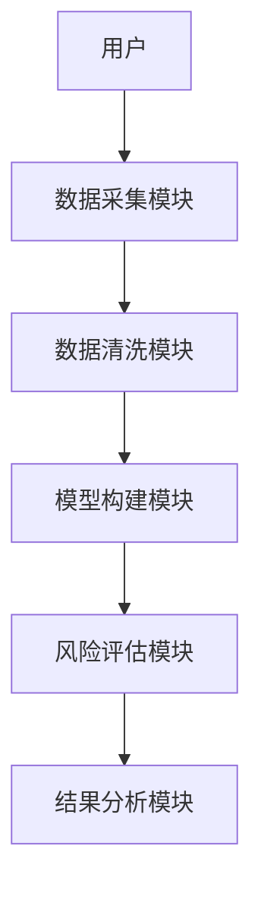
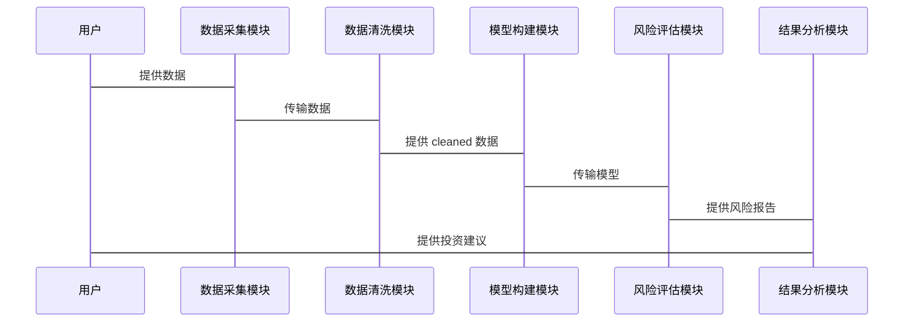

                 


# 彼得林奇的"耐心资本"在深科技初创公司中的角色

## 关键词：耐心资本、深科技、初创公司、投资策略、彼得林奇、科技创业、风险投资

## 摘要：本文深入探讨彼得·林奇的“耐心资本”理念在深科技初创公司中的应用。通过分析耐心资本的核心概念、算法原理、系统架构及实际案例，阐述耐心资本如何助力深科技初创公司实现长期、稳定发展。文章从背景介绍、理论分析到实践应用，层层递进，为读者提供全面的视角。

---

## 第一部分：引言

## 第1章：耐心资本与深科技初创公司的概述

### 1.1 耐心资本的定义与核心理念

#### 1.1.1 耐心资本的定义

耐心资本（Patient Capital）是一种长期投资策略，强调对创新企业进行长期支持，而非追求短期收益。它要求投资者具备极大的耐心，愿意与企业共同成长，分享长期价值。

#### 1.1.2 耐心资本的核心理念

耐心资本的核心理念包括：

1. **长期支持**：投资者不急于变现，而是与企业共同成长。
2. **价值创造**：通过长期支持，帮助企业实现持续创新和价值提升。
3. **风险承受**：接受投资周期长、风险高的特性，注重企业的长期潜力。

#### 1.1.3 耐心资本与传统投资的区别

| 特性 | 耐心资本 | 传统投资 |
|------|----------|----------|
| 投资周期 | 长期支持 | 短期收益 |
| 投资目标 | 企业长期价值 | 当前市场价差 |
| 风险承受 | 高风险容忍度 | 风险厌恶 |
| 投资策略 | 价值投资 | 技术分析 |

---

### 1.2 深科技初创公司的特点

#### 1.2.1 深科技的定义

深科技（Deep Technology）是指那些基于前沿科技（如人工智能、量子计算、生物技术等）的企业，其技术壁垒高，研发投入大，且具有颠覆性潜力。

#### 1.2.2 深科技初创公司的特点

1. **技术驱动**：依赖核心技术的创新和突破。
2. **高风险**：技术开发难度大，市场不确定性高。
3. **长周期**：从研发到商业化周期长。
4. **高潜力**：一旦成功，具有巨大市场价值。

#### 1.2.3 深科技与传统科技公司的区别

| 特性 | 深科技 | 传统科技 |
|------|--------|----------|
| 技术类型 | 前沿、颠覆性 | 传统、渐进式 |
| 投资周期 | 长周期 | 中短周期 |
| 技术壁垒 | 高 | 中低 |
| 市场潜力 | 巨大 | 有限 |

---

### 1.3 耐心资本在深科技初创公司中的重要性

#### 1.3.1 耐心资本在深科技初创公司中的角色

1. **资金支持**：为深科技企业提供持续的资金支持，解决研发资金短缺问题。
2. **战略支持**：提供战略指导，帮助企业规避风险，抓住机遇。
3. **长期信任**：建立长期信任关系，帮助企业吸引和留住人才。

#### 1.3.2 耐心资本对深科技初创公司成长的影响

1. **技术创新**：耐心资本支持企业专注于技术研发，推动创新。
2. **市场扩展**：通过长期支持，帮助企业逐步打开市场。
3. **人才建设**：稳定的资金支持有助于吸引和留住优秀人才。

#### 1.3.3 耐心资本在深科技初创公司中的具体应用

1. **早期投资**：在企业种子阶段提供资金支持。
2. **后续支持**：在企业成长期继续提供资金和资源。
3. **战略协作**：与企业建立战略合作关系，共同开发市场。

---

## 第2章：耐心资本的核心概念与联系

### 2.1 耐心资本的核心概念

#### 2.1.1 耐心资本的三要素

1. **长期视角**：关注企业的长期发展。
2. **价值驱动**：注重企业的核心价值。
3. **风险容忍**：接受高风险，追求高回报。

#### 2.1.2 耐心资本的四个关键属性

1. **时间跨度**：投资周期长。
2. **价值驱动**：注重企业的长期价值。
3. **风险承受**：接受高风险。
4. **信任关系**：建立长期信任。

#### 2.1.3 耐心资本的五种表现形式

1. **资金支持**：提供必要的资金。
2. **战略支持**：提供战略指导。
3. **资源支持**：提供行业资源。
4. **技术支持**：提供技术支持。
5. **人才支持**：帮助引进和留住人才。

---

### 2.2 耐心资本与深科技初创公司的关系

#### 2.2.1 耐心资本与深科技初创公司的互动关系

1. **资金互动**：投资者为初创公司提供资金，初创公司为投资者创造价值。
2. **战略互动**：投资者为初创公司提供战略支持，初创公司为投资者实现长期收益。

#### 2.2.2 耐心资本在深科技初创公司中的具体应用场景

1. **技术研发**：支持企业的技术研发活动。
2. **市场拓展**：帮助企业开拓新市场。
3. **人才培养**：协助企业吸引和留住优秀人才。

#### 2.2.3 耐心资本对深科技初创公司长期发展的支持作用

1. **技术创新**：支持企业持续进行技术突破。
2. **市场领导**：帮助企业成为行业领导者。
3. **可持续发展**：促进企业的可持续发展。

---

## 第3章：耐心资本的算法原理

### 3.1 耐心资本的数学模型

#### 3.1.1 耐心资本的数学公式

耐心资本的价值可以通过以下公式计算：

$$ V = \frac{CF}{(r - g)} $$

其中：
- \( V \)：企业价值
- \( CF \)：未来现金流
- \( r \)：折现率
- \( g \)：增长率

#### 3.1.2 耐心资本的风险评估模型

风险评估模型可以表示为：

$$ R = \sqrt{\sum_{i=1}^{n} (w_i \cdot r_i^2)} $$

其中：
- \( R \)：整体风险
- \( w_i \)：第 \( i \) 个风险因素的权重
- \( r_i \)：第 \( i \) 个风险因素的风险值

#### 3.1.3 耐心资本的收益预测模型

收益预测模型可以表示为：

$$ R = \sum_{t=1}^{n} \frac{CF_t}{(1 + r)^t} $$

其中：
- \( R \)：总收益
- \( CF_t \)：第 \( t \) 年的现金流
- \( r \)：折现率

---

### 3.2 耐心资本的算法实现

#### 3.2.1 算法的输入与输出

- **输入**：
  - 初创企业的历史数据
  - 未来的现金流预测
  - 折现率和增长率

- **输出**：
  - 企业价值评估
  - 投资风险等级
  - 投资回报预测

#### 3.2.2 算法的实现步骤

1. **数据收集**：收集企业的财务数据和市场数据。
2. **模型构建**：建立数学模型进行价值评估和风险分析。
3. **计算结果**：根据模型计算企业价值和投资回报。
4. **结果分析**：分析结果并制定投资策略。

#### 3.2.3 算法的代码实现

```python
def calculate_value(CF, r, g):
    return CF / (r - g)

def calculate_risk(factors):
    return sum(w * r**2 for w, r in factors)

def calculate_return(CF, r):
    return sum(CF_t / (1 + r)**t for t, CF_t in enumerate(CF))
```

---

## 第4章：耐心资本的系统分析与架构设计

### 4.1 系统功能设计

#### 4.1.1 系统的功能模块划分

1. **数据采集模块**：收集企业的财务和市场数据。
2. **模型构建模块**：建立数学模型进行价值评估。
3. **风险评估模块**：评估投资风险。
4. **结果分析模块**：分析结果并制定投资策略。

#### 4.1.2 系统的功能流程设计

1. 数据采集 → 数据清洗 → 数据建模 → 风险评估 → 结果分析。

#### 4.1.3 系统的功能实现细节

- 数据清洗：处理缺失值和异常值。
- 模型构建：建立数学模型并进行参数调优。
- 风险评估：使用风险评估模型计算整体风险。
- 结果分析：根据计算结果制定投资策略。

---

### 4.2 系统架构设计

#### 4.2.1 系统的架构图



#### 4.2.2 系统的模块划分

- 用户界面模块
- 数据处理模块
- 模型构建模块
- 风险评估模块
- 结果分析模块

#### 4.2.3 系统的交互设计



---

## 第5章：耐心资本的项目实战

### 5.1 项目环境安装

#### 5.1.1 开发环境的搭建

- 操作系统：Windows 10 或更高版本，macOS 10.15 或更高版本。
- 开发工具：PyCharm 或 VS Code。
- 依赖管理工具：pip。

#### 5.1.2 依赖库的安装

- Python 3.8 或更高版本。
- 安装必要的库：numpy、pandas、scikit-learn。

#### 5.1.3 项目的初始化

```bash
mkdir patience_capital
cd patience_capital
python manage.py startapp analysis
```

---

### 5.2 项目核心实现

#### 5.2.1 核心算法的实现

```python
import numpy as np
import pandas as pd

def calculate_patience_value(CF, r, g):
    return CF / (r - g)

def calculate_risk(factors):
    return np.sqrt(np.sum(w * r**2 for w, r in factors))

def calculate_return(CF, r):
    return np.nansum(CF_t / (1 + r)**t for t, CF_t in enumerate(CF))
```

#### 5.2.2 系统功能的实现

1. 数据采集模块：
   - 读取企业的财务数据和市场数据。
2. 数据清洗模块：
   - 处理缺失值和异常值。
3. 模型构建模块：
   - 建立数学模型并进行参数调优。
4. 风险评估模块：
   - 使用风险评估模型计算整体风险。
5. 结果分析模块：
   - 根据计算结果制定投资策略。

#### 5.2.3 项目的测试与优化

1. 测试数据的准确性。
2. 验证模型的准确性。
3. 优化算法的性能。

---

## 第6章：案例分析与经验总结

### 6.1 案例分析

#### 案例背景

假设一家深科技初创公司专注于人工智能技术的研发。该公司在种子阶段需要资金支持，且未来具有很高的市场潜力。

#### 投资策略

1. 提供必要的资金支持。
2. 提供战略指导和资源支持。
3. 建立长期信任关系。

#### 投资回报

通过耐心资本的支持，该公司成功开发出具有市场竞争力的人工智能产品，并在市场中占据了领先地位。

---

### 6.2 经验总结

1. 耐心资本的核心在于长期支持和价值创造。
2. 深科技初创公司需要长期的资金和技术支持。
3. 投资者应具备高风险承受能力，注重企业的长期发展潜力。

---

## 第7章：最佳实践与注意事项

### 7.1 最佳实践

1. **长期支持**：投资者应具备长期支持的耐心。
2. **价值驱动**：注重企业的长期价值。
3. **风险承受**：接受高风险，追求高回报。

### 7.2 小结

耐心资本在深科技初创公司中的应用具有重要意义。通过长期支持和价值创造，投资者可以帮助企业实现技术创新和市场扩展，最终实现双赢。

### 7.3 注意事项

1. **风险评估**：投资者应充分评估投资风险。
2. **战略支持**：提供有效的战略支持。
3. **信任关系**：建立长期信任关系。

---

## 第8章：总结与展望

### 8.1 总结

本文深入探讨了彼得·林奇的“耐心资本”理念在深科技初创公司中的应用。通过分析耐心资本的核心概念、算法原理、系统架构及实际案例，阐述了耐心资本如何助力深科技初创公司实现长期、稳定发展。

### 8.2 展望

未来，随着深科技领域的快速发展，耐心资本将在更多领域发挥重要作用。投资者应继续探索耐心资本的新应用场景，为深科技初创公司的发展提供更多支持。

---

## 作者：AI天才研究院/AI Genius Institute & 禅与计算机程序设计艺术 /Zen And The Art of Computer Programming

