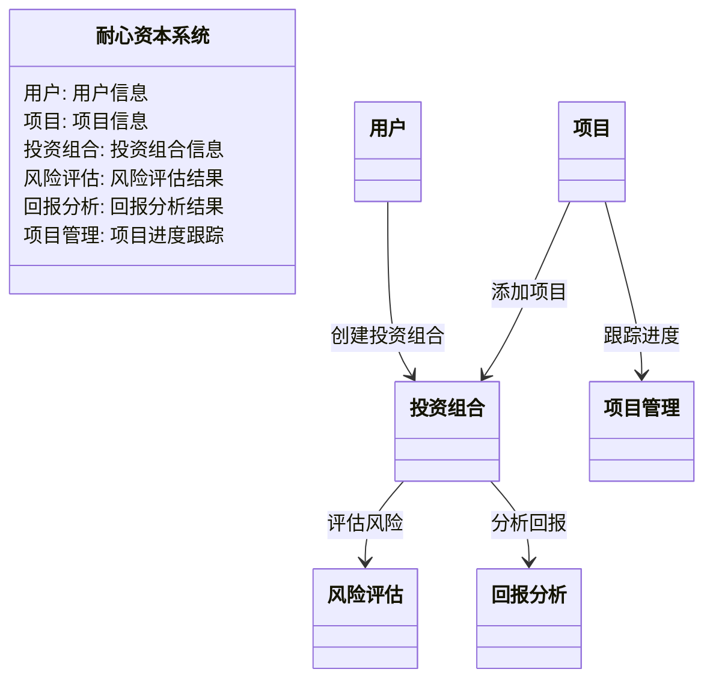
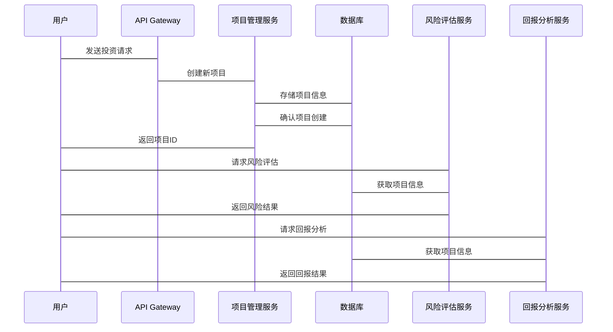

                 


# 彼得林奇的"耐心资本"在颠覆性创新中的角色

## 关键词：
- 彼得·林奇，耐心资本，颠覆性创新，投资理论，系统架构

## 摘要：
本文探讨了彼得·林奇的耐心资本理论在颠覆性创新中的应用，分析了耐心资本如何通过长期投资和价值创造推动创新，同时结合系统架构设计，展示了如何在实际项目中应用这些理论。文章通过详细讲解理论基础、数学模型和实际案例，揭示了耐心资本在创新过程中的关键作用，并提供了最佳实践建议。

---

## 第一部分：耐心资本与颠覆性创新的背景介绍

### 第1章：耐心资本的核心概念

#### 1.1 耐心资本的定义与特征

- **1.1.1 耐心资本的定义**
  耐心资本是一种长期投资策略，强调通过持续的价值创造实现回报，而非短期收益。它要求投资者具备耐心，能够在较长的时间内持有资产，等待其价值增长。

- **1.1.2 耐心资本的核心特征**
  - 长期持有：耐心资本注重长期投资，而非短期交易。
  - 价值创造：通过优化管理和创新，提升资产价值。
  - 风险承受：能够承受较高的短期波动风险，以换取长期收益。

- **1.1.3 耐心资本与传统资本的区别**
  | 特性       | 耐心资本         | 传统资本         |
  |------------|------------------|------------------|
  | 投资期限   | 长期             | 短期             |
  | 风险承受   | 高               | 低               |
  | 投资目标   | 价值创造         | 短期收益         |

#### 1.2 颠覆性创新的定义与特点

- **1.2.1 颠覆性创新的定义**
  颠覆性创新是指通过引入新的技术、商业模式或产品，破坏现有市场格局，创造新的市场机会。它通常以更低的成本或更高的价值吸引客户，逐步取代传统竞争对手。

- **1.2.2 颠覆性创新的核心要素**
  - 技术创新：引入新技术或新方法，降低成本或提高效率。
  - 商业模式创新：改变收入来源或客户接触点，创造新价值。
  - 市场定位：目标非主流市场或未被满足的需求。

- **1.2.3 颠覆性创新与渐进式创新的区别**
  | 特性           | 颠覆性创新         | 渐进式创新         |
  |----------------|--------------------|--------------------|
  | 影响程度       | 高                 | 低                 |
  | 目标市场       | 非主流或新兴市场   | 现有市场           |
  | 技术依赖       | 依赖新技术         | 基于现有技术       |

#### 1.3 彼得林奇的耐心资本理论背景

- **1.3.1 彼得林奇的生平简介**
  彼得·林奇是美国著名投资经理人，以其管理的麦哲伦基金闻名，该基金在他的管理下取得了显著的长期收益。他的投资策略强调长期持有和深入研究。

- **1.3.2 耐心资本理论的提出背景**
  在20世纪80年代，彼得林奇观察到许多投资者追求短期收益，忽视了长期价值创造的重要性。他提出耐心资本理论，强调通过长期投资和价值创造实现稳定回报。

- **1.3.3 耐心资本在投资中的应用**
  耐心资本通过投资具有强大管理和增长潜力的公司，帮助这些公司实现长期价值增长。这种策略尤其适合那些在新兴市场或技术领域有潜力的颠覆性创新企业。

---

## 第二部分：耐心资本的理论与数学模型

### 第2章：耐心资本的理论基础

#### 2.1 耐心资本的数学模型

- **2.1.1 投资组合优化的数学表达**
  耐心资本的投资组合优化可以通过以下公式表示：
  $$ \text{最大化 } \sum_{i=1}^{n} w_i r_i - \lambda \sum_{i=1}^{n} w_i^2 $$
  其中，\( w_i \) 是第i个资产的权重，\( r_i \) 是预期收益率，\( \lambda \) 是风险厌恶系数。

- **2.1.2 时间价值与资本回报的关系**
  资本的未来价值计算公式为：
  $$ V(t) = V(0) \times (1 + r)^t $$
  其中，\( V(0) \) 是初始价值，\( r \) 是年化回报率，\( t \) 是时间。

#### 2.2 耐心资本与风险的关系

- **2.2.1 风险调整后的资本回报模型**
  预期回报与风险的关系可以通过CAPM模型表示：
  $$ E(r_i) = r_f + \beta_i (r_m - r_f) $$
  其中，\( r_f \) 是无风险利率，\( r_m \) 是市场预期回报率，\( \beta_i \) 是第i个资产的贝塔系数。

- **2.2.2 风险溢价的计算方法**
  风险溢价计算公式为：
  $$ \text{风险溢价} = E(r_i) - r_f $$

---

## 第三部分：颠覆性创新的机制分析

### 第3章：颠覆性创新的驱动因素

#### 3.1 技术进步的作用

- **3.1.1 技术创新与市场颠覆的关系**
  新技术的引入可以降低生产成本或提高产品性能，从而为颠覆性创新创造条件。

- **3.1.2 数字技术对颠覆性创新的影响**
  数字技术（如人工智能、大数据）的应用加速了产品和服务的创新，推动了市场的颠覆。

#### 3.2 市场结构的变化

- **3.2.1 新进入者的市场机会**
  颠覆性创新通常由新进入者发起，他们利用新技术或新商业模式挑战现有企业。

- **3.2.2 现有企业的防御策略**
  现有企业可能通过创新、收购或合作来应对颠覆性挑战，但这需要耐心资本的支持。

---

### 第4章：耐心资本与颠覆性创新的关系

#### 4.1 耐心资本如何促进颠覆性创新

- **4.1.1 长期投资对创新的支持**
  耐心资本通过长期资金支持，为颠覆性创新提供了必要的资源和时间。

- **4.1.2 耐心资本在创新周期中的作用**
  在创新周期的各个阶段，耐心资本提供了资金支持，帮助创新企业度过种子期、成长期和成熟期。

#### 4.2 颠覆性创新对耐心资本的影响

- **4.2.1 创新带来的回报周期**
  颠覆性创新可能需要较长的时间才能显现回报，但这正是耐心资本的核心特征。

- **4.2.2 创新失败的风险管理**
  颠覆性创新存在较高的失败风险，耐心资本需要具备风险管理能力，分散投资以降低风险。

---

## 第四部分：系统分析与架构设计

### 第5章：系统分析与架构设计方案

#### 5.1 问题场景介绍

- **目标**：设计一个支持耐心资本投资的系统，用于跟踪和管理颠覆性创新项目。
- **关键需求**：长期跟踪、风险评估、回报分析、项目管理。

#### 5.2 系统功能设计（领域模型Mermaid类图）



#### 5.3 系统架构设计（Mermaid架构图）


#### 5.4 系统交互设计（Mermaid序列图）



---

## 第五部分：项目实战与案例分析

### 第6章：项目实战

#### 6.1 环境安装

- **技术栈**：Python、Django、PostgreSQL。
- **安装步骤**：
  1. 安装Python和Django框架。
  2. 配置数据库连接。
  3. 创建项目并配置路由。
  4. 启动服务器并测试功能。

#### 6.2 核心实现源代码

```python
from django.urls import path
from .views import *

urlpatterns = [
    path('create_project/', create_project, name='create_project'),
    path('evaluate_risk/<int:project_id>/', evaluate_risk, name='evaluate_risk'),
    path('analyze_return/<int:project_id>/', analyze_return, name='analyze_return'),
]
```

#### 6.3 代码应用解读与分析

- **create_project**：处理新项目的创建，将项目信息存入数据库。
- **evaluate_risk**：基于项目信息评估风险，返回风险等级。
- **analyze_return**：预测项目未来回报，计算预期回报率。

#### 6.4 实际案例分析

- **案例1：科技领域的颠覆性创新**
  一家初创公司开发了一种新型AI算法，通过耐心资本的投资，逐步占据了市场领先地位。
  
- **案例2：医疗领域的颠覆性创新**
  一家医疗科技公司引入数字健康技术，通过耐心资本的支持，成功实现了商业模式的创新，成为行业领导者。

---

## 第六部分：总结与建议

### 第7章：总结

#### 7.1 核心内容回顾

- 耐心资本的长期投资策略为颠覆性创新提供了资金支持。
- 颠覆性创新通过技术或商业模式的创新，推动市场变革。
- 系统架构设计为耐心资本的管理和应用提供了技术支持。

#### 7.2 小结与注意事项

- **小结**：耐心资本与颠覆性创新相辅相成，前者为后者提供资金和时间支持，后者为前者带来高回报潜力。
- **注意事项**：
  - 投资者需具备长期眼光和风险承受能力。
  - 创业者需专注于创新和价值创造。
  - 系统设计需考虑灵活性和可扩展性。

### 第8章：最佳实践与拓展阅读

#### 8.1 最佳实践 tips

- **投资策略**：选择具有强大管理团队和创新潜力的企业。
- **风险管理**：分散投资以降低风险。
- **系统应用**：利用系统工具跟踪和管理投资项目。

#### 8.2 拓展阅读

- 《The Peter Lynch Method》
- 《The Innovator's Dilemma》
- 《系统设计精解》

---

## 作者信息

作者：AI天才研究院/AI Genius Institute & 禅与计算机程序设计艺术/Zen And The Art of Computer Programming

---

通过以上详细的内容，文章全面探讨了彼得·林奇的耐心资本理论在颠覆性创新中的应用，结合理论分析、系统架构设计和实际案例，为读者提供了深入的理解和实践指导。

