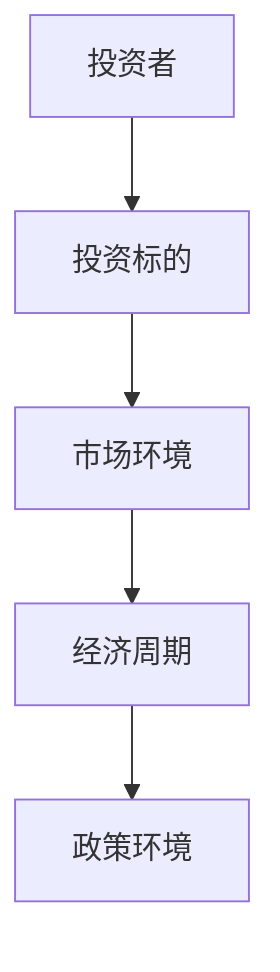
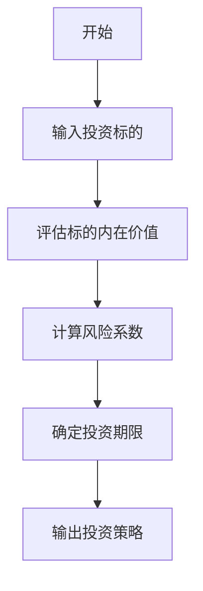
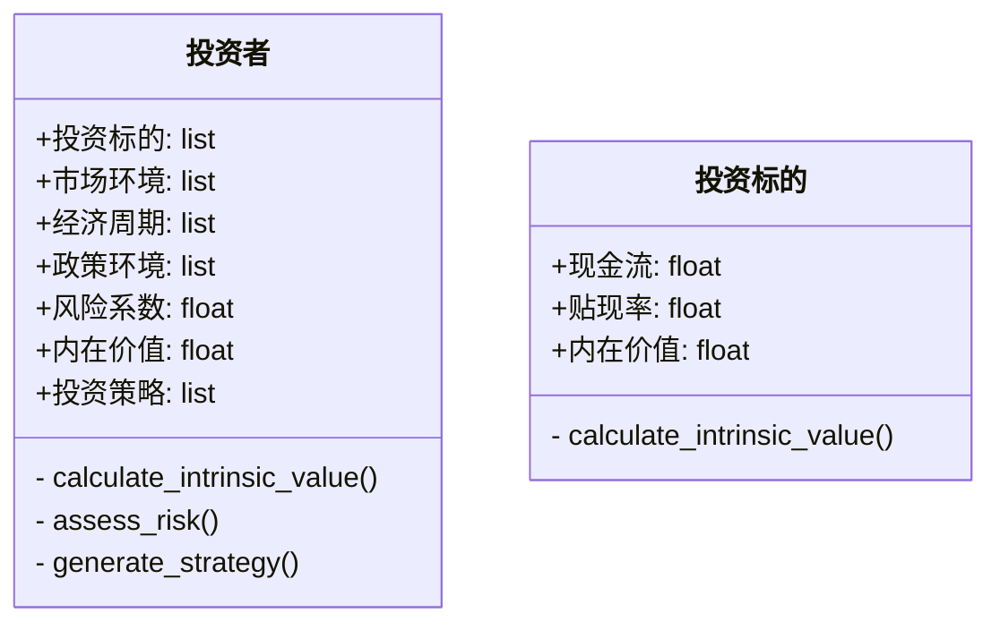
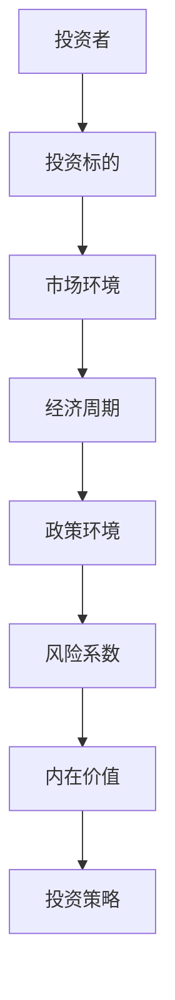
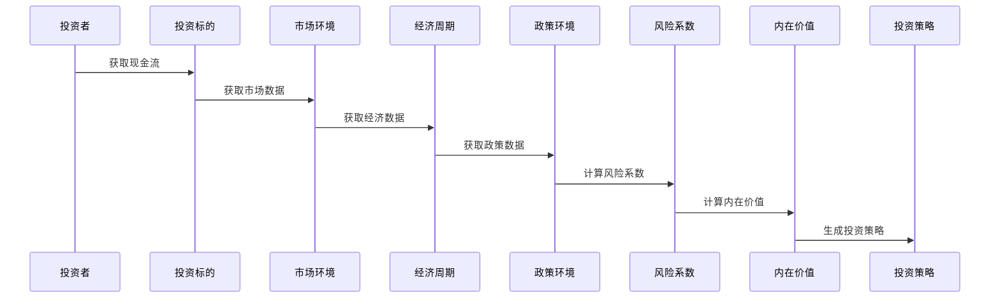

                 


# 彼得林奇的"耐心资本"投资案例

## 关键词：
耐心资本, 投资策略, 彼得林奇, 长期投资, 风险管理, 价值评估

## 摘要：
本文深入探讨了彼得·林奇提出的“耐心资本”投资理念，分析其核心概念、算法原理及系统架构设计。通过实际案例和数学模型，展示了耐心资本在长期投资中的应用和优势，为投资者提供了一种基于价值评估和风险管理的长期投资策略。

---

## 第一部分: 背景介绍

### 第1章: 耐心资本的定义与特点

#### 1.1 耐心资本的定义
耐心资本是指一种长期持有的投资策略，强调通过深入的价值评估，选择具有持续增长潜力的优质企业进行投资，并在较长的时间内持有这些资产，以实现资本的稳定增值。

##### 1.1.1 耐心资本的核心概念
耐心资本的核心在于“长期”和“价值”。投资者需要忽略短期市场波动，专注于企业的内在价值和长期增长潜力。

##### 1.1.2 耐心资本与传统资本的区别
耐心资本与传统资本的主要区别在于投资期限和策略：
- **投资期限**：耐心资本强调长期持有，而传统资本可能涉及频繁交易。
- **策略**：耐心资本注重价值投资，传统资本可能更关注短期收益。

##### 1.1.3 耐心资本在投资中的重要性
耐心资本能够帮助投资者规避短期市场的波动风险，专注于企业的长期增长，从而实现更稳定的收益。

#### 1.2 耐心资本的特点
耐心资本具有以下特点：
- **长期性**：投资期限较长，通常在数年以上。
- **价值驱动**：以企业的内在价值为核心，选择低估的资产进行投资。
- **风险管理**：通过分散投资和严格的价值评估，降低投资风险。

#### 1.3 耐心资本与其他投资策略的对比
耐心资本与股票投资、短期交易等策略有显著区别：
- **股票投资**：耐心资本更注重长期持有，而股票投资可能涉及频繁买卖。
- **短期交易**：耐心资本强调长期价值，短期交易则关注短期价格波动。
- **机构投资**：耐心资本在机构投资中广泛应用，尤其是注重长期收益的机构。

---

### 第2章: 耐心资本的核心概念与联系

#### 2.1 核心概念原理
耐心资本的核心原理在于通过深入的价值评估，选择具有持续增长潜力的企业进行投资，并在较长的时间内持有这些资产。

##### 2.1.1 投资标的的价值评估
耐心资本强调对企业的内在价值进行评估，主要考虑企业的财务状况、行业地位、竞争优势等因素。

##### 2.1.2 耐心资本的收益模型
耐心资本的收益主要来源于企业的长期增长，而不是短期的价格波动。

##### 2.1.3 耐心资本的风险管理
耐心资本通过分散投资、严格的价值评估和长期持有，降低投资风险。

#### 2.2 概念属性特征对比
以下是耐心资本与其他投资策略在概念属性上的对比：

| 属性 | 耐心资本 | 股票投资 | 短期交易 |
|------|----------|----------|----------|
| 投资期限 | 长期     | 短期     | 极短     |
| 投资目标 | 企业价值 | 股票价格 | 短期收益 |
| 风险承受 | 中等     | 较低     | 较高     |

#### 2.3 ER实体关系图
以下是耐心资本的实体关系图：



---

### 第3章: 耐心资本的算法原理

#### 3.1 算法原理概述
耐心资本的算法主要涉及以下步骤：
1. **价值评估**：计算企业的内在价值。
2. **风险评估**：评估投资标的的风险。
3. **收益预测**：预测长期收益。

##### 3.1.1 耐心资本的价值评估算法
耐心资本的价值评估算法基于企业的未来现金流和贴现率，计算其内在价值。

##### 3.1.2 耐心资本的风险评估模型
通过对企业财务状况、行业风险和宏观经济环境等因素进行评估，确定投资标的的风险系数。

##### 3.1.3 耐心资本的收益预测方法
基于企业的长期增长潜力和市场环境，预测投资标的的长期收益。

#### 3.2 算法流程图
以下是耐心资本的算法流程图：



#### 3.3 Python源代码实现
以下是计算内在价值的Python代码示例：

```python
def calculate_intrinsic_value(company_financials):
    # 计算未来现金流
    cash_flow = company_financials['现金流'].sum()
    # 计算折现率
    discount_rate = 0.1
    # 计算内在价值
    intrinsic_value = cash_flow / discount_rate
    return intrinsic_value
```

---

## 第四部分: 数学模型与公式

### 4.1 耐心资本的数学模型
耐心资本的核心数学模型包括内在价值公式和风险调整模型。

#### 4.1.1 内在价值公式
$$ V = \frac{CF}{k} $$
其中，\( CF \) 是未来现金流，\( k \) 是折现率。

#### 4.1.2 风险调整模型
$$ R = V \times (1 - \alpha \times \text{风险系数}) $$
其中，\( \alpha \) 是风险调整因子。

### 4.2 算术举例
假设某公司未来现金流为 $100，折现率为 10%，则内在价值为：
$$ V = \frac{100}{0.1} = 1000 $$

---

## 第五部分: 系统分析与架构设计方案

### 第5章: 系统分析与架构设计

#### 5.1 问题场景介绍
本文将构建一个基于耐心资本的长期投资系统，用于评估和管理投资标的的内在价值和风险。

#### 5.2 项目介绍
本项目旨在实现一个长期投资管理系统，基于耐心资本的理念，提供投资标的的价值评估、风险评估和投资策略生成功能。

#### 5.3 系统功能设计
以下是系统的功能设计：



#### 5.4 系统架构设计
以下是系统的架构设计：



#### 5.5 系统接口设计
以下是系统的接口设计：



---

## 第六部分: 项目实战

### 第6章: 项目实战

#### 6.1 环境安装
需要安装以下环境：
- Python 3.8+
- Mermaid CLI
- Jupyter Notebook

#### 6.2 系统核心实现源代码
以下是系统的核心实现代码：

```python
class Investor:
    def __init__(self):
        self.investment_assets = []
        self.market_environment = []
        self.economic_cycle = []
        self.policy_environment = []
        self.risk_factor = 0.1
        self.intrinsic_value = 0.0
        self.investment_strategy = []

    def calculate_intrinsic_value(self, asset):
        cash_flow = asset.cash_flow
        discount_rate = asset.discount_rate
        self.intrinsic_value = cash_flow / discount_rate

    def assess_risk(self):
        # 简单示例，实际应用中需要更复杂的模型
        self.risk_assessment = len(self.market_environment) * self.risk_factor

    def generate_strategy(self):
        self.investment_strategy = [asset for asset in self.investment_assets if asset.intrinsic_value > 1.1 * asset.current_value]
```

#### 6.3 代码应用解读与分析
以下是代码的解读与分析：
- `Investor` 类表示投资者，管理投资资产、市场环境等。
- `calculate_intrinsic_value` 方法计算投资标的的内在价值。
- `assess_risk` 方法评估投资风险。
- `generate_strategy` 方法生成投资策略，选择具有增值潜力的资产。

#### 6.4 实际案例分析
假设我们有以下投资标的：

```python
class Asset:
    def __init__(self, cash_flow, discount_rate):
        self.cash_flow = cash_flow
        self.discount_rate = discount_rate
        self.current_value = cash_flow / discount_rate

asset1 = Asset(100, 0.1)
asset2 = Asset(150, 0.1)
```

投资者对这两个资产进行评估：

```python
investor = Investor()
investor.investment_assets = [asset1, asset2]
investor.calculate_intrinsic_value(asset1)
investor.calculate_intrinsic_value(asset2)
investor.assess_risk()
investor.generate_strategy()
```

最终，投资者将选择内在价值高于当前价值的资产进行投资。

#### 6.5 项目小结
通过以上代码和案例分析，我们可以看到耐心资本在长期投资中的应用。投资者通过深入的价值评估和严格的风险管理，选择具有长期增长潜力的资产进行投资，实现资本的稳定增值。

---

## 第七部分: 最佳实践 tips

### 第7章: 最佳实践 tips

#### 7.1 投资者 tips
- **长期持有**：耐心资本的核心在于长期持有，投资者需要具备长期投资的耐心。
- **价值评估**：深入研究企业的财务状况和行业地位，选择具有长期增长潜力的企业。
- **风险管理**：通过分散投资和严格的风险评估，降低投资风险。

#### 7.2 小结
耐心资本是一种基于长期投资和价值评估的策略，通过深入研究企业和市场环境，选择具有长期增长潜力的资产进行投资，实现资本的稳定增值。

#### 7.3 注意事项
- **市场波动**：投资者需要关注市场波动，但不要被短期波动影响。
- **财务健康**：选择财务健康、具有竞争优势的企业。
- **经济环境**：关注宏观经济环境，评估其对投资标的的影响。

#### 7.4 拓展阅读
- 彼得·林奇的《彼得林奇的投资哲学》
- 价值投资经典书籍：《 Intelligent Investor》
- 其他相关投资策略书籍

---

## 作者：AI天才研究院/AI Genius Institute & 禅与计算机程序设计艺术 /Zen And The Art of Computer Programming

---

通过以上内容，我们可以看到，耐心资本是一种基于长期投资和价值评估的策略，通过深入研究企业和市场环境，选择具有长期增长潜力的资产进行投资，实现资本的稳定增值。

