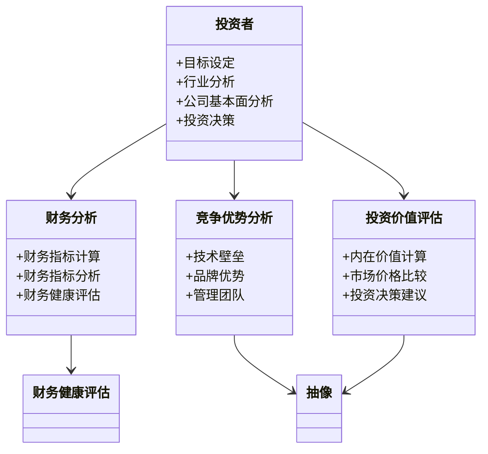
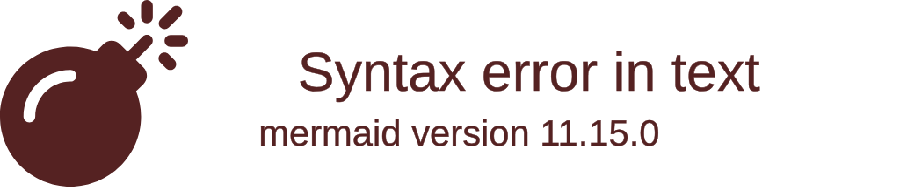

                 


# 彼得林奇的"自下而上"选股方法

> 关键词：彼得·林奇，自下而上选股，投资策略，财务分析，股票投资

> 摘要：本文深入探讨了彼得·林奇的“自下而上”选股方法，从基本概念到具体实施步骤，结合实例分析，为读者提供系统化的投资策略。通过详细阐述其选股标准、财务分析技巧、投资价值评估模型等内容，帮助投资者掌握一套科学有效的选股方法。

---

## 第一部分：彼得·林奇的"自下而上"选股方法概述

### 第1章：自下而上选股方法的背景与概念

#### 1.1 投资的基本概念
- **投资的定义与分类**：投资是将资金投入某一资产或项目，以期获得未来收益的行为。股票投资是其中的重要形式，分为短线交易和长线投资。
- **股票投资的基本原理**：股票代表公司所有权，投资者通过持有股票分享公司收益。股票价格受市场供需、公司业绩和宏观经济因素影响。
- **股票市场的基本运作机制**：股票市场是买卖股票的场所，包括一级市场（新股发行）和二级市场（现成交易）。投资者通过交易所进行买卖，价格由市场供需决定。

#### 1.2 自下而上选股方法的定义
- **自下而上选股方法的定义**：从单个股票出发，逐一分析其投资价值，再决定是否纳入投资组合。这种方法强调个股分析，而非宏观经济或行业趋势。
- **自下而上选股方法的核心思想**：重点关注公司基本面，寻找具有持续盈利能力、良好财务状况和竞争优势的企业。
- **自下而上选股方法与自上而下选股方法的区别**：
  - 自下而上：从个股出发，注重公司基本面。
  - 自上而下：从宏观经济和行业趋势出发，注重市场整体走势。

#### 1.3 彼得·林奇的投资理念
- **彼得·林奇的个人简介**：美国著名基金经理，曾管理富达麦哲伦基金，创造了卓越的投资业绩。
- **彼得·林奇的投资哲学**：坚信长期投资优质股票能够带来超额收益，反对短期频繁交易。
- **彼得·林奇对投资者的建议**：耐心研究个股，选择具有竞争优势和良好管理的公司。

#### 1.4 本章小结
- **自下而上选股方法的核心要点**：从个股出发，分析公司基本面，寻找具有投资价值的股票。
- **彼得·林奇投资理念的总结**：长期投资优质股票，注重公司基本面分析。

---

### 第2章：彼得·林奇的选股标准

#### 2.1 选股的基本原则
- **选股的基本原则概述**：选择具有持续盈利能力、良好财务状况和竞争优势的公司。
- **选股的三大核心要素**：
  1. 盈利能力：ROE（净资产收益率）和ROA（资产收益率）是衡量公司盈利能力的重要指标。
  2. 财务状况：关注资产负债表，评估公司偿债能力和财务健康。
  3. 竞争优势：分析公司在行业中的竞争优势，如技术壁垒、品牌优势等。
- **选股的常见误区**：盲目跟风、追涨杀跌、忽略基本面分析。

#### 2.2 彼得·林奇的选股标准
- **公司基本面分析的重要性**：公司基本面是选股的核心，包括财务状况、盈利能力、竞争优势等。
- **公司财务状况的评估**：通过分析资产负债表、利润表和现金流量表，评估公司的财务健康。
- **公司竞争优势的分析**：关注公司的技术、品牌、管理团队等竞争优势，判断其能否长期保持领先地位。

#### 2.3 选股标准的实践应用
- **如何选择行业**：选择具有增长潜力的行业，如科技、消费、医疗等。
- **如何分析公司的财务报表**：
  1. 资产负债表：关注资产结构、负债水平和股东权益。
  2. 利润表：分析收入、成本和利润情况。
  3. 现金流量表：评估公司现金流健康。
- **如何评估公司的竞争优势**：分析公司的技术、品牌、管理团队和市场地位。

#### 2.4 本章小结
- **彼得·林奇选股标准的核心要点**：注重公司基本面分析，选择具有持续盈利能力、良好财务状况和竞争优势的公司。
- **选股标准在实际投资中的应用**：结合行业分析和公司基本面分析，筛选出优质投资标的。

---

## 第二部分：自下而上选股方法的步骤与技巧

### 第3章：自下而上选股方法的步骤与技巧

#### 3.1 自下而上选股的基本步骤
- **确定投资目标**：明确投资目的、风险承受能力和投资期限。
- **列出潜在投资标的**：根据行业分析和市场研究，列出潜在投资股票。
- **进行公司基本面分析**：详细分析公司的财务状况、盈利能力、竞争优势等。
- **评估公司的投资价值**：结合市场估值和公司基本面，评估股票的投资价值。
- **做出投资决策**：根据分析结果，决定是否买入和持有。

#### 3.2 公司基本面分析的技巧
- **财务指标的计算与分析**：
  1. 盈利能力指标：ROE、ROA、净利润率。
  2. 偿债能力指标：资产负债率、流动比率。
  3. 运营能力指标：存货周转率、应收账款周转率。
- **财务指标的分析方法**：对比历史数据和行业平均水平，判断公司财务状况。
- **财务指标在选股中的应用**：通过筛选财务指标，过滤出具有良好财务状况的公司。

#### 3.3 选股技巧的实战应用
- **如何筛选行业龙头股**：选择行业龙头股，关注其市场地位和竞争优势。
- **如何识别价值低估股**：通过市盈率、市净率等估值指标，寻找价值低估的股票。
- **如何避免投资陷阱**：警惕财务造假、管理层问题和行业风险。

#### 3.4 本章小结
- **自下而上选股方法的步骤总结**：从目标设定到投资决策，每一步都需要细致分析。
- **公司基本面分析技巧的总结**：通过财务指标和行业分析，筛选出具有投资价值的公司。
- **选股技巧的实际应用**：结合市场估值和公司基本面，避免投资陷阱。

---

### 第4章：彼得·林奇选股方法的数学模型与公式

#### 4.1 财务指标的计算与分析
- **常见财务指标的定义与计算公式**：
  - 净利润：净利润 = 收入 - 成本 - 费用
  - 净资产收益率（ROE）：ROE = 净利润 / 平均净资产
  - 资产负债率：资产负债率 = 负债总额 / 资产总额
- **财务指标的分析方法**：
  - 对比历史数据：分析公司财务状况的变化趋势。
  - 对比行业平均水平：判断公司财务状况在行业中的位置。
  - 结合公司业务模式：分析财务指标与公司业务的匹配性。

#### 4.2 投资价值评估的数学模型
- **投资价值评估的基本公式**：
  - 市盈率（P/E）：P/E = 股价 / 每股净利润
  - 市净率（P/B）：P/B = 股价 / 每股净资产
  - 内在价值计算公式：内在价值 = 将来的现金流以适当贴现率折现的总和。
- **投资价值评估模型的构建**：
  1. 预测公司未来现金流。
  2. 确定合适的贴现率。
  3. 计算内在价值。
  4. 比较内在价值与市场价格，判断是否低估或高估。

#### 4.3 选股标准的量化分析
- **量化分析的基本原理**：通过数学模型和量化指标，筛选出具有投资价值的股票。
- **量化分析的指标选择**：
  - 盈利能力指标：ROE、ROA。
  - 偿债能力指标：资产负债率、流动比率。
  - 成长能力指标：净利润增长率、收入增长率。
- **量化分析的实际应用**：
  1. 筛选ROE > 10%的公司。
  2. 筛选资产负债率 < 50%的公司。
  3. 筛选净利润增长率 > 10%的公司。

#### 4.4 本章小结
- **财务指标计算与分析的总结**：通过计算和分析财务指标，评估公司财务状况和盈利能力。
- **投资价值评估模型的总结**：通过内在价值计算，判断股票是否低估或高估。
- **选股标准量化分析的总结**：通过量化指标筛选出具有投资价值的股票。

---

## 第三部分：系统分析与架构设计方案

### 第5章：系统分析与架构设计方案

#### 5.1 问题场景介绍
- **问题背景**：投资者需要一套科学的选股方法，以提高投资效率和收益率。
- **问题描述**：如何通过系统化的方法，筛选出具有投资价值的股票。

#### 5.2 系统功能设计（领域模型）


#### 5.3 系统架构设计


#### 5.4 系统接口设计
- **输入接口**：投资者目标设定、行业分析结果。
- **输出接口**：财务健康评估、竞争优势评估、投资价值评估。

#### 5.5 系统交互设计
```mermaid
sequenceDiagram
    投资者 -> 财务分析模块: 提供财务数据
    财务分析模块 -> 财务指标计算: 计算ROE、ROA等指标
    财务指标计算 -> 财务指标分析: 分析财务状况
    财务指标分析 -> 投资者: 提供财务健康评估报告
    投资者 -> 竞争优势分析模块: 提供竞争优势数据
    竞争优势分析模块 ->抽像抽像抽像抽像抽像抽像抽像抽像抽像抽像抽像抽像抽像抽像抽像抽像抽像抽像抽像抽像抽像抽像抽像抽像抽像抽像抽像抽像抽像抽像抽像抽像抽像抽像抽像抽像抽像抽像抽像抽像抽像抽像抽像抽像抽像抽像抽像抽像抽像抽像抽像抽像抽像抽像抽像抽像抽像抽像抽像抽像抽像抽像抽像抽像抽像抽像抽像抽像抽像抽像抽像抽像抽像抽像抽像抽像抽像抽像抽像抽像抽像抽像抽像抽像抽像抽像抽像抽像抽像抽像抽像抽像抽像抽像抽像抽像抽像抽像抽像抽像抽像抽像抽像抽像抽像抽像抽像抽像抽像抽像抽像抽像抽像抽像抽像抽像抽像抽像抽像抽像抽像抽像抽像抽像抽像抽像抽像抽像抽像抽像抽像抽像抽像抽像抽像抽像抽像抽像抽像抽像抽像抽像抽像抽像抽像抽像抽像抽像抽像抽像抽像抽像抽像抽像抽像抽像抽像抽像抽像抽像抽像抽像抽像抽像抽像抽像抽像抽像抽像抽像抽像抽像抽像抽像抽像抽像抽像抽像抽像抽像抽像抽像抽像抽像抽像抽像抽像抽像抽像抽像抽像抽像抽像抽像抽像抽像抽像抽像抽像抽像抽像抽像抽像抽像抽像抽像抽像抽像抽像抽像抽像抽像抽像抽像抽像抽像抽像抽像抽像抽像抽像抽像抽像抽像抽像抽像抽像抽像抽像抽像抽像抽像抽像抽像抽像抽像抽像抽像抽像抽像抽像抽像抽像抽像抽像抽像抽像抽像抽像抽像抽像抽像抽像抽像抽像抽像抽像抽像抽像抽像抽像抽像抽像抽像抽像抽像抽像抽像抽像抽像抽像抽像抽像抽像抽像抽像抽像抽像抽像抽像抽像抽像抽像抽像抽像抽像抽像抽像抽像抽像抽像抽像抽像抽像抽像抽像抽像抽像抽像抽像抽像抽像抽像抽像抽像抽像抽像抽像抽像抽像抽像抽像抽像抽像抽像抽像抽像抽像抽像抽像抽像抽像抽像抽像抽像抽像抽像抽像抽像抽像抽像抽像抽像抽像抽像抽像抽像抽像抽像抽像抽像抽像抽像抽像抽像抽像抽像抽像抽像抽像抽像抽像抽像抽像抽像抽像抽像抽像抽像抽像抽像抽像抽像抽像抽像抽像抽像抽像抽像抽像抽像抽像抽像抽像抽像抽像抽像抽像抽像抽像抽像抽像抽像抽像抽像抽像抽像抽像抽像抽像抽像抽像抽像抽像抽像抽像抽像抽像抽像抽像抽像抽像抽像抽像抽像抽像抽像抽像抽像抽像抽像抽像抽像抽像抽像抽像抽像抽像抽像抽像抽像抽像抽像抽像抽像抽像抽像抽像抽像抽像抽像抽像抽像抽像抽像抽像抽像抽像抽像抽像抽像抽像抽像抽像抽像抽像抽像抽像抽像抽像抽像抽像抽像抽像抽像抽像抽像抽像抽像抽像抽像抽像抽像抽像抽像抽像抽像抽像抽像抽像抽像抽像抽像抽像抽像抽像抽像抽像抽像抽像抽像抽像抽像抽像抽像抽像抽像抽像抽像抽像抽像抽像抽像抽像抽像抽像抽像抽像抽像抽像抽像抽像抽像抽像抽像抽像抽像抽像抽像抽像抽像抽像抽像抽像抽像抽像抽像抽像抽像抽像抽像抽像抽像抽像抽像抽像抽像抽像抽像抽像抽像抽像抽像抽像抽像抽像抽像抽像抽像抽像抽像抽像抽像抽像抽像抽像抽像抽像抽像抽像抽像抽像抽像抽像抽像抽像抽像抽像抽像抽像抽像抽像抽像抽像抽像抽像抽像抽像抽像抽像抽像抽像抽像抽像抽像抽像抽像抽像抽像抽像抽像抽像抽像抽像抽像抽像抽像抽像抽像抽像抽像抽像抽像抽像抽像抽像抽像抽像抽像抽像抽像抽像抽像抽像抽像抽像抽像抽像抽像抽像抽像抽像抽像抽像抽像抽像抽像抽像抽像抽像抽像抽像抽像抽像抽像抽像抽像抽像抽像抽像抽像抽像抽像抽像抽像抽像抽像抽像抽像抽像抽像抽像抽像抽像抽像抽像抽像抽像抽像抽像抽像抽像抽像抽像抽像抽像抽像抽像抽像抽像抽像抽像抽像抽像抽像抽像抽像抽像抽像抽像抽像抽像抽像抽像抽像抽像抽像抽像抽像抽像抽像抽像抽像抽像抽像抽像抽像抽像抽像抽像抽像抽像抽像抽像抽像抽像抽像抽像抽像抽像抽像抽像抽像抽像抽像抽像抽像抽像抽像抽像抽像抽像抽像抽像抽像抽像抽像抽像抽像抽像抽像抽像抽像抽像抽像抽像抽像抽像抽像抽像抽像抽像抽像抽像抽像抽像抽像抽像抽像抽像抽像抽像抽像抽像抽像抽像抽像抽像抽像抽像抽像抽像抽像抽像抽像抽像抽像抽像抽像抽像抽像抽像抽像抽像抽像抽像抽像抽像抽像抽像抽像抽像抽像抽像抽像抽像抽像抽像抽像抽像抽像抽像抽像抽像抽像抽像抽像抽像抽像抽像抽像抽像抽像抽像抽像抽像抽像抽像抽像抽像抽像抽像抽像抽像抽像抽像抽像抽像抽像抽像抽像抽像抽像抽像抽像抽像抽像抽像抽像抽像抽像抽像抽像抽像抽像抽像抽像抽像抽像抽像抽像抽像抽像抽像抽像抽像抽像抽像抽像抽像抽像抽像抽像抽像抽像抽像抽像抽像抽像抽像抽像抽像抽像抽像抽像抽像抽像抽像抽像抽像抽像抽像抽像抽像抽像抽像抽像抽像抽像抽像抽像抽像抽像抽像抽像抽像抽像抽像抽像抽像抽像抽像抽像抽像抽像抽像抽像抽像抽像抽像抽像抽像抽像抽像抽像抽像抽像抽像抽像抽像抽像抽像抽像抽像抽像抽像抽像抽像抽像抽像抽像抽像抽像抽像抽像抽像抽像抽像抽像抽像抽像抽像抽像抽像抽像抽像抽像抽像抽像抽像抽像抽像抽像抽像抽像抽像抽像抽像抽像抽像抽像抽像抽像抽像抽像抽像抽像抽像抽像抽像抽像抽像抽像抽像抽像抽像抽像抽像抽像抽像抽像抽像抽像抽像抽像抽像抽像抽像抽像抽像抽像抽像抽像抽像抽像抽像抽像抽像抽像抽像抽像抽像抽像抽像抽像抽像抽像抽像抽像抽像抽像抽像抽像抽像抽像抽像抽像抽像抽像抽像抽像抽像抽像抽像抽像抽像抽像抽像抽像抽像抽像抽像抽像抽像抽像抽像抽像抽像抽像抽像抽像抽像抽像抽像抽像抽像抽像抽像抽像抽像抽像抽像抽像抽像抽像抽像抽像抽像抽像抽像抽像抽像抽像抽像抽像抽像抽像抽像抽像抽像抽像抽像抽像抽像抽像抽像抽像抽像抽像抽像抽像抽像抽像抽像抽像抽像抽像抽像抽像抽像抽像抽像抽像抽像抽像抽像抽像抽像抽像抽像抽像抽像抽像抽像抽像抽像抽像抽像抽像抽像抽像抽像抽像抽像抽像抽像抽像抽像抽像抽像抽像抽像抽像抽像抽像抽像抽像抽像抽像抽像抽像抽像抽像抽像抽像抽像抽像抽像抽像抽像抽像抽像抽像抽像抽像抽像抽像抽像抽像抽像抽像抽像抽像抽像抽像抽像抽像抽像抽像抽像抽像抽像抽像抽像抽像抽像抽像抽像抽像抽像抽像抽像抽像抽像抽像抽像抽像抽像抽像抽像抽像抽像抽像抽像抽像抽像抽像抽像抽像抽像抽像抽像抽像抽像抽像抽像抽像抽像抽像抽像抽像抽像抽像抽像抽像抽像抽像抽像抽像抽像抽像抽像抽像抽像抽像抽像抽像抽像抽像抽像抽像抽像抽像抽像抽像抽像抽像抽像抽像抽像抽像抽像抽像抽像抽像抽像抽像抽像抽像抽像抽像抽像抽像抽像抽像抽像抽像抽像抽像抽像抽像抽像抽像抽像抽像抽像抽像抽像抽像抽像抽像抽像抽像抽像抽像抽像抽像抽像抽像抽像抽像抽像抽像抽像抽像抽像抽像抽像抽像抽像抽像抽像抽像抽像抽像抽像抽像抽像抽像抽像抽像抽像抽像抽像抽像抽像抽像抽像抽像抽像抽像抽像抽像抽像抽像抽像抽像抽像抽像抽像抽像抽像抽像抽像抽像抽像抽像抽像抽像抽像抽像抽像抽像抽像抽像抽像抽像抽像抽像抽像抽像抽像抽像抽像抽像抽像抽像抽像抽像抽像抽像抽像抽像抽像抽像抽像抽像抽像抽像抽像抽像抽像抽像抽像抽像抽像抽像抽像抽像抽像抽像抽像抽像抽像抽像抽像抽像抽像抽像抽像抽像抽像抽像抽像抽像抽像抽像抽像抽像抽像抽像抽像抽像抽像抽像抽像抽像抽像抽像抽像抽像抽像抽像抽像抽像抽像抽像抽像抽像抽像抽像抽像抽像抽像抽像抽像抽像抽像抽像抽像抽像抽像抽像抽像抽像抽像抽像抽像抽像抽像抽像抽像抽像抽像抽像抽像抽像抽像抽像抽像抽像抽像抽像抽像抽像抽像抽像抽像抽像抽像抽像抽像抽像抽像抽像抽像抽像抽像抽像抽像抽像抽像抽像抽像抽像抽像抽像抽像抽像抽像抽像抽像抽像抽像抽像抽像抽像抽像抽像抽像抽像抽像抽像抽像抽像抽像抽像抽像抽像抽像抽像抽像抽像抽像抽像抽像抽像抽像抽像抽像抽像抽像抽像抽像抽像抽像抽像抽像抽像抽像抽像抽像抽像抽像抽像抽像抽像抽像抽像抽像抽像抽像抽像抽像抽像抽像抽像抽像抽像抽像抽像抽像抽像抽像抽像抽像抽像抽像抽像抽像抽像抽像抽像抽像抽像抽像抽像抽像抽像抽像抽像抽像抽像抽像抽像抽像抽像抽像抽像抽像抽像抽像抽像抽像抽像抽像抽像抽像抽像抽像抽像抽像抽像抽像抽像抽像抽像抽像抽像抽像抽像抽像抽像抽像抽像抽像抽像抽像抽像抽像抽像抽像抽像抽像抽像抽像抽像抽像抽像抽像抽像抽像抽像抽像抽像抽像抽像抽像抽像抽像抽像抽像抽像抽像抽像抽像抽像抽像抽像抽像抽像抽像抽像抽像抽像抽像抽像抽像抽像抽像抽像抽像抽像抽像抽像抽像抽像抽像抽像抽像抽像抽像抽像抽像抽像抽像抽像抽像抽像抽像抽像抽像抽像抽像抽像抽像抽像抽像抽像抽像抽像抽像抽像抽像抽像抽像抽像抽像抽像抽像抽像抽像抽像抽像抽像抽像抽像抽像抽像抽像抽像抽像抽像抽像抽像抽像抽像抽像抽像抽像抽像抽像抽像抽像抽像抽像抽像抽像抽像抽像抽像抽像抽像抽像抽像抽像抽像抽像抽像抽像抽像抽像抽像抽像抽像抽像抽像抽像抽像抽像抽像抽像抽像抽像抽像抽像抽像抽像抽像抽像抽像抽像抽像抽像抽像抽像抽像抽像抽像抽像抽像抽像抽像抽像抽像抽像抽像抽像抽像抽像抽像抽像抽像抽像抽像抽像抽像抽像抽像抽像抽像抽像抽像抽像抽像抽像抽像抽像抽像抽像抽像抽像抽像抽像抽像抽像抽像抽像抽像抽像抽像抽像抽像抽像抽像抽像抽像抽像抽像抽像抽像抽像抽像抽像抽像抽像抽像抽像抽像抽像抽像抽像抽像抽像抽像抽像抽像抽像抽像抽像抽像抽像抽像抽像抽像抽像抽像抽像抽像抽像抽像抽像抽像抽像抽像抽像抽像抽像抽像抽像抽像抽像抽像抽像抽像抽像抽像抽像抽像抽像抽像抽像抽像抽像抽像抽像抽像抽像抽像抽像抽像抽像抽像抽像抽像抽像抽像抽像抽像抽像抽像抽像抽像抽像抽像抽像抽像抽像抽像抽像抽像抽像抽像抽像抽像抽像抽像抽像抽像抽像抽像抽像抽像抽像抽像抽像抽像抽像抽像抽像抽像抽像抽像抽像抽像抽像抽像抽像抽像抽像抽像抽像抽像抽像抽像抽像抽像抽像抽像抽像抽像抽像抽像抽像抽像抽像抽像抽像抽像抽像抽像抽像抽像抽像抽像抽像抽像抽像抽像抽像抽像抽像抽像抽像抽像抽像抽像抽像抽像抽像抽像抽像抽像抽像抽像抽像抽像抽像抽像抽像抽像抽像抽像抽像抽像抽像抽像抽像抽像抽像抽像抽像抽像抽像抽像抽像抽像抽像抽像抽像抽像抽像抽像抽像抽像抽像抽像抽像抽像抽像抽像抽像抽像抽像抽像抽像抽像抽像抽像抽像抽像抽像抽像抽像抽像抽像抽像抽像抽像抽像抽像抽像抽像抽像抽像抽像抽像抽像抽像抽像抽像抽像抽像抽像抽像抽像抽像抽像抽像抽像抽像抽像抽像抽像抽像抽像抽像抽像抽像抽像抽像抽像抽像抽像抽像抽像抽像抽像抽像抽像抽像抽像抽像抽像抽像抽像抽像抽像抽像抽像抽像抽像抽像抽像抽像抽像抽像抽像抽像抽像抽像抽像抽像抽像抽像抽像抽像抽像抽像抽像抽像抽像抽像抽像抽像抽像抽像抽像抽像抽像抽像抽像抽像抽像抽像抽像抽像抽像抽像抽像抽像抽像抽像抽像抽像抽像抽像抽像抽像抽像抽像抽像抽像抽像抽像抽像抽像抽像抽像抽像抽像抽像抽像抽像抽像抽像抽像抽像抽像抽像抽像抽像抽像抽像抽像抽像抽像抽像抽像抽像抽像抽像抽像抽像抽像抽像抽像抽像抽像抽像抽像抽像抽像抽像抽像抽像抽像抽像抽像抽像抽像抽像抽像抽像抽像抽像抽像抽像抽像抽像抽像抽像抽像抽像抽像抽像抽像抽像抽像抽像抽像抽像抽像抽像抽像抽像抽像抽像抽像抽像抽像抽像抽像抽像抽像抽像抽像抽像抽像抽像抽像抽像抽像抽像抽像抽像抽像抽像抽像抽像抽像抽像抽像抽像抽像抽像抽像抽像抽像抽像抽像抽像抽像抽像抽像抽像抽像抽像抽像抽像抽像抽像抽像抽像抽像抽像抽像抽像抽像抽像抽像抽像抽像抽像抽像抽像抽像抽像抽像抽像抽像抽像抽像抽像抽像抽像抽像抽像抽像抽像抽像抽像抽像抽像抽像抽像抽像抽像抽像抽像抽像抽像抽像抽像抽像抽像抽像抽像抽像抽像抽像抽像抽像抽像抽像抽像抽像抽像抽像抽像抽像抽像抽像抽像抽像抽像抽像抽像抽像抽像抽像抽像抽像抽像抽像抽像抽像抽像抽像抽像抽像抽像抽像抽像抽像抽像抽像抽像抽像抽像抽像抽像抽像抽像抽像抽像抽像抽像抽像抽像抽像抽像抽像抽像抽像抽像抽像抽像抽像抽像抽像抽像抽像抽像抽像抽像抽像抽像抽像抽像抽像抽像抽像抽像抽像抽像抽像抽像抽像抽像抽像抽像抽像抽像抽像抽像抽像抽像抽像抽像抽像抽像抽像抽像抽像抽像抽像抽像抽像抽像抽像抽像抽像抽像抽像抽像抽像抽像抽像抽像抽像抽像抽像抽像抽像抽像抽像抽像抽像抽像抽像抽像抽像抽像抽像抽像抽像抽像抽像抽像抽像抽像抽像抽像抽像抽像抽像抽像抽像抽像抽像抽像抽像抽像抽像抽像抽像抽像抽像抽像抽像抽像抽像抽像抽像抽像抽像抽像抽像抽像抽像抽像抽像抽像抽像抽像抽像抽像抽像抽像抽像抽像抽像抽像抽像抽像抽像抽像抽像抽像抽像抽像抽像抽像抽像抽像抽像抽像抽像抽像抽像抽像抽像抽像抽像抽像抽像抽像抽像抽像抽像抽像抽像抽像抽像抽像抽像抽像抽像抽像抽像抽像抽像抽像抽像抽像抽像抽像抽像抽像抽像抽像抽像抽像抽像抽像抽像抽像抽像抽像抽像抽像抽像抽像抽像抽像抽像抽像抽像抽像抽像抽像抽像抽像抽像抽像抽像抽像抽像抽像抽像抽像抽像抽像抽像抽像抽像抽像抽像抽像抽像抽像抽像抽像抽像抽像抽像抽像抽像抽像抽像抽像抽像抽像抽像抽像抽像抽像抽像抽像抽像抽像抽像抽像抽像抽像抽像抽像抽像抽像抽像抽像抽像抽像抽像抽像抽像抽像抽像抽像抽像抽像抽像抽像抽像抽像抽像抽像抽像抽像抽像抽像抽像抽像抽像抽像抽像抽像抽像抽像抽像抽像抽像抽像抽像抽像抽像抽像抽像抽像抽像抽像抽像抽像抽像抽像抽像抽像抽像抽像抽像抽像抽像抽像抽像抽像抽像抽像抽像抽像抽像抽像抽像抽像抽像抽像抽像抽像抽像抽像抽像抽像抽像抽像抽像抽像抽像抽像抽像抽像抽像抽像抽像抽像抽像抽像抽像抽像抽像抽像抽像抽像抽像抽像抽像抽像抽像抽像抽像抽像抽像抽像抽像抽像抽像抽像抽像抽像抽像抽像抽像抽像抽像抽像抽像抽像抽像抽像抽像抽像抽像抽像抽像抽像抽像抽像抽像抽像抽像抽像抽像抽像抽像抽像抽像抽像抽像抽像抽像抽像抽像抽像抽像抽像抽像抽像抽像抽像抽像抽像抽像抽像抽像抽像抽像抽像抽像抽像抽像抽像抽像抽像抽像抽像抽像抽像抽像抽像抽像抽像抽像抽像抽像抽像抽像抽像抽像抽像抽像抽像抽像抽像抽像抽像抽像抽像抽像抽像抽像抽像抽像抽像抽像抽像抽像抽像抽像抽像抽像抽像抽像抽像抽像抽像抽像抽像抽像抽像抽像抽像抽像抽像抽像抽像抽像抽像抽像抽像抽像抽像抽像抽像抽像抽像抽像抽像抽像抽像抽像抽像抽像抽像抽像抽像抽像抽像抽像抽像抽像抽像抽像抽像抽像抽像抽像抽像抽像抽像抽像抽像抽像抽像抽像抽像抽像抽像抽像抽像抽像抽像抽像抽像抽像抽像抽像抽像抽像抽像抽像抽像抽像抽像抽像抽像抽像抽像抽像抽像抽像抽像抽像抽像抽像抽像抽像抽像抽像抽像抽像抽像抽像抽像抽像抽像抽像抽像抽像抽像抽像抽像抽像抽像抽像抽像抽像抽像抽像抽像抽像抽像抽像抽像抽像抽像抽像抽像抽像抽像抽像抽像抽像抽像抽像抽像抽像抽像抽像抽像抽像抽像抽像抽像抽像抽像抽像抽像抽像抽像抽像抽像抽像抽像抽像抽像抽像抽像抽像抽像抽像抽像抽像抽像抽像抽像抽像抽像抽像抽像抽像抽像抽像抽像抽像抽像抽像抽像抽像抽像抽像抽像抽像抽像抽像抽像抽像抽像抽像抽像抽像抽像抽像抽像抽像抽像抽像抽像抽像抽像抽像抽像抽像抽像抽像抽像抽像抽像抽像抽像抽像抽像抽像抽像抽像抽像抽像抽像抽像抽像抽像抽像抽像抽像抽像抽像抽像抽像抽像抽像抽像抽像抽像抽像抽像抽像抽像抽像抽像抽像抽像抽像抽像抽像抽像抽像抽像抽像抽像抽像抽像抽像抽像抽像抽像抽像抽像抽像抽像抽像抽像抽像抽像抽像抽像抽像抽像抽像抽像抽像抽像抽像抽像抽像抽像抽像抽像抽像抽像抽像抽像抽像抽像抽像抽像抽像抽像抽像抽像抽像抽像抽像抽像抽像抽像抽像抽像抽像抽像抽像抽像抽像抽像抽像抽像抽像抽像抽像抽像抽像抽像抽像抽像抽像抽像抽像抽像抽像抽像抽像抽像抽像抽像抽像抽像抽像抽像抽像抽像抽像抽像抽像抽像抽像抽像抽像抽像抽像抽像抽像抽像抽像抽像抽像抽像抽像抽像抽像抽像抽像抽像抽像抽像抽像抽像抽像抽像抽像抽像抽像抽像抽像抽像抽像抽像抽像抽像抽像抽像抽像抽像抽像抽像抽像抽像抽像抽像抽像抽像抽像抽像抽像抽像抽像抽像抽像抽像抽像抽像抽像抽像抽像抽像抽像抽像抽像抽像抽像抽像抽像抽像抽像抽像抽像抽像抽像抽像抽像抽像抽像抽像抽像抽像抽像抽像抽像抽像抽像抽像抽像抽像抽像抽像抽像抽像抽像抽像抽像抽像抽像抽像抽像抽像抽像抽像抽像抽像抽像抽像抽像抽像抽像抽像抽像抽像抽像抽像抽像抽像抽像抽像抽像抽像抽像抽像抽像抽像抽像抽像抽像抽像抽像抽像抽像抽像抽像抽像抽像抽像抽像抽像抽像抽像抽像抽像抽像抽像抽像抽像抽像抽像抽像抽像抽像抽像抽像抽像抽像抽像抽像抽像抽像抽像抽像抽像抽像抽像抽像抽像抽像抽像抽像抽像抽像抽像抽像抽像抽像抽像抽像抽像抽像抽像抽像抽像抽像抽像抽像抽像抽像抽像抽像抽像抽像抽像抽像抽像抽像抽像抽像抽像抽像抽像抽像抽像抽像抽像抽像抽像抽像抽像抽像抽像抽像抽像抽像抽像抽像抽像抽像抽像抽像抽像抽像抽像抽像抽像抽像抽像抽像抽像抽像抽像抽像抽像抽像抽像抽像抽像抽像抽像抽像抽像抽像抽像抽像抽像抽像抽像抽像抽像抽像抽像抽像抽像抽像抽像抽像抽像抽像抽像抽像抽像抽像抽像抽像抽像抽像抽像抽像抽像抽像抽像抽像抽像抽像抽像抽像抽像抽像抽像抽像抽像抽像抽像抽像抽像抽像抽像抽像抽像抽像抽像抽像抽像抽像抽像抽像抽像抽像抽像抽像抽像抽像抽像抽像抽像抽像抽像抽像抽像抽像抽像抽像抽像抽像抽像抽像抽像抽像抽像抽像抽像抽像抽像抽像抽像抽像抽像抽像抽像抽像抽像抽像抽像抽像抽像抽像抽像抽像抽像抽像抽像抽像抽像抽像抽像抽像抽像抽像抽像抽像抽像抽像抽像抽像抽像抽像抽像抽像抽像抽像抽像抽像抽像抽像抽像抽像抽像抽像抽像抽像抽像抽像抽像抽像抽像抽像抽像抽像抽像抽像抽像抽像抽像抽像抽像抽像抽像抽像抽像抽像抽像抽像抽像抽像抽像抽像抽像抽像抽像抽像抽像抽像抽像抽像抽像抽像抽像抽像抽像抽像抽像抽像抽像抽像抽像抽像抽像抽像抽像抽像抽像抽像抽像抽像抽像抽像抽像抽像抽像抽像抽像抽像抽像抽像抽像抽像抽像抽像抽像抽像抽像抽像抽像抽像抽像抽像抽像抽像抽像抽像抽像抽像抽像抽像抽像抽像抽像抽像抽像抽像抽像抽像抽像抽像抽像抽像抽像抽像抽像抽像抽像抽像抽像抽像抽像抽像抽像抽像抽像抽像抽像抽像抽像抽像抽像抽像抽像抽像抽像抽像抽像抽像抽像抽像抽像抽像抽像抽像抽像抽像抽像抽像抽像抽像抽像抽像抽像抽像抽像抽像抽像抽像抽像抽像抽像抽像抽像抽像抽像抽像抽像抽像抽像抽像抽像抽像抽像抽像抽像抽像抽像抽像抽像抽像抽像抽像抽像抽像抽像抽像抽像抽像抽像抽像抽像抽像抽像抽像抽像抽像抽像抽像抽像抽像抽像抽像抽像抽像抽像抽像抽像抽像抽像抽像抽像抽像抽像抽像抽像抽像抽像抽像抽像抽像抽像抽像抽像抽像抽像抽像抽像抽像抽像抽像抽像抽像抽像抽像抽像抽像抽像抽像抽像抽像抽像抽像抽像抽像抽像抽像抽像抽像抽像抽像抽像抽像抽像抽像抽像抽像抽像抽像抽像抽像抽像抽像抽像抽像抽像抽像抽像抽像抽像抽像抽像抽像抽像抽像抽像抽像抽像抽像抽像抽像抽像抽像抽像抽像抽像抽像抽像抽像抽像抽像抽像抽像抽像抽像抽像抽像抽像抽像抽像抽像抽像抽像抽像抽像抽像抽像抽像抽像抽像抽像抽像抽像抽像抽像抽像抽像抽像抽像抽像抽像抽像抽像抽像抽像抽像抽像抽像抽像抽像抽像抽像抽像抽像抽像抽像抽像抽像抽像抽像抽像抽像抽像抽像抽像抽像抽像抽像抽像抽像抽像抽像抽像抽像抽像抽像抽像抽像抽像抽像抽像抽像抽像抽像抽像抽像抽像抽像抽像抽像抽像抽像抽像抽像抽像抽像抽像抽像抽像抽像抽像抽像抽像抽像抽像抽像抽像抽像抽像抽像抽像抽像抽像抽像抽像抽像抽像抽像抽像抽像抽像抽像抽像抽像抽像抽像抽像抽像抽像抽像抽像抽像抽像抽像抽像抽像抽像抽像抽像抽像抽像抽像抽像抽像抽像抽像抽像抽像抽像抽像抽像抽像抽像抽像抽像抽像抽像抽像抽像抽像抽像抽像抽像抽像抽像抽像抽像抽像抽像抽像抽像抽像抽像抽像抽像抽像抽像抽像抽像抽像抽像抽像抽像抽像抽像抽像抽像抽像抽像抽像抽像抽像抽像抽像抽像抽像抽像抽像抽像抽像抽像抽像抽像抽像抽像抽像抽像抽像抽像抽像抽像抽像抽像抽像抽像抽像抽像抽像抽像抽像抽像抽像抽像抽像抽像抽像抽像抽像抽像抽像抽像抽像抽像抽像抽像抽像抽像抽像抽像抽像抽像抽像抽像抽像抽像抽像抽像抽像抽像抽像抽像抽像抽像抽像抽像抽像抽像抽像抽像抽像抽像抽像抽像抽像抽像抽像抽像抽像抽像抽像抽像抽像抽像抽像抽像抽像抽像抽像抽像抽像抽像抽像抽像抽像抽像抽像抽像抽像抽像抽像抽像抽像抽像抽像抽像抽像抽像抽像抽像抽像抽像抽像抽像抽像抽像抽像抽像抽像抽像抽像抽像抽像抽像抽像抽像抽像抽像抽像抽像抽像抽像抽像抽像抽像抽像抽像抽像抽像抽像抽像抽像抽像抽像抽像抽像抽像抽像抽像抽像抽像抽像抽像抽像抽像抽像抽像抽像抽像抽像抽像抽像抽像抽像抽像抽像抽像抽像抽像抽像抽像抽像抽像抽像抽像抽像抽像抽像抽像抽像抽像抽像抽像抽像抽像抽像抽像抽像抽像抽像抽像抽像抽像抽像抽像抽像抽像抽像抽像抽像抽像抽像抽像抽像抽像抽像抽像抽像抽像抽像抽像抽像抽像抽像抽像抽像抽像抽像抽像抽像抽像抽像抽像抽像抽像抽像抽像抽像抽像抽像抽像抽像抽像抽像抽像抽像抽像抽像抽像抽像抽像抽像抽像抽像抽像抽像抽像抽像抽像抽像抽像抽像抽像抽像抽像抽像抽像抽像抽像抽像抽像抽像抽像抽像抽像抽像抽像抽像抽像抽像抽像抽像抽像抽像抽像抽像抽像抽像抽像抽像抽像抽像抽像抽像抽像抽像抽像抽像抽像抽像抽像抽像抽像抽像抽像抽像抽像抽像抽像抽像抽像抽像抽像抽像抽像抽像抽像抽像抽像抽像抽像抽像抽像抽像抽像抽像抽像抽像抽像抽像抽像抽像抽像抽像抽像抽像抽像抽像抽像抽像抽像抽像抽像抽像抽像抽像抽像抽像抽像抽像抽像抽像抽像抽像抽像抽像抽像抽像抽像抽像抽像抽像抽像抽像抽像抽像抽像抽像抽像抽像抽像抽像抽像抽像抽像抽像抽像抽像抽像抽像抽像抽像抽像抽像抽像抽像抽像抽像抽像抽像抽像抽像抽像抽像抽像抽像抽像抽像抽像抽像抽像抽像抽像抽像抽像抽像抽像抽像抽像抽像抽像抽像抽像抽像抽像抽像抽像抽像抽像抽像抽像抽像抽像抽像抽像抽像抽像抽像抽像抽像抽像抽像抽像抽像抽像抽像抽像抽像抽像抽像抽像抽像抽像抽像抽像抽像抽像抽像抽像抽像抽像抽像抽像抽像抽像抽像抽像抽像抽像抽像抽像抽像抽像抽像抽像抽像抽像抽像抽像抽像抽像抽像抽像抽像抽像抽像抽像抽像抽像抽像抽像抽像抽像抽像抽像抽像抽像抽像抽像抽像抽像抽像抽像抽像抽像抽像抽像抽像抽像抽像抽像抽像抽像抽像抽像抽像抽像抽像抽像抽像抽像抽像抽像抽像抽像抽像抽像抽像抽像抽像抽像抽像抽像抽像抽像抽像抽像抽像抽像抽像抽像抽像抽像抽像抽像抽像抽像抽像抽像抽像抽像抽像抽像抽像抽像抽像抽像抽像抽像抽像抽像抽像抽像抽像抽像抽像抽像抽像抽像抽像抽像抽像抽像抽像抽像抽像抽像抽像抽像抽像抽像抽像抽像抽像抽像抽像抽像抽像抽像抽像抽像抽像抽像抽像抽像抽像抽像抽像抽像抽像抽像抽像抽像抽像抽像抽像抽像抽像抽像抽像抽像抽像抽像抽像抽像抽像抽像抽像抽像抽像抽像抽像抽像抽像抽像抽像抽像抽像抽像抽像抽像抽像抽像抽像抽像抽像抽像抽像抽像抽像抽像抽像抽像抽像抽像抽像抽像抽像抽像抽像抽像抽像抽像抽像抽像抽像抽像抽像抽像抽像抽像抽像抽像抽像抽像抽像抽像抽像抽像抽像抽像抽像抽像抽像抽像抽像抽像抽像抽像抽像抽像抽像抽像抽像抽像抽像抽像抽像抽像抽像抽像抽像抽像抽像抽像抽像抽像抽像抽像抽像抽像抽像抽像抽像抽像抽像抽像抽像抽像抽像抽像抽像抽像抽像抽像抽像抽像抽像抽像抽像抽像抽像抽像抽像抽像抽像抽像抽像抽像抽像抽像抽像抽像抽像抽像抽像抽像抽像抽像抽像抽像抽像抽像抽像抽像抽像抽像抽像抽像抽像抽像抽像抽像抽像抽像抽像抽像抽像抽像抽像抽像抽像抽像抽像抽像抽像抽像抽像抽像抽像抽像抽像抽像抽像抽像抽像抽像抽像抽像抽像抽像抽像抽像抽像抽像抽像抽像抽像抽像抽像抽像抽像抽像抽像抽像抽像抽像抽像抽像抽像抽像抽像抽像抽像抽像抽像抽像抽像抽像抽像抽像抽像抽像抽像抽像抽像抽像抽像抽像抽像抽像抽像抽像抽像抽像抽像抽像抽像抽像抽像抽像抽像抽像抽像抽像抽像抽像抽像抽像抽像抽像抽像抽像抽像抽像抽像抽像抽像抽像抽像抽像抽像抽像抽像抽像抽像抽像抽像抽像抽像抽像抽像抽像抽像抽像抽像抽像抽像抽像抽像抽像抽像抽像抽像抽像抽像抽像抽像抽像抽像抽像抽像抽像抽像抽像抽像抽像抽像抽像抽像抽像抽像抽像抽像抽像抽像抽像抽像抽像抽像抽像抽像抽像抽像抽像抽像抽像抽像抽像抽像抽像抽像抽像抽像抽像抽像抽像抽像抽像抽像抽像抽像抽像抽像抽像抽像抽像抽像抽像抽像抽像抽像抽像抽像抽像抽像抽像抽像抽像抽像抽像抽像抽像抽像抽像抽像抽像抽像抽像抽像抽像抽像抽像抽像抽像抽像抽像抽像抽像抽像抽像抽像抽像抽像抽像抽像抽像抽像抽像抽像抽像抽像抽像抽像抽像抽像抽像抽像抽像抽像抽像抽像抽像抽像抽像抽像抽像抽像抽像抽像抽像抽像抽像抽像抽像抽像抽像抽像抽像抽像抽像抽像抽像抽像抽像抽像抽像抽像抽像抽像抽像抽像抽像抽像抽像抽像抽像抽像抽像抽像抽像抽像抽像抽像抽像抽像抽像抽像抽像抽像抽像抽像抽像抽像抽像抽像抽像抽像抽像抽像抽像抽像抽像抽像抽像抽像抽像抽像抽像抽像抽像抽像抽像抽像抽像抽像抽像抽像抽像抽像抽像抽像抽像抽像抽像抽像抽像抽像抽像抽像抽像抽像抽像抽像抽像抽像抽像抽像抽像抽像抽像抽像抽像抽像抽像抽像抽像抽像抽像抽像抽像抽像抽像抽像抽像抽像抽像抽像抽像抽像抽像抽像抽像抽像抽像抽像抽像抽像抽像抽像抽像抽像抽像抽像抽像抽像抽像抽像抽像抽像抽像抽像抽像抽像抽像抽像抽像抽像抽像抽像抽像抽像抽像抽像抽像抽像抽像抽像抽像抽像抽像抽像抽像抽像抽像抽像抽像抽像抽像抽像抽像抽像抽像抽像抽像抽像抽像抽像抽像抽像抽像抽像抽像抽像抽像抽像抽像抽像抽像抽像抽像抽像抽像抽像抽像抽像抽像抽像抽像抽像抽像抽像抽像抽像抽像抽像抽像抽像抽像抽像抽像抽像抽像抽像抽像抽像抽像抽像抽像抽像抽像抽像抽像抽像抽像抽像抽像抽像抽像抽像抽像抽像抽像抽像抽像抽像抽像抽像抽像抽像抽像抽像抽像抽像抽像抽像抽像抽像抽像抽像抽像抽像抽像抽像抽像抽像抽像抽像抽像抽像抽像抽像抽像抽像抽像抽像抽像抽像抽像抽像抽像抽像抽像抽像抽像抽像抽像抽像抽像抽像抽像抽像抽像抽像抽像抽像抽像抽像抽像抽像抽像抽像抽像抽像抽像抽像抽像抽像抽像抽像抽像抽像抽像抽像抽像抽像抽像抽像抽像抽像抽像抽像抽像抽像抽像抽像抽像抽像抽像抽像抽像抽像抽像抽像抽像抽像抽像抽像抽像抽像抽像抽像抽像抽像抽像抽像抽像抽像抽像抽像抽像抽像抽像抽像抽像抽像抽像抽像抽像抽像抽像抽像抽像抽像抽像抽像抽像抽像抽像抽像抽像抽像抽像抽像抽像抽像抽像抽像抽像抽像抽像抽像抽像抽像抽像抽像抽像抽像抽像抽像抽像抽像抽像抽像抽像抽像抽像抽像抽像抽像抽像抽像抽像抽像抽像抽像抽像抽像抽像抽像抽像抽像抽像抽像抽像抽像抽像抽像抽像抽像抽像抽像抽像抽像抽像抽像抽像抽像抽像抽像抽像抽像抽像抽像抽像抽像抽像抽像抽像抽像抽像抽像抽像抽像抽像抽像抽像抽像抽像抽像抽像抽像抽像抽像抽像抽像抽像抽像抽像抽像抽像抽像抽像抽像抽像抽像抽像抽像抽像抽像抽像抽像抽像抽像抽像抽像抽像抽像抽像抽像抽像抽像抽像抽像抽像抽像抽像抽像抽像抽像抽像抽像抽像抽像抽像抽像抽像抽像抽像抽像抽像抽像抽像抽像抽像抽像抽像抽像抽像抽像抽像抽像抽像抽像抽像抽像抽像抽像抽像抽像抽像抽像抽像抽像抽像抽像抽像抽像抽像抽像抽像抽像抽像抽像抽像抽像抽像抽像抽像抽像抽像抽像抽像抽像抽像抽像抽像抽像抽像抽像抽像抽像抽像抽像抽像抽像抽像抽像抽像抽像抽像抽像抽像抽像抽像抽像抽像抽像抽像抽像抽像抽像抽像抽像抽像抽像抽像抽像抽像抽像抽像抽像抽像抽像抽像抽像抽像抽像抽像抽像抽像抽像抽像抽像抽像抽像抽像抽像抽像抽像抽像抽像抽像抽像抽像抽像抽像抽像抽像抽像抽像抽像抽像抽像抽像抽像抽像抽像抽像抽像抽像抽像抽像抽像抽像抽像抽像抽像抽像抽像抽像抽像抽像抽像抽像抽像抽像抽像抽像抽像抽像抽像抽像抽像抽像抽像抽像抽像抽像抽像抽像抽像抽像抽像抽像抽像抽像抽像抽像抽像抽像抽像抽像抽像抽像抽像抽像抽像抽像抽像抽像抽像抽像抽像抽像抽像抽像抽像抽像抽像抽像抽像抽像抽像抽像抽像抽像抽像抽像抽像抽像抽像抽像抽像抽像抽像抽像抽像抽像抽像抽像抽像抽像抽像抽像抽像抽像抽像抽像抽像抽像抽像抽像抽像抽像抽像抽像抽像抽像抽像抽像抽像抽像抽像抽像抽像抽像抽像抽像抽像抽像抽像抽像抽像抽像抽像抽像抽像抽像抽像抽像抽像抽像抽像抽像抽像抽像抽像抽像抽像抽像抽像抽像抽像抽像抽像抽像抽像抽像抽像抽像抽像抽像抽像抽像抽像抽像抽像抽像抽像抽像抽像抽像抽像抽像抽像抽像抽像抽像抽像抽像抽像抽像抽像抽像抽像抽像抽像抽像抽像抽像抽像抽像抽像抽像抽像抽像抽像抽像抽像抽像抽像抽像抽像抽像抽像抽像抽像抽像抽像抽像抽像抽像抽像抽像抽像抽像抽像抽像抽像抽像抽像抽像抽像抽像抽像抽像抽像抽像抽像抽像抽像抽像抽像抽像抽像抽像抽像抽像抽像抽像抽像抽像抽像抽像抽像抽像抽像抽像抽像抽像抽像抽像抽像抽像抽像抽像抽像抽像抽像抽像抽像抽像抽像抽像抽像抽像抽像抽像抽像抽像抽像抽像抽像抽像抽像抽像抽像抽像抽像抽像抽像抽像抽像抽像抽像抽像抽像抽像抽像抽像抽像抽像抽像抽像抽像抽像抽像抽像抽像抽像抽像抽像抽像抽像抽像抽像抽像抽像抽像抽像抽像抽像抽像抽像抽像抽像抽像抽像抽像抽像抽像抽像抽像抽像抽像抽像抽像抽像抽像抽像抽像抽像抽像抽像抽像抽像抽像抽像抽像抽像抽像抽像抽像抽像抽像抽像抽像抽像抽像抽像抽像抽像抽像抽像抽像抽像抽像抽像抽像抽像抽像抽像抽像抽像抽像抽像抽像抽像抽像抽像抽像抽像抽像抽像抽像抽像抽像抽像抽像抽像抽像抽像抽像抽像抽像抽像抽像抽像抽像抽像抽像抽像抽像抽像抽像抽像抽像抽像抽像抽像抽像抽像抽像抽像抽像抽像抽像抽像抽像抽像抽像抽像抽像抽像抽像抽像抽像抽像抽像抽像抽像抽像抽像抽像抽像抽像抽像抽像抽像抽像抽像抽像抽像抽像抽像抽像抽像抽像抽像抽像抽像抽像抽像抽像抽像抽像抽像抽像抽像抽像抽像抽像抽像抽像抽像抽像抽像抽像抽像抽像抽像抽像抽像抽像抽像抽像抽像抽像抽像抽像抽像抽像抽像抽像抽像抽像抽像抽像抽像抽像抽像抽像抽像抽像抽像抽像抽像抽像抽像抽像抽像抽像抽像抽像抽像抽像抽像抽像抽像抽像抽像抽像抽像抽像抽像抽像抽像抽像抽像抽像抽像抽像抽像抽像抽像抽像抽像抽像抽像抽像抽像抽像抽像抽像抽像抽像抽像抽像抽像抽像抽像抽像抽像抽像抽像抽像抽像抽像抽像抽像抽像抽像抽像抽像抽像抽像抽像抽像抽像抽像抽像抽像抽像抽像抽像抽像抽像抽像抽像抽像抽像抽像抽像抽像抽像抽像抽像抽像抽像抽像抽像抽像抽像抽像抽像抽像抽像抽像抽像抽像抽像抽像抽像抽像抽像抽像抽像抽像抽像抽像抽像抽像抽像抽像抽像抽像抽像抽像抽像抽像抽像抽像抽像抽像抽像抽像抽像抽像抽像抽像抽像抽像抽像抽像抽像抽像抽像抽像抽像抽像抽像抽像抽像抽像抽像抽像抽像抽像抽像抽像抽像抽像抽像抽像抽像抽像抽像抽像抽像抽像抽像抽像抽像抽像抽像抽像抽像抽像抽像抽像抽像抽像抽像抽像抽像抽像抽像抽像抽像抽像抽像抽像抽像抽像抽像抽像抽像抽像抽像抽像抽像抽像抽像抽像抽像抽像抽像抽像抽像抽像抽像抽像抽像抽像抽像抽像抽像抽像抽像抽像抽像抽像抽像抽像抽像抽像抽像抽像抽像抽像抽像抽像抽像抽像抽像抽像抽像抽像抽像抽像抽像抽像抽像抽像抽像抽像抽像抽像抽像抽像抽像抽像抽像抽像抽像抽像抽像抽像抽像抽像抽像抽像抽像抽像抽像抽像抽像抽像抽像抽像抽像抽像抽像抽像抽像抽像抽像抽像抽像抽像抽像抽像抽像抽像抽像抽像抽像抽像抽像抽像抽像抽像抽像抽像抽像抽像抽像抽像抽像抽像抽像抽像抽像抽像抽像抽像抽像抽像抽像抽像抽像抽像抽像抽像抽像抽像抽像抽像抽像抽像抽像抽像抽像抽像抽像抽像抽像抽像抽像抽像抽像抽像抽像抽像抽像抽像抽像抽像抽像抽像抽像抽像抽像抽像抽像抽像抽像抽像抽像抽像抽像抽像抽像抽像抽像抽像抽像抽像抽像抽像抽像抽像抽像抽像抽像抽像抽像抽像抽像抽像抽像抽像抽像抽像抽像抽像抽像抽像抽像抽像抽像抽像抽像抽像抽像抽像抽像抽像抽像抽像抽像抽像抽像抽像抽像抽像抽像抽像抽像抽像抽像抽像抽像抽像抽像抽像抽像抽像抽像抽像抽像抽像抽像抽像抽像抽像抽像抽像抽像抽像抽像抽像抽像抽像抽像抽像抽像抽像抽像抽像抽像抽像抽像抽像抽像抽像抽像抽像抽像抽像抽像抽像抽像抽像抽像抽像抽像抽像抽像抽像抽像抽像抽像抽像抽像抽像抽像抽像抽像抽像抽像抽像抽像抽像抽像抽像抽像抽像抽像抽像抽像抽像抽像抽像抽像抽像抽像抽像抽像抽像抽像抽像抽像抽像抽像抽像抽像抽像抽像抽像抽像抽像抽像抽像抽像抽像抽像抽像抽像抽像抽像抽像抽像抽像抽像抽像抽像抽像抽像抽像抽像抽像抽像抽像抽像抽像抽像抽像抽像抽像抽像抽像抽像抽像抽像抽像抽像抽像抽像抽像抽像抽像抽像抽像抽像抽像抽像抽像抽像抽像抽像抽像抽像抽像抽像抽像抽像抽像抽像抽像抽像抽像抽像抽像抽像抽像抽像抽像抽像抽像抽像抽像抽像抽像抽像抽像抽像抽像抽像抽像抽像抽像抽像抽像抽像抽像抽像抽像抽像抽像抽像抽像抽像抽像抽像抽像抽像抽像抽像抽像抽像抽像抽像抽像抽像抽像抽像抽像抽像抽像抽像抽像抽像抽像抽像抽像抽像抽像抽像抽像抽像抽像抽像抽像抽像抽像抽像抽像抽像抽像抽像抽像抽像抽像抽像抽像抽像抽像抽像抽像抽像抽像抽像抽像抽像抽像抽像抽像抽像抽像抽像抽像抽像抽像抽像抽像抽像抽像抽像抽像抽像抽像抽像抽像抽像抽像抽像抽像抽像抽像抽像抽像抽像抽像抽像抽像抽像抽像抽像抽像抽像抽像抽像抽像抽像抽像抽像抽像抽像抽像抽像抽像抽像抽像抽像抽像抽像抽像抽像抽像抽像抽像抽像抽像抽像抽像抽像抽像抽像抽像抽像抽像抽像抽像抽像抽像抽像抽像抽像抽像抽像抽像抽像抽像抽像抽像抽像抽像抽像抽像抽像抽像抽像抽像抽像抽像抽像抽像抽像抽像抽像抽像抽像抽像抽像抽像抽像抽像抽像抽像抽像抽像抽像抽像抽像抽像抽像抽像抽像抽像抽像抽像抽像抽像抽像抽像抽像抽像抽像抽像抽像抽像抽像抽像抽像抽像抽像抽像抽像抽像抽像抽像抽像抽像抽像抽像抽像抽像抽像抽像抽像抽像抽像抽像抽像抽像抽像抽像抽像抽像抽像抽像抽像抽像抽像抽像抽像抽像抽像抽像抽像抽像抽像抽像抽像抽像抽像抽像抽像抽像抽像抽像抽像抽像抽像抽像抽像抽像抽像抽像抽像抽像抽像抽像抽像抽像抽像抽像抽像抽像抽像抽像抽像抽像抽像抽像抽像抽像抽像抽像抽像抽像抽像抽像抽像抽像抽像抽像抽像抽像抽像抽像抽像抽像抽像抽像抽像抽像抽像抽像抽像抽像抽像抽像抽像抽像抽像抽像抽像抽像抽像抽像抽像抽像抽像抽像抽像抽像抽像抽像抽像抽像抽像抽像抽像抽像抽像抽像抽像抽像抽像抽像抽像抽像抽像抽像抽像抽像抽像抽像抽像抽像抽像抽像抽像抽像抽像抽像抽像抽像抽像抽像抽像抽像抽像抽像抽像抽像抽像抽像抽像抽像抽像抽像抽像抽像抽像抽像抽像抽像抽像抽像抽像抽像抽像抽像抽像抽像抽像抽像抽像抽像抽像抽像抽像抽像抽像抽像抽像抽像抽像抽像抽像抽像抽像抽像抽像抽像抽像抽像抽像抽像抽像抽像抽像抽像抽像抽像抽像抽像抽像抽像抽像抽像抽像抽像抽像抽像抽像抽像抽像抽像抽像抽像抽像抽像抽像抽像抽像抽像抽像抽像抽像抽像抽像抽像抽像抽像抽像抽像抽像抽像抽像抽像抽像抽像抽像抽像抽像抽像抽像抽像抽像抽像抽像抽像抽像抽像抽像抽像抽像抽像抽像抽像抽像抽像抽像抽像抽像抽像抽像抽像抽像抽像抽像抽像抽像抽像抽像抽像抽像抽像抽像抽像抽像抽像抽像抽像抽像抽像抽像抽像抽像抽像抽像抽像抽像抽像抽像抽像抽像抽像抽像抽像抽像抽像抽像抽像抽像抽像抽像抽像抽像抽像抽像抽像抽像抽像抽像抽像抽像抽像抽像抽像抽像抽像抽像抽像抽像抽像抽像抽像抽像抽像抽像抽像抽像抽像抽像抽像抽像抽像抽像抽像抽像抽像抽像抽像抽像抽像抽像抽像抽像抽像抽像抽像抽像抽像抽像抽像抽像抽像抽像抽像抽像抽像抽像抽像抽像抽像抽像抽像抽像抽像抽像抽像抽像抽像抽像抽像抽像抽像抽像抽像抽像抽像抽像抽像抽像抽像抽像抽像抽像抽像抽像抽像抽像抽像抽像抽像抽像抽像抽像抽像抽像抽像抽像抽像抽像抽像抽像抽像抽像抽像抽像抽像抽像抽像抽像抽像抽像抽像抽像抽像抽像抽像抽像抽像抽像抽像抽像抽像抽像抽像抽像抽像抽像抽像抽像抽像抽像抽像抽像抽像抽像抽像抽像抽像抽像抽像抽像抽像抽像抽像抽像抽像抽像抽像抽像抽像抽像抽像抽像抽像抽像抽像抽像抽像抽像抽像抽像抽像抽像抽像抽像抽像抽像抽像抽像抽像抽像抽像抽像抽像抽像抽像抽像抽像抽像抽像抽像抽像抽像抽像抽像抽像抽像抽像抽像抽像抽像抽像抽像抽像抽像抽像抽像抽像抽像抽像抽像抽像抽像抽像抽像抽像抽像抽像抽像抽像抽像抽像抽像抽像抽像抽像抽像抽像抽像抽像抽像抽像抽像抽像抽像抽像抽像抽像抽像抽像抽像抽像抽像抽像抽像抽像抽像抽像抽像抽像抽像抽像抽像抽像抽像抽像抽像抽像抽像抽像抽像抽像抽像抽像抽像抽像抽像抽像抽像抽像抽像抽像抽像抽像抽像抽像抽像抽像抽像抽像抽像抽像抽像抽像抽像抽像抽像抽像抽像抽像抽像抽像抽像抽像抽像抽像抽像抽像抽像抽像抽像抽像抽像抽像抽像抽像抽像抽像抽像抽像抽像抽像抽像抽像抽像抽像抽像抽像抽像抽像抽像抽像抽像抽像抽像抽像抽像抽像抽像抽像抽像抽像抽像抽像抽像抽像抽像抽像抽像抽像抽像抽像抽像抽像抽像抽像抽像抽像抽像抽像抽像抽像抽像抽像抽像抽像抽像抽像抽像抽像抽像抽像抽像抽像抽像抽像抽像抽像抽像抽像抽像抽像抽像抽像抽像抽像抽像抽像抽像抽像抽像抽像抽像抽像抽像抽像抽像抽像抽像抽像抽像抽像抽像抽像抽像抽像抽像抽像抽像抽像抽像抽像抽像抽像抽像抽像抽像抽像抽像抽像抽像抽像抽像抽像抽像抽像抽像抽像抽像抽像抽像抽像抽像抽像抽像抽像抽像抽像抽像抽像抽像抽像抽像抽像抽像抽像抽像抽像抽像抽像抽像抽像抽像抽像抽像抽像抽像抽像抽像抽像抽像抽像抽像抽像抽像抽像抽像抽像抽像抽像抽像抽像抽像抽像抽像抽像抽像抽像抽像抽像抽像抽像抽像抽像抽像抽像抽像抽像抽像抽像抽像抽像抽像抽像抽像抽像抽像抽像抽像抽像抽像抽像抽像抽像抽像抽像抽像抽像抽像抽像抽像抽像抽像抽像抽像抽像抽像抽像抽像抽像抽像抽像抽像抽像抽像抽像抽像抽像抽像抽像抽像抽像抽像抽像抽像抽像抽像抽像抽像抽像抽像抽像抽像抽像抽像抽像抽像抽像抽像抽像抽像抽像抽像抽像抽像抽像抽像抽像抽像抽像抽像抽像抽像抽像抽像抽像抽像抽像抽像抽像抽像抽像抽像抽像抽像抽像抽像抽像抽像抽像抽像抽像抽像抽像抽像抽像抽像抽像抽像抽像抽像抽像抽像抽像抽像抽像抽像抽像抽像抽像抽像抽像抽像抽像抽像抽像抽像抽像抽像抽像抽像抽像抽像抽像抽像抽像抽像抽像抽像抽像抽像抽像抽像抽像抽像抽像抽像抽像抽像抽像抽像抽像抽像抽像抽像抽像抽像抽像抽像抽像抽像抽像抽像抽像抽像抽像抽像抽像抽像抽像抽像抽像抽像抽像抽像抽像抽像抽像抽像抽像抽像抽像抽像抽像抽像抽像抽像抽像抽像抽像抽像抽像抽像抽像抽像抽像抽像抽像抽像抽像抽像抽像抽像抽像抽像抽像抽像抽像抽像抽像抽像抽像抽像抽像抽像抽像抽像抽像抽像抽像抽像抽像抽像抽像抽像抽像抽像抽像抽像抽像抽像抽像抽像抽像抽像抽像抽像抽像抽像抽像抽像抽像抽像抽像抽像抽像抽像抽像抽像抽像抽像抽像抽像抽像抽像抽像抽像抽像抽像抽像抽像抽像抽像抽像抽像抽像抽像抽像抽像抽像抽像抽像抽像抽像抽像抽像抽像抽像抽像抽像抽像抽像抽像抽像抽像抽像抽像抽像抽像抽像抽像抽像抽像抽像抽像抽像抽像抽像抽像抽像抽

