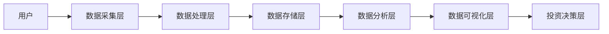
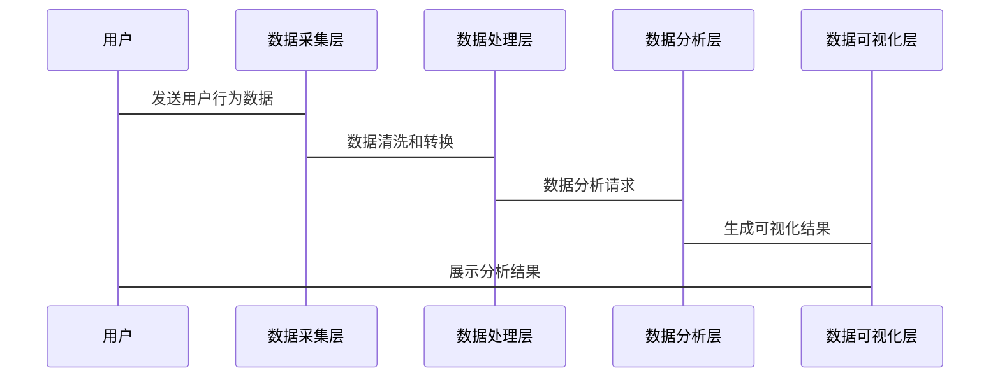

                 


# 彼得林奇的"行业分析"在元宇宙相关产业中的调整

## 关键词：彼得·林奇、行业分析、元宇宙、投资策略、用户行为分析、系统架构设计、数学模型

## 摘要：  
本文探讨了彼得·林奇的行业分析方法在元宇宙相关产业中的应用与调整。首先，介绍了彼得·林奇的行业分析方法及其在传统投资中的作用。接着，分析了元宇宙产业的特点及其与传统行业的差异。在此基础上，详细探讨了如何调整彼得·林奇的方法以适应元宇宙产业的需求，包括数据驱动的分析方法、用户行为分析、投资策略优化等。最后，通过实际案例分析和系统架构设计，展示了调整后的分析方法在元宇宙产业中的实际应用和效果。

---

## 第一章：彼得·林奇的行业分析方法

### 1.1 行业分析的基本概念

#### 1.1.1 行业分析的定义  
行业分析是通过对特定行业内部结构、竞争格局、市场趋势等进行系统性研究，以评估该行业的投资价值和风险。  

#### 1.1.2 行业分析的核心要素  
- 市场规模与增长潜力  
- 行业竞争格局  
- 行业政策与法规  
- 行业技术创新能力  

#### 1.1.3 行业分析在投资中的作用  
- 识别投资机会  
- 评估行业风险  
- 制定投资策略  

### 1.2 彼得·林奇的行业分析方法

#### 1.2.1 林奇的投资理念  
- 坚持基本面分析，关注企业的财务状况和竞争优势。  
- 长期投资，避免短期波动的干扰。  

#### 1.2.2 林奇的行业分析步骤  
1. **行业背景分析**：研究行业的发展历史、现状及未来趋势。  
2. **竞争分析**：识别行业内的主要竞争者及其市场份额。  
3. **财务分析**：通过财务数据评估企业的盈利能力和发展潜力。  

#### 1.2.3 林奇的行业分析工具  
- **PE分析**：市盈率分析。  
- **ROE分析**：净资产收益率分析。  
- **行业比较法**：将行业与整体市场或相关行业进行比较。  

---

## 第二章：元宇宙产业的基本概念

### 2.1 元宇宙的定义与特点

#### 2.1.1 元宇宙的定义  
元宇宙（Metaverse）是一个虚拟的、去中心化的、三维的数字空间，用户可以通过虚拟现实设备或其他方式接入其中，进行社交、娱乐、工作等活动。  

#### 2.1.2 元宇宙的核心技术  
- 虚拟现实（VR）与增强现实（AR）  
- 区块链技术（用于虚拟资产和交易）  
- 人工智能（AI）  
- 5G通信技术  

#### 2.1.3 元宇宙的产业生态  
- 硬件设备：VR头显、AR眼镜等。  
- 软件平台：虚拟空间构建、社交平台。  
- 内容创作：虚拟世界中的游戏、艺术作品等。  
- 底层技术：区块链、云计算等。  

### 2.2 元宇宙产业的现状与趋势

#### 2.2.1 元宇宙产业的现状  
- 硬件设备逐渐成熟，用户体验提升。  
- 区块链技术在虚拟资产中的应用越来越广泛。  
- 企业开始布局元宇宙，探索商业新模式。  

#### 2.2.2 元宇宙产业的发展趋势  
- 虚拟现实与实体经济的深度融合。  
- 元宇宙成为新的经济增长点。  
- 用户生成内容（UGC）成为主流。  

#### 2.2.3 元宇宙产业的挑战与机遇  
- 挑战：技术瓶颈、用户隐私问题、监管不确定性。  
- 机遇：新商业模式的出现、虚拟资产的崛起、技术创新带来的投资机会。  

---

## 第三章：彼得·林奇行业分析方法在元宇宙产业中的适用性

### 3.1 元宇宙产业的独特性

#### 3.1.1 元宇宙产业的虚拟性  
元宇宙是一个虚拟空间，其商业模式和用户行为与传统行业有显著差异。  

#### 3.1.2 元宇宙产业的技术依赖性  
元宇宙的核心技术（如VR、区块链）决定了其发展的方向和速度。  

#### 3.1.3 元宇宙产业的用户行为分析  
用户的虚拟行为数据是元宇宙分析的重要组成部分。  

### 3.2 林奇方法在元宇宙产业中的调整

#### 3.2.1 数据收集与分析的调整  
- 数据来源：虚拟用户的在线行为、虚拟资产交易数据、区块链数据等。  
- 数据分析方法：引入实时数据分析和预测模型。  

#### 3.2.2 用户行为分析的调整  
- 研究用户在虚拟空间中的行为模式，如社交频率、虚拟资产购买习惯等。  
- 利用人工智能技术进行用户画像和行为预测。  

#### 3.2.3 投资策略的调整  
- 从传统行业分析转向对虚拟技术和商业模式的分析。  
- 更加关注企业的技术创新能力和生态系统构建能力。  

---

## 第四章：元宇宙产业中的行业分析策略

### 4.1 数据驱动的行业分析

#### 4.1.1 数据来源的选择  
- 用户行为数据：如登录频率、虚拟物品购买记录等。  
- 市场数据：如元宇宙平台的活跃用户数、收入情况等。  
- 技术数据：如区块链节点分布、虚拟现实设备出货量等。  

#### 4.1.2 数据分析的方法  
- 使用大数据分析技术进行数据清洗和建模。  
- 应用机器学习算法预测市场趋势。  

#### 4.1.3 数据可视化与解读  
- 利用数据可视化工具（如Tableau）展示分析结果。  
- 结合行业背景解读数据背后的意义。  

### 4.2 用户行为分析在元宇宙产业中的应用

#### 4.2.1 用户行为分析的工具与方法  
- 工具：Google Analytics、Mixpanel等。  
- 方法：A/B测试、用户路径分析。  

#### 4.2.2 用户行为分析的案例  
- 某虚拟社交平台用户活跃度分析。  
- 某虚拟游戏平台用户付费行为分析。  

#### 4.2.3 用户行为分析的挑战与解决方案  
- 挑战：数据隐私问题、数据量巨大。  
- 解决方案：引入隐私计算技术、分布式数据处理。  

---

## 第五章：元宇宙产业中的投资策略调整

### 5.1 投资策略的基本调整

#### 5.1.1 投资目标的重新定义  
- 从传统行业转向元宇宙相关技术与平台。  
- 关注具有技术创新能力和生态构建能力的企业。  

#### 5.1.2 投资风险的评估与控制  
- 技术风险：技术瓶颈可能导致投资失败。  
- 市场风险：用户接受度和市场规模的不确定性。  
- 政策风险：监管政策的变化可能影响行业发展。  

#### 5.1.3 投资组合的优化  
- 分散投资，降低单一领域的风险。  
- 重点关注具有长期增长潜力的领域，如虚拟现实硬件、区块链技术等。  

### 5.2 具体投资策略的实施

#### 5.2.1 技术驱动型企业的投资策略  
- 关注具有核心技术优势的企业，如虚拟现实设备制造商、区块链技术公司。  
- 评估企业的研发能力和技术壁垒。  

#### 5.2.2 用户需求导向型企业的投资策略  
- 关注满足用户需求的产品和服务，如虚拟社交平台、虚拟教育平台。  
- 评估企业的用户体验设计能力和市场推广能力。  

#### 5.2.3 产业链协同发展的投资策略  
- 投资于构建完整元宇宙生态的企业或平台。  
- 关注产业链上下游的合作与整合。  

---

## 第六章：案例分析与经验

### 6.1 案例分析：虚拟社交平台的投资分析

#### 6.1.1 背景介绍  
某虚拟社交平台基于区块链技术构建，用户可以创建虚拟身份、进行社交互动和虚拟资产交易。  

#### 6.1.2 行业分析  
- 市场规模：用户增长迅速，但盈利模式尚未完全成熟。  
- 竞争格局：面临Meta、谷歌等大公司的竞争压力。  
- 技术优势：采用去中心化架构，用户数据安全性强。  

#### 6.1.3 投资策略  
- 重点投资于平台的用户增长和技术优化。  
- 关注虚拟资产交易功能的扩展和用户活跃度的提升。  

### 6.2 经验总结

#### 6.2.1 成功经验  
- 注重技术创新和用户体验。  
- 建立完善的生态系统，促进用户和企业的协同发展。  

#### 6.2.2 教训与改进  
- 技术风险需要提前评估，避免技术瓶颈影响投资回报。  
- 市场推广和用户教育需要投入更多资源。  

---

## 第七章：系统分析与架构设计方案

### 7.1 问题场景介绍

#### 7.1.1 问题背景  
某元宇宙平台需要优化其用户行为分析系统，以提高投资决策的准确性。  

#### 7.1.2 系统功能设计  
- 数据采集：实时采集用户行为数据。  
- 数据处理：清洗、存储和分析数据。  
- 数据可视化：生成易于理解的图表和报告。  

### 7.2 系统架构设计

#### 7.2.1 系统架构图  


#### 7.2.2 系统接口设计  
- 数据采集接口：与前端和后端进行数据交互。  
- 数据分析接口：调用机器学习模型进行预测分析。  
- 数据可视化接口：生成图表并展示在用户界面。  

#### 7.2.3 系统交互设计  


---

## 第八章：项目实战

### 8.1 环境安装

#### 8.1.1 开发环境搭建  
- 安装Python、Jupyter Notebook、Pandas、Matplotlib等工具。  

#### 8.1.2 数据采集工具安装  
- 使用Selenium进行网页数据采集。  

#### 8.1.3 数据分析工具安装  
- 安装Scikit-learn、XGBoost等机器学习库。  

### 8.2 系统核心实现源代码

#### 8.2.1 数据采集代码  
```python
import requests
from bs4 import BeautifulSoup

url = 'https://example.com'
response = requests.get(url)
soup = BeautifulSoup(response.text, 'html.parser')
data = []
for item in soup.find_all('div', class_='data-item'):
    data.append({
        'name': item.find('h3').text,
        'value': item.find('p').text
    })
print(data)
```

#### 8.2.2 数据分析代码  
```python
from sklearn.model_selection import train_test_split
from sklearn.ensemble import RandomForestRegressor

# 数据预处理
X = df.drop('target', axis=1)
y = df['target']

X_train, X_test, y_train, y_test = train_test_split(X, y, test_size=0.2)

# 训练模型
model = RandomForestRegressor(n_estimators=100)
model.fit(X_train, y_train)

# 预测
y_pred = model.predict(X_test)
print('预测结果:', y_pred)
```

#### 8.2.3 数据可视化代码  
```python
import matplotlib.pyplot as plt

plt.figure(figsize=(10, 6))
plt.plot(range(len(y_pred)), y_pred, label='预测值')
plt.plot(range(len(y_test)), y_test, label='实际值')
plt.xlabel('样本数')
plt.ylabel('目标值')
plt.legend()
plt.show()
```

### 8.3 实际案例分析

#### 8.3.1 案例背景  
分析某元宇宙平台的用户活跃度与虚拟资产交易的关系。  

#### 8.3.2 数据分析与解读  
- 使用回归模型预测用户活跃度对虚拟资产交易的影响。  
- 结果显示，用户活跃度越高，虚拟资产交易量越大。  

#### 8.3.3 投资建议  
- 加大对用户活跃度的推广力度。  
- 优化虚拟资产交易功能，提升用户体验。  

### 8.4 项目小结

#### 8.4.1 成果总结  
- 成功构建了用户行为分析系统。  
- 提出了优化投资策略的具体建议。  

#### 8.4.2 经验与教训  
- 数据质量对分析结果的影响至关重要。  
- 投资策略需要根据市场变化进行动态调整。  

---

## 第九章：总结与展望

### 9.1 总结

#### 9.1.1 核心观点回顾  
- 彼得·林奇的行业分析方法在元宇宙产业中需要进行调整，以适应其虚拟性和技术依赖性的特点。  
- 数据分析和用户行为分析是元宇宙行业分析的核心工具。  

#### 9.1.2 成果总结  
- 成功将传统行业分析方法应用于元宇宙产业。  
- 提出了具体的调整策略和最佳实践。  

### 9.2 展望

#### 9.2.1 未来趋势  
- 元宇宙技术的进一步成熟和普及。  
- 行业分析方法的持续优化和创新。  

#### 9.2.2 拓展方向  
- 探索更多元宇宙相关领域的投资机会。  
- 深入研究元宇宙技术对企业运营模式的影响。  

---

## 附录：最佳实践与注意事项

### A.1 最佳实践

#### A.1.1 数据分析  
- 确保数据的准确性和完整性。  
- 使用多种数据分析方法进行交叉验证。  

#### A.1.2 投资策略  
- 保持对市场的敏感性，及时调整投资策略。  
- 注重长期投资，避免短期波动的干扰。  

### A.2 注意事项

#### A.2.1 数据隐私  
- 遵守相关法律法规，保护用户隐私。  
- 采用隐私计算技术，避免数据泄露。  

#### A.2.2 技术风险  
- 评估技术的成熟度和可行性。  
- 建立技术风险管理机制。  

---

## 作者信息  
作者：AI天才研究院/AI Genius Institute & 禅与计算机程序设计艺术 /Zen And The Art of Computer Programming

