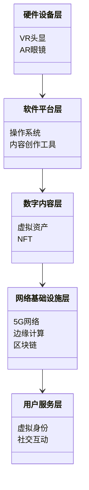
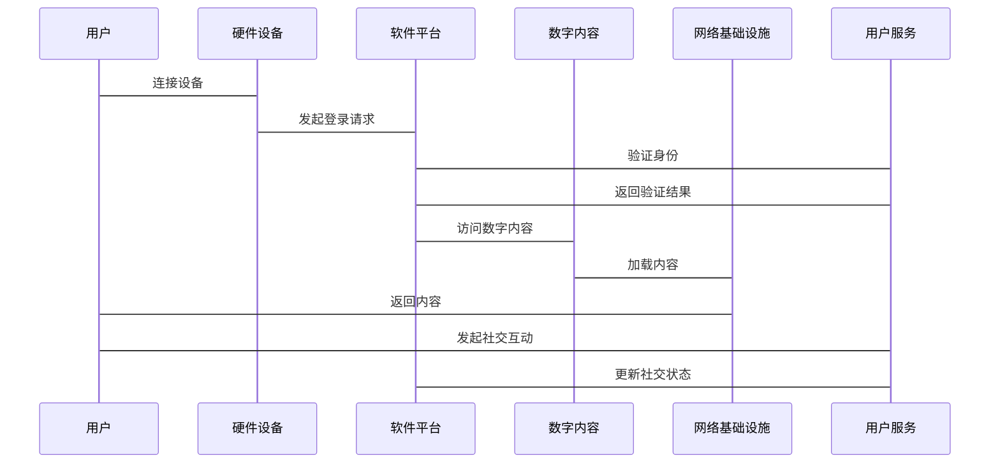

                 


# 彼得林奇的"行业分析"在元宇宙相关产业链中的框架创新

## 关键词：彼得林奇，行业分析，元宇宙，产业链，框架创新

## 摘要：  
本文通过分析彼得林奇的行业分析方法，探讨其在元宇宙产业链中的应用与创新。结合元宇宙产业链的特点，提出了一套创新的行业分析框架，详细阐述了该框架的核心要素、系统架构设计及实际应用案例，为元宇宙产业链的分析与投资提供了新的视角。

---

## 第一部分：彼得林奇的行业分析方法与元宇宙产业链的结合

### 第1章：彼得林奇的行业分析方法概述

#### 1.1 彼得林奇的行业分析方法

##### 1.1.1 行业分析的基本概念
行业分析是投资决策中的重要环节，旨在通过对行业整体情况的了解，评估企业的经营环境和竞争优势。彼得林奇（Peter Lynch）作为著名投资经理，提出了一系列行业分析方法，强调关注行业生命周期、竞争结构和财务指标。

##### 1.1.2 彼得林奇行业分析的核心要素
- **行业生命周期分析**：分析行业所处的生命周期阶段（导入期、成长期、成熟期、衰退期），判断行业的增长潜力和风险。
- **行业竞争结构分析**：通过分析行业的竞争格局，识别行业中的主要企业、潜在进入者、替代品威胁等，评估行业的竞争强度。
- **行业财务指标分析**：通过分析行业的财务指标（如收入增长率、利润率、资产负债率等），评估行业的财务健康状况和盈利能力。

##### 1.1.3 行业分析在投资决策中的作用
行业分析能够帮助投资者识别行业风险和机会，评估企业的经营环境，从而做出更明智的投资决策。彼得林奇强调，成功的投资不仅需要分析企业本身，还需要深入理解其所处的行业环境。

#### 1.2 元宇宙产业链的定义与结构

##### 1.2.1 元宇宙的定义与特点
元宇宙（Metaverse）是一个虚拟的三维空间，通过区块链、虚拟现实（VR）、增强现实（AR）、人工智能（AI）等技术构建的去中心化数字世界。元宇宙的特点包括开放性、沉浸式体验、去中心化和实时性。

##### 1.2.2 元宇宙产业链的构成
元宇宙产业链由多个环节构成，包括硬件设备（如VR头显、AR眼镜）、软件平台（如操作系统、内容创作工具）、网络基础设施（如5G、边缘计算）、数字内容（如虚拟资产、NFT）、用户服务（如虚拟身份、社交互动）等。

##### 1.2.3 元宇宙产业链的关键环节
- **硬件设备**：提供沉浸式体验的基础，如 Oculus、HoloLens 等。
- **软件平台**：支撑元宇宙运行的核心，如 Meta 的 Horizon Worlds、Decentraland 等。
- **数字内容**：元宇宙的核心价值所在，包括虚拟资产、NFT 等。
- **网络基础设施**：支撑元宇宙运行的底层技术，如5G、边缘计算、区块链等。

### 第2章：彼得林奇行业分析框架的核心要素

#### 2.1 彼得林奇行业分析的核心要素

##### 2.1.1 行业生命周期分析
行业生命周期分析是彼得林奇行业分析的重要组成部分。通过分析行业所处的生命周期阶段，可以判断行业的增长潜力和投资风险。例如，在成长期的行业通常具有较高的增长潜力，而在衰退期的行业则面临较大的下行风险。

##### 2.1.2 行业竞争结构分析
彼得林奇强调竞争结构对行业投资价值的影响。通过分析行业的竞争格局，可以识别行业中的主要竞争对手、潜在进入者和替代品威胁。例如，在竞争激烈的行业，企业可能面临较低的利润率和较高的经营风险。

##### 2.1.3 行业财务指标分析
行业财务指标分析是彼得林奇行业分析的重要工具。通过分析行业的收入增长率、利润率、资产负债率等财务指标，可以评估行业的财务健康状况和盈利能力。例如，收入增长率较高的行业通常具有较高的增长潜力。

#### 2.2 元宇宙产业链的行业特征

##### 2.2.1 元宇宙产业链的行业生命周期
元宇宙产业链目前处于成长期，随着技术的不断进步和市场需求的增加，行业有望在未来几年内保持快速增长。然而，部分细分领域（如硬件设备）可能已经进入成熟期。

##### 2.2.2 元宇宙产业链的竞争结构
元宇宙产业链的竞争结构复杂，涉及多个环节和参与者。例如，在硬件设备领域，主要竞争者包括 Oculus、HoloLens 等；在软件平台领域，主要竞争者包括 Meta、Decentraland 等。此外，元宇宙的去中心化特性也带来了新的竞争形式，例如区块链技术的应用。

##### 2.2.3 元宇宙产业链的财务指标分析
元宇宙产业链的财务指标分析需要结合行业特点进行。例如，硬件设备制造商的收入增长率和利润率通常较高，而数字内容创作者的收入可能主要依赖于虚拟资产和NFT的销售。

### 第3章：元宇宙产业链的行业分析框架创新

#### 3.1 元宇宙产业链的行业分析框架

##### 3.1.1 框架的设计思路
结合彼得林奇的行业分析方法，设计一套适用于元宇宙产业链的行业分析框架。该框架需要考虑元宇宙产业链的特殊性，例如去中心化、沉浸式体验、数字内容等。

##### 3.1.2 框架的核心要素
- **行业生命周期分析**：分析元宇宙产业链的整体生命周期，判断行业的增长潜力和投资风险。
- **行业竞争结构分析**：分析元宇宙产业链的竞争格局，识别行业中的主要竞争者和潜在进入者。
- **行业财务指标分析**：分析元宇宙产业链的财务指标，评估行业的财务健康状况和盈利能力。
- **数字内容分析**：分析元宇宙产业链中的数字内容，评估其对行业价值的影响。

##### 3.1.3 框架的创新点
与传统行业分析框架相比，元宇宙产业链的行业分析框架具有以下创新点：
- **数字内容分析**：将数字内容（如NFT、虚拟资产）纳入分析范围，评估其对行业价值的影响。
- **去中心化分析**：分析元宇宙产业链的去中心化特性，评估其对行业竞争结构的影响。
- **技术驱动分析**：结合区块链、VR、AR等技术，分析其对行业发展的推动作用。

#### 3.2 框架与彼得林奇行业分析的对比

##### 3.2.1 框架的核心要素对比
- **行业生命周期分析**：与彼得林奇的行业生命周期分析相似，但更加关注元宇宙产业链的特殊性。
- **行业竞争结构分析**：与彼得林奇的竞争结构分析相似，但更加复杂，涉及去中心化和数字内容。
- **行业财务指标分析**：与彼得林奇的财务指标分析相似，但需要结合元宇宙产业链的特殊性进行调整。

##### 3.2.2 框架的创新点对比
- **数字内容分析**：传统行业分析框架未将数字内容纳入分析范围，而元宇宙产业链的行业分析框架进行了创新。
- **去中心化分析**：传统行业分析框架未考虑去中心化特性，而元宇宙产业链的行业分析框架进行了补充。
- **技术驱动分析**：传统行业分析框架未将技术作为核心驱动力，而元宇宙产业链的行业分析框架进行了强调。

---

## 第二部分：元宇宙产业链的系统分析与架构设计

### 第4章：元宇宙产业链的系统分析与架构设计

#### 4.1 元宇宙产业链的系统分析

##### 4.1.1 系统分析的定义与方法
系统分析是对系统的整体结构和功能进行分析，以便更好地理解和优化系统。在元宇宙产业链中，系统分析可以帮助我们理解各环节之间的关系和相互作用。

##### 4.1.2 元宇宙产业链的系统构成
元宇宙产业链的系统构成包括硬件设备、软件平台、数字内容、网络基础设施和用户服务五个部分。

##### 4.1.3 系统分析的关键指标
系统分析的关键指标包括系统性能、用户体验、安全性、可扩展性和去中心化程度等。

#### 4.2 元宇宙产业链的架构设计

##### 4.2.1 架构设计的原则与方法
架构设计需要遵循模块化、可扩展性和安全性原则。在元宇宙产业链中，架构设计需要考虑去中心化、实时性和沉浸式体验等特性。

##### 4.2.2 元宇宙产业链的架构模型
通过 mermaid 类图展示元宇宙产业链的架构模型，包括硬件设备层、软件平台层、数字内容层、网络基础设施层和用户服务层。



##### 4.2.3 架构设计的创新点
元宇宙产业链的架构设计创新点包括：
- **去中心化架构**：采用区块链技术实现去中心化，确保数据的安全性和不可篡改性。
- **实时性架构**：通过5G和边缘计算技术实现低延迟和高实时性，确保沉浸式体验。
- **模块化架构**：各层之间相对独立，便于系统的扩展和维护。

#### 4.3 元宇宙产业链的系统交互设计

##### 4.3.1 系统交互的定义与方法
系统交互设计是指设计系统各部分之间的交互流程和通信方式。在元宇宙产业链中，系统交互设计需要考虑用户与硬件设备、软件平台、数字内容和用户服务之间的互动。

##### 4.3.2 系统交互的 mermaid 序列图
通过 mermaid 序列图展示元宇宙产业链的系统交互流程，包括用户登录、虚拟身份创建、数字内容访问和社交互动等。



---

## 第三部分：元宇宙产业链的项目实战

### 第5章：元宇宙产业链的项目实战

#### 5.1 项目背景与目标

##### 5.1.1 项目背景
本项目旨在通过彼得林奇的行业分析框架，对元宇宙产业链中的虚拟现实设备行业进行分析，识别行业中的投资机会和风险。

##### 5.1.2 项目目标
- 分析虚拟现实设备行业的市场现状和竞争格局。
- 评估虚拟现实设备行业的财务状况和增长潜力。
- 提出基于彼得林奇行业分析框架的投资建议。

#### 5.2 项目实施与分析

##### 5.2.1 项目实施步骤
1. **数据收集**：收集虚拟现实设备行业的市场数据、财务数据和竞争数据。
2. **行业分析**：应用彼得林奇的行业分析框架，对虚拟现实设备行业进行分析。
3. **投资评估**：根据分析结果，评估行业的投资价值，提出投资建议。

##### 5.2.2 项目分析方法
- **行业生命周期分析**：判断虚拟现实设备行业所处的生命周期阶段。
- **行业竞争结构分析**：识别行业中的主要竞争者和潜在进入者。
- **行业财务指标分析**：分析虚拟现实设备行业的收入增长率、利润率等财务指标。

##### 5.2.3 核心代码实现
以下是基于Python的行业分析代码示例：

```python
import pandas as pd
import numpy as np

# 数据收集
data = {
    '公司': ['A', 'B', 'C'],
    '收入增长率': [20, 15, 25],
    '利润率': [10, 12, 8],
    '资产负债率': [40, 35, 45]
}
df = pd.DataFrame(data)

# 行业生命周期分析
def industry_lifecycle(growth_rate, profit_margin):
    if growth_rate > 20 and profit_margin > 10:
        return '成长期'
    elif growth_rate < 10 and profit_margin < 5:
        return '衰退期'
    else:
        return '成熟期'

# 行业竞争结构分析
def competition_analysis(data):
    competitors = data['公司']
    max_market_share = max(data['收入增长率'])
    return f"主要竞争者：{competitors[0]}，市场份额：{max_market_share}%"

# 行业财务指标分析
def financial_analysis(data):
    avg_profit_margin = np.mean(data['利润率'])
    return f"平均利润率：{avg_profit_margin}%"

# 投资建议
def investment_recommendation(data):
    lifecycle = industry_lifecycle(data['收入增长率'], data['利润率'])
    competition = competition_analysis(data)
    financial = financial_analysis(data)
    return f"行业生命周期阶段：{lifecycle}\n竞争结构分析：{competition}\n财务指标分析：{financial}"

# 示例分析
analysis = investment_recommendation(df)
print(analysis)
```

##### 5.2.4 案例分析
以虚拟现实设备行业为例，应用上述代码进行分析，得出行业的生命周期阶段为成长期，主要竞争者为公司A，市场份额为20%。平均利润率为15%。根据分析结果，提出投资建议：重点关注公司A，同时注意行业竞争加剧的风险。

---

## 第四部分：总结与展望

### 第6章：总结与展望

#### 6.1 总结
本文通过分析彼得林奇的行业分析方法，提出了一套适用于元宇宙产业链的行业分析框架。该框架结合了元宇宙产业链的特点，创新性地将数字内容、去中心化和实时性纳入分析范围，为元宇宙产业链的分析与投资提供了新的视角。

#### 6.2 未来展望
未来的研究可以进一步深化元宇宙产业链的行业分析，探索更多创新的分析方法。例如，结合人工智能技术，提高行业分析的准确性和效率；研究元宇宙产业链的跨国运营和全球化竞争策略；探索元宇宙产业链中的新兴商业模式等。

---

## 附录：扩展阅读资料

- 彼得林奇的《投资之道》
- 元宇宙相关技术白皮书
- 区块链、VR、AR等技术的详细介绍

---

## 作者信息

作者：AI天才研究院/AI Genius Institute & 禅与计算机程序设计艺术 /Zen And The Art of Computer Programming

