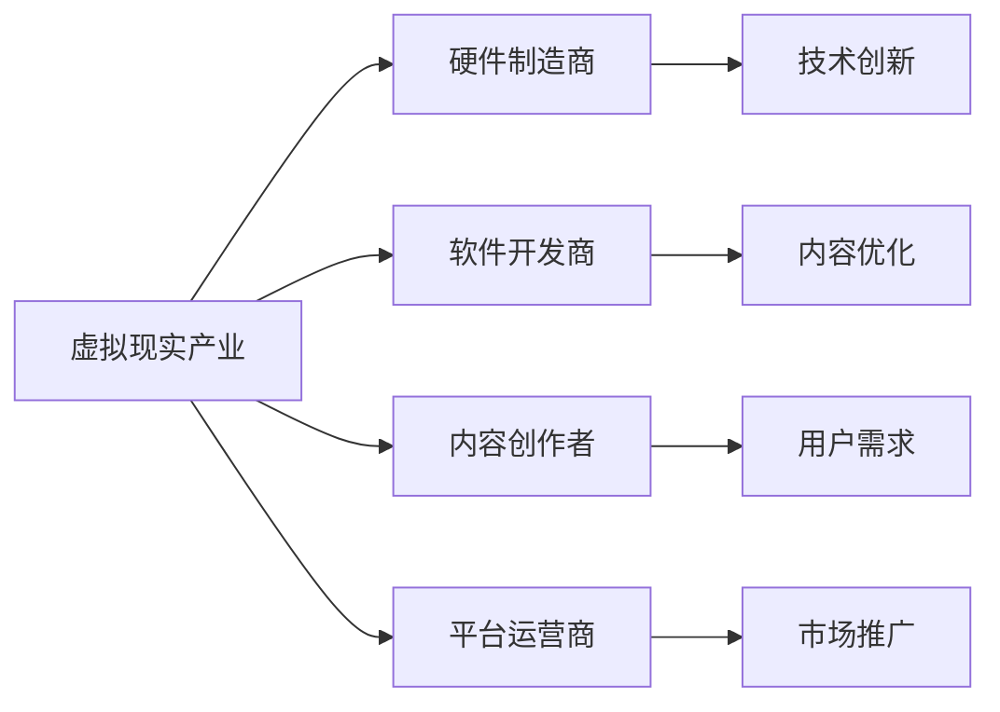
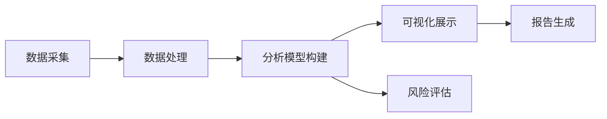

                 


# 彼得林奇的"行业分析"在虚拟现实产业中的调整

## 关键词
- 彼得林奇
- 行业分析
- 虚拟现实
- 投资策略
- 产业趋势
- 技术分析
- 风险管理

## 摘要
本文探讨了彼得·林奇的行业分析方法在虚拟现实产业中的应用与调整。通过分析虚拟现实产业的现状、技术趋势和市场动态，结合彼得林奇的行业分析框架，提出了一套适用于虚拟现实产业的分析方法。文章详细介绍了如何通过关键指标、市场趋势和竞争格局的分析，优化投资策略和企业战略，并提供了系统的架构设计和实际案例分析。

---

## 第一部分：彼得·林奇行业分析方法概述

### 第1章：彼得·林奇的行业分析方法

#### 1.1 彼得·林奇的背景与投资理念
- **1.1.1 彼得·林奇的个人简介**
  - 彼得·林奇是美国著名投资家，曾任富达投资集团麦哲伦基金的经理，以其出色的选股能力和投资业绩闻名。
  - 林奇强调基本面分析和行业研究，认为行业分析是投资成功的关键。

- **1.1.2 林奇的投资哲学与成功案例**
  - 林奇的投资哲学强调长期持有优质股票，注重企业的基本面和行业趋势。
  - 成功案例包括可口可乐、露华浓等企业的投资，这些企业在其行业中的竞争优势显著。

- **1.1.3 行业分析在林奇投资策略中的重要性**
  - 林奇认为，行业分析是选股的基础，只有深入了解行业趋势和竞争格局，才能找到具有长期增长潜力的企业。

#### 1.2 林奇行业分析的核心方法
- **1.2.1 行业分析的基本步骤**
  - 收集行业数据：包括市场规模、增长率、主要企业市场份额等。
  - 分析行业趋势：包括技术进步、市场需求变化、政策影响等。
  - 评估竞争格局：分析行业内主要竞争对手的优势和劣势。

- **1.2.2 关键指标与数据的筛选**
  - 市场规模：行业的总收入和增长潜力。
  - 市场份额：主要企业的市场份额和竞争优势。
  - 财务指标：企业的盈利能力、成长性、财务健康状况。

- **1.2.3 行业趋势与竞争格局的评估**
  - 行业趋势：技术进步、政策变化、市场需求变化。
  - 竞争格局：行业内主要企业的竞争策略、市场份额变化。

---

## 第二部分：虚拟现实产业的现状与趋势

### 第2章：虚拟现实产业的现状分析

#### 2.1 虚拟现实产业的定义与范围
- **2.1.1 VR与AR的定义与区别**
  - VR（Virtual Reality）：完全沉浸式的虚拟环境，通过头戴设备实现。
  - AR（Augmented Reality）：增强现实，将虚拟元素叠加在现实环境中。
  - 区别：VR强调虚拟环境的完全沉浸，AR强调虚拟与现实的结合。

- **2.1.2 产业链构成与主要参与者**
  - 产业链构成：硬件制造商（如 Oculus、HTC）、软件开发商（如 Unity、Unreal）、内容创作者（如游戏开发商）、平台运营商（如 Facebook、谷歌）。
  - 主要参与者：科技巨头（如 Meta、苹果、谷歌）和初创企业（如 Oculus、Pico）。

- **2.1.3 当前市场规模与增长预测**
  - 根据市场研究机构的数据，全球VR市场规模预计在未来几年将以超过30%的速度增长。
  - 主要驱动力：游戏、教育、医疗、工业应用等领域的需求增长。

#### 2.2 虚拟现实技术的最新发展
- **2.2.1 关键技术的突破与应用**
  - 头显技术：高分辨率屏幕、低延迟、轻量化设计。
  - 交互技术：手势识别、眼球追踪、语音识别。
  - 内容生成：虚拟现实内容的制作技术，包括3D建模、实时渲染。

- **2.2.2 主流硬件与软件平台的分析**
  - 硬件：Oculus Rift、HTC Vive、Sony PlayStation VR。
  - 软件平台：Unity、Unreal Engine、Google Earth VR。

- **2.2.3 行业标准与规范化进展**
  - 行业标准：如 OpenXR，旨在统一跨平台的API接口。
  - 规范化进展：主要体现在硬件性能、内容格式、用户体验等方面。

---

## 第三部分：彼得·林奇方法在虚拟现实产业中的应用

### 第3章：行业分析框架的构建

#### 3.1 构建虚拟现实产业的分析框架
- **3.1.1 确定分析维度与指标**
  - 市场规模：全球VR市场规模、区域市场分布。
  - 市场增长率：年复合增长率（CAGR）。
  - 主要企业的市场份额：如Meta、Oculus、HTC等。
  - 技术进步：硬件性能提升、软件平台优化。

- **3.1.2 产业链各环节的关联性分析**
  - 硬件与软件的协同发展：硬件性能提升依赖软件优化，软件平台的成功需要硬件支持。
  - 内容生态的建设：内容丰富度直接影响用户体验和市场增长。

- **3.1.3 竞争格局的可视化表示**



---

### 第4章：关键指标与数据的筛选

#### 4.1 财务指标的筛选与分析
- **4.1.1 主要企业的财务数据收集与整理**
  - 收入与利润：如Meta的VR业务收入、HTC的VR设备销售收入。
  - 研发投入：企业的研发投入占总收入的比例。
  - 净利润：企业的盈利能力。

- **4.1.2 关键财务指标的计算与对比**
  - 市盈率（P/E）：用于评估企业的估值。
  - 市净率（P/B）：用于评估企业的资产价值。
  - 营业利润率：用于评估企业的盈利能力。

- **4.1.3 财务健康状况的评估与预测**
  - 财务健康：通过现金流、负债率、利润率等指标评估企业的财务状况。
  - 市场预测：基于历史财务数据和行业趋势，预测企业的未来财务表现。

#### 4.2 市场趋势的预测与分析
- **4.2.1 市场需求的预测模型构建**
  - 使用ARIMA模型预测市场规模。
  - 考虑影响市场需求的主要因素：技术创新、政策支持、消费者偏好。

- **4.2.2 技术进步对市场的影响分析**
  - 技术进步：硬件性能提升、软件优化、交互技术进步。
  - 对市场的影响：技术进步将推动市场需求增长，提升用户体验。

- **4.2.3 消费者行为变化的监测与分析**
  - 消费者偏好：消费者对VR设备的接受度、使用频率。
  - 影响因素：价格、性能、内容丰富度。

---

## 第四部分：应用案例与策略调整

### 第5章：虚拟现实产业中的案例分析

#### 5.1 成功企业的分析与借鉴
- **5.1.1 主流企业的运营模式分析**
  - Meta：通过 Oculus 支持虚拟现实生态，整合社交网络和内容平台。
  - HTC：专注于硬件设备的研发和销售，推动B2B市场的发展。
  - Unity：通过提供开发工具和服务，构建虚拟现实内容生态。

- **5.1.2 核心竞争力的识别与评价**
  - Meta的核心竞争力：强大的社交网络和内容生态。
  - HTC的核心竞争力：高端硬件设备的技术优势。
  - Unity的核心竞争力：领先的3D开发工具和平台。

- **5.1.3 经验总结与策略调整**
  - 技术创新是核心竞争力的关键。
  - 生态系统的建设是行业发展的关键。

#### 5.2 潜在风险与应对策略
- **5.2.1 产业中的主要风险因素识别**
  - 技术风险：硬件性能不足、软件平台不够完善。
  - 市场风险：市场需求低于预期。
  - 竞争风险：新进入者的竞争压力。

- **5.2.2 风险评估模型的构建与应用**
  - 使用风险矩阵评估主要风险因素。
  - 根据风险概率和影响程度制定应对策略。

- **5.2.3 应对策略的制定与实施**
  - 技术创新：加大研发投入，提升硬件性能和软件优化。
  - 市场推广：通过营销活动和用户教育提升市场需求。
  - 竞争策略：通过差异化竞争和合作建立竞争优势。

---

### 第6章：行业分析结果的应用与策略调整

#### 6.1 投资策略的制定与优化
- **6.1.1 投资组合的构建与调整**
  - 根据行业分析结果，选择具有竞争优势的企业进行投资。
  - 调整投资组合，分散风险。

- **6.1.2 投资风险的控制与管理**
  - 通过多元化投资降低风险。
  - 定期评估投资组合，及时调整。

- **6.1.3 长期与短期投资目标的平衡**
  - 长期目标：通过长期持有优质股票获得超额收益。
  - 短期目标：通过短期交易捕捉市场波动。

#### 6.2 企业战略的调整与优化
- **6.2.1 企业战略目标的重新设定**
  - 根据行业分析结果，重新评估企业的战略目标。
  - 确定企业的核心竞争力和市场定位。

- **6.2.2 资源配置的优化与调整**
  - 根据行业分析结果，优化资源配置，加大技术研发投入。
  - 调整组织结构，提升运营效率。

- **6.2.3 创新驱动与成本控制的平衡**
  - 创新驱动：通过技术创新提升产品竞争力。
  - 成本控制：通过优化生产流程降低成本。

---

## 第五部分：系统架构与技术实现

### 第7章：系统架构设计

#### 7.1 系统功能模块划分
- **7.1.1 数据采集与处理模块**
  - 数据来源：公开财报、行业报告、市场数据。
  - 数据处理：清洗、整理、分析。

- **7.1.2 分析模型构建模块**
  - 使用ARIMA模型预测市场规模。
  - 构建竞争格局分析模型。

- **7.1.3 可视化展示模块**
  - 使用图表展示分析结果。
  - 提供直观的可视化报告。

#### 7.2 系统架构设计



---

### 第8章：项目实战与代码实现

#### 8.1 环境安装
- **8.1.1 安装Python**
  - 使用Anaconda或虚拟环境安装Python 3.8以上版本。
- **8.1.2 安装数据分析库**
  - pandas、numpy、scikit-learn、statsmodels。

#### 8.2 核心实现源代码
- **8.2.1 使用ARIMA模型预测市场规模**

```python
import pandas as pd
from statsmodels.tsa.arima_model import ARIMA
import matplotlib.pyplot as plt

# 数据加载
data = pd.read_csv('vr_market_size.csv')
data['date'] = pd.to_datetime(data['date'])
data.set_index('date', inplace=True)

# 模型训练
model = ARIMA(data['revenue'], order=(5,1,0))
model_fit = model.fit()

# 预测未来5年的市场规模
forecast = model_fit.forecast(steps=5)
print(forecast)
```

#### 8.3 代码应用解读与分析
- **8.3.1 数据加载与预处理**
  - 加载数据并将其转换为时间序列数据。
  - 设置日期为索引，方便后续分析。

- **8.3.2 模型训练**
  - 使用ARIMA模型训练数据，选择适当的阶数（5,1,0）。
  - 训练完成后，模型将用于预测市场规模。

- **8.3.3 预测与可视化**
  - 预测未来5年的市场规模。
  - 将预测结果可视化，与历史数据对比。

#### 8.4 实际案例分析
- **8.4.1 案例背景**
  - 数据来源：虚拟现实设备的市场规模数据，2015年至今。
  - 数据特征：市场规模呈快速增长趋势，年复合增长率超过30%。

- **8.4.2 预测结果与分析**
  - 预测结果：未来5年市场规模将保持快速增长，年复合增长率约为35%。
  - 结论：虚拟现实产业具有较大的增长潜力，值得长期关注。

#### 8.5 项目小结
- **8.5.1 项目成果**
  - 成功构建了虚拟现实产业的分析框架。
  - 使用ARIMA模型预测了市场规模，为投资决策提供了依据。
- **8.5.2 经验总结**
  - 数据质量是分析结果准确性的关键。
  - 模型选择需要根据数据特征进行调整。

---

## 第六部分：最佳实践与未来展望

### 第9章：最佳实践与小结

#### 9.1 最佳实践 tips
- **数据驱动决策**
  - 依赖高质量的数据和准确的分析结果。
- **持续学习与更新**
  - 虚拟现实产业技术更新快，需要持续关注行业动态。
- **风险管理**
  - 在投资和企业战略中，始终关注潜在风险并制定应对策略。

#### 9.2 总结
- 本文通过将彼得·林奇的行业分析方法应用于虚拟现实产业，构建了适用于该行业的分析框架。
- 通过实际案例分析和系统设计，展示了如何利用数据分析技术优化投资策略和企业战略。

### 第10章：未来展望

#### 10.1 未来研究方向
- **技术进步**
  - 研究更先进的虚拟现实技术（如元宇宙、脑机接口）。
- **市场动态**
  - 关注新兴市场的增长潜力和政策变化。
- **投资策略**
  - 探索更多量化分析方法，提升投资决策的科学性。

#### 10.2 风险管理
- **长期与短期策略**
  - 在长期投资中注重企业的核心竞争力。
  - 在短期操作中关注市场波动和政策变化。
- **分散投资**
  - 通过多元化投资降低风险。

---

## 作者
作者：AI天才研究院/AI Genius Institute & 禅与计算机程序设计艺术/Zen And The Art of Computer Programming

