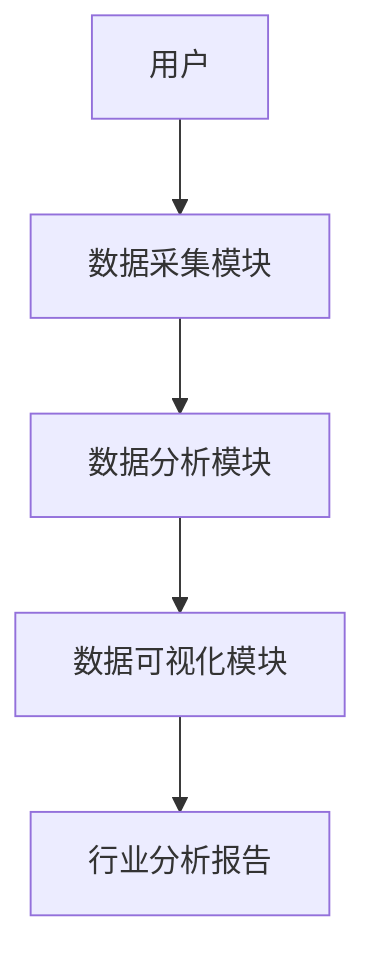
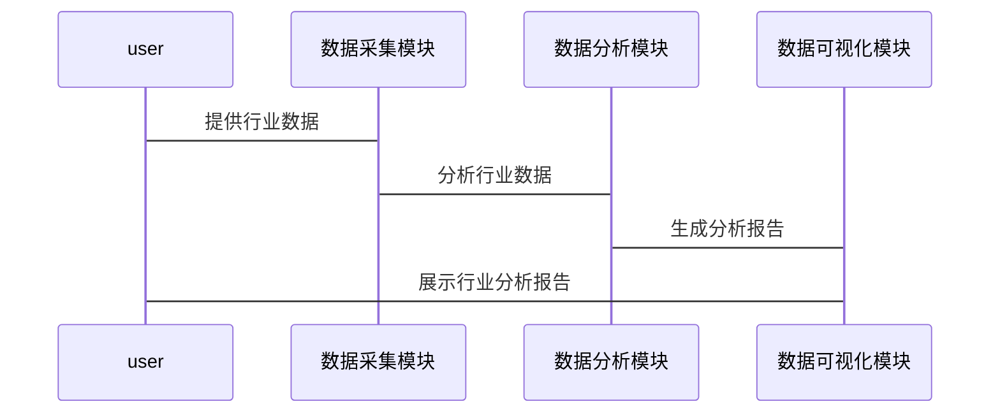

                 


# 彼得林奇的行业分析方法

> 关键词：行业分析，彼得林奇，投资策略，财务指标，竞争分析

> 摘要：本文详细介绍了彼得林奇的行业分析方法，包括行业分析的重要性、核心概念、算法原理、系统架构设计以及实际项目实战。通过分析行业生命周期、竞争优势、企业特性等关键因素，结合数学模型和实际案例，帮助投资者更好地理解和应用彼得林奇的行业分析方法。

---

## 第1章: 行业分析的重要性

### 1.1 行业分析的核心概念

#### 1.1.1 什么是行业分析
行业分析是研究某一行业内的企业及其竞争环境、市场趋势、财务状况等，以评估行业的健康状况和投资潜力。彼得林奇认为，行业分析是投资决策的基础，只有了解行业，才能做出明智的投资选择。

#### 1.1.2 行业分析的必要性
- 行业分析帮助投资者识别行业中的优势企业。
- 行业分析能够揭示行业内的潜在风险和机会。
- 行业分析是制定投资策略的重要依据。

#### 1.1.3 行业分析的基本框架
行业分析通常包括以下几个方面：
1. 行业生命周期分析
2. 行业竞争结构分析
3. 行业财务状况分析

### 1.2 彼得林奇的行业分析方法

#### 1.2.1 彼得林奇的背景与投资理念
彼得林奇是美国著名的基金经理，以其独特的投资风格和对行业分析的深入研究而闻名。他认为，成功的投资不仅依赖于对公司的分析，还需要对整个行业进行深入研究。

#### 1.2.2 彼得林奇行业分析的核心思想
彼得林奇强调，行业分析的核心是识别行业的竞争优势和潜在风险。他通过分析行业的财务指标、市场趋势和竞争格局，来评估行业的投资价值。

#### 1.2.3 彼得林奇方法与其他行业分析方法的区别
与传统的行业分析方法相比，彼得林奇的方法更加注重实际操作和案例分析。他通过具体案例，展示了如何将行业分析应用于实际投资决策中。

---

## 第2章: 行业分析的核心要素

### 2.1 行业生命周期分析

#### 2.1.1 行业生命周期的四个阶段
1. **导入期**：行业刚刚起步，市场需求较低，竞争较小。
2. **成长期**：行业快速发展，市场需求增加，竞争加剧。
3. **成熟期**：行业增长放缓，竞争趋于稳定。
4. **衰退期**：行业市场需求下降，企业盈利能力减弱。

#### 2.1.2 不同阶段的行业特征
| 阶段       | 市场需求 | 竞争状况 | 利润率变化 |
|------------|----------|----------|------------|
| 导入期     | 低       | 小       | 低          |
| 成长期     | 高       | 增加     | 提高         |
| 成熟期     | 稳定     | 稳定     | 稳定         |
| 衰退期     | 下降     | 减少     | 下降         |

#### 2.1.3 如何判断行业所处阶段
通过分析行业的市场规模增长率、竞争企业数量、市场需求变化等指标，可以判断行业所处的生命周期阶段。

### 2.2 行业的竞争结构分析

#### 2.2.1 五力模型在行业分析中的应用
五力模型由迈克尔·波特提出，包括：
1. 新进入者的威胁
2. 替代品的威胁
3. 买方的议价能力
4. 供应商的议价能力
5. 行业内的竞争程度

#### 2.2.2 行业的竞争格局
- 垄断型行业：少数几家企业控制市场。
- 垄断竞争型行业：许多企业竞争，产品差异化。
- 完全竞争型行业：大量企业竞争，产品无差异化。

#### 2.2.3 关键成功因素分析
通过分析行业内成功企业的特点，识别行业的关键成功因素，如成本控制、技术创新、品牌影响力等。

### 2.3 行业的财务指标分析

#### 2.3.1 行业财务指标的定义与作用
行业财务指标用于评估行业的整体盈利能力、成长能力和风险水平。

#### 2.3.2 关键财务指标的计算公式
- **市盈率（P/E）**：
  $$ P/E = \frac{\text{股价}}{\text{每股收益}} $$
- **市净率（P/B）**：
  $$ P/B = \frac{\text{股价}}{\text{每股净资产}} $$
- **净资产收益率（ROE）**：
  $$ ROE = \frac{\text{净利润}}{\text{股东权益}} $$

#### 2.3.3 财务指标在行业分析中的应用
通过分析行业的P/E、P/B和ROE等指标，可以评估行业的估值水平和投资潜力。

---

## 第3章: 彼得林奇的行业分析框架

### 3.1 彼得林奇的行业分析步骤

#### 3.1.1 确定行业范围
根据投资目标，选择特定行业进行分析。

#### 3.1.2 收集行业数据
收集行业的历史数据、财务报表、市场报告等信息。

#### 3.1.3 分析行业趋势
研究行业的市场规模、增长率、竞争格局等趋势。

#### 3.1.4 评估行业风险
识别行业的潜在风险，如政策风险、市场风险、技术风险等。

### 3.2 彼得林奇的行业分析工具

#### 3.2.1 财务比率分析工具
通过分析行业的财务比率，评估企业的财务健康状况。

#### 3.2.2 市场趋势分析工具
利用市场数据和趋势图，分析行业的市场走向。

#### 3.2.3 竞争对手分析工具
通过分析竞争对手的市场份额、产品策略等，评估行业的竞争态势。

### 3.3 彼得林奇的行业分析案例

#### 3.3.1 案例一：零售行业的分析
分析零售行业的市场规模、竞争格局和财务指标，评估行业的投资价值。

#### 3.3.2 案例二：科技行业的分析
研究科技行业的技术发展趋势、市场需求和竞争格局，评估行业的成长潜力。

#### 3.3.3 案例三：金融行业的分析
分析金融行业的监管环境、市场结构和财务指标，评估行业的风险和机会。

---

## 第4章: 行业分析的数学模型与公式

### 4.1 行业分析的关键公式

#### 4.1.1 市盈率（P/E）公式
$$ P/E = \frac{\text{股价}}{\text{每股收益}} $$

#### 4.1.2 市净率（P/B）公式
$$ P/B = \frac{\text{股价}}{\text{每股净资产}} $$

#### 4.1.3 净资产收益率（ROE）公式
$$ ROE = \frac{\text{净利润}}{\text{股东权益}} $$

### 4.2 行业分析的数学模型

#### 4.2.1 行业生命周期模型
通过分析行业的市场规模和增长率，判断行业所处的生命周期阶段。

#### 4.2.2 行业竞争结构模型
利用五力模型分析行业内的竞争态势，评估行业的进入壁垒和竞争优势。

#### 4.2.3 行业财务状况模型
通过分析行业的财务指标，评估行业的盈利能力和财务健康状况。

---

## 第5章: 系统分析与架构设计

### 5.1 系统功能设计

#### 5.1.1 数据采集模块
- 采集行业的财务数据、市场数据和竞争数据。
- 数据来源包括上市公司财报、行业报告和市场分析。

#### 5.1.2 数据分析模块
- 使用统计分析和机器学习算法，对行业数据进行深度分析。
- 输出行业生命周期、竞争结构和财务状况的分析结果。

#### 5.1.3 数据可视化模块
- 将分析结果以图表形式展示，包括趋势图、饼图和雷达图等。
- 提供直观的行业分析报告，帮助用户快速理解行业状况。

### 5.2 系统架构设计

#### 5.2.1 系统架构图


#### 5.2.2 系统功能模块
- 数据采集模块：负责收集行业数据。
- 数据分析模块：对数据进行处理和分析。
- 数据可视化模块：将分析结果以图表形式展示。

### 5.3 系统接口设计

#### 5.3.1 数据接口
- 提供API接口，方便与其他系统进行数据交互。
- 支持JSON格式的数据传输。

#### 5.3.2 用户接口
- 提供友好的用户界面，方便用户输入和查看分析结果。
- 支持多种数据输入格式，如Excel和CSV。

### 5.4 系统交互设计

#### 5.4.1 交互流程图


---

## 第6章: 项目实战

### 6.1 环境安装

#### 6.1.1 安装Python
```bash
# 安装Python
python --version
```

#### 6.1.2 安装数据分析库
```bash
pip install pandas numpy matplotlib
```

### 6.2 核心实现代码

#### 6.2.1 数据采集代码
```python
import pandas as pd

# 从CSV文件中读取行业数据
data = pd.read_csv('industry_data.csv')
print(data.head())
```

#### 6.2.2 数据分析代码
```python
# 计算行业平均市盈率
average_pe = data['P/E'].mean()
print(f'行业平均市盈率：{average_pe:.2f}')
```

#### 6.2.3 数据可视化代码
```python
import matplotlib.pyplot as plt

# 绘制行业市场规模趋势图
plt.plot(data['年份'], data['市场规模'])
plt.xlabel('年份')
plt.ylabel('市场规模')
plt.title('行业市场规模趋势')
plt.show()
```

### 6.3 案例分析

#### 6.3.1 案例一：零售行业
分析零售行业的市场规模、竞争格局和财务指标，评估行业的投资价值。

#### 6.3.2 案例二：科技行业
研究科技行业的技术发展趋势、市场需求和竞争格局，评估行业的成长潜力。

### 6.4 项目总结
通过项目实战，我们验证了彼得林奇行业分析方法的有效性。通过实际操作，读者可以更好地理解如何将理论应用于实际投资决策中。

---

## 第7章: 最佳实践与小结

### 7.1 小结
彼得林奇的行业分析方法是一种实用的投资工具，通过分析行业的生命周期、竞争结构和财务状况，可以帮助投资者做出明智的投资决策。

### 7.2 注意事项
- 在实际投资中，行业分析只是决策的一部分，还需要结合其他因素进行综合评估。
- 数据的准确性和及时性对行业分析结果有重要影响。

### 7.3 拓展阅读
- 彼得林奇的《投资之道》
- 迈克尔·波特的《竞争优势》

---

## 作者信息

作者：AI天才研究院/AI Genius Institute & 禅与计算机程序设计艺术 /Zen And The Art of Computer Programming

---

通过以上结构和内容，我们可以系统地介绍彼得林奇的行业分析方法，从理论到实践，帮助读者全面理解和应用这一方法。

