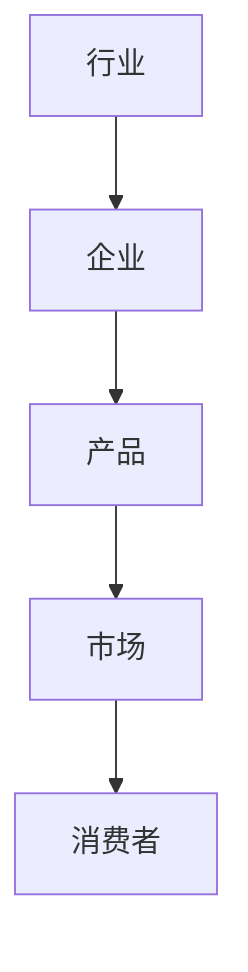
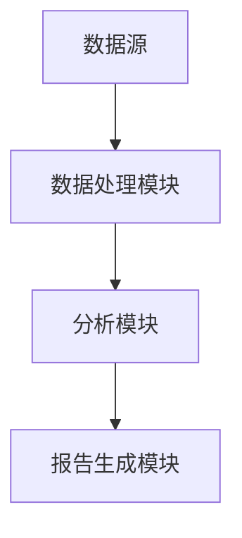

                 


# 彼得林奇的"行业分析"方法论

## 关键词：
- 彼得林奇
- 行业分析
- 投资方法
- 竞争优势
- 财务分析

## 摘要：
彼得林奇是全球著名投资专家，其行业分析方法论强调通过深入研究行业趋势和企业竞争优势来做出投资决策。本文系统阐述了彼得林奇的行业分析方法，包括行业生命周期分析、竞争优势分析、财务指标评估等方面，并通过实例展示如何应用这些方法进行投资决策。

---

# 第一部分: 彼得林奇行业分析方法论概述

## 第1章: 行业分析的背景与重要性

### 1.1 行业分析的核心概念

#### 1.1.1 行业分析的定义
行业分析是通过对行业整体发展趋势、市场结构、竞争环境和关键驱动因素的研究，评估行业内企业的投资价值和潜在风险的过程。

#### 1.1.2 行业分析在投资中的作用
行业分析帮助投资者识别行业中的高增长潜力企业，评估企业所处的竞争环境，从而做出更明智的投资决策。

#### 1.1.3 彼得林奇的行业分析方法
彼得林奇强调通过研究行业生命周期和竞争优势，选择那些处于成长期且具备可持续竞争优势的企业进行投资。

### 1.2 行业分析的背景与演变

#### 1.2.1 投资分析的历史演变
投资分析从基本面分析、技术分析到行业分析，逐步发展为现代投资学的重要组成部分。

#### 1.2.2 行业分析在现代投资中的地位
行业分析是投资决策中的关键环节，帮助投资者识别行业风险和机会，优化投资组合。

#### 1.2.3 彼得林奇的行业分析方法论的提出
彼得林奇在20世纪80年代提出行业分析方法论，强调行业趋势和企业竞争优势的重要性。

---

## 第2章: 行业分析的核心要素与框架

### 2.1 行业生命周期分析

#### 2.1.1 行业生命周期的定义
行业生命周期包括导入期、成长期、成熟期和衰退期，不同阶段的行业特征和投资策略有所不同。

#### 2.1.2 不同阶段的特征与策略
- **导入期**：市场需求增长快，企业研发投入高，适合风险承受能力强的投资者。
- **成长期**：行业增长稳定，企业规模扩大，适合长期投资者。
- **成熟期**：行业增长放缓，企业竞争加剧，适合选择龙头企业。
- **衰退期**：行业需求下降，企业利润减少，投资风险较高。

#### 2.1.3 彼得林奇的行业生命周期视角
彼得林奇认为，投资应集中在成长期行业，选择具有持续增长潜力的企业。

### 2.2 行业竞争结构分析

#### 2.2.1 五力模型的引入
迈克尔·波特的五力模型包括新进入者威胁、替代品威胁、供应商议价能力、买家议价能力和现有竞争者之间竞争程度。

#### 2.2.2 行业竞争的关键因素
- 市场集中度
- 进入壁垒
- 规模效应

#### 2.2.3 彼得林奇的竞争优势识别法
彼得林奇关注企业的核心竞争优势，如技术优势、成本优势和品牌优势。

### 2.3 行业分析的核心概念与联系

#### 2.3.1 行业生命周期与企业成长的关系
企业生命周期与行业生命周期密切相关，行业处于成长期时，企业更容易实现高增长。

#### 2.3.2 行业结构对投资决策的影响
行业集中度高的行业风险较低，竞争激烈的行业需选择具有差异化优势的企业。

#### 2.3.3 竞争优势的动态变化
企业竞争优势会随行业环境变化而调整，投资者需持续关注行业动态。

### 2.4 行业分析的概念属性特征对比

| 特征 | 行业生命周期 | 行业竞争结构 |
|------|--------------|---------------|
| 核心要素 | 阶段发展 | 竞争因素 |
| 主要指标 | 市场增长率 | 市场集中度 |
| 影响因素 | 技术进步、政策变化 | 进入壁垒、竞争程度 |

### 2.5 行业分析的ER实体关系图



---

## 第3章: 行业分析的算法原理

### 3.1 行业增长潜力评估算法

#### 3.1.1 市场增长率计算公式
$$\text{市场增长率} = \frac{\text{当年销售额} - \text{前一年销售额}}{\text{前一年销售额}} \times 100\%$$

#### 3.1.2 市场份额计算公式
$$\text{市场份额} = \frac{\text{企业销售额}}{\text{行业总销售额}} \times 100\%$$

### 3.2 竞争优势分析算法

#### 3.2.1 盈利能力分析
$$\text{净利润率} = \frac{\text{净利润}}{\text{营业收入}} \times 100\%$$

#### 3.2.2 资产回报率分析
$$\text{ROA} = \frac{\text{净利润}}{\text{总资产}}$$

---

## 第4章: 行业分析的系统架构设计

### 4.1 行业分析系统框架



### 4.2 系统功能设计

#### 4.2.1 数据收集与清洗
从多个来源收集行业数据，清洗并预处理数据。

#### 4.2.2 行业分析模型构建
基于行业生命周期和竞争优势模型，构建分析框架。

#### 4.2.3 报告生成与可视化
生成分析报告，并以图表形式展示分析结果。

---

## 第5章: 项目实战

### 5.1 环境安装

#### 5.1.1 安装Python
```bash
python --version
pip install pandas numpy matplotlib
```

#### 5.1.2 数据源获取
从公开数据库获取行业数据，如行业增长率、企业财务数据等。

### 5.2 系统核心实现源代码

#### 5.2.1 行业增长潜力评估
```python
import pandas as pd

def calculate_market_growth(yearly_sales, previous_sales):
    return ((yearly_sales - previous_sales) / previous_sales) * 100

# 示例数据
data = {
    'year': [2018, 2019, 2020, 2021, 2022],
    'sales': [100, 120, 150, 180, 200]
}
df = pd.DataFrame(data)
growth = calculate_market_growth(df['sales'][2020], df['sales'][2019])
print(f"市场增长率为：{growth}%")
```

#### 5.2.2 竞争优势分析
```python
def calculate_net_profit_margin(net_profit, revenue):
    return (net_profit / revenue) * 100

# 示例数据
net_profit = 50
revenue = 500
margin = calculate_net_profit_margin(net_profit, revenue)
print(f"净利润率为：{margin}%")
```

### 5.3 代码应用解读与分析

#### 5.3.1 行业增长潜力评估
通过计算市场增长率，识别行业处于哪个生命周期阶段。

#### 5.3.2 竞争优势分析
通过分析企业财务指标，评估其竞争优势。

### 5.4 实际案例分析

#### 5.4.1 案例选择
选择科技行业中的某公司进行分析，评估其市场增长率和竞争优势。

#### 5.4.2 分析步骤
1. 收集行业数据。
2. 计算市场增长率。
3. 分析企业财务指标。
4. 生成分析报告。

### 5.5 项目小结

通过实战项目，读者可以掌握如何应用彼得林奇的行业分析方法论进行投资决策。

---

## 第6章: 最佳实践、小结、注意事项和拓展阅读

### 6.1 最佳实践 tips
- 定期更新行业分析数据。
- 关注行业政策变化。
- 结合多种分析方法进行综合评估。

### 6.2 小结
彼得林奇的行业分析方法论提供了系统化的投资分析框架，帮助投资者识别高增长潜力企业。

### 6.3 注意事项
- 数据来源的可靠性。
- 分析模型的适用性。
- 行业动态变化的影响。

### 6.4 拓展阅读
- 《彼得·林奇的成功投资》
- 《投资学基础》
- 《行业分析方法论》

---

# 作者：AI天才研究院 & 禅与计算机程序设计艺术

---

以上是《彼得林奇的"行业分析"方法论》的完整目录大纲和内容概述，接下来将根据以上结构逐步展开，详细撰写每部分内容。

