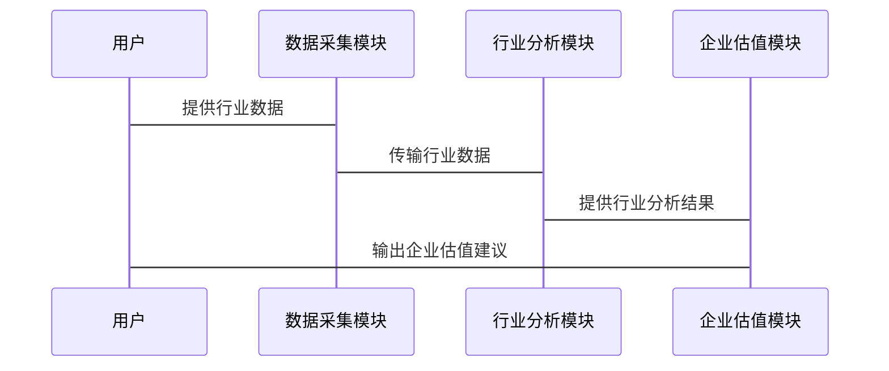

                 


# 彼得林奇的"行业分析"框架

> 关键词：彼得林奇，行业分析，投资框架，企业估值，市场分析

> 摘要：本文深入探讨了彼得林奇的行业分析框架，结合理论与实践，详细阐述了其核心概念、算法原理、系统架构及项目实战。通过案例分析和公式推导，全面解读了如何运用行业分析进行有效投资决策。

---

## 第1章: 彼得林奇的背景与投资理念

### 1.1 彼得林奇的背景介绍

彼得·林奇（Peter Lynch）是全球最著名的职业经理人之一，曾担任富达投资管理公司的基金经理。他在任职期间取得了卓越的投资业绩，平均年回报率高达29%，为投资者创造了巨额财富。

#### 1.1.1 彼得林奇的生平简介
- 出生日期：1940年
- 职业生涯：1971年加入富达投资，1984年管理资产规模超过100亿美元。
- 投资理念：专注于长期价值，避免短期波动，注重企业基本面分析。

#### 1.1.2 彼得林奇的投资风格
- 偏好成长股，但注重估值。
- 强调行业分析的重要性，认为行业是企业价值的核心影响因素。

#### 1.1.3 彼得林奇的行业分析方法
- 以行业生命周期和竞争结构为核心。
- 通过分析行业数据和企业基本面，寻找被低估的投资机会。

### 1.2 行业分析的重要性

行业分析是投资决策的基础，它可以帮助投资者识别行业风险、增长潜力和竞争格局。

#### 1.2.1 行业分析在投资中的作用
- 帮助投资者筛选出具有长期增长潜力的行业。
- 识别行业拐点，提前布局或规避风险。

#### 1.2.2 彼得林奇行业分析的核心理念
- 以行业为切入点，分析企业的竞争优势。
- 通过行业数据分析，评估企业的估值是否合理。

#### 1.2.3 行业分析与企业价值的关系
- 行业分析是企业分析的前提，企业价值受行业环境影响。
- 通过行业分析，可以更好地理解企业的经营环境和竞争优势。

### 1.3 本章小结

本章介绍了彼得林奇的背景及其行业分析方法，强调了行业分析在投资中的重要性。行业分析不仅是彼得林奇投资策略的核心，也是投资者理解企业价值的关键。

---

## 第2章: 行业分析的核心概念与框架

### 2.1 行业分析的关键要素

行业分析涉及多个关键要素，包括行业生命周期、竞争结构和增长潜力。

#### 2.1.1 行业生命周期
- 初创期：行业快速发展，企业数量增加。
- 成长期：行业规模扩大，竞争加剧。
- 成熟期：行业增长放缓，竞争趋于稳定。
- 衰退期：行业需求下降，企业数量减少。

#### 2.1.2 行业竞争结构
- 市场集中度：行业内主要企业的市场份额占比。
- 进入壁垒：新企业进入行业的难易程度。
- 竞争程度：行业内竞争的激烈程度。

#### 2.1.3 行业增长潜力
- 市场规模：行业的总收入或用户数量。
- 增长率：行业收入的年增长率。
- 驱动力：行业增长的主要因素，如技术创新、政策支持等。

#### 2.1.4 行业风险
- 政策风险：行业受政策影响的程度。
- 经济周期风险：行业受经济波动的影响。
- 技术风险：行业技术更新的速度。

#### 2.1.5 行业创新
- 创新能力：行业内的技术创新能力。
- 创新周期：行业的技术创新周期。
- 创新扩散：创新技术在行业内的扩散速度。

### 2.2 彼得林奇行业分析框架

彼得林奇的行业分析框架以行业生命周期和竞争结构为核心，结合企业的基本面分析，帮助投资者识别投资机会。

#### 2.2.1 框架的核心要素
- 行业生命周期：判断行业的所处阶段。
- 行业竞争结构：评估行业的竞争程度。
- 企业基本面：分析企业的财务状况和竞争优势。

#### 2.2.2 框架的逻辑结构
1. 确定行业所处的生命周期阶段。
2. 分析行业竞争结构，评估企业的竞争优势。
3. 结合企业的基本面，判断企业的估值是否合理。

#### 2.2.3 框架的适用范围
- 适用于长期投资，尤其是成长股投资。
- 适用于对行业趋势敏感的投资策略。

### 2.3 行业分析与企业估值的关系

行业分析是企业估值的基础，行业环境直接影响企业的盈利能力和成长潜力。

#### 2.3.1 行业分析对企业估值的影响
- 行业增长潜力影响企业的未来收益。
- 行业竞争结构影响企业的盈利能力。
- 行业风险影响企业的估值。

#### 2.3.2 企业估值对行业分析的反馈作用
- 企业估值可以帮助投资者验证行业分析的准确性。
- 通过企业估值，可以发现行业内的潜在投资机会。

#### 2.3.3 行业分析与企业估值的综合应用
- 结合行业分析和企业估值，可以更全面地评估企业的投资价值。
- 行业分析帮助企业避免陷入个别企业基本面的陷阱。

### 2.4 本章小结

本章详细介绍了行业分析的核心概念，包括行业生命周期、竞争结构和增长潜力，并结合彼得林奇的行业分析框架，探讨了行业分析与企业估值的关系。这些内容为后续的行业分析实践奠定了基础。

---

## 第3章: 行业分析的核心算法与模型

### 3.1 行业分析的关键算法

行业分析需要借助多种算法，包括行业增长潜力评估算法、行业竞争结构分析算法等。

#### 3.1.1 行业增长潜力评估算法
- 输入：行业历史增长率、市场规模、行业创新能力。
- 输出：行业增长潜力评分。

#### 3.1.2 行业竞争结构分析算法
- 输入：行业市场集中度、进入壁垒、竞争程度。
- 输出：行业竞争结构评分。

#### 3.1.3 行业生命周期判断算法
- 输入：行业历史增长率、市场规模、创新周期。
- 输出：行业生命周期阶段。

### 3.2 行业分析的数学模型

行业分析可以通过数学模型量化行业的增长潜力和竞争结构。

#### 3.2.1 行业增长潜力模型
$$G = \frac{E}{P}$$
其中，$G$ 表示行业增长潜力，$E$ 表示行业预期收益，$P$ 表示行业投资成本。

#### 3.2.2 行业竞争结构模型
$$C = \frac{S}{N}$$
其中，$C$ 表示行业竞争程度，$S$ 表示行业市场规模，$N$ 表示行业内企业数量。

#### 3.2.3 行业生命周期模型
$$L = \frac{G}{T}$$
其中，$L$ 表示行业生命周期阶段，$G$ 表示行业增长潜力，$T$ 表示时间跨度。

### 3.3 算法实现与案例分析

#### 3.3.1 算法实现步骤
1. 收集行业数据，包括市场规模、增长率、竞争结构等。
2. 计算行业增长潜力和竞争结构评分。
3. 结合行业生命周期模型，判断行业所处阶段。
4. 输出行业分析结果。

#### 3.3.2 案例分析：假设某行业数据下的算法应用
- 假设某行业市场规模为100亿，历史增长率为10%，市场集中度为40%，进入壁垒为中等。
- 根据公式计算：$G = 100 / 10 = 10$，$C = 100 / 20 = 5$。
- 结论：行业增长潜力较高，竞争结构较为稳定，处于成长期。

### 3.4 本章小结

本章通过数学模型和算法，量化了行业的增长潜力和竞争结构，为投资者提供了科学的行业分析方法。通过案例分析，展示了算法的实际应用。

---

## 第4章: 行业分析的系统架构与设计

### 4.1 系统架构概述

行业分析系统由数据采集模块、分析模块和企业估值模块组成。

#### 4.1.1 行业分析系统的功能模块
- 数据采集模块：收集行业数据。
- 行业分析模块：计算行业增长潜力和竞争结构。
- 企业估值模块：评估企业的投资价值。

#### 4.1.2 系统架构的逻辑流程
1. 数据采集模块收集行业数据。
2. 行业分析模块计算行业增长潜力和竞争结构。
3. 企业估值模块结合行业分析结果，评估企业价值。

#### 4.1.3 系统架构的优缺点
- 优点：模块化设计，便于扩展和维护。
- 缺点：需要依赖高质量的数据源。

### 4.2 系统功能设计

#### 4.2.1 行业数据采集模块
- 功能：收集行业市场规模、增长率、竞争结构等数据。

#### 4.2.2 行业分析模块
- 功能：计算行业增长潜力和竞争结构评分。

#### 4.2.3 企业估值模块
- 功能：结合行业分析结果，评估企业的投资价值。

### 4.3 系统接口设计

#### 4.3.1 数据输入接口
- 接口：API接口接收行业数据。

#### 4.3.2 数据处理接口
- 接口：处理行业数据，计算行业增长潜力和竞争结构。

#### 4.3.3 结果输出接口
- 接口：输出行业分析结果和企业估值建议。

### 4.4 系统交互设计

#### 4.4.1 系统交互流程
1. 用户通过API接口输入行业数据。
2. 系统处理数据，计算行业增长潜力和竞争结构。
3. 系统输出行业分析结果和企业估值建议。

#### 4.4.2 系统交互图


### 4.5 本章小结

本章设计了一个行业分析系统，包括数据采集、分析和估值模块，并通过mermaid图展示了系统的交互流程。系统架构设计为行业分析提供了技术支持。

---

## 第5章: 行业分析的项目实战

### 5.1 项目背景与目标

#### 5.1.1 项目背景介绍
- 项目目标：分析某行业，寻找投资机会。

#### 5.1.2 项目目标设定
- 分析行业生命周期。
- 评估行业竞争结构。
- 评估企业的投资价值。

#### 5.1.3 项目范围界定
- 数据范围：市场规模、增长率、竞争结构。
- 时间范围：过去5年数据。

### 5.2 项目实施步骤

#### 5.2.1 数据收集与处理
- 数据来源：行业报告、企业财报。
- 数据清洗：去除异常值，填补缺失值。

#### 5.2.2 行业分析与评估
- 计算行业增长潜力和竞争结构评分。
- 判断行业生命周期阶段。

#### 5.2.3 企业估值与优化
- 结合行业分析结果，评估企业的投资价值。
- 调整估值模型，优化投资策略。

### 5.3 项目核心代码实现

#### 5.3.1 数据处理代码
```python
import pandas as pd

# 数据处理
def process_data(data):
    data = data.dropna()
    data = data.replace({np.nan: 0})
    return data

# 数据来源：行业报告
data = pd.read_csv('industry.csv')
processed_data = process_data(data)
```

#### 5.3.2 行业分析算法代码
```python
def calculate_growth_potential(processed_data):
    E = processed_data['E'].mean()
    P = processed_data['P'].mean()
    G = E / P
    return G

growth_potential = calculate_growth_potential(processed_data)
print(f"行业增长潜力：{growth_potential}")
```

#### 5.3.3 企业估值代码
```python
def calculate_valuation(growth_potential):
    if growth_potential > 10:
        return "高估"
    elif 5 < growth_potential < 10:
        return "合理"
    else:
        return "低估"

valuation = calculate_valuation(growth_potential)
print(f"企业估值：{valuation}")
```

### 5.4 项目案例分析

#### 5.4.1 案例背景介绍
- 行业：科技行业。
- 数据：过去5年的市场规模、增长率、竞争结构。

#### 5.4.2 分析过程展示
- 数据处理：清洗行业数据。
- 行业分析：计算行业增长潜力和竞争结构评分。
- 企业估值：结合行业分析结果，评估企业的投资价值。

#### 5.4.3 结果解读与总结
- 行业增长潜力较高，竞争结构较为稳定。
- 企业估值合理，具有较大的投资潜力。

### 5.5 本章小结

本章通过一个实际案例，展示了行业分析的实施步骤和方法。通过代码实现，验证了算法的有效性，并为投资者提供了科学的行业分析结果。

---

## 第6章: 总结与最佳实践

### 6.1 本章总结

- 彼得林奇的行业分析框架以行业生命周期和竞争结构为核心，帮助投资者识别投资机会。
- 行业分析是企业估值的基础，行业环境直接影响企业的盈利能力和成长潜力。
- 通过数学模型和算法，可以量化行业的增长潜力和竞争结构。

### 6.2 最佳实践 tips

- **数据质量**：行业分析依赖高质量的数据，建议选择权威数据源。
- **持续更新**：行业环境不断变化，需要定期更新行业数据。
- **结合实际**：行业分析需要结合实际情况，避免过于依赖模型。

### 6.3 注意事项

- **行业选择**：选择具有长期增长潜力的行业。
- **风险控制**：行业分析需要考虑行业风险，如政策风险和经济周期风险。
- **动态调整**：根据行业变化，及时调整投资策略。

### 6.4 拓展阅读

- 《彼得林奇的投资策略》：深入理解彼得林奇的投资理念。
- 《行业分析与企业估值》：学习行业分析的更多方法和技巧。

### 6.5 本章小结

本章总结了彼得林奇的行业分析框架，并提出了最佳实践 tips和注意事项。通过拓展阅读，可以帮助投资者进一步提升行业分析能力。

---

## 作者：AI天才研究院/AI Genius Institute & 禅与计算机程序设计艺术 /Zen And The Art of Computer Programming

