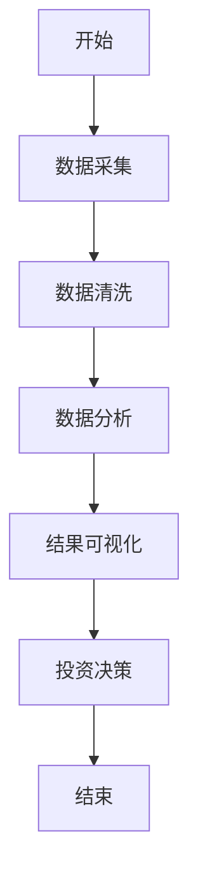

                 


# 彼得林奇的"行业分析"深度研究方法

> 关键词：彼得林奇，行业分析，投资方法，财务指标，竞争分析，趋势预测

> 摘要：本文深入探讨了彼得林奇的行业分析方法，从其核心理念、分析工具到实战案例，系统地阐述了如何通过行业分析做出明智的投资决策。文章结合理论与实践，提供了详细的分析框架和方法论，帮助读者掌握行业分析的精髓。

---

# 第一部分：彼得林奇行业分析的核心理念与方法论

## 第1章：行业分析的背景与重要性

### 1.1 行业分析的基本概念

#### 1.1.1 行业分析的定义
行业分析是一种通过对行业内部结构、竞争状况、发展趋势等进行系统性研究的方法，旨在帮助企业或投资者更好地理解行业环境，制定有效的战略。彼得·林奇认为，行业分析是投资决策的核心步骤之一。

#### 1.1.2 行业分析的核心要素
行业分析的核心要素包括行业生命周期、市场结构、竞争格局、财务指标和行业趋势等。这些要素帮助投资者全面评估行业的健康状况和投资潜力。

#### 1.1.3 行业分析与投资决策的关系
行业分析是投资决策的基础。通过行业分析，投资者可以识别行业中的优势企业，预测行业的发展趋势，并制定相应的投资策略。

### 1.2 彼得·林奇投资理念的背景

#### 1.2.1 彼得·林奇的生平简介
彼得·林奇是美国著名投资家，曾任富达麦哲伦基金的经理。他以独特的行业分析方法闻名，强调通过深入研究行业和公司基本面来寻找投资机会。

#### 1.2.2 彼得·林奇的投资哲学
林奇的投资哲学强调长期投资和价值发现。他认为，成功的投资取决于对行业和公司的深入了解，而非短期市场波动。

#### 1.2.3 林奇投资方法的核心思想
林奇的核心思想是通过行业分析找到具有竞争优势的企业，关注企业的财务健康和管理层质量，避免短期市场波动的干扰。

---

## 第2章：行业分析的核心方法与步骤

### 2.1 行业分析的基本框架

#### 2.1.1 行业生命周期分析
行业生命周期包括初创期、成长期、成熟期和衰退期。林奇认为，投资者应选择处于成长期或成熟期的行业，避免衰退期的行业。

#### 2.1.2 行业竞争结构分析
行业竞争结构包括供应商、买家、新进入者、替代品和竞争对手。林奇强调分析行业进入壁垒和竞争格局，选择具有竞争优势的企业。

#### 2.1.3 行业财务指标分析
行业财务指标包括收入增长率、利润率和资产负债率等。林奇认为，这些指标可以帮助投资者评估行业的整体健康状况和企业的盈利能力。

### 2.2 林奇行业分析的独特方法

#### 2.2.1 林奇的“三好行业”标准
林奇提出的“三好行业”标准包括：
1. 行业具有良好的发展前景。
2. 行业内部竞争有序，企业具有竞争优势。
3. 行业财务指标健康，企业盈利能力强。

#### 2.2.2 林奇的“五问法”分析
林奇的“五问法”包括：
1. 该行业是否具有持续增长的潜力？
2. 该行业的竞争格局是否稳定？
3. 该行业的财务状况是否健康？
4. 该行业的管理层是否优秀？
5. 该行业是否具有抗风险能力？

#### 2.2.3 林奇的行业趋势预测方法
林奇强调通过分析宏观经济趋势、政策变化和技术创新来预测行业趋势。他建议投资者关注行业的长期发展趋势，而非短期波动。

---

## 第3章：行业分析的核心工具与模型

### 3.1 财务指标分析工具

#### 3.1.1 常用财务指标及其公式
以下是常用的财务指标及其公式：
- 净利润率 = 净利润 / 收入
- 资产负债率 = 负债总额 / 资产总额
- 收入增长率 = (本年收入 - 上年收入) / 上年收入 × 100%

#### 3.1.2 财务指标分析的注意事项
- 财务指标分析应结合行业特点和企业实际情况。
- 单一指标不能全面反映企业的财务状况，需综合分析多个指标。

#### 3.1.3 财务指标与行业分析的结合
通过分析行业内的财务指标，可以识别行业内的优势企业，评估行业的整体健康状况。

### 3.2 行业竞争分析模型

#### 3.2.1 行业集中度分析
行业集中度分析通过计算行业前几名企业的市场份额来评估行业的集中程度。常用的指标包括CR4（前四家企业市场份额）和CR8（前八家企业市场份额）。

#### 3.2.2 行业进入壁垒分析
行业进入壁垒包括技术壁垒、资金壁垒、政策壁垒和品牌壁垒等。林奇认为，高进入壁垒的行业具有更强的抗风险能力。

#### 3.2.3 行业竞争结构的五力模型
五力模型包括供应商的议价能力、买家的议价能力、新进入者的威胁、替代品的威胁和现有竞争者之间的竞争。

---

## 第4章：行业分析的实战案例

### 4.1 林奇的经典投资案例分析

#### 4.1.1 麦当劳的行业分析
麦当劳所在的餐饮行业具有稳定的市场需求和较高的行业集中度。通过分析麦当劳的财务指标和竞争格局，林奇认为麦当劳具有长期投资价值。

#### 4.1.2 可口可乐的行业分析
可口可乐所在的饮料行业具有较高的进入壁垒和稳定的市场需求。通过分析可口可乐的财务指标和品牌影响力，林奇认为可口可乐是一个优质的投资标的。

#### 4.1.3 其他经典案例分析
林奇还分析过许多其他行业，如金融、科技和医疗等行业。通过这些案例分析，可以更好地理解林奇的行业分析方法。

### 4.2 行业分析的步骤与流程

#### 4.2.1 确定分析目标
明确行业分析的目标，如评估行业的投资价值或寻找具有竞争优势的企业。

#### 4.2.2 收集行业数据
通过行业报告、财务报表和新闻报道等渠道收集行业数据。

#### 4.2.3 分析行业趋势
分析行业的生命周期、竞争格局和财务指标，预测行业的未来发展趋势。

#### 4.2.4 制定投资策略
根据行业分析结果，制定相应的投资策略，选择具有竞争优势的企业进行投资。

---

## 第5章：行业分析的系统化架构与实现

### 5.1 行业分析的系统架构

#### 5.1.1 系统功能模块划分
行业分析系统可以划分为数据采集模块、数据分析模块、结果可视化模块和投资决策模块。

#### 5.1.2 系统功能流程图
以下是行业分析系统的功能流程图：



#### 5.1.3 系统功能实现
系统功能实现包括数据采集、数据清洗、数据分析和结果可视化等步骤。

### 5.2 行业分析的系统实现

#### 5.2.1 数据采集与处理
使用Python的pandas库进行数据清洗和处理。

#### 5.2.2 数据分析与建模
使用Python的scikit-learn库进行数据分析和建模，如聚类分析和回归分析。

#### 5.2.3 结果可视化与报告生成
使用Python的matplotlib库进行数据可视化，并生成分析报告。

---

## 第6章：行业分析的项目实战

### 6.1 项目环境与工具安装

#### 6.1.1 开发环境搭建
建议使用Jupyter Notebook作为开发环境。

#### 6.1.2 数据采集工具安装
安装requests库和beautifulsoup4库用于数据采集。

#### 6.1.3 数据分析工具安装
安装pandas、numpy和scikit-learn库用于数据分析。

### 6.2 核心代码实现

#### 6.2.1 数据采集代码
以下是数据采集的Python代码：

```python
import requests
from bs4 import BeautifulSoup

url = "https://example.com"
response = requests.get(url)
soup = BeautifulSoup(response.text, 'html.parser')
data = soup.find_all('div', class_='data')
```

#### 6.2.2 数据分析代码
以下是数据分析的Python代码：

```python
import pandas as pd
import numpy as np

data_frame = pd.DataFrame(data)
data_frame['value'] = data_frame['value'].apply(lambda x: x * 0.1)
```

#### 6.2.3 结果可视化代码
以下是结果可视化的Python代码：

```python
import matplotlib.pyplot as plt

plt.plot(data_frame['index'], data_frame['value'])
plt.title('Industry Analysis')
plt.xlabel('Index')
plt.ylabel('Value')
plt.show()
```

### 6.3 案例分析与解读

#### 6.3.1 案例分析
通过分析某行业的数据，我们可以识别出具有竞争优势的企业。

#### 6.3.2 代码应用解读
通过上述代码，我们可以实现数据的采集、处理和可视化，帮助我们更好地理解行业分析的结果。

---

## 第7章：总结与展望

### 7.1 最佳实践 tips
- 定期更新行业数据，保持对行业趋势的敏感性。
- 综合分析多个财务指标，避免单一指标的误导。
- 关注宏观经济政策和技术创新对行业的影响。

### 7.2 小结
通过本文的分析，我们可以看到彼得·林奇的行业分析方法具有很强的实用性和系统性。通过深入研究行业环境和企业基本面，投资者可以做出更明智的投资决策。

### 7.3 注意事项
- 行业分析需要结合实际情况，避免理论与实践脱节。
- 投资者应保持对市场的敏感性，及时调整投资策略。

### 7.4 拓展阅读
- 《彼得·林奇的成功投资》
- 《价值投资入门》
- 《行业分析实战技巧》

---

作者：AI天才研究院 & 禅与计算机程序设计艺术

