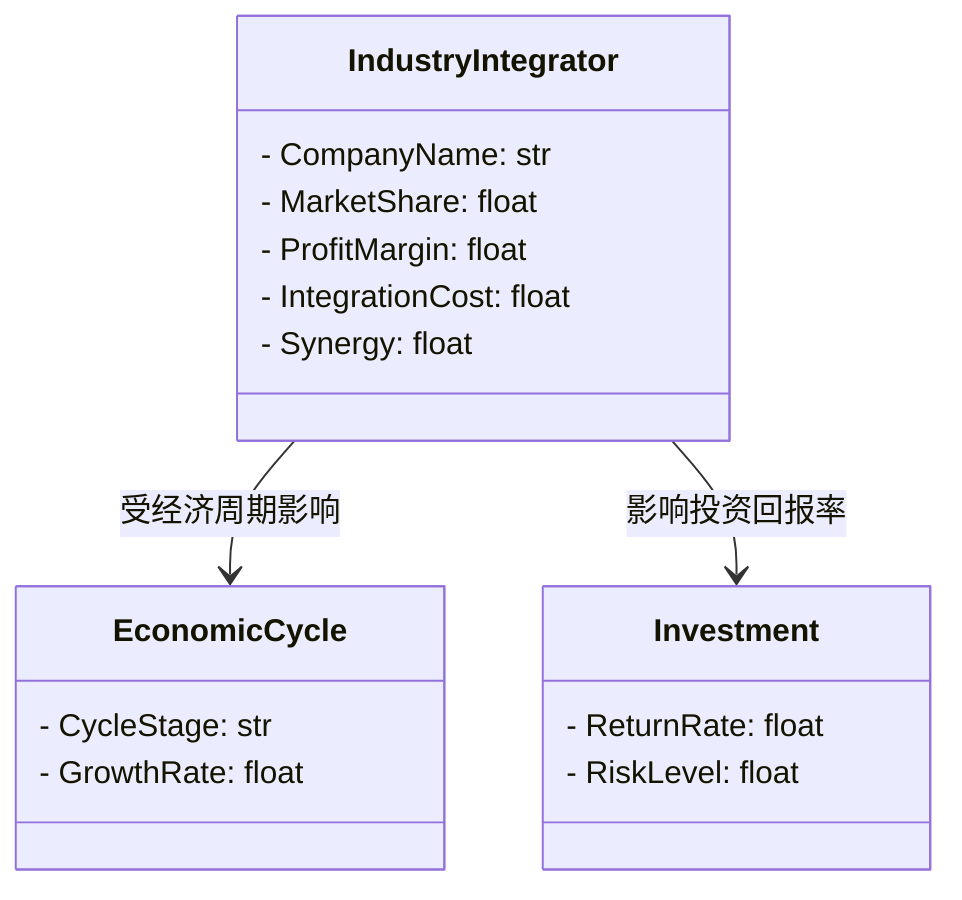
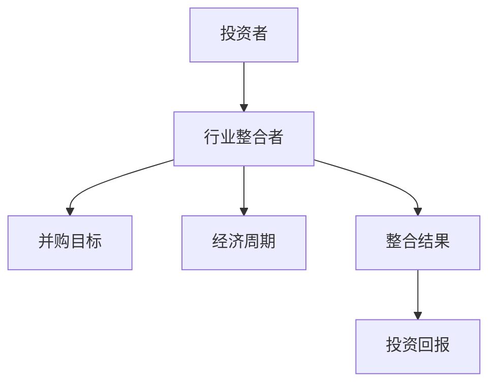
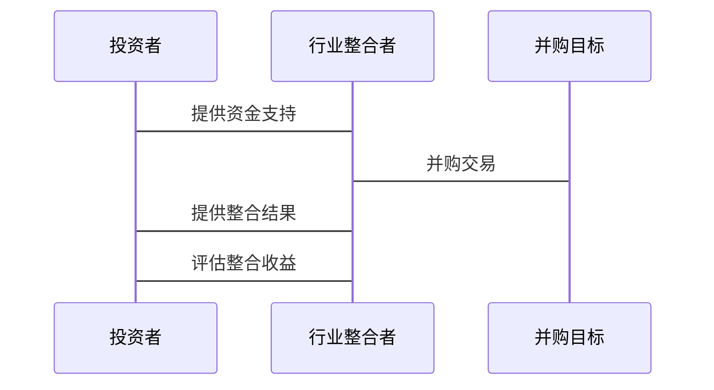

                 


# 彼得林奇的"行业整合者"在不同经济周期中的表现

> 关键词：彼得林奇、行业整合者、经济周期、投资策略、并购策略

> 摘要：本文深入分析了彼得·林奇的投资哲学及其对“行业整合者”的独特见解，探讨了不同经济周期中行业整合者的投资策略、表现及其背后的数学模型。通过系统分析和项目实战，本文为投资者提供了在不同经济环境下应用行业整合者策略的实践指南。

---

## 第一章：彼得林奇与行业整合者

### 1.1 彼得林奇的投资哲学

#### 1.1.1 彼得林奇的投资理念
彼得·林奇是全球最著名的投资者之一，他的投资哲学以“价值投资”为核心，强调通过深入研究公司基本面来寻找被市场低估的投资机会。他认为，成功的投资不仅依赖于市场分析，更需要对行业趋势和公司前景的深刻理解。

#### 1.1.2 彼得林奇的投资策略
彼得·林奇的策略包括：
- **长期持有**：他倾向于长期持有优质股票，避免频繁交易。
- **分散投资**：通过投资多个行业和公司来降低风险。
- **关注管理层**：他认为公司管理层的能力和决策是影响公司长期表现的关键因素。

#### 1.1.3 彼得林奇的成功案例
彼得·林奇在波士顿有限合伙人基金（Fidelity）的管理中取得了巨大成功，基金规模从1977年的1900万美元增长到1990年的125亿美元，年均回报率超过市场平均水平。

### 1.2 什么是行业整合者

#### 1.2.1 行业整合者的定义
行业整合者是指通过并购整合行业内其他公司，扩大市场份额、提高竞争力的企业。这类企业在特定行业中占据主导地位，通常是行业领导者。

#### 1.2.2 行业整合者的特征
- **强大的资本实力**：能够承担并购成本。
- **清晰的战略目标**：并购是为了整合资源、优化结构。
- **行业影响力**：通常在行业内具有较高的声誉和影响力。

#### 1.2.3 行业整合者的优缺点
- **优点**：
  - 提高市场占有率。
  - 优化资源分配。
  - 提升企业竞争力。
- **缺点**：
  - 并购后整合难度大。
  - 可能面临反垄断审查。

### 1.3 行业整合者的投资策略

#### 1.3.1 行业整合者的并购策略
- **横向并购**：整合同一行业内的竞争对手。
- **纵向并购**：整合供应链上下游企业。
- **混合并购**：并购与主业不直接相关但具有战略意义的企业。

#### 1.3.2 行业整合者的市场定位
行业整合者通常选择在市场中具有领先地位的企业作为并购目标，以确保并购后的协同效应。

#### 1.3.3 行业整合者的财务表现
- **收入增长**：并购后收入显著增加。
- **成本优化**：通过整合降低运营成本。
- **利润提升**：协同效应带来更高的利润率。

---

## 第二章：不同经济周期中的行业整合者

### 2.1 经济周期的定义与分类

#### 2.1.1 经济周期的定义
经济周期是指经济活动的波动，通常分为衰退、复苏、扩张和稳定四个阶段。

#### 2.1.2 经济周期的分类
- **衰退周期**：经济增长放缓，企业利润下降。
- **复苏周期**：经济开始复苏，企业逐渐恢复。
- **扩张周期**：经济增长迅速，企业利润增加。
- **稳定周期**：经济处于平稳增长状态。

#### 2.1.3 经济周期对行业整合者的影响
不同经济周期对行业整合者的战略选择和财务表现有显著影响。

### 2.2 衰退周期中的行业整合者

#### 2.2.1 衰退周期的特征
- 经济增长放缓，市场需求下降。
- 企业利润减少，融资难度增加。

#### 2.2.2 衰退周期中行业整合者的策略
- **防御性并购**：选择具有潜力的企业进行并购，等待经济复苏。
- **成本控制**：通过整合优化成本结构。
- **专注核心业务**：减少非核心业务的投入。

#### 2.2.3 衰退周期中行业整合者的成功案例
在2008年金融危机期间，许多行业整合者通过并购陷入困境的企业，成功扩大了市场份额。

### 2.3 扩张周期中的行业整合者

#### 2.3.1 扩张周期的特征
- 经济增长迅速，市场需求旺盛。
- 企业利润增加，融资环境宽松。

#### 2.3.2 扩张周期中行业整合者的策略
- **积极并购**：抓住市场机会，扩大市场份额。
- **拓展新市场**：通过并购进入新兴市场。
- **多元化发展**：并购相关行业，实现多元化布局。

#### 2.3.3 扩张周期中行业整合者的成功案例
互联网巨头在高速扩张期通过并购整合竞争对手，进一步巩固市场地位。

### 2.4 稳定周期中的行业整合者

#### 2.4.1 稳定周期的特征
- 经济增长平稳，市场需求稳定。
- 企业利润稳定，融资环境良好。

#### 2.4.2 稳定周期中行业整合者的策略
- **优化并购**：通过并购整合低效企业，优化行业结构。
- **技术创新**：利用并购引入新技术，提升竞争力。
- **国际化战略**：通过并购拓展国际市场。

#### 2.4.3 稳定周期中行业整合者的成功案例
许多科技公司在稳定周期通过并购整合技术资源，推动创新发展。

---

## 第三章：彼得林奇的行业整合者策略

### 3.1 彼得林奇的行业整合者策略

#### 3.1.1 行业整合者的投资逻辑
彼得·林奇认为，在不同经济周期中，行业整合者的表现取决于其并购策略和整合能力。他倾向于投资那些能够在行业整合中占据优势地位的企业。

#### 3.1.2 彼得林奇的行业整合者选择标准
- **行业地位**：选择行业龙头。
- **财务状况**：企业具有健康的财务状况。
- **管理层能力**：管理层具备战略眼光和整合能力。

#### 3.1.3 彼得林奇的行业整合者投资策略
- **长期持有**：耐心持有优质行业整合者股票。
- **分散投资**：通过投资多个行业整合者分散风险。
- **关注并购动态**：密切关注行业整合者的并购活动。

### 3.2 彼得林奇的行业整合者数学模型

#### 3.2.1 投资回报率模型
$$ \text{投资回报率} = \frac{\text{净利润增长} \times \text{市盈率}}{\text{初始投资}} $$

#### 3.2.2 并购整合模型
$$ \text{整合收益} = \text{协同效应} - \text{整合成本} $$

#### 3.2.3 经济周期与行业整合者的关系
$$ \text{行业整合者表现} = f(\text{经济周期}, \text{并购策略}, \text{整合能力}) $$

### 3.3 彼得林奇的行业整合者实战案例

#### 3.3.1 案例背景
假设在经济衰退周期中，彼得·林奇关注一家行业整合者公司，该公司通过并购整合竞争对手，提升市场份额。

#### 3.3.2 数据分析
使用Python进行数据分析，计算该公司的并购收益、整合成本和投资回报率。

#### 3.3.3 投资决策
基于数据分析结果，决定是否投资该行业整合者公司。

---

## 第四章：行业整合者的系统分析与架构设计

### 4.1 系统分析

#### 4.1.1 问题场景
分析一家行业整合者在经济周期中的表现，建立数学模型预测其投资回报率。

#### 4.1.2 领域模型
使用mermaid类图展示领域模型。



#### 4.1.3 系统架构
使用mermaid架构图展示系统架构。



---

## 第五章：行业整合者的项目实战

### 5.1 项目环境安装

#### 5.1.1 安装Python
使用以下命令安装Python和相关库：
```
python --version
pip install numpy pandas matplotlib
```

#### 5.1.2 数据获取
从公开数据源获取行业整合者的财务数据和经济周期数据。

### 5.2 核心实现

#### 5.2.1 数据分析代码
```python
import pandas as pd
import numpy as np

# 加载数据
data = pd.read_csv('industry_integrator.csv')

# 计算投资回报率
data['ReturnRate'] = data['NetProfit'] / data['Investment']

# 绘制图表
import matplotlib.pyplot as plt
plt.plot(data['Year'], data['ReturnRate'])
plt.title('投资回报率随年份变化')
plt.xlabel('年份')
plt.ylabel('投资回报率')
plt.show()
```

#### 5.2.2 并购整合分析
使用mermaid序列图展示并购整合过程。



### 5.3 实际案例分析

#### 5.3.1 案例选择
分析一家在经济扩张周期中通过并购整合成功的企业。

#### 5.3.2 数据分析与解读
使用Python代码分析该企业的并购整合效果。

#### 5.3.3 结果解读
解读数据分析结果，评估行业整合者在不同经济周期中的表现。

---

## 第六章：行业整合者投资策略总结

### 6.1 投资启示

#### 6.1.1 不同经济周期中的投资策略
- 衰退周期：谨慎选择，关注防御性行业。
- 扩张周期：积极布局，抓住并购机会。
- 稳定周期：优化整合，提升效率。

#### 6.1.2 投资注意事项
- 选择具有强大整合能力的企业。
- 关注宏观经济趋势，调整投资策略。
- 分散投资，降低风险。

### 6.2 投资策略数学模型

#### 6.2.1 投资组合优化模型
$$ \text{最优投资组合} = \argmin_{w} \left( \sigma^2 \right) \text{ s.t. } w^T \mu = \text{目标收益} $$

#### 6.2.2 风险调整回报模型
$$ \text{风险调整回报} = \frac{\text{投资回报率} - \text{无风险利率}}{\text{标准差}} $$

### 6.3 投资策略最佳实践

#### 6.3.1 系统性投资
- 建立科学的投资模型。
- 利用数据分析工具优化投资组合。

#### 6.3.2 风险管理
- 设定止损点，控制投资风险。
- 定期评估投资组合，及时调整。

#### 6.3.3 持续学习
- 关注宏观经济和行业动态。
- 不断优化投资策略，适应市场变化。

---

## 第七章：总结与展望

### 7.1 总结
彼得·林奇的行业整合者策略在不同经济周期中表现各异。投资者应根据经济环境和企业特点，灵活调整投资策略，选择具有强大整合能力和竞争优势的企业。

### 7.2 展望
随着全球经济的不断发展，行业整合者在各行业的影响力将逐渐增强。投资者应密切关注宏观经济趋势和行业动态，抓住行业整合的机会，实现投资收益最大化。

---

## 作者：AI天才研究院 & 禅与计算机程序设计艺术

---

通过以上详细的内容框架，您可以撰写一篇结构清晰、内容丰富的技术博客文章。每部分内容都需要进一步展开和详细阐述，以确保文章的完整性和深度。

