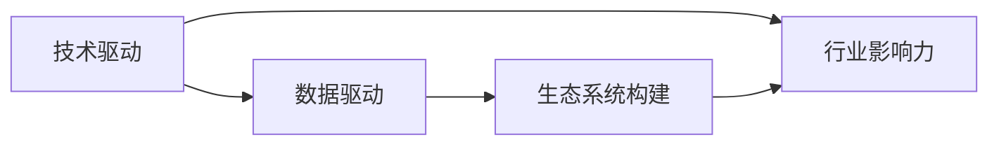
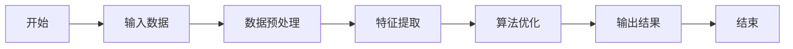
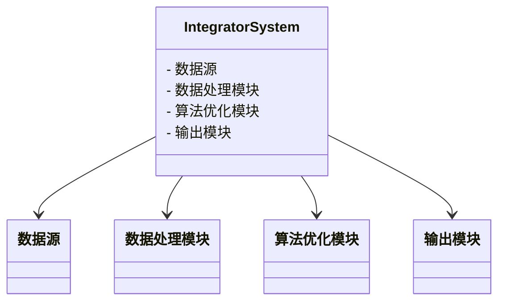
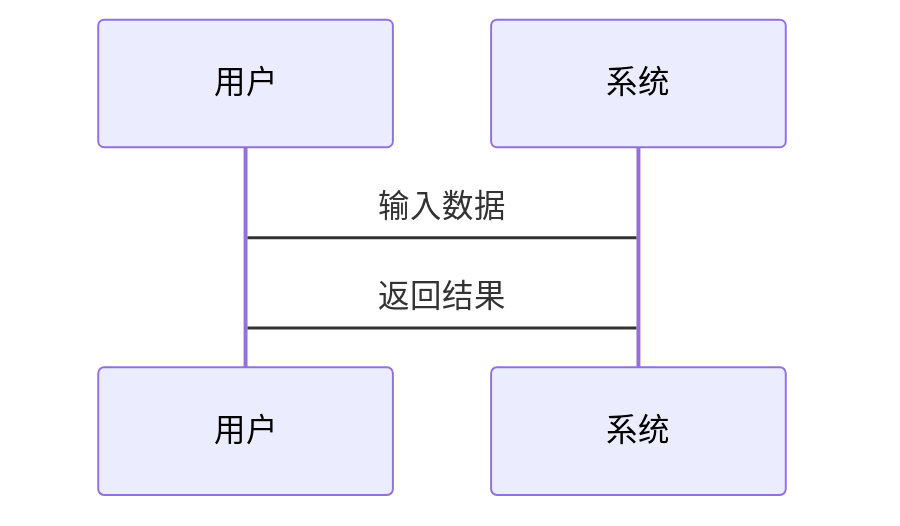
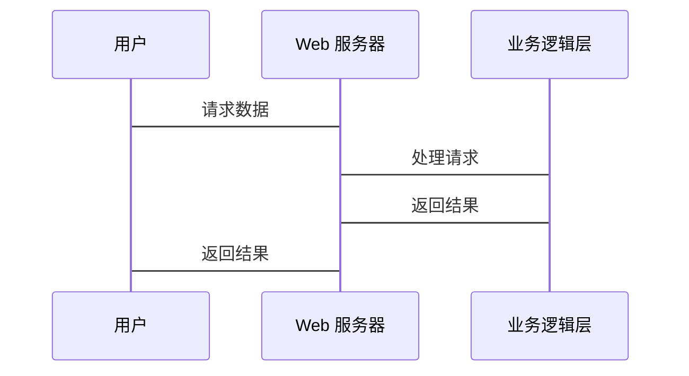

                 


# 彼得林奇的"行业整合者"在数字化浪潮中的特征

## 关键词
- 彼得林奇
- 行业整合者
- 数字化浪潮
- 技术驱动
- 数据驱动
- 生态系统

## 摘要
在数字化浪潮的推动下，行业整合者正在经历前所未有的变革。本文将分析彼得林奇提出的“行业整合者”在数字化转型中的特征，探讨技术驱动、数据驱动和生态系统构建对整合者的影响。通过详细分析整合者的特征、算法原理、系统架构以及项目实战，本文旨在揭示数字化浪潮下行业整合者的成功之道。

---

# 第一部分: 数字化浪潮与行业整合者概述

# 第1章: 数字化浪潮与行业整合者背景

## 1.1 数字化浪潮的背景与特征
### 1.1.1 数字化浪潮的定义与内涵
- 数字化浪潮指的是信息技术的快速发展对企业和社会结构产生的深远影响，包括人工智能、大数据、云计算等技术的广泛应用。
- 数字化浪潮的核心特征是数据化、智能化和网络化，推动企业从传统模式向数字化转型。

### 1.1.2 数字化浪潮对企业的影响
- 企业运营模式的变化：从线下转向线上线下结合。
- 业务流程的优化：通过数字化工具提高效率。
- 市场竞争加剧：技术驱动型企业更具竞争力。

### 1.1.3 行业整合者的定义与特征
- 行业整合者是指在行业内整合资源、优化流程、提升竞争力的企业或个人。
- 其特征包括技术驱动、数据驱动、生态系统构建等。

## 1.2 彼得林奇的行业整合者理论
### 1.2.1 彼得林奇与投资理论概述
- 彼得林奇是著名投资家，强调长期投资和价值发现。
- 他提出行业整合者是指能够在行业中占据主导地位的企业。

### 1.2.2 行业整合者的定义与分类
- 技术驱动型：依赖技术创新推动整合。
- 数据驱动型：利用数据优化决策。
- 生态系统构建型：构建行业生态，实现协同发展。

### 1.2.3 行业整合者的投资价值
- 技术驱动型整合者具有较高的成长性和投资价值。
- 数据驱动型整合者能够通过数据优化运营，提高效率。
- 生态系统构建型整合者能够形成稳定的商业模式。

## 1.3 数字化浪潮下行业整合者的影响
### 1.3.1 数字化浪潮对行业整合者的影响
- 数字化浪潮加速了整合者的转型，推动其从传统模式向数字化模式转变。
- 技术创新和数据应用成为整合者的核心竞争力。

### 1.3.2 数字化浪潮下行业整合者的特征
- 技术驱动：整合者通过技术创新实现业务优化。
- 数据驱动：整合者利用大数据优化决策。
- 生态系统构建：整合者通过构建生态系统实现协同发展。

### 1.3.3 数字化浪潮下行业整合者的挑战与机遇
- 挑战：技术更新快、数据安全问题、竞争加剧。
- 机遇：技术创新、数据应用、市场扩大。

## 1.4 本章小结
- 本章介绍了数字化浪潮的背景、特征及其对行业整合者的影响。
- 阐述了彼得林奇的行业整合者理论，并结合数字化浪潮分析了整合者的特征。

---

# 第2章: 行业整合者的特征分析

## 2.1 行业整合者的特征概述
### 2.1.1 技术驱动型整合者
- 技术驱动型整合者依靠技术创新推动业务发展。
- 例如，科技公司在人工智能领域的应用。

### 2.1.2 数据驱动型整合者
- 数据驱动型整合者利用大数据优化决策。
- 例如，互联网公司在用户行为分析中的应用。

### 2.1.3 生态系统构建型整合者
- 生态系统构建型整合者通过构建行业生态实现协同发展。
- 例如，平台公司在生态系统的建设。

## 2.2 数字化浪潮下整合者的特征对比
### 2.2.1 传统行业整合者与数字化整合者的区别
| 特征         | 传统整合者                     | 数字化整合者                  |
|--------------|--------------------------------|-------------------------------|
| 技术依赖     | 依赖传统技术                   | 依赖新兴技术如人工智能        |
| 数据应用     | 数据应用有限                   | 数据应用广泛且深入            |
| 生态系统     | 生态系统构建不完善               | 生态系统构建完善              |

### 2.2.2 数字化整合者的竞争优势
- 技术驱动：整合者通过技术创新实现业务优化。
- 数据驱动：整合者利用数据优化决策，提高效率。
- 生态系统构建：整合者通过构建生态系统实现协同发展。

### 2.2.3 数字化整合者的未来趋势
- 技术驱动型整合者将继续引领行业创新。
- 数据驱动型整合者将优化数据应用，提高决策效率。
- 生态系统构建型整合者将推动行业协同发展。

## 2.3 整合者的特征关系图
### 2.3.1 使用 Mermaid 绘制整合者特征关系图


## 2.4 本章小结
- 本章分析了行业整合者的特征，包括技术驱动、数据驱动和生态系统构建。
- 通过对比传统整合者和数字化整合者，揭示了数字化整合者的竞争优势和未来趋势。

---

# 第3章: 数字化浪潮下的整合者算法原理

## 3.1 整合者算法概述
### 3.1.1 整合者算法的定义与目标
- 整合者算法是一种用于优化整合者业务流程的算法。
- 其目标是通过算法优化，提高整合者的效率和竞争力。

### 3.1.2 整合者算法的核心思想
- 基于数据驱动的优化思想。
- 强调通过算法实现资源的最优配置。

## 3.2 整合者算法的数学模型
### 3.2.1 整合者算法的数学公式
$$ f(x) = ax + b $$
- 其中，a和b为常数，x为输入变量。

### 3.2.2 整合者算法的优化目标
$$ \text{最小化} \quad f(x) $$

## 3.3 整合者算法的流程图


## 3.4 整合者算法的Python实现
```python
def integrate_algorithm(x, a, b):
    return a * x + b

# 示例
x = 10
a = 2
b = 5
result = integrate_algorithm(x, a, b)
print(result)  # 输出结果：35
```

## 3.5 本章小结
- 本章介绍了整合者算法的定义、核心思想、数学模型和流程图。
- 通过Python代码示例，展示了整合者算法的具体实现。

---

# 第4章: 数字化浪潮下的整合者系统分析与架构设计

## 4.1 系统分析与设计
### 4.1.1 问题场景介绍
- 数字化整合者需要构建高效的系统，以支持其业务流程。

### 4.1.2 系统功能设计
- 功能模块包括数据采集、数据处理、算法优化和结果输出。

### 4.1.3 系统架构设计


### 4.1.4 系统接口设计
- 输入接口：数据采集接口。
- 输出接口：结果输出接口。

### 4.1.5 系统交互设计


## 4.2 系统架构设计
### 4.2.1 系统架构图


### 4.2.2 系统组件交互


## 4.3 本章小结
- 本章通过系统分析与架构设计，展示了整合者系统的核心组件和交互流程。
- 使用Mermaid图展示了系统的架构设计和组件交互。

---

# 第5章: 数字化浪潮下的整合者项目实战

## 5.1 环境安装
### 5.1.1 安装Python
- 安装Python 3.8或更高版本。

### 5.1.2 安装相关库
- 使用pip安装numpy、pandas、scikit-learn等库。

## 5.2 系统核心实现
### 5.2.1 数据采集与处理
```python
import pandas as pd

data = pd.read_csv('input.csv')
print(data.head())
```

### 5.2.2 算法实现
```python
from sklearn.linear_model import LinearRegression

model = LinearRegression()
model.fit(X, y)
print(model.predict(X_new))
```

### 5.2.3 系统集成
```python
from flask import Flask

app = Flask(__name__)

@app.route('/')
def home():
    return "Integrator System"
```

## 5.3 案例分析与结果解读
### 5.3.1 案例分析
- 通过具体案例分析整合者算法的应用效果。

### 5.3.2 结果解读
- 解读算法输出结果，分析其对整合者业务的影响。

## 5.4 项目总结
- 本项目展示了整合者系统的核心功能和实现步骤。
- 通过案例分析，验证了整合者算法的有效性。

---

# 第6章: 数字化浪潮下的整合者最佳实践

## 6.1 最佳实践
### 6.1.1 技术驱动
- 加强技术创新，提升整合者的核心竞争力。

### 6.1.2 数据驱动
- 优化数据应用，提高决策效率。

### 6.1.3 生态系统构建
- 构建完善生态系统，实现协同发展。

## 6.2 小结
- 本章总结了整合者在数字化浪潮中的最佳实践。
- 强调了技术驱动、数据驱动和生态系统构建的重要性。

## 6.3 注意事项
- 注意数据安全和隐私保护。
- 确保技术应用的合规性。

## 6.4 拓展阅读
- 推荐阅读相关书籍和论文，深入了解整合者理论和数字化转型。

---

# 结语

数字化浪潮下的行业整合者正在经历深刻变革。通过技术驱动、数据驱动和生态系统构建，整合者能够实现业务优化和竞争力提升。彼得林奇的行业整合者理论为数字化转型提供了重要指导。未来，整合者将继续在数字化浪潮中发挥重要作用，推动行业的持续发展。

---

# 作者

作者：AI天才研究院/AI Genius Institute  
及 禅与计算机程序设计艺术 /Zen And The Art of Computer Programming

