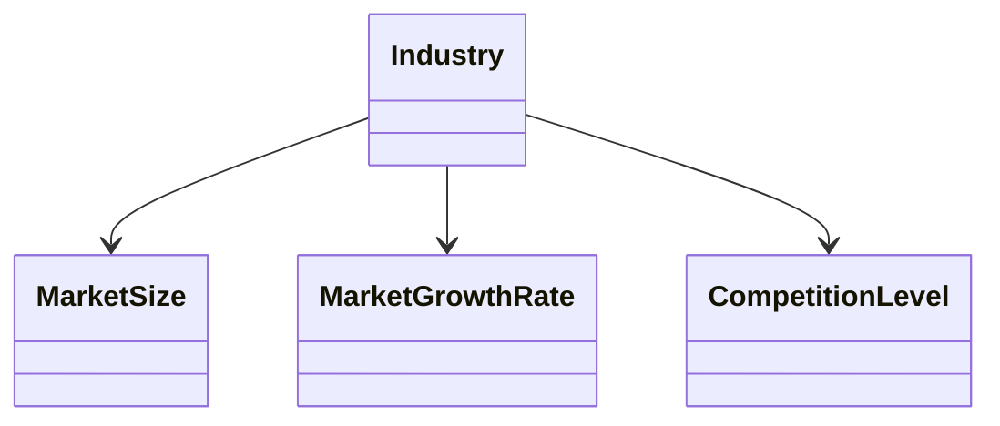

                 


# 彼得林奇的"行业生命周期"分析框架

## 关键词：行业生命周期，彼得林奇，投资分析，行业分析，市场趋势

## 摘要：本文介绍彼得林奇提出的行业生命周期分析框架，探讨其核心概念、分析方法和实际应用。通过详细分析行业生命周期的各个阶段，帮助投资者和企业更好地理解市场趋势和投资机会。

---

# 第一部分：行业生命周期分析框架概述

## 1.1 行业生命周期的基本概念

### 1.1.1 行业生命周期的定义

行业生命周期是指一个行业从诞生、成长到成熟，再到衰退的整个演变过程。每个行业在其生命周期中会经历不同的阶段，每个阶段都有其独特的特征和市场表现。

### 1.1.2 行业生命周期的阶段划分

行业生命周期通常分为四个阶段：

1. **导入期（Introduction）**：行业刚刚进入市场，产品或服务逐渐被消费者接受，市场需求增长缓慢，竞争较小。
2. **成长期（Growth）**：市场需求迅速增长，行业规模扩大，企业数量增加，竞争开始加剧。
3. **成熟期（Maturity）**：市场趋于饱和，行业规模稳定增长，竞争激烈，价格压力增大。
4. **衰退期（Decline）**：市场需求下降，行业规模缩小，企业逐渐退出，竞争减弱。

### 1.1.3 行业生命周期的影响因素

行业生命周期受多种因素影响，包括技术进步、消费者偏好、政策法规、经济环境等。这些因素会加速或延缓行业的生命周期。

## 1.2 彼得林奇的行业生命周期分析框架

### 1.2.1 分析框架的核心理念

彼得林奇的行业生命周期分析框架强调通过分析行业所处的生命周期阶段，来评估其投资价值。他认为，处于不同阶段的行业适合不同的投资策略。

### 1.2.2 分析框架的适用范围

该框架适用于分析大多数行业，尤其是制造业、服务业和技术行业。它可以帮助投资者识别高增长行业和衰退行业，制定相应的投资策略。

### 1.2.3 分析框架的局限性

尽管彼得林奇的框架有其优势，但也存在一些局限性，比如对新兴行业的适用性较弱，且需要大量市场数据支持。

---

# 第二部分：行业生命周期的核心概念与联系

## 2.1 行业生命周期的核心概念

### 2.1.1 行业生命周期的四个阶段

1. **导入期**：市场需求低，企业数量少，竞争小。
2. **成长期**：市场需求增长快，企业数量增加，竞争加剧。
3. **成熟期**：市场需求稳定，企业数量稳定，竞争激烈。
4. **衰退期**：市场需求下降，企业数量减少，竞争减弱。

### 2.1.2 每个阶段的关键特征

- **导入期**：市场增长率低，企业利润微薄，风险较高。
- **成长期**：市场增长率高，企业利润开始上升，竞争加剧。
- **成熟期**：市场增长率稳定，企业利润达到峰值，竞争激烈。
- **衰退期**：市场增长率下降，企业利润下降，竞争减弱。

### 2.1.3 不同阶段的行业表现对比

| 阶段       | 市场增长率 | 利润水平 | 竞争程度 |
|------------|------------|----------|----------|
| 导入期     | 低         | 低       | 低       |
| 成长期     | 高         | 中       | 中       |
| 成熟期     | 稳定       | 高       | 高       |
| 衰退期     | 下降       | 低       | 低       |

## 2.2 行业生命周期的核心要素

### 2.2.1 市场增长率

市场增长率是衡量行业生命周期阶段的重要指标。通过分析市场增长率的变化，可以判断行业所处的阶段。

### 2.2.2 市场容量

市场容量反映行业的市场规模。在导入期和成长期，市场容量迅速扩大；在成熟期和衰退期，市场容量趋于稳定或下降。

### 2.2.3 行业竞争程度

行业竞争程度在不同阶段有所不同。导入期和成长期竞争较小，成熟期和衰退期竞争激烈。

## 2.3 行业生命周期与其他分析工具的关系

### 2.3.1 与SWOT分析的对比

SWOT分析用于评估企业的优势、劣势、机会和威胁，而行业生命周期分析框架关注整个行业的生命周期阶段。两者可以结合使用，帮助投资者全面分析行业和企业。

### 2.3.2 与PEST分析的对比

PEST分析用于评估政治、经济、社会和技术因素对行业的影响，而行业生命周期分析框架关注行业的整体发展趋势。两者结合可以帮助投资者更好地理解行业的宏观环境。

### 2.3.3 与波特五力模型的对比

波特五力模型分析行业的竞争结构，而行业生命周期分析框架关注行业的整体生命周期阶段。两者结合可以帮助投资者全面评估行业的竞争环境。

---

# 第三部分：行业生命周期分析框架的构建

## 3.1 行业生命周期分析框架的构建步骤

### 3.1.1 确定行业的基本特征

首先，需要明确行业的基本特征，包括市场规模、市场增长率、竞争程度等。

### 3.1.2 确定行业的生命周期阶段

根据行业生命周期的四个阶段，判断行业所处的具体阶段。

### 3.1.3 分析行业的竞争环境

通过分析行业竞争环境，评估行业的投资价值。

## 3.2 行业生命周期分析框架的数学模型

### 3.2.1 生命周期阶段的数学表达

行业生命周期的数学模型可以通过市场增长率和市场容量来表示。例如：

$$ \text{市场增长率} = \frac{\text{当前市场规模} - \text{上期市场规模}}{\text{上期市场规模}} $$

### 3.2.2 行业增长与生命周期阶段的关系

在成长期，市场增长率较高；在成熟期，市场增长率稳定；在衰退期，市场增长率下降。

### 3.2.3 行业生命周期的预测模型

通过历史数据分析，可以预测行业生命周期的未来阶段。

---

# 第四部分：行业生命周期分析的算法原理

## 4.1 行业生命周期分析的算法流程

### 4.1.1 数据收集与预处理

收集行业的市场规模、市场增长率、竞争程度等数据，并进行清洗和整理。

### 4.1.2 生命周期阶段的分类

根据预处理后的数据，使用聚类分析或分类算法，将行业分为导入期、成长期、成熟期和衰退期。

### 4.1.3 行业趋势的预测

通过时间序列分析或机器学习算法，预测行业未来的生命周期阶段。

## 4.2 行业生命周期分析的数学模型

### 4.2.1 行业增长模型

$$ \text{市场增长率} = \frac{\text{当前市场规模} - \text{上期市场规模}}{\text{上期市场规模}} $$

### 4.2.2 行业竞争模型

$$ \text{竞争程度} = \frac{\text{行业内企业数量}}{\text{市场规模}} $$

---

# 第五部分：系统分析与架构设计方案

## 5.1 问题场景介绍

通过分析行业生命周期阶段，帮助投资者制定投资策略。

## 5.2 项目介绍

设计一个行业生命周期分析系统，帮助用户快速判断行业所处的生命周期阶段。

## 5.3 系统功能设计

### 5.3.1 领域模型（Mermaid类图）



## 5.4 系统架构设计（Mermaid架构图）

```mermaid
div class="mermaid"
graph LR
    A[用户] --> B[数据输入]
    B --> C[数据预处理]
    C --> D[生命周期阶段分类]
    D --> E[行业趋势预测]
    E --> F[结果输出]
```

## 5.5 系统接口设计

设计API接口，用于数据输入和结果输出。

## 5.6 系统交互设计（Mermaid序列图）

```mermaid
div class="mermaid"
sequenceDiagram
    participant 用户
    participant 系统
    用户 -> 系统: 提供行业数据
    系统 -> 用户: 返回生命周期阶段
```

---

# 第六部分：项目实战

## 6.1 环境安装

安装Python和必要的数据处理库（如Pandas、Scikit-learn）。

## 6.2 核心实现源代码

```python
import pandas as pd
from sklearn.cluster import KMeans

# 数据预处理
data = pd.read_csv('industry_data.csv')
data_processed = data.dropna()

# 生命周期阶段分类
model = KMeans(n_clusters=4)
model.fit(data_processed)
labels = model.predict(data_processed)

# 行业趋势预测
from statsmodels.tsa.arima_model import ARIMA
model = ARIMA(data_processed['market_growth_rate'], order=(1,1,1))
model.fit()
forecast = model.forecast(steps=12)
```

## 6.3 代码应用解读与分析

通过代码实现行业生命周期阶段的分类和趋势预测，帮助投资者制定投资策略。

## 6.4 实际案例分析

以某行业为例，分析其生命周期阶段，并制定相应的投资策略。

## 6.5 项目小结

总结项目实施过程中的经验和教训，提出改进建议。

---

# 第七部分：最佳实践 tips、小结、注意事项、拓展阅读

## 7.1 tips

- 定期更新行业数据，保持模型的准确性。
- 结合其他分析工具，全面评估行业和企业。

## 7.2 小结

彼得林奇的行业生命周期分析框架是一个强大的工具，帮助投资者和企业理解行业发展趋势，制定有效的投资策略。

## 7.3 注意事项

- 数据的准确性和及时性是关键。
- 模型的选择和参数设置会影响分析结果。

## 7.4 拓展阅读

推荐阅读彼得林奇的《投资学入门： stocks for the long run》和《股市外的百万aires》。

---

# 作者：AI天才研究院 & 禅与计算机程序设计艺术

