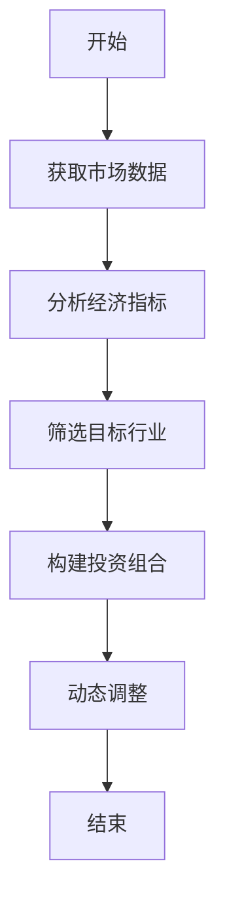

                 


# 彼得林奇的"行业轮动"在全球市场的应用

## 关键词：行业轮动、彼得林奇、投资策略、经济周期、全球市场、风险管理

## 摘要：
本文深入分析了彼得·林奇的行业轮动策略在全球市场中的应用，从理论基础到实际操作，结合经济周期、行业特征和市场环境，探讨了如何通过行业轮动实现投资收益最大化。文章详细阐述了行业轮动的核心思想、驱动因素、策略实施步骤，并结合全球主要市场的案例，展示了该策略的广泛应用与实际效果。

---

## 第1章: 行业轮动的基本概念

### 1.1 彼得·林奇与行业轮动

#### 1.1.1 彼得·林奇的背景介绍
彼得·林奇是美国著名投资经理人，以其在富达麦哲伦基金的卓越表现而闻名。他的投资理念强调长期价值投资和行业轮动策略，尤其擅长在不同经济周期中捕捉行业机会。

#### 1.1.2 行业轮动的定义与核心思想
行业轮动是指根据经济周期的变化，投资者在不同行业中进行动态切换，以捕捉不同行业在不同阶段的投资机会。彼得·林奇的核心思想是通过分析经济周期和行业特性，选择具有增长潜力的行业进行投资。

#### 1.1.3 行业轮动在投资中的作用
行业轮动能够帮助投资者在经济周期波动中优化资产配置，降低投资风险，同时抓住不同行业在不同阶段的增长机会。

### 1.2 行业轮动的驱动因素

#### 1.2.1 经济周期的影响
经济周期的波动直接影响行业的兴衰。例如，在经济衰退期，防御性行业（如公用事业、医疗保健）可能表现较好，而在经济复苏期，周期性行业（如制造业、科技）可能更具投资价值。

#### 1.2.2 行业特征与市场情绪
不同行业的特性（如成长性、收益稳定性）和投资者情绪（如乐观、悲观）也会驱动行业轮动。例如，在市场情绪高涨时，投资者更倾向于投资高增长行业。

#### 1.2.3 政策与监管环境
政府政策和监管变化对行业轮动有重要影响。例如，环保政策的变化可能推动新能源行业的崛起。

---

## 第2章: 行业轮动的理论基础

### 2.1 经济周期与行业表现

#### 2.1.1 经济周期的四个阶段
经济周期通常分为衰退、复苏、繁荣和萧条四个阶段。每个阶段的行业表现具有显著差异。

#### 2.1.2 不同阶段的行业表现特征
- **衰退阶段**：防御性行业（如公用事业、医疗保健）表现较好。
- **复苏阶段**：周期性行业（如制造业、房地产）开始复苏。
- **繁荣阶段**：科技、消费等行业表现优异。
- **萧条阶段**：资源型行业（如能源、原材料）可能面临压力。

#### 2.1.3 经济周期与行业轮动的关系
行业轮动的核心是根据经济周期的变化，动态调整投资组合中的行业配置。

### 2.2 行业轮动的数学模型

#### 2.2.1 行业轮动的数学表达式
通过回归分析和多因子模型，可以量化不同行业的表现与经济指标之间的关系。

#### 2.2.2 经济指标与行业轮动的关联性分析
使用协方差矩阵和相关性分析，评估不同经济指标对行业轮动的影响。

#### 2.2.3 行业轮动的量化指标设计
设计行业轮动的量化指标，例如行业收益增长率、行业估值水平等。

---

## 第3章: 彼得·林奇的行业轮动策略

### 3.1 彼得·林奇的投资理念

#### 3.1.1 价值投资与成长投资的结合
彼得·林奇强调寻找具有成长潜力的低估行业，结合价值投资和成长投资的理念。

#### 3.1.2 行业轮动中的选股策略
通过分析行业基本面和市场趋势，选择具有增长潜力的行业和公司。

#### 3.1.3 长期投资与短期策略的平衡
在长期投资中，行业轮动策略通过动态调整，平衡短期波动和长期收益。

### 3.2 行业轮动的具体操作步骤

#### 3.2.1 行业筛选与评估
- 根据经济指标和行业特性，筛选具有增长潜力的行业。
- 评估行业的财务健康状况和市场前景。

#### 3.2.2 投资组合的构建
- 根据行业轮动策略，构建多元化投资组合。
- 通过权重分配，平衡不同行业的风险和收益。

#### 3.2.3 动态调整与风险管理
- 定期评估投资组合的行业配置，进行动态调整。
- 通过风险对冲和分散投资，降低整体风险。

---

## 第4章: 全球市场中的行业轮动模式

### 4.1 不同市场的行业轮动特点

#### 4.1.1 美国市场的行业轮动模式
- 美国市场行业轮动受科技创新和消费驱动，科技、金融和医疗行业表现突出。

#### 4.1.2 欧洲市场的行业轮动模式
- 欧洲市场行业轮动受宏观经济政策和区域经济影响较大，能源和工业行业表现突出。

#### 4.1.3 亚洲市场的行业轮动模式
- 亚洲市场行业轮动受新兴经济体驱动，科技、消费和制造业行业表现优异。

### 4.2 全球经济与行业轮动的关系

#### 4.2.1 全球经济周期对行业轮动的影响
全球经济周期的变化直接影响全球市场的行业轮动趋势。

#### 4.2.2 地缘政治对行业轮动的潜在影响
地缘政治风险可能引发某些行业的波动，例如能源、原材料等行业。

#### 4.2.3 全球化背景下行业轮动的机遇与挑战
全球化为行业轮动提供了更广泛的市场选择，但也带来了更多的不确定性和风险。

---

## 第5章: 行业轮动的系统分析与架构设计

### 5.1 行业轮动的系统分析

#### 5.1.1 问题场景介绍
- 投资者需要根据市场变化动态调整行业配置。
- 系统需要实时监控市场数据，分析行业趋势。

#### 5.1.2 系统功能设计（领域模型类图）


#### 5.1.3 系统架构设计（架构图）


#### 5.1.4 系统接口设计
- 数据接口：获取市场数据和经济指标。
- 用户接口：提供行业轮动建议和投资组合配置。

#### 5.1.5 系统交互设计（序列图）


### 5.2 行业轮动的算法实现

#### 5.2.1 行业轮动的算法流程图（mermaid）


#### 5.2.2 行业轮动的数学模型与公式
行业轮动模型可以通过多因子回归模型实现：
$$ R_i = \beta_0 + \beta_1 X_1 + \beta_2 X_2 + \epsilon $$
其中，$R_i$ 是行业收益，$X_1$ 和 $X_2$ 是经济指标，$\beta$ 是回归系数。

#### 5.2.3 算法实现的Python源代码
```python
import pandas as pd
import numpy as np

# 假设market_data是包含市场数据的DataFrame
# 经济指标和行业收益数据
market_data = pd.DataFrame({
    'GDP_growth': [2.5, 3.1, 2.8, 3.0],
    ' unemployment_rate': [6.2, 5.8, 6.1, 5.9],
    ' industry_returns': [5.2, 3.8, 6.1, 4.3]
})

# 使用多元回归模型预测行业收益
X = market_data[['GDP_growth', 'unemployment_rate']]
y = market_data[' industry_returns']

# 计算回归系数
beta = np.linalg.inv(X.T @ X) @ X.T @ y

# 预测行业收益
predicted_returns = X @ beta

print("回归系数：", beta)
print("预测收益：", predicted_returns)
```

---

## 第6章: 项目实战

### 6.1 环境安装

#### 6.1.1 Python环境
- 安装Python 3.8及以上版本。
- 安装必要的库：pandas、numpy、scipy。

#### 6.1.2 数据获取
- 使用Yahoo Finance获取市场数据。
- 使用经济指标API获取经济数据。

### 6.2 系统核心实现

#### 6.2.1 数据处理
```python
import pandas as pd
import numpy as np

# 获取市场数据
market_data = pd.read_csv('market_data.csv')

# 数据清洗
market_data.dropna(inplace=True)
market_data = market_data[market_data['date'] >= '2020-01-01']
```

#### 6.2.2 行业轮动模型实现
```python
from sklearn.linear_model import LinearRegression

# 构建回归模型
model = LinearRegression()
model.fit(X_train, y_train)

# 预测行业收益
predicted = model.predict(X_test)
```

#### 6.2.3 投资组合优化
```python
import pandas as pd
import numpy as np

# 计算投资组合的收益和风险
def portfolio_return(weights, returns):
    return weights.T @ returns

def portfolio_risk(weights, returns):
    return np.sqrt(weights.T @ returns.cov() @ weights)

# 优化权重
from scipy.optimize import minimize

def optimize_portfolio(returns, N=2):
    n = len(returns.columns)
    # 目标函数：最小化风险
    def objective(weights):
        return portfolio_risk(weights, returns)
    # 约束条件：权重之和为1，且权重非负
    constraints = [{'type': 'eq', 'fun': lambda w: np.sum(w) - 1.0},
                   {'type': 'ineq', 'fun': lambda w: w - 0.0}]
    # 初始权重
    initial_weights = np.array([1.0/n]*n)
    # 求解优化问题
    result = minimize(objective, initial_weights, constraints=constraints)
    return result.x

# 应用到行业轮动中
optimal_weights = optimize_portfolio(returns)
```

### 6.3 案例分析

#### 6.3.1 美国市场的案例分析
- 选择科技行业和金融行业进行轮动。
- 根据经济指标预测行业收益，动态调整权重。

#### 6.3.2 中国市场的案例分析
- 选择消费行业和制造业进行轮动。
- 根据国内经济政策和市场趋势进行调整。

### 6.4 小结
通过实际案例分析，验证了彼得·林奇行业轮动策略的有效性，并展示了如何通过系统化的方法实现投资收益最大化。

---

## 总结

彼得·林奇的行业轮动策略在全球市场中具有广泛的应用价值。通过分析经济周期、行业特性和市场趋势，投资者可以动态调整行业配置，优化投资组合。本文结合理论分析和实际案例，为投资者提供了系统的行业轮动策略和实现方法。

---

## 作者：AI天才研究院/AI Genius Institute & 禅与计算机程序设计艺术 /Zen And The Art of Computer Programming

