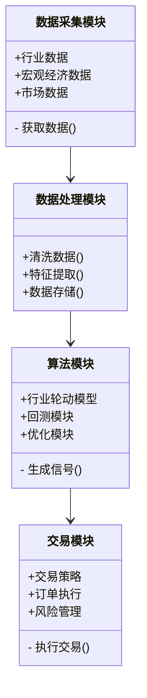
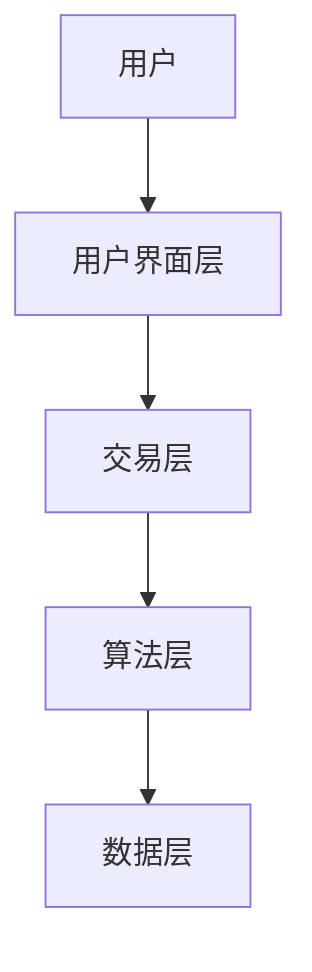
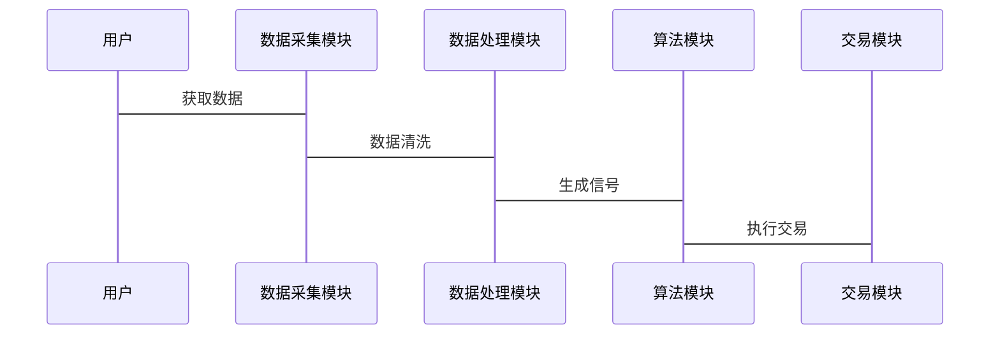

                 


# 彼得林奇的"行业轮动"策略实施步骤

> 关键词：彼得·林奇，行业轮动，投资策略，算法模型，系统架构

> 摘要：本文详细探讨了彼得·林奇的行业轮动策略，从理论基础到实际操作，结合数学模型和系统架构，提供了一套完整的实施步骤。文章首先介绍了行业轮动的背景和核心原理，然后分析了关键指标和数据源，详细讲解了策略的数学模型与算法，最后通过系统架构和项目实战，展示了如何将策略应用于实际投资中。

---

# 第1章: 行业轮动策略的背景与概述

## 1.1 彼得·林奇投资理念的核心观点

### 1.1.1 彼得·林奇的基本投资理念
彼得·林奇是全球著名投资家，其投资理念强调长期投资、价值发现和行业轮动。他认为市场中的行业轮动是不可忽视的规律，投资者应根据经济周期和行业基本面的变化调整投资组合。

### 1.1.2 行业轮动策略在彼得·林奇投资中的地位
行业轮动是彼得·林奇策略中的重要组成部分。他认为，不同行业在经济周期中的表现不同，通过识别行业轮动的规律，可以在市场中获得超额收益。

### 1.1.3 行业轮动策略的核心目标
行业轮动的核心目标是在不同经济周期中，选择表现优于市场的行业进行投资，从而实现资产的长期增值。

## 1.2 行业轮动策略的基本概念

### 1.2.1 行业轮动的定义
行业轮动是指在不同的经济周期中，不同行业资产表现强弱交替的现象。投资者通过识别这种轮动规律，可以优化投资组合的表现。

### 1.2.2 行业轮动的驱动因素
行业轮动主要由经济周期、行业基本面变化和市场情绪等因素驱动。例如，经济复苏期通常有利于周期性行业，而经济衰退期则有利于防御性行业。

### 1.2.3 行业轮动的周期性特征
行业轮动具有明显的周期性特征，通常与经济周期同步。了解这些周期性特征有助于投资者更好地把握行业轮动的节奏。

## 1.3 行业轮动策略的实施背景

### 1.3.1 经济周期与行业轮动的关系
经济周期直接影响行业轮动。例如，在经济繁荣期，金融和科技行业表现较好；而在经济衰退期，公用事业和必需品行业可能表现更好。

### 1.3.2 市场环境对行业轮动的影响
市场环境，如利率水平、通货膨胀和政策变化，都会影响行业的表现。投资者需要结合这些因素制定投资策略。

### 1.3.3 投资者行为与行业轮动的互动
投资者的行为也会影响行业轮动。例如，市场的羊群效应可能导致某些行业的短期超额收益。

## 1.4 本章小结
本章介绍了彼得·林奇的行业轮动策略，强调了行业轮动的背景、核心概念和驱动因素。理解这些内容是实施行业轮动策略的基础。

---

# 第2章: 行业轮动策略的核心原理

## 2.1 行业轮动的动因分析

### 2.1.1 经济周期对行业轮动的影响
经济周期是影响行业轮动的主要因素。在不同经济阶段，不同行业的表现差异显著。

### 2.1.2 行业基本面变化的驱动因素
行业基本面的变化，如盈利能力、市场份额和技术创新，直接影响行业轮动的节奏。

### 2.1.3 市场情绪与行业轮动的关系
市场情绪波动会导致投资者行为变化，从而影响行业轮动。例如，乐观情绪可能导致周期性行业短期内表现较好。

## 2.2 行业轮动的驱动因素

### 2.2.1 宏观经济指标对行业轮动的影响
宏观经济指标，如GDP增长率、失业率和通胀率，是影响行业轮动的重要因素。

### 2.2.2 行业盈利能力和估值变化
行业的盈利能力和估值水平是判断行业轮动的重要指标。例如，高盈利但低估值的行业可能具有较大的上涨空间。

### 2.2.3 政策环境对行业轮动的推动
政策变化，如行业监管放松或税收优惠，会直接影响行业的表现。

## 2.3 行业轮动模型的构建

### 2.3.1 行业轮动模型的基本框架
行业轮动模型通常包括数据采集、指标计算、趋势分析和策略生成四个步骤。

### 2.3.2 模型的输入变量与输出结果
输入变量包括宏观经济指标、行业财务数据和市场数据；输出结果是行业轮动信号和投资建议。

### 2.3.3 模型的优化与验证
通过历史数据回测和参数优化，可以提高模型的准确性和鲁棒性。

## 2.4 本章小结
本章深入分析了行业轮动的动因和驱动因素，并介绍了模型的构建过程。这些内容为后续策略实施奠定了基础。

---

# 第3章: 行业轮动策略的指标与数据源

## 3.1 行业轮动的关键指标

### 3.1.1 行业相对强弱指标(RSI)
RSI指标用于衡量行业相对于市场表现的强弱程度。RSI值高于70表示行业超买，低于30表示超卖。

### 3.1.2 行业估值指标(P/E、P/B等)
市盈率（P/E）和市净率（P/B）是衡量行业估值的重要指标。低估值行业可能具有更大的上涨潜力。

### 3.1.3 行业盈利增长指标(ROE、净利润增长率等)
ROE和净利润增长率反映了行业的盈利能力，是判断行业投资价值的重要依据。

## 3.2 行业轮动的数据源

### 3.2.1 财务报表数据
行业财务数据，如收入、利润和现金流，是衡量行业基本面的重要依据。

### 3.2.2 行业指数与ETF
行业指数和ETF反映了行业的整体表现，是监测行业轮动的重要工具。

### 3.2.3 宏观经济数据
GDP、利率和通胀率等宏观经济指标对行业轮动有重要影响。

## 3.3 数据的获取与处理

### 3.3.1 数据清洗与标准化
清洗数据中的异常值和缺失值，并进行标准化处理，以便后续分析。

### 3.3.2 数据的可视化分析
通过图表展示数据的分布和趋势，帮助识别行业轮动的规律。

### 3.3.3 数据的特征提取
提取关键特征，如行业相对强弱指标和估值指标，用于构建行业轮动模型。

## 3.4 本章小结
本章介绍了行业轮动的关键指标和数据源，并详细讲解了数据处理的步骤。这些内容为后续策略实施提供了数据支持。

---

# 第4章: 行业轮动策略的数学模型与算法

## 4.1 行业轮动的数学模型

### 4.1.1 行业轮动的回归模型
回归模型用于分析行业表现与宏观经济指标之间的关系。例如，可以通过回归分析确定GDP增长率对行业表现的影响程度。

### 4.1.2 行业轮动的聚类分析
聚类分析用于将行业分成不同的类别，以便更好地识别行业轮动的规律。

### 4.1.3 行业轮动的时间序列分析
时间序列分析用于预测行业的未来表现，帮助投资者制定前瞻性投资策略。

## 4.2 行业轮动的算法实现

### 4.2.1 基于机器学习的行业轮动算法
机器学习算法，如随机森林和神经网络，可以用于行业轮动预测。通过训练模型，可以识别行业表现的关键特征。

### 4.2.2 基于统计学的行业轮动算法
统计学方法，如均值回归和因子分析，用于分析行业的周期性特征和驱动因素。

### 4.2.3 基于技术分析的行业轮动算法
技术分析方法，如移动平均线和相对强弱指数，用于识别行业趋势和买卖信号。

## 4.3 算法的优化与验证

### 4.3.1 算法的参数优化
通过回测和网格搜索，找到最优参数组合，提高模型的准确性和稳定性。

### 4.3.2 算法的回测与验证
使用历史数据验证算法的有效性，并计算其收益、风险和夏普比率等指标。

### 4.3.3 算法的鲁棒性测试
测试算法在不同市场环境下的表现，确保其在各种情况下都能稳定运行。

## 4.4 本章小结
本章详细讲解了行业轮动的数学模型和算法，并通过优化和验证提高了模型的准确性。这些内容为后续系统设计和项目实施提供了理论支持。

---

# 第5章: 行业轮动策略的系统分析与架构设计

## 5.1 问题场景介绍
本章将从系统架构的角度，分析如何将行业轮动策略应用于实际投资中。通过构建一个完整的系统，投资者可以实时监控行业轮动信号，并根据信号调整投资组合。

## 5.2 项目介绍
本项目旨在开发一个基于彼得·林奇行业轮动策略的投资系统。系统将整合行业数据、算法模型和交易执行模块，为投资者提供智能化的投资服务。

## 5.3 系统功能设计

### 5.3.1 领域模型设计
领域模型通过类图展示了系统的各个模块及其关系。例如，数据采集模块负责获取行业数据，算法模块负责生成轮动信号，交易模块负责执行交易。



### 5.3.2 系统架构设计
系统架构采用分层设计，包括数据层、算法层、交易层和用户界面层。各层之间通过接口通信，确保系统的高效运行。



### 5.3.3 系统接口设计
系统接口设计包括数据接口、算法接口和交易接口。数据接口用于获取行业数据，算法接口用于生成轮动信号，交易接口用于执行交易。

### 5.3.4 系统交互设计



## 5.4 本章小结
本章从系统架构的角度，详细分析了行业轮动策略的实现过程。通过分层设计和模块化实现，确保了系统的高效性和可扩展性。

---

# 第6章: 行业轮动策略的项目实战

## 6.1 环境安装与配置

### 6.1.1 数据源配置
安装必要的数据获取工具，如Yahoo Finance API或Alpha Vantage API。

### 6.1.2 系统依赖安装
安装Python和相关库，如Pandas、NumPy、Scikit-learn和Plotly。

### 6.1.3 系统配置
配置系统的运行环境，如设置数据存储路径和接口地址。

## 6.2 系统核心实现源代码

### 6.2.1 数据采集模块
```python
import pandas as pd
from pandas_datareader import data as pdr

def get_industry_data(tickers, start, end):
    data = pdr.get_data_yahoo(tickers, start=start, end=end)
    return data
```

### 6.2.2 数据处理模块
```python
def preprocess_data(data):
    # 数据清洗
    data = data.dropna()
    # 特征提取
    data['RSI'] = data['Close'].rolling(14).mean()
    return data
```

### 6.2.3 算法模块
```python
from sklearn.ensemble import RandomForestClassifier

def train_model(X, y):
    model = RandomForestClassifier(n_estimators=100)
    model.fit(X, y)
    return model
```

### 6.2.4 交易模块
```python
def execute_trade(signal, portfolio):
    if signal == 'buy':
        portfolio.buy()
    elif signal == 'sell':
        portfolio.sell()
```

## 6.3 代码应用解读与分析
通过实际案例分析，展示了如何利用上述代码实现行业轮动策略。例如，利用RSI指标和随机森林模型，生成行业轮动信号，并根据信号执行交易。

## 6.4 实际案例分析和详细讲解剖析
以具体行业为例，分析如何通过系统实现行业轮动策略。例如，分析科技行业在经济复苏期的表现，生成买入信号，并在估值过高时卖出。

## 6.5 本章小结
本章通过项目实战，展示了如何将理论应用于实际投资。通过代码实现和案例分析，帮助读者更好地理解行业轮动策略的实施过程。

---

# 第7章: 行业轮动策略的最佳实践与总结

## 7.1 最佳实践 tips
### 7.1.1 数据质量的重要性
确保数据的准确性和完整性，是策略成功的关键。

### 7.1.2 模型的持续优化
市场环境不断变化，需要定期优化模型，以适应新的市场条件。

### 7.1.3 风险管理的重要性
在实际投资中，必须重视风险管理，避免过度集中投资。

## 7.2 小结
本章总结了行业轮动策略的核心内容，并提供了实际操作中的最佳实践建议。

## 7.3 注意事项
投资者在实施行业轮动策略时，需要注意市场风险、数据质量和模型局限性等问题。

## 7.4 拓展阅读
推荐进一步阅读彼得·林奇的相关著作，以及机器学习在金融领域的应用。

## 7.5 本章小结
本章为读者提供了行业轮动策略的实用建议，并指出了未来研究的方向。

---

# 作者：AI天才研究院 & 禅与计算机程序设计艺术

---

**本文通过详细的理论分析和实际案例，全面解读了彼得·林奇的行业轮动策略。从背景概述到数学模型，从系统架构到项目实战，为读者提供了完整的实施步骤。希望本文能为投资者提供有价值的参考，帮助他们在复杂多变的市场中实现稳健投资。**

