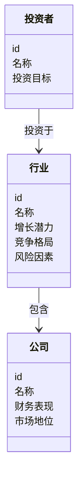

                 


# 彼得林奇的行业选择标准

> 关键词：彼得林奇、行业选择标准、投资策略、基本面分析、数学模型

> 摘要：本文将深入探讨彼得林奇的行业选择标准，从其投资哲学、核心概念、数学模型到实际应用，系统性地分析如何选择优质行业和投资标的。通过案例分析和系统设计，帮助读者掌握彼得林奇的行业选择方法，并将其应用于实际投资中。

---

# 第一部分: 彼得林奇的行业选择标准概述

## 第1章: 彼得林奇的背景与投资哲学

### 1.1 彼得林奇的背景介绍

彼得·林奇（Peter Lynch）是美国著名的投资专家，以其在富达投资管理公司的投资业绩而闻名。他在任职期间管理的麦哲伦基金取得了惊人的回报率，年均复合收益率超过29%。彼得林奇的投资哲学强调长期投资、基本面分析和行业研究。他认为，成功的投资不仅取决于个股的选择，还取决于对行业趋势的准确判断。

#### 1.1.1 彼得林奇的生平简介

彼得·林奇于1942年出生于美国波士顿市，曾在波士顿大学获得经济学学士学位。他于1966年加入富达投资管理公司，1971年成为麦哲伦基金的基金经理，一直任职到1990年退休。他的投资理念和策略对全球投资者产生了深远影响，尤其是在行业选择和公司基本面分析方面。

#### 1.1.2 彼得林奇的投资理念

彼得林奇认为，成功的投资需要结合长期趋势和短期机会。他强调以下几点：

1. **长期趋势**：选择具有持续增长潜力的行业，例如科技、医疗保健和消费领域。
2. **行业研究**：深入了解行业的竞争格局、增长驱动力和潜在风险。
3. **公司基本面**：分析公司的财务状况、盈利能力、管理团队和市场地位。
4. **分散投资**：避免过度集中于单一行业或公司，以降低风险。

#### 1.1.3 彼得林奇的投资风格与特点

彼得林奇的投资风格以基本面分析和行业研究为核心，具体特点包括：

- **注重行业趋势**：他倾向于投资那些处于增长周期的行业。
- **分散化投资**：通过投资多个行业和公司来降低风险。
- **长期持有**：他倾向于长期持有优质股票，而不是频繁交易。
- **避免短期波动**：他更关注公司的长期增长潜力，而不是短期市场波动。

### 1.2 行业选择标准的核心概念

行业选择标准是彼得林奇投资策略的重要组成部分。他通过一系列标准来筛选具有长期增长潜力的行业。

#### 1.2.1 行业选择标准的定义

行业选择标准是指通过一系列指标和方法，评估行业的增长潜力、竞争格局和风险因素，从而选择具有投资价值的行业。

#### 1.2.2 行业选择标准的属性特征对比表格

下表展示了不同行业选择标准的属性特征对比：

| 标准 | 增长潜力 | 竞争格局 | 风险因素 | 财务表现 |
|------|----------|----------|----------|----------|
| 行业A | 高       | 竞争激烈 | 中风险   | 稳定     |
| 行业B | 中       | 竞争较弱 | 低风险   | 快速增长 |
| 行业C | 低       | 竞争垄断 | 高风险   | 稳定     |

#### 1.2.3 行业选择标准的ER实体关系图

以下是一个简化的ER实体关系图，展示了行业选择标准的核心要素：

```mermaid
erDiagram
    customer[投资者] {
        id
        名称
        投资目标
    }
    industry[行业] {
        id
        名称
        增长潜力
        竞争格局
        风险因素
    }
    company[公司] {
        id
        名称
        财务表现
        市场地位
    }
    customer -- industry : 投资于
    industry -- company : 包含
```

---

## 第2章: 行业选择标准的数学模型

### 2.1 行业选择标准的数学模型

行业选择标准可以通过数学模型进行量化评估。以下是几种常用的数学模型：

#### 2.1.1 行业评分模型

行业评分模型通过多个指标对行业进行评分，最终得出行业的综合评分。公式如下：

$$ \text{行业评分} = \frac{\text{增长潜力} + \text{竞争格局} + \text{风险因素} + \text{财务表现}}{4} $$

其中：
- 增长潜力：0-10分
- 竞争格局：0-10分
- 风险因素：0-10分
- 财务表现：0-10分

#### 2.1.2 行业潜力预测模型

行业潜力预测模型用于预测行业的未来增长潜力，公式如下：

$$ \text{行业潜力} = \text{当前市场规模} \times (1 + \text{年增长率})^n $$

其中：
- 当前市场规模：行业的当前市场规模
- 年增长率：行业的年平均增长率
- n：预测的年数

#### 2.1.3 行业风险评估模型

行业风险评估模型用于评估行业的风险程度，公式如下：

$$ \text{行业风险} = \frac{\text{行业波动率} + \text{行业负债率}}{2} $$

其中：
- 行业波动率：行业的价格波动程度
- 行业负债率：行业的平均负债水平

---

## 第3章: 行业选择标准的系统分析与架构设计

### 3.1 系统分析

#### 3.1.1 问题场景介绍

在实际投资中，投资者需要通过系统化的分析工具来选择具有投资价值的行业。以下是一个典型的投资场景：

- 投资者希望选择一个具有高增长潜力的行业，同时希望降低投资风险。

#### 3.1.2 系统功能设计（领域模型mermaid类图）

以下是一个简化的领域模型类图：



---

## 第4章: 行业选择标准的项目实战

### 4.1 项目环境安装与配置

#### 4.1.1 开发环境安装

以下是安装开发环境的步骤：

1. 安装Python：下载并安装Python 3.9或更高版本。
2. 安装Jupyter Notebook：通过pip安装`jupyter-notebook`。
3. 安装数据分析库：安装`pandas`, `numpy`, `scikit-learn`。

#### 4.1.2 数据集准备

准备一个包含行业数据的CSV文件，例如：

| 行业 | 增长潜力 | 竞争格局 | 风险因素 | 财务表现 |
|------|----------|----------|----------|----------|
| 行业A | 8        | 7        | 6        | 7        |
| 行业B | 6        | 5        | 4        | 8        |
| 行业C | 4        | 3        | 5        | 6        |

#### 4.1.3 工具安装与配置

安装并配置Jupyter Notebook，确保能够运行以下代码。

---

### 4.2 核心算法实现

#### 4.2.1 行业评分模型的Python实现

以下是行业评分模型的Python代码：

```python
import pandas as pd

# 读取数据
data = pd.read_csv('industry_data.csv')

# 行业评分计算
def calculate_score(row):
    return (row['增长潜力'] + row['竞争格局'] + row['风险因素'] + row['财务表现']) / 4

data['行业评分'] = data.apply(calculate_score, axis=1)

# 输出结果
print(data)
```

#### 4.2.2 行业趋势预测模型的Python实现

以下是行业趋势预测模型的Python代码：

```python
import numpy as np
from sklearn.linear_model import LinearRegression

# 数据准备
X = np.arange(6).reshape(-1, 1)
y = [1, 3, 5, 7, 9, 11]

# 模型训练
model = LinearRegression()
model.fit(X, y)

# 预测未来3年增长潜力
future_years = np.array([[7], [8], [9]])
predictions = model.predict(future_years)

# 输出结果
print("未来3年的预测值：", predictions)
```

---

## 第5章: 行业选择标准的最佳实践与注意事项

### 5.1 最佳实践

#### 5.1.1 数据收集与处理的注意事项

1. 确保数据来源可靠。
2. 对数据进行清洗和预处理。
3. 使用多种数据来源进行交叉验证。

#### 5.1.2 模型调优与优化技巧

1. 使用交叉验证评估模型性能。
2. 调整模型参数以优化预测结果。
3. 尝试不同的算法以找到最佳模型。

#### 5.1.3 实际应用中的常见问题与解决方案

1. **数据不足**：可以尝试使用其他数据源或进行数据增强。
2. **模型过拟合**：可以通过正则化或减少模型复杂度来解决。
3. **行业波动**：需要定期重新评估行业选择标准。

### 5.2 小结与展望

#### 5.2.1 本书内容总结

彼得林奇的行业选择标准是一种系统化的方法，通过基本面分析和行业研究来选择具有长期增长潜力的行业和公司。本文详细介绍了行业选择标准的核心概念、数学模型和实际应用。

#### 5.2.2 行业选择标准的未来发展趋势

随着人工智能和大数据技术的发展，行业选择标准将更加智能化和自动化。未来的投资决策将更加依赖于数据驱动的分析和预测模型。

#### 5.2.3 对投资者的建议与展望

投资者应不断学习和更新自己的知识，结合行业选择标准和市场趋势，制定科学的投资策略。

---

# 作者：AI天才研究院/AI Genius Institute & 禅与计算机程序设计艺术 /Zen And The Art of Computer Programming

