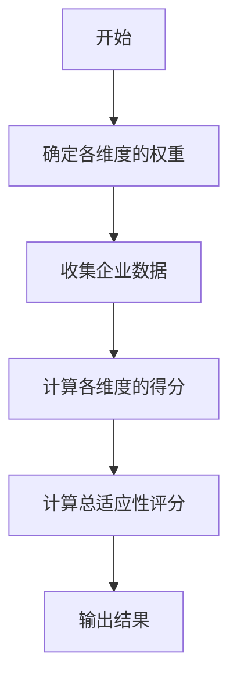
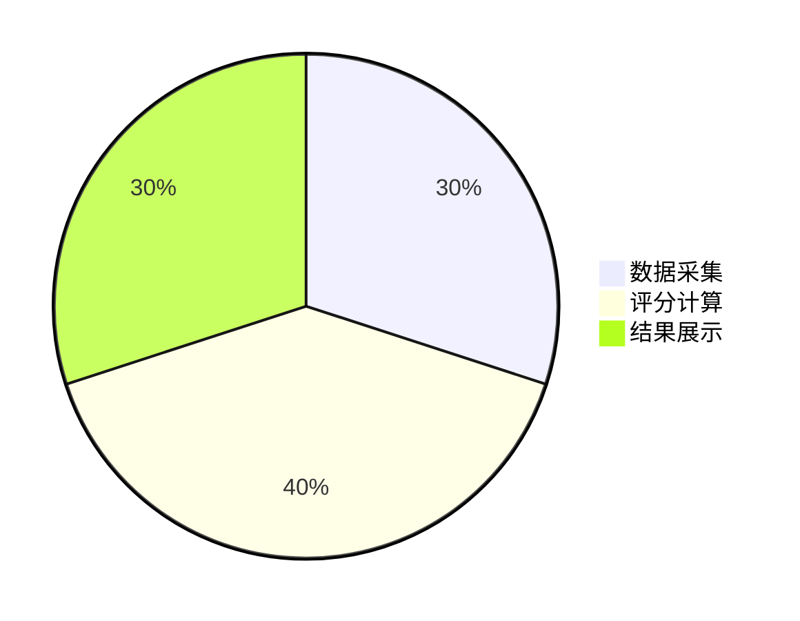
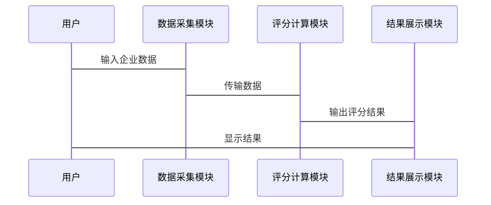

                 


# 彼得林奇的"行业领导者"在技术变革中的适应性评分模型

## 关键词：行业领导者、技术变革、适应性评分、彼得林奇模型、系统架构设计、项目实战

## 摘要：本篇文章将详细探讨彼得林奇提出的"行业领导者"在技术变革中的适应性评分模型。通过分析模型的核心概念、构建方法、算法原理、系统架构设计以及实际项目案例，我们将深入理解如何评估和提升企业适应技术变革的能力。文章内容丰富，逻辑清晰，涵盖从理论到实践的各个方面，帮助读者全面掌握适应性评分模型的应用方法。

---

## 第一部分: 技术变革与行业领导者的适应性挑战

### 第1章: 技术变革对企业的影响

#### 1.1 技术变革的背景与趋势

- **1.1.1 数字化转型的加速**
  - 数字化转型是当前企业发展的核心趋势，技术变革的速度和深度前所未有。
  - 企业需要不断适应新技术的出现和应用，以保持竞争力。

- **1.1.2 技术变革对企业竞争力的影响**
  - 技术变革直接影响企业的运营模式、产品创新和市场竞争力。
  - 能否快速适应技术变革决定了企业的生存与发展。

- **1.1.3 行业领导者的角色**
  - 行业领导者在技术变革中扮演着关键角色，引领行业发展方向。
  - 他们的适应性直接影响整个行业的技术进步和市场格局。

#### 1.2 行业领导者的定义与特征

- **1.2.1 行业领导者的定义**
  - 行业领导者是指在行业内具有领先地位，能够影响行业发展方向的企业。
  - 他们通常拥有强大的市场影响力、技术创新能力和资源分配能力。

- **1.2.2 行业领导者的特征分析**
  - **市场占有率高**：行业领导者通常占据较大的市场份额。
  - **技术创新能力强**：能够引领行业的技术发展方向。
  - **资源丰富**：拥有充足的人力、物力和财力资源。
  - **品牌影响力大**：在行业内具有较高的品牌知名度和信誉度。

- **1.2.3 行业领导者与非领导者的区别**
  - 行业领导者在技术变革中的适应能力更强，能够更快地调整战略和资源分配。
  - 非领导者通常缺乏足够的资源和灵活性，难以应对快速变化的技术环境。

#### 1.3 技术变革中的适应性问题

- **1.3.1 适应性的重要性**
  - 适应性是企业在技术变革中生存和发展的关键能力。
  - 适应性强的企业能够快速调整战略、技术和组织结构，抓住技术变革带来的机遇。

- **1.3.2 技术变革中的常见挑战**
  - **技术更新速度快**：企业难以跟上技术变革的步伐。
  - **资源有限**：中小型企业缺乏足够的资源进行技术创新和调整。
  - **组织惯性**：企业内部的组织结构和文化可能阻碍变革的推进。

- **1.3.3 适应性不足的后果**
  - 适应性不足可能导致企业市场份额的丧失，甚至被市场淘汰。
  - 在竞争激烈的市场环境中，适应性不足的企业难以生存和发展。

---

## 第2章: 彼得林奇适应性评分模型的核心概念

### 2.1 适应性评分模型的定义

- **2.1.1 模型的提出背景**
  - 为了帮助企业评估和提升适应性，彼得林奇提出了适应性评分模型。
  - 该模型基于行业领导者的特征和适应性能力，提供了一套量化评估方法。

- **2.1.2 模型的目标与意义**
  - 目标：帮助企业识别和评估其在技术变革中的适应性能力。
  - 意义：通过量化评估，企业可以发现自身的不足，并制定相应的改进策略。

### 2.2 适应性评分的核心要素

- **2.2.1 适应性维度**
  - **技术能力**：企业的技术储备和创新能力。
  - **组织结构**：企业的组织灵活性和变革能力。
  - **资源分配**：企业资源的分配效率和灵活性。
  - **市场响应**：企业对市场变化的敏感性和反应速度。

- **2.2.2 评分标准**
  - 评分标准基于行业领导者的特征和适应性能力。
  - 每个维度都有具体的评分细则和权重分配。

- **2.2.3 权重分配**
  - 不同维度的权重根据其重要性进行分配。
  - 技术能力通常具有较高的权重，其次是市场响应和组织结构。

---

## 第3章: 适应性评分模型的构建与应用

### 3.1 模型构建的逻辑框架

- **3.1.1 数据收集与处理**
  - 收集企业的各项数据，包括技术能力、组织结构、资源分配和市场响应等方面。
  - 数据可能来自企业内部报告、市场调研和行业分析。

- **3.1.2 模型的设计与优化**
  - 根据数据设计适应性评分模型。
  - 通过不断测试和优化，确保模型的准确性和实用性。

- **3.1.3 模型的验证与测试**
  - 使用实际案例验证模型的有效性。
  - 根据验证结果调整模型参数和权重分配。

### 3.2 适应性评分的计算方法

- **3.2.1 加权平均法**
  - 使用加权平均法计算企业的适应性评分。
  - 公式：$$ \text{评分} = \sum (\text{权重}_i \times \text{得分}_i) $$

- **3.2.2 层次分析法**
  - 通过层次分析法确定各维度的权重。
  - 公式：$$ \text{权重}_i = \frac{\sum \text{得分}_i}{\sum \text{总得分}} $$

- **3.2.3 其他评分方法的对比**
  - 对比不同评分方法的优缺点，选择最适合的评估方法。

---

## 第4章: 模型的算法原理与数学公式

### 4.1 适应性评分的数学模型

- **4.1.1 模型的数学表达**
  - $$ \text{适应性评分} = \sum_{i=1}^{n} w_i \times s_i $$
  - 其中，$$ w_i $$ 是第 $$ i $$ 个维度的权重，$$ s_i $$ 是第 $$ i $$ 个维度的得分。

- **4.1.2 模型的变量与参数**
  - 变量：适应性评分、权重、得分。
  - 参数：各维度的权重分配。

- **4.1.3 模型的计算步骤**
  - 1. 确定各维度的权重。
  - 2. 根据实际数据计算各维度的得分。
  - 3. 使用加权平均法计算总适应性评分。

### 4.2 算法流程图



---

## 第5章: 系统分析与架构设计方案

### 5.1 系统分析

- **问题场景介绍**
  - 系统需要评估企业的适应性能力，帮助企业在技术变革中保持竞争力。

- **项目目标与范围**
  - 目标：开发一个适应性评分系统，帮助企业评估和提升适应性能力。
  - 范围：包括数据收集、模型计算、结果展示等功能。

- **系统功能设计**
  - **数据采集模块**：收集企业的各项数据。
  - **评分计算模块**：根据模型计算适应性评分。
  - **结果展示模块**：以可视化的方式展示评分结果。

### 5.2 系统架构设计

- **系统架构图**



- **模块划分与功能分配**
  - 数据采集模块：负责收集企业的各项数据。
  - 评分计算模块：根据模型计算适应性评分。
  - 结果展示模块：以图表或报告的形式展示评分结果。

- **系统接口设计**
  - 数据接口：与其他系统或数据库对接，获取企业数据。
  - 用户接口：供用户输入数据和查看结果。

- **系统交互设计**



---

## 第6章: 项目实战与案例分析

### 6.1 项目环境与工具安装

- **开发环境的选择**
  - 推荐使用Python和相关数据处理工具。

- **必要工具的安装**
  - 安装Python、Pandas、NumPy、Matplotlib等库。

### 6.2 系统核心代码实现

```python
import pandas as pd
import numpy as np
import matplotlib.pyplot as plt

# 定义适应性评分函数
def calculate_adaptability_score(weights, scores):
    return np.dot(weights, scores)

# 示例数据
weights = np.array([0.4, 0.3, 0.2, 0.1])  # 各维度权重
scores = np.array([0.8, 0.7, 0.6, 0.9])   # 各维度得分

# 计算适应性评分
score = calculate_adaptability_score(weights, scores)
print("适应性评分:", score)

# 可视化结果
plt.bar(range(len(weights)), weights)
plt.title("各维度权重分布")
plt.show()
```

### 6.3 案例分析

- **案例背景**
  - 某行业领导者企业在技术变革中的适应性评估。

- **数据分析**
  - 收集企业的各项数据，包括技术能力、组织结构、资源分配和市场响应。

- **评分计算**
  - 使用适应性评分模型计算企业的适应性评分。

- **结果解读**
  - 根据评分结果，提出改进建议和策略。

---

## 第7章: 最佳实践与小结

### 7.1 最佳实践 tips

- 定期更新模型和权重分配，以适应技术变革的新趋势。
- 关注行业动态，及时调整适应性评分策略。
- 通过数据可视化工具，直观展示评分结果，便于决策者理解和应用。

### 7.2 小结

- 本文详细介绍了彼得林奇的适应性评分模型，从理论到实践，全面解析了模型的构建和应用。
- 通过实际案例分析和系统架构设计，展示了模型的实际应用价值。
- 希望本文能够帮助企业更好地评估和提升在技术变革中的适应性能力。

---

## 作者：AI天才研究院 & 禅与计算机程序设计艺术

---

通过以上思考过程，我们可以系统地构建彼得林奇的适应性评分模型，并将其应用于实际项目中，帮助企业更好地应对技术变革的挑战。

