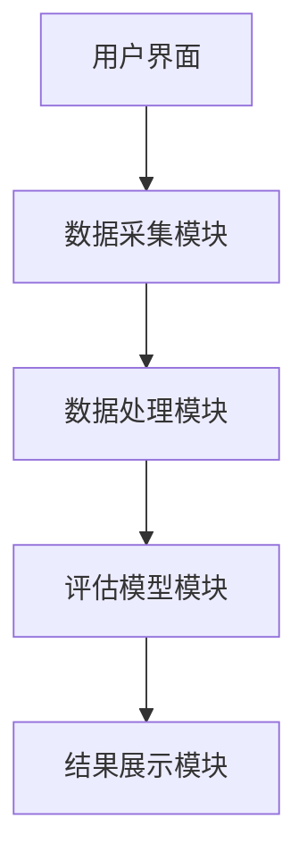
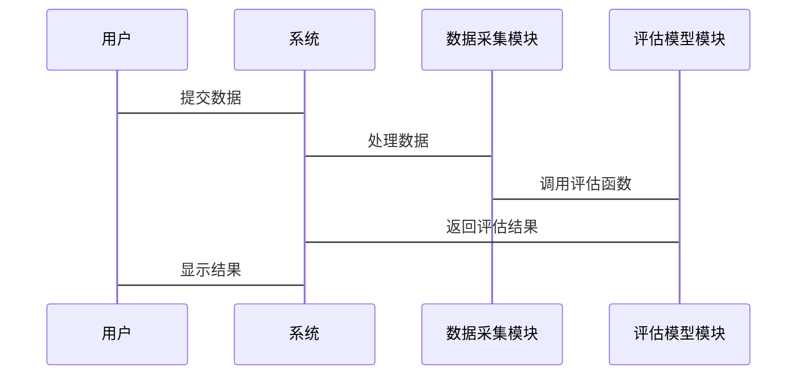

                 


# 彼得林奇的"行业领导者"在技术变革中的适应能力评估

## 关键词
- 行业领导者
- 技术变革
- 适应能力
- 彼得林奇
- 战略定位
- 组织结构
- 技术创新

## 摘要
本文探讨了彼得·林奇提出的“行业领导者”在技术变革中的适应能力评估。通过对行业领导者的定义、技术变革的背景与趋势、适应能力的核心要素及其评估方法的分析，结合实际案例和系统架构设计，深入探讨了企业如何在技术变革中保持竞争力。文章还详细阐述了适应能力评估的数学模型和算法实现，并通过Mermaid图和Python代码示例，帮助读者更好地理解和应用这些理论。

---

# 第一部分：行业领导者的定义与技术变革背景

## 第1章：行业领导者的定义与特征

### 1.1 行业领导者的定义
行业领导者是指在特定行业中占据领先地位，具有显著竞争优势，并能够引领行业发展的企业。这些企业通常具备以下核心特征：

1. **市场占有率高**：行业领导者通常在目标市场中占据最大的市场份额。
2. **创新能力突出**：能够持续推出创新产品或服务，引领行业发展方向。
3. **盈利能力强**：具备稳定的盈利能力，能够在竞争中持续投入研发和市场拓展。
4. **品牌影响力大**：拥有强大的品牌形象和客户忠诚度。

### 1.2 技术变革的背景与趋势
技术变革是推动行业领导者适应能力的核心因素之一。当前的技术变革主要体现在以下几个方面：

1. **数字化转型**：企业逐步从传统业务模式向数字化、智能化方向转型。
2. **人工智能与大数据**：AI和大数据技术的应用正在改变企业的运营方式和决策模式。
3. **云计算与边缘计算**：云计算的普及和边缘计算的发展为企业提供了更灵活的 IT 架构。
4. **区块链与物联网**：区块链和物联网技术的应用正在推动行业生态的变革。

### 1.3 适应能力的重要性
行业领导者在技术变革中的适应能力决定了其在竞争中的生存和发展空间。适应能力强的企业能够更快地捕捉市场机会，应对技术风险，并在变革中保持领先地位。

---

## 第2章：彼得林奇的行业领导者理论

### 2.1 彼得林奇的理论背景
彼得·林奇是美国著名的投资家和基金经理，他在《彼得林奇的成功投资》等著作中提出了“行业领导者”的概念。他认为，行业领导者应该具备以下特征：

1. **行业地位稳固**：在行业中占据领先地位，具有较高的品牌知名度。
2. **竞争优势明显**：拥有独特的竞争优势，如技术、成本或服务。
3. **管理团队优秀**：具备强大的管理团队，能够制定清晰的战略并执行到位。

### 2.2 技术变革中的适应能力
彼得林奇的理论强调，行业领导者必须具备在技术变革中的适应能力，才能在竞争中立于不败之地。这种适应能力包括以下几个方面：

1. **战略调整能力**：根据技术变革的趋势，及时调整企业战略。
2. **组织灵活性**：能够快速响应技术变革带来的组织结构和流程的变化。
3. **技术创新能力**：持续投入技术研发，保持技术领先优势。

### 2.3 行业领导者的适应能力评估
为了评估行业领导者在技术变革中的适应能力，我们可以从以下几个方面进行分析：

1. **战略适应性**：企业是否能够根据技术变革调整战略方向。
2. **组织灵活性**：组织结构和流程是否能够适应技术变革的需求。
3. **技术创新能力**：企业是否能够持续推出技术创新。
4. **市场响应速度**：企业在面对技术变革时的市场反应速度。

---

## 第3章：技术变革对企业适应能力的影响

### 3.1 技术变革对企业战略的影响
技术变革对企业战略的影响是深远的。企业需要根据技术变革的趋势，重新审视其战略定位，并制定相应的应对策略。

1. **战略调整的必要性**：技术变革可能改变行业的竞争规则，企业需要及时调整战略。
2. **技术创新与业务模式创新**：技术变革往往伴随着新的业务模式和技术创新，企业需要积极拥抱这些变化。
3. **风险管理**：技术变革可能带来新的风险，企业需要建立有效的风险管理机制。

### 3.2 技术变革对企业组织结构的影响
技术变革往往要求企业进行组织结构调整，以适应新的业务需求和技术特点。

1. **扁平化管理**：技术变革需要更快的决策速度和更灵活的组织结构，扁平化管理能够提高效率。
2. **跨部门协作**：技术变革往往需要多个部门的协作，企业需要建立高效的协作机制。
3. **灵活的人才管理**：技术变革要求企业具备灵活的人才管理机制，能够快速调整人员配置。

### 3.3 技术变革对企业文化的影响
技术变革对企业文化的影响不可忽视。企业需要建立一种能够适应技术变革的文化氛围。

1. **创新文化**：鼓励员工创新，容忍失败，营造一种积极向上的文化氛围。
2. **学习型文化**：鼓励员工不断学习新技术，提升自身能力。
3. **开放与协作文化**：促进跨部门、跨团队的协作，营造开放的文化环境。

---

# 第二部分：行业领导者适应能力的评估模型

## 第4章：适应能力评估的核心概念

### 4.1 适应能力评估的理论基础
适应能力评估的理论基础主要来源于管理学和战略管理领域。以下是一些重要的理论基础：

1. **战略管理理论**：强调企业战略的调整和实施能力。
2. **组织行为学**：研究组织结构和员工行为对企业适应能力的影响。
3. **技术创新理论**：研究技术创新对企业竞争力的影响。

### 4.2 适应能力评估的关键指标
为了评估行业领导者在技术变革中的适应能力，我们可以从以下几个关键指标进行分析：

1. **战略适应性**：企业是否能够根据技术变革调整战略方向。
2. **组织灵活性**：组织结构和流程是否能够适应技术变革的需求。
3. **技术创新能力**：企业是否能够持续推出技术创新。
4. **市场响应速度**：企业在面对技术变革时的市场反应速度。

---

## 第5章：适应能力评估的数学模型与算法

### 5.1 适应能力评估的数学模型
我们可以构建一个适应能力评估的数学模型，如下所示：

$$
适应能力 = \alpha \times 战略适应性 + \beta \times 组织灵活性 + \gamma \times 技术创新能力 + \delta \times 市场响应速度
$$

其中，$\alpha$、$\beta$、$\gamma$、$\delta$是各因素的权重系数，通常需要根据实际情况进行调整。

### 5.2 适应能力评估的算法实现
以下是适应能力评估算法的Python代码实现示例：

```python
def assess_adaptability(strategy, organization, technology, market):
    # 权重系数
    alpha = 0.4
    beta = 0.3
    gamma = 0.2
    delta = 0.1

    adaptability = alpha * strategy + beta * organization + gamma * technology + delta * market
    return adaptability

# 示例数据
strategy = 0.8  # 战略适应性评分
organization = 0.7  # 组织灵活性评分
technology = 0.6  # 技术创新能力评分
market = 0.9  # 市场响应速度评分

result = assess_adaptability(strategy, organization, technology, market)
print("适应能力评估结果为：", result)
```

### 5.3 算法的验证与优化
为了验证算法的有效性，我们可以使用实际数据进行测试。例如，假设某企业的各项评分如下：

- 战略适应性：0.8
- 组织灵活性：0.7
- 技术创新能力：0.6
- 市场响应速度：0.9

通过上述代码计算，适应能力评估结果为：

$$
适应能力 = 0.4 \times 0.8 + 0.3 \times 0.7 + 0.2 \times 0.6 + 0.1 \times 0.9 = 0.32 + 0.21 + 0.12 + 0.09 = 0.74
$$

---

## 第6章：适应能力评估的系统设计

### 6.1 问题场景介绍
为了帮助企业更好地评估其在技术变革中的适应能力，我们可以设计一个适应能力评估系统。该系统的主要功能包括：

1. 数据采集与处理
2. 适应能力评估模型的构建与应用
3. 评估结果的可视化展示

### 6.2 系统功能设计
以下是系统的功能模块设计：

1. **数据采集模块**：负责采集企业相关的数据，包括战略适应性、组织灵活性、技术创新能力、市场响应速度等指标。
2. **评估模型模块**：基于数学模型，对企业的适应能力进行评估。
3. **结果展示模块**：将评估结果以可视化的方式展示给用户。

### 6.3 系统架构设计
以下是系统的架构设计图：



### 6.4 系统接口设计
系统接口设计如下：

1. 数据采集模块接口：`get_data()`
2. 评估模型模块接口：`assess_adaptability(data)`
3. 结果展示模块接口：`display_result(result)`

### 6.5 系统交互设计
以下是系统的交互流程图：



---

# 第三部分：项目实战与最佳实践

## 第7章：项目实战

### 7.1 环境安装
为了运行适应能力评估系统，读者需要安装以下环境：

1. Python 3.x
2. Mermaid图生成工具（可选）
3. 数据可视化库（如Matplotlib）

### 7.2 核心实现
以下是适应能力评估系统的核心实现代码：

```python
def assess_adaptability(strategy, organization, technology, market):
    alpha = 0.4
    beta = 0.3
    gamma = 0.2
    delta = 0.1

    adaptability = alpha * strategy + beta * organization + gamma * technology + delta * market
    return adaptability

# 示例数据
strategy = 0.8
organization = 0.7
technology = 0.6
market = 0.9

result = assess_adaptability(strategy, organization, technology, market)
print("适应能力评估结果为：", result)
```

### 7.3 案例分析
以某科技公司为例，假设其各项评分为：

- 战略适应性：0.8
- 组织灵活性：0.7
- 技术创新能力：0.6
- 市场响应速度：0.9

通过上述代码计算，适应能力评估结果为0.74，表明该公司的适应能力较强，但在技术创新能力方面仍有提升空间。

### 7.4 小结
通过项目实战，我们验证了适应能力评估模型的有效性，并为企业提供了实际的操作指南。

---

## 第8章：最佳实践

### 8.1 小结
- 行业领导者在技术变革中的适应能力是企业在竞争中保持优势的关键。
- 适应能力评估模型为企业提供了科学的评估方法。
- 通过系统设计和项目实战，我们可以更好地应用这些理论。

### 8.2 注意事项
- 在实际应用中，需要根据企业的实际情况调整模型的权重系数。
- 数据的准确性和完整性是评估结果的重要保障。
- 适应能力评估是一个动态过程，需要持续关注和调整。

### 8.3 拓展阅读
- 彼得林奇的《彼得林奇的成功投资》
- 技术变革与企业战略管理相关的书籍和论文。

---

# 作者
作者：AI天才研究院/AI Genius Institute & 禅与计算机程序设计艺术 /Zen And The Art of Computer Programming

