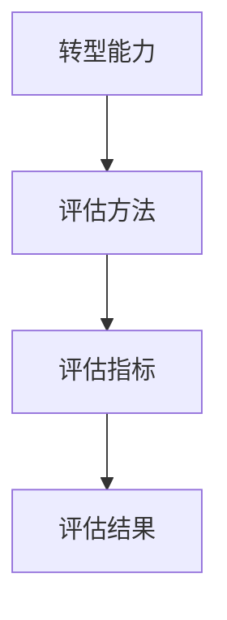
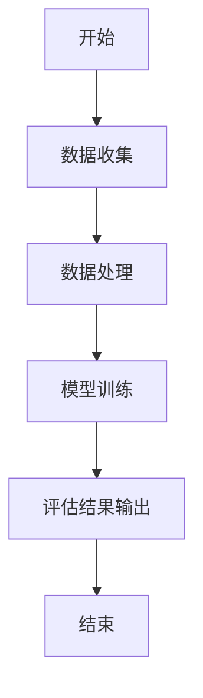
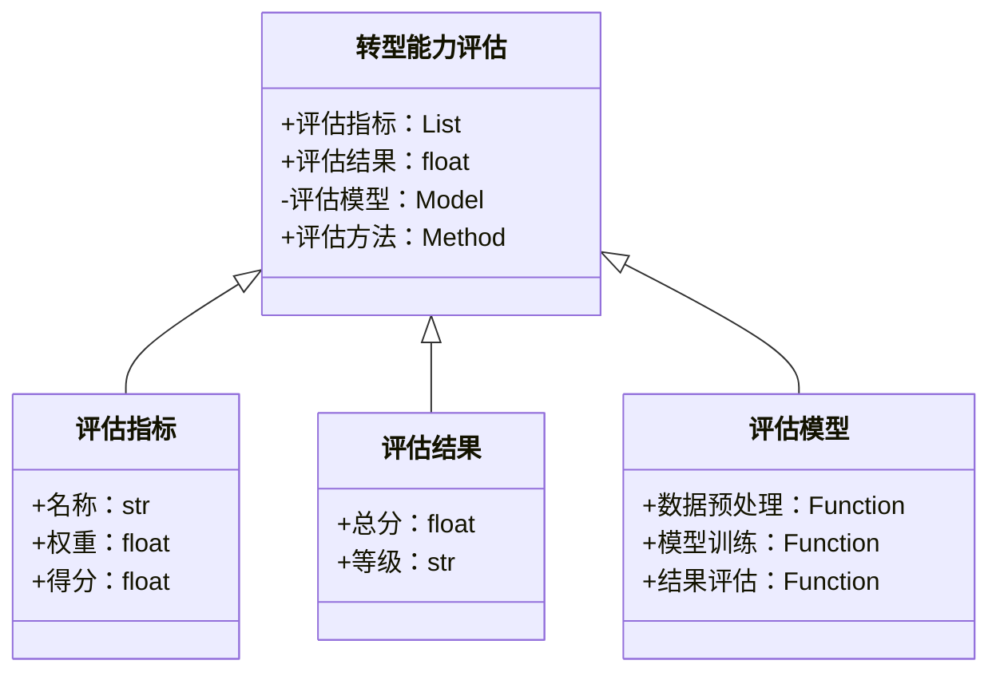
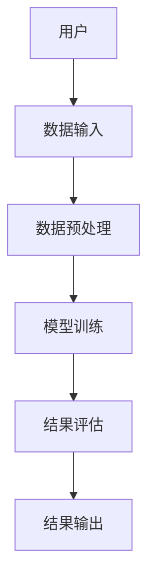
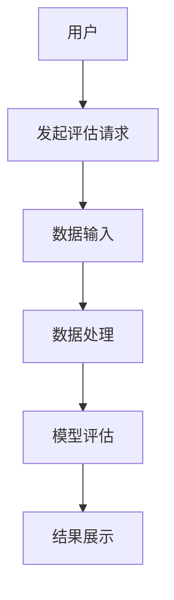

                 


# 彼得林奇的"行业领导者"转型能力评估

> 关键词：行业领导者，转型能力，彼得·林奇，评估模型，案例分析

> 摘要：本文探讨了彼得·林奇的行业领导者转型能力评估方法，分析其核心概念、评估模型，并通过实际案例展示了其应用效果。通过系统分析和详细解读，本文旨在为企业领导者提供实用的转型能力评估框架和方法。

---

## 正文

### 第1章: 行业领导者转型能力评估的背景与意义

#### 1.1 问题背景

随着全球化和数字化的快速发展，行业领导者面临着前所未有的挑战。企业需要不断适应市场变化，领导者的能力直接关系到企业的生存与发展。然而，许多企业在转型过程中失败，往往是因为领导者缺乏必要的转型能力。彼得·林奇提出了一套独特的评估方法，旨在帮助企业识别和培养行业领导者的核心能力。

#### 1.2 问题描述

转型能力评估的核心在于识别领导者在面对变革时的适应性和创新能力。本文将探讨以下几个关键问题：
- 行业领导者转型能力的定义和范围是什么？
- 转型能力评估的关键指标有哪些？
- 如何通过评估结果优化领导者的转型能力？

#### 1.3 问题解决

通过建立科学的评估模型，彼得·林奇的方法能够帮助企业系统地分析领导者的能力，从而制定有效的培养和提升策略。本文将详细讲解评估模型的设计和实施步骤，确保评估结果能够为企业提供实际指导。

### 第2章: 彼得·林奇的行业领导者转型能力评估方法

#### 2.1 核心概念与联系

转型能力评估的核心概念包括：
1. **转型能力**：领导者在变革中的综合能力，包括战略思维、创新能力和适应能力。
2. **评估方法**：通过定量和定性分析，全面评估领导者的转型能力。

**核心概念属性特征对比表**：

| 核心概念    | 属性特征                  |
|-------------|---------------------------|
| 转型能力    | 综合性、动态性、可评估性  |
| 评估方法    | 客观性、可操作性、可验证性 |

**ER实体关系图**：



#### 2.2 算法原理讲解

##### 算法流程图：



##### 核心代码实现：

```python
def transform_assessment(data):
    processed_data = preprocess(data)
    model = train_model(processed_data)
    result = evaluate(model, processed_data)
    return result
```

##### 数学模型与公式

1. **转型能力评估模型**：
   $$ \text{评估分数} = \sum_{i=1}^{n} w_i x_i $$
   其中，$w_i$ 是第i个指标的权重，$x_i$ 是第i个指标的得分。

2. **权重计算公式**：
   $$ w_i = \frac{\sum_{j=1}^{m} s_{ij}}{m} $$
   其中，$s_{ij}$ 是第i个指标在第j个样本中的得分，$m$ 是样本总数。

### 第3章: 评估模型与工具

#### 3.1 评估模型设计

##### 领域模型类图：



#### 3.2 系统架构设计

##### 系统架构图：



#### 3.3 系统接口设计

##### 接口说明：

- **输入接口**：接收领导者的各项能力数据。
- **输出接口**：提供评估结果和改进建议。

##### 系统交互图：



### 第4章: 实际案例分析

#### 4.1 成功案例分析

以某高科技公司为例，通过彼得·林奇的方法评估其CEO的转型能力：
1. 数据收集：包括战略思维、创新能力、适应能力等指标。
2. 模型训练：利用历史数据建立评估模型。
3. 结果分析：CEO在创新能力和适应能力上表现突出，但在战略思维方面稍显不足。

#### 4.2 失败案例分析

某传统制造企业在转型过程中失败，评估结果表明其领导者在创新能力和数字化能力上有明显短板，未能及时适应市场变化。

### 第5章: 总结与展望

#### 5.1 总结

彼得·林奇的行业领导者转型能力评估方法为企业提供了科学的评估框架，帮助企业识别和培养具备转型能力的领导者。

#### 5.2 展望

未来的研究可以进一步优化评估模型，引入更多动态指标，以更准确地评估领导者的转型能力。

---

### 作者

**作者：AI天才研究院 & 禅与计算机程序设计艺术**

---

通过以上结构，文章详细探讨了彼得·林奇的行业领导者转型能力评估方法，结合理论分析和实际案例，为企业领导者提供了实用的评估框架和方法。

