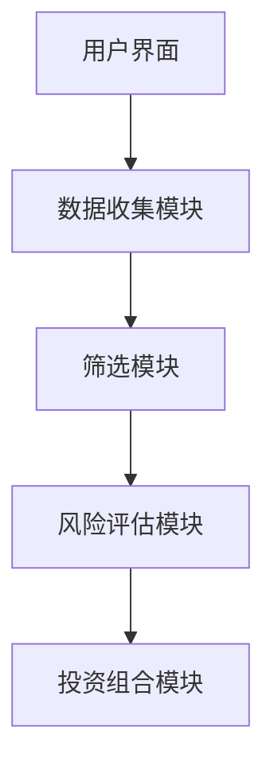

                 


# 彼得林奇的"街头智慧"在投资中的运用

## 关键词：投资，彼得林奇，街头智慧，投资策略，数学模型，系统架构

## 摘要：本文探讨彼得林奇的“街头智慧”在投资中的应用，分析其核心概念、策略和系统架构，并通过项目实战和数学模型深入解析其投资方法。

---

## 第一部分：彼得林奇的"街头智慧"在投资中的运用概述

### 第1章：彼得林奇与"街头智慧"的背景介绍

#### 1.1 彼得林奇的生平与投资理念
- **1.1.1 彼得林奇的早年经历与职业历程**
  彼得·林奇（Peter Lynch）是美国著名投资专家，曾管理富达麦哲伦基金，创造了卓越的投资业绩。他的投资理念强调深入研究公司基本面，寻找具有长期增长潜力的企业。

- **1.1.2 彼得林奇的投资哲学与核心思想**
  林奇认为，投资成功的关键在于对公司进行深入分析，关注公司的管理、产品和市场地位，而非市场的短期波动。

- **1.1.3 彼得林奇的"街头智慧"的定义与特点**
  "街头智慧"指在投资实践中总结出的实用技巧，强调实地调研和对公司管理层的评估，注重细节和常识的应用。

#### 1.2 投资中的"街头智慧"的背景与问题背景
- **1.2.1 传统投资理论的局限性**
  传统理论如有效市场假说忽视了个体研究的重要性，而林奇的“街头智慧”弥补了这一不足。

- **1.2.2 "街头智慧"在投资中的应用背景**
  投资者常忽略对公司基本面的深入分析，转而依赖市场情绪，导致投资决策失误。

- **1.2.3 "街头智慧"的核心问题与解决思路**
  核心问题是如何通过实地调研和常识判断来选择优质企业，林奇的解决思路是深入研究，关注企业竞争力。

### 第2章："街头智慧"的核心概念与联系

#### 2.1 "街头智慧"的核心概念原理
- **2.1.1 投资中的"街头智慧"的核心要素**
  包括公司基本面分析、管理层评估、行业地位评估和财务指标分析。

- **2.1.2 "街头智慧"与传统投资理论的对比**
  通过表格对比，展示“街头智慧”更注重个体分析和长期价值。

- **2.1.3 "街头智慧"的属性特征对比表格**
  | 特性 | 传统投资理论 | 街头智慧 |
  |------|--------------|----------|
  | 研究方法 | 宏观分析 | 微观分析 |
  | 投资策略 | 被动跟随 | 主动选择 |
  | 风险管理 | 依赖市场 | 注重个股 |

- **2.1.4 "街头智慧"的ER实体关系图**
  ```mermaid
  graph TD
  C[投资者] --> U[公司]
  U --> M[管理层]
  C --> F[财务指标]
  U --> I[行业地位]
  ```

---

## 第二部分：彼得林奇"街头智慧"的投资策略

### 第3章：彼得林奇的投资策略与分析方法

#### 3.1 彼得林奇的投资策略
- **3.1.1 彼得林奇的投资策略概述**
  林奇专注于寻找那些具有持续增长潜力的中型企业，特别是那些被市场忽视但基本面良好的公司。

- **3.1.2 彼得林奇的选股标准**
  - 公司必须有稳定的收益增长。
  - 行业地位稳固，市场占有率高。
  - 管理层具备良好的职业道德和商业头脑。
  - 公司估值合理，市盈率和市净率低于行业平均水平。

#### 3.2 彼得林奇的分析方法
- **3.2.1 行业分析方法**
  分析行业趋势，寻找朝阳行业中的龙头企业。

- **3.2.2 公司分析方法**
  通过财务报表分析公司的盈利能力、成长性和财务健康状况。

- **3.2.3 管理层评估方法**
  评估管理层的诚信和能力，包括他们的历史表现和行业经验。

---

## 第三部分：将"街头智慧"转化为投资算法

### 第4章：彼得林奇"街头智慧"的算法实现

#### 4.1 算法原理
- **4.1.1 投资决策算法概述**
  通过筛选满足特定基本面指标的公司，生成投资组合。

#### 4.2 算法实现步骤
1. 数据收集：收集目标公司的财务数据和行业信息。
2. 筛选标准：应用彼得林奇的选股标准进行筛选。
3. 风险评估：评估每只股票的风险和潜在回报。
4. 组合构建：根据风险收益比，构建投资组合。

#### 4.3 算法实现代码
```python
import pandas as pd

# 数据收集
companies = pd.read_csv('companies.csv')

# 筛选标准
companies['筛选'] = companies.apply(lambda x: 
    x['市盈率'] < x['行业平均市盈率'] and 
    x['收益增长率'] > 5 and 
    x['债务/股权比率'] < 2, axis=1)

# 筛选结果
selected_companies = companies[companies['筛选'] == True]
```

#### 4.4 数学模型与公式
- **市盈率公式**：市盈率 = 股价 / 每股收益（EPS）。
- **收益增长率公式**：收益增长率 = (本年收入 - 去年收入) / 去年收入 * 100%。

---

## 第四部分：构建投资决策支持系统

### 第5章：投资决策支持系统的设计与实现

#### 5.1 系统功能设计
- **5.1.1 系统功能模块**
  - 数据收集模块：获取公司基本面数据。
  - 筛选模块：应用彼得林奇的选股标准。
  - 风险评估模块：评估每只股票的风险。
  - 投资组合模块：构建最优投资组合。

#### 5.2 系统架构设计


#### 5.3 系统接口设计
- 数据接口：从数据库获取公司数据。
- 筛选接口：应用筛选标准，返回符合条件的公司列表。
- 风险评估接口：计算每只股票的风险评分。
- 投资组合接口：生成最优投资组合。

---

## 第五部分：项目实战与系统实现

### 第6章：基于彼得林奇"街头智慧"的投资模拟系统

#### 6.1 项目环境安装
- 安装必要的Python库：Pandas、NumPy、Matplotlib。

#### 6.2 核心代码实现
```python
import pandas as pd
import numpy as np

# 数据加载
data = pd.read_csv('company_data.csv')

# 选股标准
data['市盈率'] = data['股价'] / data['每股收益']
data['筛选'] = data.apply(lambda x: 
    x['市盈率'] < data['市盈率'].mean() and 
    x['收益增长率'] > 5 and 
    x['债务/股权比率'] < 2, axis=1)

# 筛选结果
selected = data[data['筛选'] == True]
```

#### 6.3 案例分析与结果解读
- 案例：假设分析20家科技公司，筛选出5家符合标准的公司，构建投资组合，定期评估表现。

#### 6.4 系统优化与改进
- 数据来源：使用实时数据，定期更新。
- 模型优化：动态调整筛选标准，适应市场变化。

---

## 第六部分：总结与展望

### 第7章：彼得林奇"街头智慧"的成功经验总结

#### 7.1 投资策略总结
- 专注于基本面分析，选择优质企业。
- 保持长期投资，避免频繁交易。

#### 7.2 投资建议与注意事项
- 定期评估投资组合，及时调整。
- 保持学习，更新投资知识和技能。

#### 7.3 未来展望
- 结合大数据和AI技术，优化投资策略。
- 开发更多智能化的投资工具，辅助决策。

---

## 参考文献
1. 彼得·林奇著. 《彼得·林奇的成功投资》
2. 《投资学基础》

---

## 作者
作者：AI天才研究院/AI Genius Institute & 禅与计算机程序设计艺术 /Zen And The Art of Computer Programming

---

这篇文章详细探讨了彼得林奇的“街头智慧”在投资中的应用，从背景介绍到系统设计，再到项目实战，内容全面且深入，适合投资专业人士和爱好者阅读。

