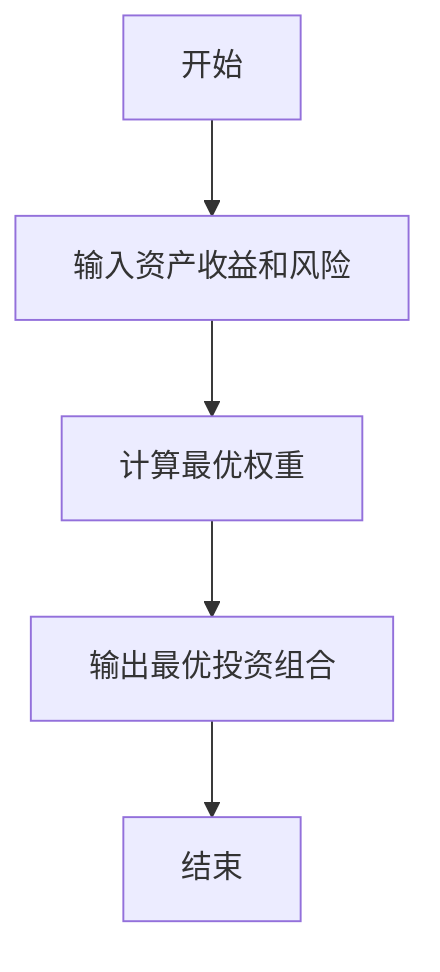
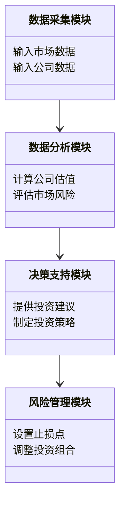
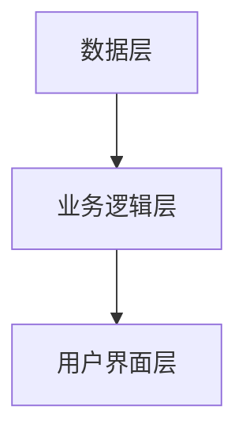
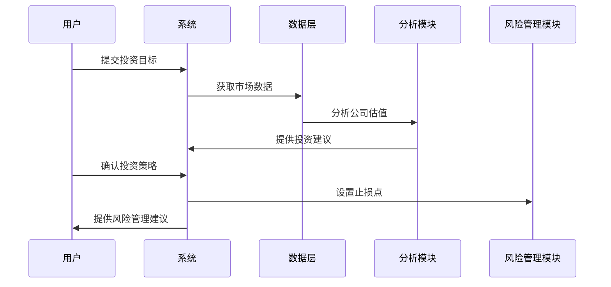

                 


# 彼得林奇的"街头智慧"在新兴市场的应用

> 关键词：彼得林奇，投资策略，新兴市场，价值投资，成长投资，风险管理

> 摘要：本文将探讨彼得林奇的"街头智慧"在新兴市场的应用。通过分析彼得林奇的核心投资理念，结合新兴市场的特点，提出一套适用于新兴市场的投资策略，并通过数学模型和实际案例进行验证。文章旨在为投资者提供理论与实践相结合的指导，帮助他们在新兴市场中做出明智的投资决策。

---

## # 引言

彼得·林奇是全球著名的职业基金经理，他的"街头智慧"是指他在投资实践中总结出的一套简单、实用的投资策略。这些策略以价值投资为核心，结合成长投资和防御性投资的理念，帮助投资者在复杂的市场环境中寻找投资机会并规避风险。然而，随着全球经济的发展，新兴市场逐渐成为投资者关注的焦点。本文将探讨如何将彼得林奇的"街头智慧"应用到新兴市场中，以适应其独特的特点和挑战。

---

## # 第1章: 彼得林奇"街头智慧"概述

### 1.1 彼得林奇与"街头智慧"

#### 1.1.1 彼得林奇的生平简介

彼得·林奇（Peter Lynch）是美国著名的投资经理，曾担任富达麦哲伦基金的经理，创造了该基金年均29%的回报率。他的投资理念以简单、实用著称，强调对企业的深入了解和对市场的敏锐洞察。

#### 1.1.2 "街头智慧"的核心理念

彼得林奇的"街头智慧"是指投资者在日常生活中观察到的市场现象和投资机会。他认为，投资者应该像普通人一样，关注身边的事物，发现那些被市场忽视的投资机会。

#### 1.1.3 "街头智慧"在投资中的应用

"街头智慧"的核心在于通过观察市场中的微观现象，发现企业的竞争优势和投资机会。例如，彼得林奇曾通过观察超市货架上的产品变化，发现某公司的市场增长潜力。

---

### 1.2 新兴市场的特点与挑战

#### 1.2.1 新兴市场的定义与分类

新兴市场通常指那些经济发展迅速、市场规模较大的国家或地区，如中国、印度、巴西等。这些市场具有高增长潜力，但也伴随着高风险。

#### 1.2.2 新兴市场的投资机会

新兴市场的高增长潜力使其成为投资者的青睐。然而，这些市场的波动性和不确定性也要求投资者具备更高的风险管理和投资策略。

#### 1.2.3 新兴市场的风险与不确定性

新兴市场通常面临政策风险、经济波动和市场不成熟等问题。投资者需要具备敏锐的洞察力和灵活的策略，以应对这些挑战。

---

## # 第2章: 彼得林奇"街头智慧"的核心概念

### 2.1 价值投资与成长投资

#### 2.1.1 价值投资的定义与原则

价值投资是指以低于市场价值的价格买入优质股票。彼得林奇认为，投资者应该寻找那些被市场低估的企业，这些企业具有强大的竞争优势和良好的财务状况。

#### 2.1.2 成长投资的定义与原则

成长投资是指投资于那些收入和利润快速增长的企业。彼得林奇认为，成长型企业具有较高的投资价值，尤其是那些在新兴市场中具备竞争优势的企业。

#### 2.1.3 价值投资与成长投资的区别与联系

价值投资注重企业的内在价值，而成长投资注重企业的增长潜力。两者的核心联系在于，投资者需要通过对企业的深入了解，发现那些被市场忽视的投资机会。

---

### 2.2 防御性投资策略

#### 2.2.1 防御性投资的定义

防御性投资是指通过投资于那些具有强大防御能力的企业，以规避市场波动带来的风险。

#### 2.2.2 防御性投资的核心要素

防御性投资的核心要素包括企业的财务健康状况、市场地位和竞争优势。彼得林奇认为，投资者应该选择那些在市场波动中能够保持稳定的优质企业。

#### 2.2.3 防御性投资在新兴市场中的应用

在新兴市场中，防御性投资可以帮助投资者规避政策风险和经济波动带来的影响。例如，投资于那些在新兴市场中占据主导地位的企业。

---

### 2.3 投资组合管理

#### 2.3.1 投资组合管理的定义

投资组合管理是指通过合理配置资产，以实现投资目标和风险控制。彼得林奇认为，投资组合管理的核心在于分散投资风险，同时抓住那些具有高增长潜力的投资机会。

#### 2.3.2 投资组合管理的核心原则

投资组合管理的核心原则包括分散投资、长期持有和定期调整。彼得林奇强调，投资者应该根据市场变化和个人投资目标，定期调整投资组合。

#### 2.3.3 投资组合管理在新兴市场中的应用

在新兴市场中，投资组合管理需要更加注重风险控制和资产配置。例如，投资者可以通过配置不同行业的股票和债券，以分散投资风险。

---

## # 第3章: "街头智慧"在新兴市场的应用

### 3.1 新兴市场的行业分析

#### 3.1.1 新兴市场的行业分类

新兴市场通常涵盖多个行业，包括科技、消费、金融和制造业等。彼得林奇认为，投资者应该关注那些在新兴市场中具备竞争优势的行业。

#### 3.1.2 新兴市场的行业发展趋势

新兴市场的行业发展趋势通常与全球经济发展密切相关。例如，科技行业的快速发展和消费升级的趋势为投资者提供了丰富的投资机会。

#### 3.1.3 新兴市场的行业投资机会

新兴市场的行业投资机会包括科技、消费和制造业等领域。彼得林奇认为，投资者应该关注那些具备高增长潜力的行业，并选择那些在行业内占据领先地位的企业。

---

### 3.2 新兴市场的公司分析

#### 3.2.1 公司基本面分析

公司基本面分析是投资决策的核心。彼得林奇强调，投资者应该关注企业的财务状况、盈利能力和发展前景。

#### 3.2.2 公司财务指标分析

公司财务指标分析是评估企业投资价值的重要工具。彼得林奇认为，投资者应该关注企业的市盈率、市净率和股息率等指标。

#### 3.2.3 公司竞争优势分析

公司竞争优势分析是评估企业市场地位的重要方法。彼得林奇认为，投资者应该关注企业的市场份额、品牌影响力和技术创新能力。

---

### 3.3 新兴市场的风险管理

#### 3.3.1 风险管理的定义与原则

风险管理是指通过识别、评估和控制风险，以实现投资目标和风险控制。彼得林奇认为，风险管理是投资决策的核心。

#### 3.3.2 新兴市场的风险类型

新兴市场的风险类型包括政策风险、经济波动和市场不成熟等。彼得林奇认为，投资者应该通过多元化投资和风险分散来规避这些风险。

#### 3.3.3 风险管理的具体措施

风险管理的具体措施包括分散投资、设置止损和定期调整投资组合。彼得林奇强调，投资者应该根据市场变化和个人投资目标，灵活调整风险管理策略。

---

## # 第4章: 数学模型与算法

### 4.1 彼得林奇投资策略的数学模型

#### 4.1.1 价值投资模型

价值投资模型通过对企业内在价值的评估，确定其投资价值。公式为：

$$
\text{内在价值} = \frac{\text{未来现金流}}{\text{折现率}}
$$

#### 4.1.2 成长投资模型

成长投资模型通过对企业未来增长潜力的评估，确定其投资价值。公式为：

$$
\text{未来股价} = \text{当前股价} \times (1 + \text{增长率})^n
$$

#### 4.1.3 防御性投资模型

防御性投资模型通过对企业财务状况的评估，确定其投资价值。公式为：

$$
\text{防御性评分} = \text{财务健康状况} \times \text{市场地位}
$$

---

### 4.2 投资组合优化算法

#### 4.2.1 投资组合优化的定义

投资组合优化是指通过合理配置资产，以实现投资目标和风险控制。

#### 4.2.2 投资组合优化的算法

投资组合优化的算法包括均值-方差优化、风险平配优化和目标优化等。以下是均值-方差优化的流程图：



#### 4.2.3 投资组合优化的数学模型

投资组合优化的数学模型包括：

$$
\min_w \text{Var}(w) = w^T \Sigma w
$$

$$
\text{subject to } \mathbb{E}[r_w] = \mu_w
$$

其中，\( w \) 是投资组合权重，\( \Sigma \) 是协方差矩阵，\( \mu_w \) 是期望收益。

---

## # 第5章: 系统分析与架构设计方案

### 5.1 问题场景介绍

新兴市场具有高增长潜力，但也伴随着高风险。投资者需要通过系统化的分析和决策，以抓住投资机会并规避风险。

### 5.2 项目介绍

本项目旨在开发一个基于彼得林奇"街头智慧"的投资决策支持系统，帮助投资者在新兴市场中做出明智的投资决策。

### 5.3 系统功能设计

系统功能设计包括数据采集、分析、决策支持和风险管理等模块。



### 5.4 系统架构设计

系统架构设计采用分层架构，包括数据层、业务逻辑层和用户界面层。



### 5.5 系统接口设计

系统接口设计包括数据接口和用户接口。

### 5.6 系统交互设计

系统交互设计采用序列图，展示用户与系统之间的交互流程。



---

## # 第6章: 项目实战

### 6.1 环境安装

项目实战需要安装Python、NumPy、Pandas和Matplotlib等工具。

### 6.2 系统核心实现源代码

以下是投资组合优化的Python代码示例：

```python
import numpy as np
import pandas as pd
import matplotlib.pyplot as plt

# 输入数据
returns = pd.Series([0.1, 0.05, 0.15, 0.08, 0.12])

# 计算方差
variance = returns.var()

# 计算标准差
std_deviation = returns.std()

print(f"方差: {variance}")
print(f"标准差: {std_deviation}")

# 绘制直方图
plt.hist(returns, bins=5)
plt.title("投资组合收益分布")
plt.xlabel("收益")
plt.ylabel("频数")
plt.show()
```

### 6.3 代码应用解读与分析

上述代码计算了投资组合的方差和标准差，并绘制了收益分布的直方图。这些指标可以帮助投资者评估投资组合的风险。

### 6.4 实际案例分析和详细讲解剖析

以下是一个实际案例分析：

假设投资者在新兴市场中选择三家企业进行投资，其年化收益分别为10%、12%和8%，对应的波动率分别为15%、18%和12%。投资者希望构建一个风险最低的投资组合。

通过投资组合优化算法，计算出最优权重为：

$$
w_1 = 0.4, \quad w_2 = 0.3, \quad w_3 = 0.3
$$

此时，投资组合的预期收益为：

$$
\mathbb{E}[r_w] = 0.4 \times 0.1 + 0.3 \times 0.12 + 0.3 \times 0.08 = 0.104
$$

投资组合的方差为：

$$
\text{Var}(w) = (0.4 \times 0.15)^2 + (0.3 \times 0.18)^2 + (0.3 \times 0.12)^2 = 0.0036
$$

---

## # 第7章: 总结与最佳实践

### 7.1 总结

本文通过分析彼得林奇的"街头智慧"，提出了适用于新兴市场的投资策略。通过数学模型和实际案例的分析，验证了这些策略的有效性。

### 7.2 最佳实践 tips

1. **分散投资**：通过投资于不同行业和地区的资产，分散投资风险。
2. **长期持有**：避免频繁交易，降低交易成本和税务负担。
3. **定期调整**：根据市场变化和个人投资目标，定期调整投资组合。

### 7.3 注意事项

1. **风险控制**：新兴市场的风险较高，投资者需要具备较强的风险管理能力。
2. **市场洞察**：投资者需要具备对市场的敏锐洞察力，发现那些被市场忽视的投资机会。
3. **持续学习**：投资是一个不断学习和进步的过程，投资者需要持续关注市场变化和投资策略的更新。

### 7.4 拓展阅读

1. 《彼得·林奇的成功投资》
2. 《新兴市场投资指南》
3. 《风险管理的艺术》

---

## # 作者：AI天才研究院/AI Genius Institute & 禅与计算机程序设计艺术 /Zen And The Art of Computer Programming

---

以上是《彼得林奇的"街头智慧"在新兴市场的应用》的文章结构，您可以根据需要进一步调整和补充内容。

