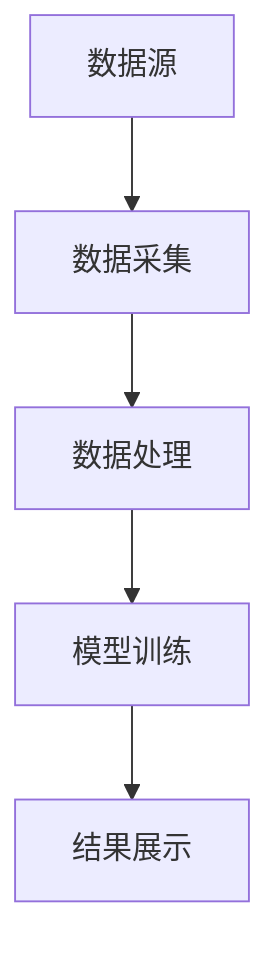

                 


# 彼得林奇的"街头智慧"在消费者行为分析中的应用

> 关键词：彼得林奇，消费者行为分析，街头智慧，投资策略，数据挖掘

> 摘要：本文探讨了彼得林奇的“街头智慧”在消费者行为分析中的应用，结合投资策略和数据分析方法，提出了基于街头智慧的消费者行为分析框架。通过分析彼得林奇的核心理念，构建了从数据收集到预测的完整流程，并通过案例分析展示了该方法的实际应用。

---

## 第一部分：彼得林奇的“街头智慧”概述

### 第1章：彼得林奇与“街头智慧”简介

#### 1.1 彼得林奇的生平与投资理念
- 彼得林奇的生平简介
- 投资哲学：价值投资、长期投资
- “街头智慧”：识别优质企业、关注基本面、避免情绪化决策

#### 1.2 街头智慧的核心概念
- 优质企业识别：低估值、高成长性、竞争优势明显
- 避免跟随市场情绪：独立思考，逆向投资
- 长期视角：关注企业长期价值，而非短期波动

### 第2章：消费者行为分析的基础知识

#### 2.1 消费者行为分析的定义
- 消费者行为分析：研究消费者决策过程、购买行为和偏好
- 分析方法：定量分析（数据挖掘、机器学习）与定性分析（问卷调查、深度访谈）

#### 2.2 彼得林奇“街头智慧”与消费者行为分析的关联
- 街头智慧的核心原则与消费者行为分析的结合点
- 如何利用彼得林奇的选股原则来预测消费者行为

---

## 第二部分：彼得林奇“街头智慧”的核心概念

### 第3章：彼得林奇的选股原则

#### 3.1 选股策略
- 高质量企业的识别：基本面分析、竞争优势、财务状况
- 企业竞争优势分析：市场地位、品牌价值、成本优势
- 企业财务状况评估：盈利能力、资产负债率、现金流

#### 3.2 选股原则在消费者行为分析中的应用
- 高质量企业识别与消费者偏好的关系
- 企业竞争优势与消费者选择的关联
- 财务状况评估对消费者行为预测的启示

### 第4章：彼得林奇的市场分析方法

#### 4.1 市场分析的基本原理
- 市场趋势识别：上升趋势、下降趋势、横盘整理
- 市场周期分析：牛市、熊市、震荡市
- 市场波动预测：短期波动、长期趋势

#### 4.2 市场分析方法在消费者行为中的应用
- 市场趋势与消费者行为的关系
- 市场周期对消费者行为的影响
- 市场波动对消费者行为的预测

---

## 第三部分：消费者行为分析的算法原理

### 第5章：数据挖掘与消费者行为分析

#### 5.1 数据挖掘的基本原理
- 数据挖掘定义：从数据中提取模式、关联、异常
- 数据挖掘关键技术：分类、聚类、关联规则挖掘
- 数据挖掘应用领域：金融、零售、医疗

#### 5.2 数据挖掘在彼得林奇“街头智慧”中的应用
- 数据挖掘用于识别优质企业
- 关联规则挖掘用于发现消费者行为模式
- 聚类分析用于细分市场

### 第6章：算法原理与数学模型

#### 6.1 算法流程
- 数据预处理：清洗、转换、标准化
- 特征提取：选择关键特征，如消费者行为数据
- 模型训练：使用机器学习算法（决策树、随机森林）
- 模型评估：准确率、召回率、F1分数

#### 6.2 数学模型
- 线性回归模型：预测消费者购买行为
  $$ y = \beta_0 + \beta_1x + \epsilon $$
- 逻辑回归模型：分类消费者行为
  $$ P(y=1|x) = \frac{1}{1 + e^{-\beta x}} $$
- 随机森林模型：集成学习，提高预测准确性

### 第7章：系统架构设计

#### 7.1 系统功能设计
- 数据采集模块：收集消费者数据
- 数据处理模块：清洗和转换数据
- 模型训练模块：训练机器学习模型
- 结果展示模块：可视化预测结果

#### 7.2 系统架构图


#### 7.3 接口设计与交互
- 数据接口：API用于数据导入
- 用户接口：可视化界面展示预测结果

---

## 第四部分：项目实战

### 第8章：项目背景与目标

#### 8.1 项目背景
- 某零售企业的消费者行为分析需求
- 目标：预测消费者购买行为，优化营销策略

### 第9章：环境安装与数据准备

#### 9.1 环境安装
- 安装Python：`python --version`
- 安装依赖库：`pip install numpy pandas scikit-learn`

#### 9.2 数据准备
- 数据来源：企业数据库、公开数据集
- 数据格式：CSV文件，包含消费者行为数据

### 第10章：核心实现

#### 10.1 数据预处理
- 数据清洗：处理缺失值、异常值
- 数据转换：标准化、归一化

#### 10.2 模型实现
- 使用随机森林算法训练模型
- 代码示例：
  ```python
  from sklearn.ensemble import RandomForestClassifier
  model = RandomForestClassifier()
  model.fit(X_train, y_train)
  ```

#### 10.3 模型评估
- 准确率：`model.score(X_test, y_test)`
- 召回率：`precision_score(y_test, y_pred)`
- F1分数：`f1_score(y_test, y_pred)`

### 第11章：案例分析

#### 11.1 数据分析与预测
- 分析消费者购买行为的模式
- 预测未来购买行为

#### 11.2 结果展示
- 可视化预测结果：折线图、柱状图
- 提供优化建议：基于预测结果调整营销策略

---

## 第五部分：总结与展望

### 第12章：总结

#### 12.1 核心观点回顾
- 彼得林奇的“街头智慧”为消费者行为分析提供了新视角
- 数据挖掘与机器学习算法的有效结合，提高了分析精度

#### 12.2 实践意义
- 为企业提供科学的消费者行为分析方法
- 优化营销策略，提升客户满意度

### 第13章：未来展望

#### 13.1 拓展研究
- 结合自然语言处理技术，分析消费者评论
- 研究实时数据流分析，实现动态预测

#### 13.2 技术进步
- 高效算法的应用：如深度学习模型
- 大数据分析技术的发展

---

## 作者：AI天才研究院

---

通过以上结构，文章系统地探讨了彼得林奇的“街头智慧”在消费者行为分析中的应用，结合了投资策略和数据分析方法，为读者提供了从理论到实践的全面指导。

