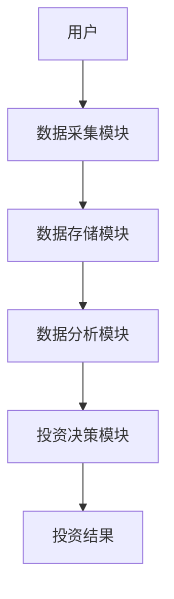

                 


# 彼得林奇的"街头智慧"在社交媒体时代的应用

> 关键词：彼得林奇，街头智慧，社交媒体，投资策略，数据分析，信息传播

> 摘要：本文探讨了彼得林奇的"街头智慧"在社交媒体时代的应用，分析了社交媒体对投资决策的影响，提出了基于社交媒体数据的投资策略，并结合算法和系统设计，展示了如何将彼得林奇的投资理念与现代技术相结合。

---

# 第一部分: 引言

## 第1章: 彼得林奇的"街头智慧"与社交媒体时代的结合

### 1.1 彼得林奇的"街头智慧"概述

#### 1.1.1 彼得林奇的生平与投资理念
彼得·林奇（Peter Lynch）是美国著名投资经理人，以其在富达投资管理公司（Fidelity）的卓越表现闻名。他的"街头智慧"是指通过观察和分析周围环境，捕捉投资机会的能力。这种智慧不仅依赖于基本面分析，还强调对市场情绪和趋势的敏感性。

#### 1.1.2 "街头智慧"的核心概念
彼得林奇的"街头智慧"主要体现在以下几个方面：
1. **价值投资**：寻找被市场低估的公司。
2. **逆向思维**：在市场恐慌时寻找机会。
3. **分散投资**：避免过度集中。
4. **长期视角**：关注企业的长期价值。

#### 1.1.3 社交媒体时代的投资环境
社交媒体的兴起改变了信息传播的方式，投资者可以实时获取市场动态，但也面临信息过载和虚假信息的挑战。

---

### 1.2 社交媒体时代的投资挑战

#### 1.2.1 社交媒体对投资决策的影响
社交媒体上的信息传播速度极快，但信息的真实性和可靠性参差不齐，这可能导致投资者做出非理性的决策。

#### 1.2.2 信息过载与虚假信息的辨别
社交媒体上的信息量巨大，投资者需要具备筛选和验证信息的能力，以避免被误导。

#### 1.2.3 投资者行为的演变
社交媒体时代，投资者的行为更加依赖于情绪化决策，市场波动性增加。

---

### 1.3 本书的研究意义与方法

#### 1.3.1 研究背景与目标
本文旨在探讨如何将彼得林奇的"街头智慧"应用于社交媒体时代，结合技术手段优化投资决策。

#### 1.3.2 研究方法与框架
本文采用理论分析与实践相结合的方法，通过数据分析和算法设计，验证彼得林奇理念在社交媒体环境下的可行性。

#### 1.3.3 本书的结构安排
本文分为以下几部分：背景分析、核心理念、算法设计、系统架构、项目实战和总结。

---

# 第二部分: 社交媒体时代的投资环境分析

## 第2章: 社交媒体的现状与投资机会

### 2.1 社交媒体的用户行为分析

#### 2.1.1 用户行为的特征与模式
社交媒体用户的行为受到情绪和利益的驱动，表现出从众性和羊群效应。

#### 2.1.2 社交媒体用户的群体划分
用户可以分为散户投资者、机构投资者和社交媒体影响者，不同群体的行为模式不同。

#### 2.1.3 用户行为对投资决策的影响
社交媒体上的用户行为可以反映市场情绪，从而影响投资决策。

---

### 2.2 社交媒体的信息传播特性

#### 2.2.1 信息传播的速度与广度
社交媒体的信息传播速度远超传统媒体，信息广度覆盖全球。

#### 2.2.2 信息传播的可信度评估
信息的可信度取决于发布者的权威性和内容的逻辑性。

#### 2.2.3 信息传播对市场情绪的影响
信息传播可以迅速改变市场情绪，从而影响资产价格。

---

### 2.3 社交媒体时代的投资机会

#### 2.3.1 新兴行业的崛起
社交媒体促进了新兴行业的快速发展，如电子商务和数字营销。

#### 2.3.2 传统行业的数字化转型
传统行业通过社交媒体实现数字化转型，提升竞争力。

#### 2.3.3 社交媒体平台的投资价值
社交媒体平台本身成为重要的投资标的，如Meta、Twitter和抖音。

---

# 第三部分: 彼得林奇"街头智慧"的核心理念

## 第3章: 价值投资与社交媒体的结合

### 3.1 价值投资的核心原则

#### 3.1.1 价值投资的基本定义
价值投资是指以低于内在价值的价格购买优质资产。

#### 3.1.2 价值投资在社交媒体时代的应用
通过社交媒体分析企业的基本面，寻找被低估的投资标的。

---

### 3.2 逆向思维与情绪化决策

#### 3.2.1 逆向思维的定义
逆向思维是指在市场恐慌时寻找机会，避免随大流。

#### 3.2.2 情绪化决策的负面影响
情绪化决策可能导致投资者在市场高点买入，在低点卖出。

#### 3.2.3 通过社交媒体分析市场情绪
利用社交媒体数据，识别市场的恐慌情绪，寻找投资机会。

---

## 第4章: 分散投资与风险管理

### 4.1 分散投资的重要性

#### 4.1.1 分散投资的基本概念
分散投资通过投资不同资产降低风险。

#### 4.1.2 社交媒体时代的分散投资策略
通过社交媒体获取多方面的信息，避免过度集中。

---

### 4.2 风险管理的现代实践

#### 4.2.1 风险管理的基本原则
风险管理的核心是控制损失，而不是追求收益。

#### 4.2.2 社交媒体时代的风险管理
通过数据分析和算法优化，实现风险的量化和控制。

---

## 第5章: 长期视角与趋势分析

### 5.1 长期视角的重要性

#### 5.1.1 长期视角的基本定义
长期视角关注企业的长期价值，而非短期波动。

#### 5.1.2 社交媒体时代的长期视角
通过社交媒体分析行业趋势，捕捉长期投资机会。

---

### 5.2 趋势分析的方法

#### 5.2.1 趋势分析的基本概念
趋势分析是通过数据挖掘识别行业和市场的长期趋势。

#### 5.2.2 社交媒体趋势分析的实践
利用社交媒体数据预测行业趋势，优化投资决策。

---

# 第四部分: 算法与系统设计

## 第6章: 社交媒体信息传播模型

### 6.1 信息传播模型的定义

#### 6.1.1 信息传播的基本原理
信息传播模型描述了信息在社交媒体上的扩散过程。

#### 6.1.2 模型的数学表达
信息传播的扩散概率可以用以下公式表示：
$$ P(t) = 1 - e^{-\lambda t} $$
其中，$\lambda$ 是传播速率，$t$ 是时间。

---

### 6.2 用户行为分析算法

#### 6.2.1 用户行为分析的基本步骤
1. 数据采集：获取社交媒体用户的交易记录和行为数据。
2. 数据清洗：去除噪声数据。
3. 数据建模：使用聚类算法分析用户行为模式。

#### 6.2.2 算法实现
以下是一个基于Python的用户行为分析代码示例：

```python
import numpy as np
import matplotlib.pyplot as plt

# 生成随机用户行为数据
np.random.seed(42)
users = np.random.randint(1, 100, 1000)
actions = np.random.choice(['buy', 'sell', 'hold'], 1000)

# 绘制用户行为分布图
plt.hist(actions, bins=[0, 1, 2, 3], rwidth=0.8)
plt.title('User Action Distribution')
plt.xlabel('Action')
plt.ylabel('Count')
plt.show()
```

---

## 第7章: 投资决策优化算法

### 7.1 投资决策优化的基本原理

#### 7.1.1 基于社交媒体数据的投资策略
通过分析社交媒体上的信息，优化投资组合。

#### 7.1.2 算法流程
1. 数据采集：获取社交媒体上的股票相关信息。
2. 数据清洗：去除虚假信息。
3. 数据分析：识别市场情绪。
4. 投资决策：基于情绪分析结果优化投资组合。

---

### 7.2 投资组合优化算法

#### 7.2.1 基于均值-方差模型的投资组合优化
均值-方差模型的目标是最小化投资组合的方差，同时满足收益目标。数学表达如下：
$$ \min_w \quad w^T \Sigma w $$
$$ \text{subject to} \quad w^T \mu = r, \quad w^T 1 = 1 $$

其中，$w$ 是权重向量，$\Sigma$ 是协方差矩阵，$\mu$ 是收益向量，$r$ 是目标收益。

---

## 第8章: 系统架构与接口设计

### 8.1 投资分析系统的功能设计

#### 8.1.1 系统功能模块
1. 数据采集模块：采集社交媒体数据。
2. 数据分析模块：分析用户行为和市场情绪。
3. 投资决策模块：优化投资组合。

#### 8.1.2 系统架构图


---

### 8.2 接口设计

#### 8.2.1 API接口设计
1. 数据采集接口：`GET /api/social_data?symbol=AAPL`
2. 数据分析接口：`POST /api/market_sentiment`
3. 投资决策接口：`POST /api/investment_decision`

---

## 第9章: 项目实战与总结

## 第10章: 总结与展望

### 10.1 总结
本文结合彼得林奇的"街头智慧"，提出了在社交媒体时代优化投资决策的方法，包括信息传播分析、用户行为建模和投资组合优化。

### 10.2 展望
未来，随着人工智能和大数据技术的发展，社交媒体投资分析将更加精准和高效。

---

# 作者：AI天才研究院/AI Genius Institute & 禅与计算机程序设计艺术 /Zen And The Art of Computer Programming

